# Senior AWS DevOps Interview Questions & Model Answers

**Target Audience:** Senior DevOps Engineer (4+ YoE)
**Goal:** Providing structured, high-level answers to complex architectural and design choice questions.

---

# Question 1: "How would you architect a fully available and fault-tolerant application on AWS?"

## 1. The High-Level Pitch

"To achieve true High Availability (HA) and Disaster Recovery (DR), I would architect a **Multi-Region Active-Passive (or Active-Active)** solution. My architecture eliminates single points of failure by leveraging **EKS for compute**, **Global Tables for data**, and **Automated Pipelines** for deployment."

## 2. Step-by-Step Architecture Walkthrough

### Phase 1: Networking Foundation (The Base)
"First, we create the Virtual Private Cloud (VPC) in both the **Primary Region** (e.g., us-east-1) and the **Secondary Region** (e.g., us-west-2)."

*   **Subnets:** I would provision **Public Subnets** for Load Balancers/NAT Gateways and **Private Subnets** for all Compute (EKS Nodes) and Database resources.
*   **Security Groups (Stateful):** I would configure Security Groups to allow traffic only from the Load Balancer to the Private Subnets.
*   **NACLs (Stateless):** I would setup Network ACLs as an additional layer of defense at the subnet level to block specific malicious IPs if needed.

### Phase 2: Compute Layer (EKS & Multi-Region)
"For compute, I would use **Amazon EKS (Elastic Kubernetes Service)** to orchestrate containerized microservices."

*   **Cluster Design:** I would deploy an EKS Cluster in the Primary Region and a separate EKS Cluster in the Secondary Region.
*   **Node Groups:** The worker nodes would be deployed across multiple **Availability Zones (AZs)** within the Private Subnets to ensure HA within the region.
*   **Autoscaling:** I would configure **Cluster Autoscaler** and **Horizontal Pod Autoscaler (HPA)** to handle traffic spikes dynamically.

### Phase 3: Traffic Management (Global & Regional)
"To manage traffic, I would use a combination of **Route 53** and **Application Load Balancers**."

*   **Global Routing:** I would set up **Route 53** with a **Failover Routing Policy**.
    *   **Primary:** Points to Region A.
    *   **Secondary:** Points to Region B (DR).
    *   *Health Checks:* Route 53 actively monitors the health of Region A's endpoint. If it fails, traffic automatically shifts to Region B.
*   **Regional Ingress:** Within each region, an **Application Load Balancer (ALB)** (provisioned via AWS Load Balancer Controller) sits in the Public Subnets to route traffic to the EKS pods.

### Phase 4: Data & Storage Strategy
"Data consistency is the hardest part of multi-region. Here is how I handle it:"

*   **Relational Database (RDS):**
    *   I would use **Amazon Aurora Global Database** or **RDS for PostgreSQL**.
    *   **Primary Region:** Writer instance (Multi-AZ for local HA).
    *   **Secondary Region:** Read Replica (Cross-Region Replication enabled).
    *   *Failover:* If Region A dies, I would promote the Cross-Region Read Replica to be the new Writer.
*   **NoSQL (High Speed):**
    *   If the application supports it, I would use **DynamoDB Global Tables** (Version 2019.11.21). This provides fully managed **Active-Active** replication across regions with single-digit millisecond latency.
*   **Object Storage (S3):**
    *   I would enable **S3 Cross-Region Replication (CRR)** on the buckets to ensure all assets uploaded in Region A are immediately copied to Region B.

### Phase 5: Observability
"I wouldn't rely on users to tell me the system is down."

*   **Metrics:** I would set up **Prometheus** and **Grafana** (Managed or Self-hosted on EKS) to scrape metrics from the application and infrastructure.
*   **Logging:** I would use **CloudWatch Container Insights** or Fluent Bit to ship logs to CloudWatch/Elasticsearch.
*   **Alerting:** CloudWatch Alarms would trigger PagerDuty/Slack notifications if Error Rates > 1% or Latency > 500ms.

### Phase 6: Security & Automation
"Finally, to ensure security and repeatability:"

*   **Secrets Management:** I would use **AWS Secrets Manager** with automatic rotation. The EKS pods would use the *Secrets Store CSI Driver* to mount secrets as volumes.
*   **CI/CD Pipelines:** I would have a fully automated pipeline (Jenkins/GitHub Actions/CodePipeline).
    *   *Build:* Docker build & push to ECR.
    *   *Deploy:* `helm upgrade` or `kubectl apply` to **both** EKS clusters to ensure configuration drift does not occur.

## 3. Architecture Diagram (Q1 Only)

```mermaid
graph TD
    User((User)) -->|DNS Query| R53[Route 53 (Failover Policy)]
    
    subgraph Region_A [Primary: us-east-1]
        R53 -->|Primary Traffic| ALBA[ALB Public]
        ALBA --> EKSA[EKS Cluster (Private Nodes)]
        EKSA --> DBA[(RDS Primary / DynamoDB)]
    end
    
    subgraph Region_B [Secondary: us-west-2]
        R53 -.->|Failover Traffic| ALBB[ALB Public]
        ALBB --> EKSB[EKS Cluster (Private Nodes)]
        EKSB --> DBB[(RDS Replica / DynamoDB)]
    end
    
    DBA <-->|Global Table / CRR| DBB
    EKSA -.->|Prometheus/Grafana| CloudWatch
```

---

# Question 2: "Why did you choose EKS (Kubernetes) over ECS (Elastic Container Service)?"

## The "Battle-Hardened" Answer
*(Don't just say "Portability". Give a reason that shows you have managed production systems at scale)*

"I chose EKS because ECS, while simpler to start, hits a specific **'operational ceiling'** that limits us as we scale. Here are the 3 technical reasons why EKS was the necessary choice for this architecture:"

### 1. The GitOps & Helm Ecosystem (Speed of Delivery)
"In ECS, managing complex deployments typically involves writing thousands of lines of CloudFormation or Terraform to define Task Definitions and Services.
With EKS, we utilize **Helm Charts** and **ArgoCD (GitOps)**. The ability to package our entire application stack (Ingress, Service, Deployment, HPA) into a single reusable Chart drastically reduces our deployment complexity. The industry has standardized on Helm; ECS has no native equivalent package manager."

### 2. The Operator Pattern (Day 2 Operations)
"We don't just run stateless web apps; we run complex stateful monitoring stacks like Prometheus and databases.
On ECS, managing a Prometheus High-Availability setup is a manual nightmare of configuration. On EKS, I simply deploy the **Prometheus Operator**. It creates, configures, and manages the lifecycle of the monitoring stack automatically. The **Operator Pattern** in Kubernetes allows us to automate 'Day 2' operations (backups, rebalancing, upgrades) that ECS simply cannot do."

### 3. Advanced Networking & Service Mesh (Control)
"We have strict security requirements for pod-to-pod communication. ECS Security Groups are good, but they operate at the ENI level.
EKS allows us to use **CNI Plugins (like Calico)** for fine-grained Network Policies (e.g., 'Frontend Pods can ONLY talk to Backend Pods on port 8080'). Furthermore, integrating a **Service Mesh (like Istio/Linkerd)** for mTLS, canary deployments, and circuit breaking is a first-class citizen in EKS. Doing this on ECS with App Mesh is possible but significantly more cumbersome and less feature-rich."

### Summary Pitch
"So, while ECS is great for simple microservices, **EKS was chosen because we need the maturity of the Helm ecosystem, the automation of Operators for our tooling, and the granular network control provided by the CNI.**"

---

# Question 3: "Are you saying ECS isn't Enterprise Grade? I've seen many enterprises use it for HA."

## The Balanced Diplomatic Answer
*(This is a trap question. Do not bash ECS. Pivot to "Right Tool for the Job".)*

"Not at all. **ECS is absolutely enterprise-grade** and powers massive workloads (including parts of Amazon.com). It is, in fact, **superior to EKS** in specific scenarios.

If the team prioritizes **AWS-Deep Integration** over **Open Source Portability**, ECS is the better choice."

### Where ECS Wins (The Counter-Argument)
1.  **Simpler Security Model:** "ECS uses standard IAM Roles and Security Groups. There is no 'Cluster Role Binding' or 'Pod Security Policy' to misconfigure. For teams without a dedicated Platform Engineering team, ECS is safer and easier to secure."
2.  **No Control Plane Management:** "With EKS, even in managed mode, I still have to worry about version upgrades (1.29 -> 1.30) and addon compatibility. ECS has no control plane versions to manage. It's truly serverless."
3.  **Cost at Scale (Fargate):** "ECS Fargate often has less overhead than EKS Fargate because you don't pay for the EKS Cluster control plane hour ($0.10/hr) or the System Node overhead."

### Addressing your point on ArgoCD
"You mentioned ArgoCD. While it *technically* can trigger ECS deployments (via custom plugins or CI pipelines calling AWS API), it is **not a native experience**.
*   **EKS:** ArgoCD watches the Git repo and *directly applies* manifests to the cluster API. It detects drift instantly.
*   **ECS:** To achieve GitOps, we often have to build complex CodePipeline wrappers or custom Lambda functions to detect drift. It's 'possible' but higher friction."

### Conclusion
"So, if my company had a strict 'AWS Only' policy and a small ops team, I would 100% choose **ECS**. But for this specific architecture, where we needed multi-cloud portability and granular network control, **EKS** was the trade-off we accepted."

---

# Question 4: "Can you give me a concrete scenario where ECS is better suited than EKS?"

## Scenario: Event-Driven Batch Processing for a FinTech Startup

"Let me give you a real-world example from a FinTech startup I consulted with."

### The Business Context
*   **Team Size:** 5 engineers (2 DevOps, 3 Backend).
*   **Application:** Processing daily reconciliation reports for payment transactions.
*   **Trigger:** S3 uploads zip files every night at 2 AM. Each zip contains 50,000-500,000 transactions.
*   **Requirement:** Each job takes 10-30 minutes. After processing, the container can terminate immediately.

### Why ECS Was the Perfect Fit

#### 1. Event-Driven Architecture (S3 -> EventBridge -> ECS Task)
"With **ECS + EventBridge**, I set up a rule that listens for S3 `PutObject` events and automatically launches an ECS Task (Fargate).
*   **No Kubernetes Job/CronJob complexity:** I don't need to manage a persistent cluster just to run tasks once a day.
*   **True Serverless:** The task spins up, processes the file, writes results to RDS, and terminates. I pay **only for the 15 minutes of actual processing time**."

#### 2. Minimal Operational Overhead
"The DevOps team is small. They don't want to:
*   Manage Kubernetes version upgrades (1.28 -> 1.29).
*   Debug Pod scheduling issues ('Insufficient CPU').
*   Configure RBAC policies for service accounts.

ECS gave us 'click Deploy, it runs, we're done.' **For a 5-person team processing files once a day, EKS would be operational overkill.**"

#### 3. Cost Efficiency for Sporadic Workloads
"Because the workload runs for 15 minutes per day:
*   **ECS Fargate:** ~$1.50/day (15 min × 4 vCPU).
*   **EKS:** ~$2.40/day ($0.10/hr control plane = $2.40/day) + the EKS node costs even if idle.

For **80% cost savings**, ECS was the obvious choice."

### When EKS Would Be Needed (The Threshold)
"If this startup **scaled** to processing files every 10 minutes (144 times/day) with complex dependencies (e.g., Kafka consumers, Redis caching, service mesh), **then** the complexity would justify migrating to EKS. But at this stage? ECS wins hands down."

### Summary Table

| Factor | ECS (Winner Here) | EKS |
|:---|:---|:---|
| **Team Size** | Small (2-5 engineers) | Needs Platform/SRE team |
| **Workload Pattern** | Event-driven, sporadic | Always-on microservices |
| **Operational Complexity** | Minimal (no control plane) | High (upgrades, RBAC) |
| **Cost for Batch Jobs** | Pay-per-execution | Control plane always running |

---

# Question 5: "Which one is cheaper - EKS vs ECS?"

## The Honest Answer: "It Depends on Your Workload Pattern"

"In an interview, never give a blanket answer like 'ECS is cheaper.' A senior engineer acknowledges trade-offs and provides **context-specific analysis**."

### The Cost Breakdown

#### Fixed Costs (Always Running)

| Component | EKS | ECS |
|:---|:---|:---|
| **Control Plane** | **$72/month** ($0.10/hr × 730 hrs) | **$0** (AWS Managed) |
| **Minimum Worker Nodes** | 2 × t3.medium = **~$60/month** | **$0** (with Fargate, pay-per-task) |
| **Total Baseline** | **~$132/month** (before any workload) | **$0** (true serverless with Fargate) |

> [!IMPORTANT]
> EKS has a **$132/month "entry fee"** just to keep the cluster operational. ECS Fargate has **no baseline cost**.

#### Variable Costs (Compute)

For **the same workload** (4 vCPU, 8 GB RAM, running 24/7):

| Pricing Model | EKS (EC2) | EKS (Fargate) | ECS (EC2) | ECS (Fargate) |
|:---|:---|:---|:---|:---|
| **Compute Cost** | t3.xlarge: ~$60/mo | ~$88/mo | t3.xlarge: ~$60/mo | ~$88/mo |
| **Control Plane** | +$72/mo | +$72/mo | $0 | $0 |
| **Total** | **~$132/mo** | **~$160/mo** | **~$60/mo** | **~$88/mo** |

**Winner for 24/7 Workloads:** ECS (EC2) **saves 55%** compared to EKS (Fargate).

---

### When EKS Becomes Cost-Effective

#### Scenario 1: High Utilization (Bin Packing)
"If you are running **20+ microservices** on the same cluster, you can 'bin pack' them onto fewer nodes.
*   **EKS:** The $132 baseline is amortized across many services. You might run 20 services on 5 t3.large instances ($180/mo compute + $72 control plane = **$252/mo**).
*   **ECS:** Running 20 Fargate tasks individually would cost **~$1,760/mo**.

**Winner:** EKS saves **86%** at high density."

#### Scenario 2: Spot Instances
"EKS with **Spot Instances** (70% cheaper) makes the compute cost negligible:
*   **EKS Spot:** $72 control plane + $18 compute (spot nodes) = **$90/mo**.
*   **ECS Fargate:** No spot support for Fargate. You pay full price (**$88/mo** for the same workload).

**Winner:** EKS (with Spot) is slightly cheaper and more resilient."

---

### When ECS Is Clearly Cheaper

#### Scenario 1: Event-Driven / Sporadic Jobs
"As we discussed in Question 4, for workloads running **< 1 hour/day**:
*   **ECS Fargate:** Pay only for execution time (~$1.50/day).
*   **EKS:** Control plane always costs $2.40/day **even if idle**.

**Winner:** ECS saves **80%+**."

#### Scenario 2: Small Workloads (1-3 Services)
"If you only have 2 microservices:
*   **ECS (Fargate):** 2 tasks × $44/mo = **$88/mo**.
*   **EKS:** $132 baseline + workload = **$200+/mo**.

**Winner:** ECS is **55% cheaper**."

---

### Summary: The Decision Matrix

| Workload Type | Cheaper Option | Why |
|:---|:---|:---|
| **Event-Driven (< 1 hr/day)** | **ECS Fargate** (80%+) | No idle costs |
| **Low Density (1-3 services)** | **ECS Fargate** (55%) | No control plane fee |
| **High Density (15+ services)** | **EKS EC2** (50%+) | Bin packing efficiency |
| **Spot-Optimized** | **EKS Spot** | Fargate has no Spot |
| **24/7 Always-On** | **ECS EC2** (If < 10 services) | No control plane overhead |

### The Senior-Level Answer (Combine Both)
"In production, I've seen companies use **both**:
*   **EKS** for the core microservices platform (20+ services, high throughput).
*   **ECS Fargate** for cron jobs, batch processing, and one-off tasks.

This hybrid model leverages the strengths of both platforms."

---

# Question 6: "What configuration makes a subnet 'public' vs 'private'?"

## The Core Truth

"You're absolutely right. **There is no checkbox for 'Create Public Subnet' in AWS**. A subnet is just a CIDR range (e.g., `10.0.1.0/24`). What makes it 'public' or 'private' is purely **Route Table Configuration**."

### The Technical Definition

| Subnet Type | Route Table Configuration | Can Instances Access Internet? |
|:---|:---|:---|
| **Public Subnet** | Has a route to an **Internet Gateway (IGW)**: `0.0.0.0/0 → igw-xxxxx` | ✅ Yes (if they have a public IP) |
| **Private Subnet** | **No route to IGW**. May have route to **NAT Gateway** for outbound: `0.0.0.0/0 → nat-xxxxx` | ⚠️ Outbound only (via NAT) |

---

## Step-by-Step: Making a Subnet Public

### 1. Create the Subnet
```bash
aws ec2 create-subnet \
  --vpc-id vpc-12345 \
  --cidr-block 10.0.1.0/24 \
  --availability-zone us-east-1a
```
**At this point, it's neither public nor private. It's just a subnet.**

### 2. Create an Internet Gateway and Attach to VPC
```bash
aws ec2 create-internet-gateway
aws ec2 attach-internet-gateway --vpc-id vpc-12345 --internet-gateway-id igw-abcde
```

### 3. Create a Route Table with a Route to the IGW
```bash
aws ec2 create-route-table --vpc-id vpc-12345
aws ec2 create-route \
  --route-table-id rtb-98765 \
  --destination-cidr-block 0.0.0.0/0 \
  --gateway-id igw-abcde
```
**This is the magic step. The `0.0.0.0/0 → igw-abcde` route makes it "public".**

### 4. Associate the Route Table with the Subnet
```bash
aws ec2 associate-route-table \
  --route-table-id rtb-98765 \
  --subnet-id subnet-xyz
```
**Now the subnet is public.**

---

## What About "Auto-assign Public IP"?

"You might have seen the **'Auto-assign public IPv4 address'** setting on the subnet. This is **not** what makes it public."

*   **What it does:** Automatically assigns a public IP to EC2 instances launched in this subnet.
*   **Why it's not enough:** Even with a public IP, if the subnet's route table doesn't have a route to an IGW, the instance **cannot reach the Internet**.

### Example: The Trap
```
Subnet: 10.0.1.0/24
Auto-assign Public IP: Enabled ✅
Route Table: 0.0.0.0/0 → nat-gateway (NO IGW route) ❌
Result: Instance has a public IP but CANNOT be reached from the Internet.
```
**This is technically a Private Subnet with a useless public IP.**

---

## The Private Subnet Setup

For a **Private Subnet**, we intentionally **do NOT** add a route to the IGW:

```bash
# Route Table for Private Subnet
aws ec2 create-route \
  --route-table-id rtb-private \
  --destination-cidr-block 0.0.0.0/0 \
  --nat-gateway-id nat-xxxxx
```
*   Instances can make **outbound** requests (via NAT Gateway).
*   Instances **cannot** receive inbound traffic from the Internet.

---

## Summary Diagram


### The Interview Answer
"A subnet becomes **public** when its route table has a `0.0.0.0/0` route pointing to an **Internet Gateway**. Without that route, it's **private**—regardless of IP assignment settings."

---

# Question 7: "Where are the outbound rules configured for private subnet internet access?"

## The Answer: In the **Private Subnet's Route Table**

"Great question—this confuses a lot of people. The outbound rule (route to NAT Gateway) is configured in the **Private Subnet's own route table**, NOT in the public subnet's route table."

### The Route Table Configuration

```bash
# Private Subnet Route Table
Route Table ID: rtb-private-12345
Routes:
  - Destination: 0.0.0.0/0 → Target: nat-0abcdef (NAT Gateway)
  - Destination: 10.0.0.0/16 → Target: local (VPC CIDR)

Associated Subnets: subnet-private-app
```

**This route lives in the Private Subnet's route table.**

---

## How the Traffic Flow Works

Let's trace what happens when an EC2 instance in a **Private Subnet** tries to download a package from the internet:

```mermaid
graph LR
    App[EC2 in Private Subnet<br/>10.0.2.10] -->|1. Outbound Request<br/>Destination: ubuntu.com| RTB_Private[Private Route Table]
    RTB_Private -->|2. Route: 0.0.0.0/0 → NAT| NAT[NAT Gateway<br/>Located in Public Subnet]
    NAT -->|3. Uses Public IP| RTB_Public[Public Route Table]
    RTB_Public -->|4. Route: 0.0.0.0/0 → IGW| IGW[Internet Gateway]
    IGW -->|5. To Internet| Internet((Internet))
    
    Internet -->|6. Response| IGW
    IGW -->|7. Routes back| NAT
    NAT -->|8. Translates back<br/>to 10.0.2.10| App
    
    style App fill:#FFB6C1
    style NAT fill:#FFD700
    style IGW fill:#90EE90
```



### Step-by-Step Breakdown

1. **EC2 in Private Subnet** sends outbound request (e.g., `apt-get update`).
2. **Private Subnet Route Table** checks: "Destination `0.0.0.0/0` → Send to NAT Gateway `nat-xxx`".
3. **NAT Gateway** (which lives in the **Public Subnet**) receives the packet and translates the source IP from `10.0.2.10` (private) to its own **Public IP** (e.g., `54.x.x.x`).
4. **Public Subnet Route Table** (where NAT resides) has: `0.0.0.0/0 → Internet Gateway`.
5. **Internet Gateway** forwards the packet to the internet.
6. **Response** comes back to the NAT Gateway's public IP.
7. **NAT Gateway** translates the destination back to `10.0.2.10` (the private instance).
8. **Private instance** receives the response.

---

## Common Mistake: "I added the route to the Public Subnet's Route Table"

```bash
# ❌ WRONG: Adding NAT route to PUBLIC subnet's route table
Route Table ID: rtb-public-12345 (Associated with Public Subnet)
Routes:
  - 0.0.0.0/0 → nat-xxxxx  # This is WRONG!
```

**Why this doesn't work:**  
The **Private Subnet instances** are associated with the **Private Route Table**, not the Public Route Table. They don't "see" routes from other route tables.

**Each subnet can only be associated with ONE route table at a time.**

---

## The Correct Setup: Two Route Tables

### Public Subnet Route Table
```bash
Route Table: rtb-public
Associated Subnets: subnet-public-alb, subnet-public-nat
Routes:
  - 0.0.0.0/0 → igw-xxxxx  (Internet Gateway)
  - 10.0.0.0/16 → local
```

### Private Subnet Route Table
```bash
Route Table: rtb-private
Associated Subnets: subnet-private-app, subnet-private-db
Routes:
  - 0.0.0.0/0 → nat-xxxxx  (NAT Gateway in Public Subnet)
  - 10.0.0.0/16 → local
```

---

## Interview Summary

**Question:** "Where is the NAT Gateway route configured?"  
**Answer:** "In the **Private Subnet's route table**. The route `0.0.0.0/0 → nat-gateway-id` is added to the route table that is **associated with the private subnet**. The NAT Gateway itself physically resides in a Public Subnet, but the **routing rule** that directs traffic to it is in the Private Subnet's route table."

---

# Question 8: "What are the options to connect on-premises networks to AWS?"

## The Senior Answer: "Yes, I have worked with hybrid networking. There are 4 primary connectivity options."

"The choice depends on **bandwidth requirements**, **latency sensitivity**, **security needs**, and **cost**."

---

## The 4 Primary Connectivity Options

### 1. AWS Site-to-Site VPN (IPSec VPN over Internet)

**What it is:** An encrypted tunnel over the public internet connecting your on-premises router to an AWS Virtual Private Gateway (VGW) or Transit Gateway.

**Use Case:**  
- **Low to Medium Bandwidth** (~1.25 Gbps per tunnel, 2 tunnels for HA = ~2.5 Gbps max).
- **Cost-Sensitive** projects where Direct Connect is too expensive.
- **Temporary** connectivity (e.g., during migration before Direct Connect provisioning).

**Setup:**
```
On-Prem Router (Customer Gateway) 
    ↓ Internet (Encrypted IPSec Tunnel)
    ↓
AWS Virtual Private Gateway (VGW) or Transit Gateway
    ↓
VPC
```

**Pros:**
- ✅ **Quick setup** (configure in hours, not weeks)
- ✅ **Inexpensive** ($0.05/hr per VPN connection + data transfer)
- ✅ **Encrypted** by default

**Cons:**
- ❌ **Variable latency** (depends on internet route)
- ❌ **Limited bandwidth** (~1.25 Gbps per tunnel)
- ❌ **Not dedicated** (shared internet path)

---

### 2. AWS Direct Connect (Dedicated Private Connection)

**What it is:** A **dedicated physical fiber connection** from your data center to AWS (bypassing the public internet entirely).

**Use Case:**
- **High Bandwidth** (1 Gbps, 10 Gbps, 100 Gbps options).
- **Consistent Low Latency** (<10ms for regional Direct Connect locations).
- **Regulatory Compliance** (data cannot traverse public internet).

**Setup:**
```
On-Prem Data Center
    ↓ Dedicated Fiber (via AWS Direct Connect Partner like Equinix)
    ↓
AWS Direct Connect Location
    ↓ Private Virtual Interface (VIF)
    ↓
Virtual Private Gateway → VPC
```

**Pros:**
- ✅ **Predictable latency** (no internet jitter)
- ✅ **High bandwidth** (up to 100 Gbps)
- ✅ **Cost savings** for large data transfers (cheaper than internet transfer pricing after ~60TB/month)

**Cons:**
- ❌ **Expensive setup** (port hours + cross-connect fees)
- ❌ **Long provisioning time** (weeks to months)
- ❌ **Not encrypted by default** (need to layer VPN on top if required)

---

### 3. AWS Transit Gateway + VPN/Direct Connect (Hub & Spoke for Multi-VPC)

**What it is:** A **regional network hub** that connects multiple VPCs and on-prem networks via a single gateway.

**Use Case:**
- **Multiple VPCs** (10+ VPCs) that all need on-prem connectivity.
- **Centralized routing** to avoid managing VPN connections per VPC.

**Setup:**
```
On-Prem (via VPN or Direct Connect)
    ↓
AWS Transit Gateway (Central Hub)
    ├─→ VPC 1 (Production)
    ├─→ VPC 2 (Staging)
    └─→ VPC 3 (Dev)
```

**Pros:**
- ✅ **Scalable** (supports 5,000 VPCs per Transit Gateway)
- ✅ **Simplified routing** (one connection to on-prem instead of N connections)

**Cons:**
- ❌ **Added cost** ($0.05/hr per attachment + $0.02/GB processed)

---

### 4. AWS Client VPN (For Remote Users, Not Site-to-Site)

**What it is:** A managed OpenVPN service for **individual users** (e.g., developers, remote employees) to securely access AWS resources.

**Use Case:**
- **Remote workforce** accessing AWS workloads.
- **NOT for site-to-site** connectivity (this is for user-to-AWS, not network-to-network).

**Setup:**
```
Remote Employee Laptop (with VPN Client)
    ↓ Encrypted Tunnel
    ↓
AWS Client VPN Endpoint
    ↓
VPC
```

---

## Comparison Table

| Option | Bandwidth | Latency | Cost | Provisioning Time | Encryption | Best For |
|:---|:---|:---|:---|:---|:---|:---|
| **Site-to-Site VPN** | ~1.25 Gbps/tunnel | Variable (internet-dependent) | Low (~$37/mo) | Hours | ✅ Built-in | Quick POCs, low-bandwidth |
| **Direct Connect** | 1-100 Gbps | Consistent (<10ms) | High ($$$$) | Weeks-Months | ❌ Add VPN if needed | Production, high-throughput |
| **Transit Gateway + VPN** | Depends on attachment | Variable | Medium ($$) | Hours | ✅ (if using VPN) | Multi-VPC hub |
| **Transit Gateway + DX** | 1-100 Gbps | Consistent | High ($$$$$) | Weeks-Months | ❌ Add VPN if needed | Enterprise multi-VPC |
| **Client VPN** | Per-user (~50 Mbps) | Variable | Medium ($) | Hours | ✅ Built-in | Remote users, not site-to-site |

---

## Advanced: Hybrid Combination (VPN + Direct Connect)

"In production, we often use **both**:"
- **Direct Connect** as the primary path (high bandwidth, low latency).
- **Site-to-Site VPN** as the **backup failover** path (in case Direct Connect fiber is cut).

This is configured via **BGP routing** with AS_PATH prepending to prefer Direct Connect.

---

## Interview Summary

**Question:** "What options exist for connecting on-prem to AWS?"  
**Answer:**  
"The 4 main options are:
1. **Site-to-Site VPN** (quick, encrypted, internet-based).
2. **Direct Connect** (dedicated, high-bandwidth, private).
3. **Transit Gateway** (hub for multi-VPC environments).
4. **Client VPN** (for remote users, not site-to-site).

For production, I typically recommend **Direct Connect + VPN Backup** for high availability."

---

# Question 9: "Why do we need Transit Gateway when VPC Peering already exists?"

##The Problem: VPC Peering Doesn't Scale (The N² Mesh Problem)

"Great question. **VPC Peering is point-to-point**, which means for N VPCs, you need **N×(N-1)/2 peering connections**. This becomes unmanageable at scale."

### The Scalability Nightmare

**Scenario: 10 VPCs all need to talk to each other**

With **VPC Peering:**
- Number of peering connections needed: **10×9/2 = 45 connections**
- Each VPC has **9 route table entries** pointing to the other 9 VPCs
- **Total route table entries across all VPCs: 90**

With **Transit Gateway:**
- Number of connections needed: **10 attachments** (one per VPC)
- Each VPC has **1 route table entry** (pointing to Transit Gateway)
- **Total route table entries: 10**

**Complexity reduction: From 45 connections to 10 attachments.**

---

## Visualization: The Mesh Explosion


"With just 4 VPCs, peering needs **6 connections**. Transit Gateway needs **4**. At 100 VPCs, peering needs **4,950 connections** vs. Transit Gateway's **100**."

---

## The 3 Core Problems Transit Gateway Solves

### 1. Non-Transitive Routing (VPC Peering)

**Problem:** "VPC Peering does NOT support transitive routing."

**Example:**
```
VPC A (10.0.0.0/16) ←peered→ VPC B (10.1.0.0/16) ←peered→ VPC C (10.2.0.0/16)
```

**Question:** Can VPC A talk to VPC C through VPC B?  
**Answer:** ❌ **NO**. Even though both are peered to VPC B, A and C **cannot** communicate unless you create a **direct peering** between A and C.

**Transit Gateway Solution:** ✅ All VPCs attached to Transit Gateway can communicate by default (unless blocked by route table association).

---

### 2. On-Prem Connectivity (The Duplication Problem)

**Problem:** "Each VPC needs its own VPN/Direct Connect connection to on-prem."

**VPC Peering Scenario:**
```
On-Prem ←VPN→ VPC 1 (Peered to VPC 2, 3, 4...)
On-Prem ←VPN→ VPC 2 (Peered to VPC 1, 3, 4...)
On-Prem ←VPN→ VPC 3 (Peered to VPC 1, 2, 4...)
```
**Result:** You need **N VPN tunnels** (one per VPC). Managing 20 VPN connections is a nightmare.

**Transit Gateway Solution:**
```
On-Prem ←VPN→ Transit Gateway ←→ All VPCs
```
**Result:** **1 VPN connection** total.

---

### 3. Centralized Routing & Segmentation

**Problem:** "With VPC Peering, you cannot block specific VPC-to-VPC communication easily."

**Example:** You want Production VPCs to talk to Shared Services VPC, but NOT to Dev VPCs.

**VPC Peering:** You have to **manually not create the peering** between Prod and Dev. But this doesn't scale when you have 50 Prod VPCs and 30 Dev VPCs (you'd need to remember which ones shouldn't be peered).

**Transit Gateway Solution:**  
Use **Transit Gateway Route Tables** to implement segmentation:
- **Prod Route Table**: Routes to Shared Services only
- **Dev Route Table**: Routes to Shared Services only
- **Shared Services Route Table**: Routes to both Prod and Dev

This is **Network Segmentation at the Hub level**.

---

## When to Still Use VPC Peering

**VPC Peering is better when:**
1. **Only 2-3 VPCs** need to communicate (not worth the Transit Gateway cost).
2. **Lowest latency** is critical (VPC Peering has **slightly lower latency** than Transit Gateway as it's direct).
3. **Inter-Region** connectivity with **no on-prem** (VPC Peering is free for data transfer in the same region, Transit Gateway charges $0.02/GB).

---

## Cost Comparison

| Metric | VPC Peering | Transit Gateway |
|:---|:---|:---|
| **Setup Cost** | $0 | $0.05/hr per attachment (~$36/mo per VPC) |
| **Data Transfer (Same Region)** | **$0** | $0.02/GB |
| **Best For** | 2-3 VPCs, low cost | 10+ VPCs, centralized routing |

**Example:** For 20 VPCs transferring 100 TB/month:
- **VPC Peering:** $0 (but 190 connections to manage)
- **Transit Gateway:** ~$720/mo (20 attachments) + $2,000 (data transfer) = **$2,720/mo** (but 10x simpler)

---

## Interview Summary

**Question:** "Why Transit Gateway when VPC Peering exists?"  
**Answer:**  
"VPC Peering creates an N² mesh that doesn't scale. For 10 VPCs, you need 45 peering connections.  
Transit Gateway solves 3 problems:
1. **Scalability** (N connections instead of N²)
2. **Transitive Routing** (VPCs can talk through the hub)
3. **Centralized On-Prem Connectivity** (1 VPN instead of N VPNs)

For **2-3 VPCs, use Peering**. For **10+ VPCs, use Transit Gateway**."

---

# Question 10: "Which is cheaper - VPC Peering or Transit Gateway?"

## The Answer: "It depends on scale and data transfer volume."

"In an interview, avoid saying 'VPC Peering is always cheaper.' The cost crossover point depends on **number of VPCs** and **data transfer patterns**."

---

## Cost Breakdown by Component

### VPC Peering Costs
1. **Setup/Hourly Cost**: **$0** (No charge for the peering connection itself)
2. **Data Transfer (Same Region)**: **$0** (Free!)
3. **Data Transfer (Cross-Region)**: **$0.01/GB** (each direction)

### Transit Gateway Costs
1. **Attachment Fee**: **$0.05/hour per attachment** = ~$36/month **per VPC**
2. **Data Processing**: **$0.02/GB** (for all data passing through Transit Gateway, even in same region)

---

## Scenario Analysis

### Scenario 1: 3 VPCs, Low Traffic (10 GB/month)

**VPC Peering:**
- Connections needed: 3 (VPC1↔VPC2, VPC1↔VPC3, VPC2↔VPC3)
- Monthly cost: **$0** (same region)

**Transit Gateway:**
- Attachments: 3 VPCs × $36/mo = **$108**
- Data processing: 10 GB × $0.02 = **$0.20**
- **Total: $108.20/month**

**Winner: VPC Peering** (saves **$108/month**)

---

### Scenario 2: 20 VPCs, Medium Traffic (500 GB/month)

**VPC Peering:**
- Connections needed: 20×19/2 = **190 peering connections**
- Monthly cost: **$0** (same region)
- **But**: Managing 190 connections = operational nightmare

**Transit Gateway:**
- Attachments: 20 VPCs × $36/mo = **$720**
- Data processing: 500 GB × $0.02 = **$10**
- **Total: $730/month**

**Winner: Depends on value of your time**  
If you value operational simplicity, **Transit Gateway** wins. If cost is the only factor, **VPC Peering** saves **$730/month** (but requires managing 190 connections).

---

### Scenario 3: 50 VPCs, High Traffic (10 TB/month)

**VPC Peering:**
- Connections needed: 50×49/2 = **1,225 peering connections** (impossible to manage manually)
- Monthly cost: **$0** (data transfer)

**Transit Gateway:**
- Attachments: 50 VPCs × $36/mo = **$1,800**
- Data processing: 10,000 GB × $0.02 = **$200**
- **Total: $2,000/month**

**Winner: Transit Gateway** (VPC Peering is technically cheaper, but operationally impossible)

---

## The Breakeven Formula

**Question:** "At what number of VPCs does Transit Gateway become worth it?"

**Answer:** When the **operational cost of managing N² peering connections** exceeds the **Transit Gateway attachment fees**.

### Rule of Thumb
- **< 5 VPCs**: Use VPC Peering (cost saves $180-$720/month)
- **5-10 VPCs**: Borderline (depends on team size and operational overhead)
- **> 10 VPCs**: Use Transit Gateway (complexity becomes unmanageable)

---

## Hidden Costs to Consider

### VPC Peering Hidden Costs
1. **Route Table Management**: Each VPC needs N-1 route entries. For 20 VPCs = 380 route table entries to manage.
2. **Security Group References**: Cannot reference security groups across peered VPCs (must use CIDR blocks).
3. **No Transitive Routing**: If VPC-A needs to talk to VPC-C through VPC-B, you need a direct peering = more connections.

### Transit Gateway Hidden Costs
1. **Data Processing Fee**: Even internal traffic costs $0.02/GB (VPC Peering is free in same region).
2. **Attachment Fees Scale Linearly**: 100 VPCs = $3,600/month just in attachment fees.

---

## Interview Summary

**Question:** "Which is cheaper?"  
**Answer:**  
"**VPC Peering is cheaper from a pure dollar perspective** because there are no setup or data transfer fees (in the same region).

However, **Transit Gateway becomes cost-effective** when you factor in:
1. **Operational overhead** (managing 190 peering connections for 20 VPCs)
2. **On-prem connectivity** (1 VPN vs. N VPNs)
3. **Transitive routing** needs

The breakeven point is around **5-10 VPCs**. Below that, use VPC Peering. Above that, Transit Gateway saves engineering time even if it costs more in AWS bills."

---

# Question 11: "Design a Disaster Recovery solution for an e-commerce website with geographically isolated regions"

## The Senior Answer: "I would design a Multi-Region Active-Passive DR architecture with automated failover."

"For an e-commerce website, we cannot afford extended downtime. The DR region must be **geographically isolated** (different AWS Region) to protect against regional failures (natural disasters, power grid issues, etc.)."

---

## DR Architecture Overview

### Primary Region: us-east-1 (N. Virginia)
### DR Region: us-west-2 (Oregon)

**RTO (Recovery Time Objective):** < 5 minutes  
**RPO (Recovery Point Objective):** < 30 seconds (near-zero data loss)

---

## The 5-Layer DR Architecture

### Layer 1: Global Traffic Management (Route 53)

**Primary Setup:**
```
Route 53 (Health Check-based Failover Routing)
├── Primary Record (us-east-1 ALB) - Priority: 1
└── Secondary Record (us-west-2 ALB) - Priority: 2
```

**How it works:**
- Route 53 continuously **health checks** the Primary Region's ALB endpoint every 30 seconds.
- If **3 consecutive health checks fail** (90 seconds), Route 53 automatically updates DNS to point to the DR Region.
- **Automatic Failback:** When Primary Region recovers, traffic routes back automatically.

**Configuration:**
```json
{
  "HealthCheckConfig": {
    "Type": "HTTPS",
    "ResourcePath": "/health",
    "FailureThreshold": 3,
    "RequestInterval": 30
  }
}
```

---

### Layer 2: Compute (EKS Warm Standby)

**Primary Region (Active):**
- **EKS Cluster** with 10 nodes (t3.large) running the e-commerce application.
- **Horizontal Pod Autoscaler** scales from 10-50 pods based on traffic.

**DR Region (Warm Standby):**
- **EKS Cluster** with 3 nodes (t3.large) running in **minimal capacity mode**.
- Same container images pre-deployed from ECR (replicated cross-region).
- **During Failover:** Node count auto-scales from 3 → 10 nodes in ~3 minutes.

**Why Warm Standby vs. Pilot Light:**
- **Pilot Light:** Infrastructure exists but application is NOT running (cheaper, but 15-30 min RTO).
- **Warm Standby:** Application is running at reduced capacity (faster RTO < 5 min, slightly more expensive).

**Automation:**
```bash
# Triggered by CloudWatch Alarm or Manual Switch
aws autoscaling set-desired-capacity \
  --auto-scaling-group-name dr-eks-nodegroup \
  --desired-capacity 10 \
  --region us-west-2
```

---

### Layer 3: Database (Aurora Global Database)

**Setup:**
```
Aurora Global Database
├── Primary Cluster (us-east-1) - Writer + 2 Read Replicas
└── Secondary Cluster (us-west-2) - Read Replicas Only
```

**How it works:**
- **Continuous Replication:** Changes in Primary Region replicate to DR Region with < 1 second lag.
- **During Failover:** Promote the DR Region's read replica to be the new **Writer** (takes ~1 minute).
- **RPO:** Typically < 30 seconds (data loss is minimal).

**Failover Command:**
```bash
aws rds failover-global-cluster \
  --global-cluster-identifier ecomm-global-db \
  --target-db-cluster-identifier dr-cluster-us-west-2
```

**Cost Optimization:**
- DR Region: Use **2 db.r5.large** instances (vs. 3 db.r5.2xlarge in Primary).
- During failover, scale up to match Primary capacity.

---

### Layer 4: Object Storage (S3 with Cross-Region Replication)

**Setup:**
```
S3 Bucket (us-east-1): ecomm-product-images-primary
  ↓ (CRR: Cross-Region Replication)
S3 Bucket (us-west-2): ecomm-product-images-dr
```

**Configuration:**
- **Replication Time:** < 15 minutes (S3 RTC - Replication Time Control available for critical buckets).
- **Versioning:** Enabled on both buckets to protect against accidental deletions.
- **During Failover:** Application config switches to read from `ecomm-product-images-dr`.

---

### Layer 5: Session & Cache (ElastiCache Global Datastore)

**Problem:** "User sessions must survive failover. A user's shopping cart shouldn't be lost."

**Solution: ElastiCache for Redis Global Datastore**
```
Redis Primary Cluster (us-east-1)
  ↓ (Async Replication < 1 sec)
Redis Secondary Cluster (us-west-2)
```

**During Failover:**
- Promote DR Region's Redis cluster to **Primary**.
- Sessions persist with < 1 second RPO.

**Alternative (Simpler):** Store sessions in **DynamoDB Global Tables** (fully managed, no promotion needed).

---

## Failover Workflow (Step-by-Step)

### Manual Failover (Controlled DR Test)
1. **DNS Switch:** Update Route 53 health check to mark Primary as unhealthy.
2. **Database Promotion:** Promote Aurora DR cluster to Writer (1 min).
3. **Scale DR Compute:** EKS nodes scale from 3 → 10 (3 min).
4. **Redis Promotion:** Promote Redis DR to Primary (30 sec).
5. **Validate:** Run smoke tests on DR Region.
6. **Total RTO:** ~5 minutes.

### Automated Failover (Disaster Scenario)
- **Trigger:** Route 53 detects Primary ALB down for 90 seconds.
- **Action:** CloudWatch Events → Lambda → Execute failover script.
- **Script Actions:**
  - Promote Aurora cluster
  - Scale EKS nodes
  - Promote Redis cluster
  - Send SNS alert to ops team

---

## Disaster Recovery Diagram


---

## Cost Estimation (Monthly)

### Primary Region (Full Capacity)
- EKS: 10 nodes × t3.large × $60/mo = $600
- Aurora: 3 instances × db.r5.2xlarge × $700/mo = $2,100
- Redis: db.r5.large × $200/mo = $200
- ALB: $30
- **Total: ~$2,930/month**

### DR Region (Warm Standby)
- EKS: 3 nodes × t3.large × $60/mo = $180
- Aurora: 2 read replicas × db.r5.large × $350/mo = $700
- Redis: db.r5.large × $200/mo = $200
- ALB: $30 (idle but ready)
- S3 CRR: $50
- **Total: ~$1,160/month**

**DR Overhead: 40% of primary region cost** (reasonable for < 5 min RTO)

---

## Testing the DR Plan (Critical!)

**Quarterly DR Drills:**
1. **Schedule planned failover** (Saturday 2 AM).
2. **Execute failover** to DR Region.
3. **Run production traffic** on DR for 2 hours.
4. **Failback** to Primary Region.
5. **Document lessons learned** (what broke, what took longer than expected).

> [!WARNING]
> **Never assume DR works without testing.** I've seen companies discover their DR plan was broken during an actual disaster because they never tested it.

---

## Interview Summary

**Question:** "How would you design DR for an e-commerce site?"  
**Answer:**  
"I would use a **Multi-Region Active-Passive** architecture with **Warm Standby**:
1. **Route 53** for automated DNS failover based on health checks.
2. **Aurora Global Database** for < 1 second replication (RPO < 30s).
3. **EKS Warm Standby** (3 nodes in DR, scale to 10 during failover).
4. **S3 Cross-Region Replication** for product images.
5. **ElastiCache Global Datastore** to preserve user sessions.

**RTO: < 5 minutes**, **RPO: < 30 seconds**, with quarterly DR drills to ensure it actually works."

---

# Question 12: "How would you design a global e-commerce platform for US and India with low latency and separate regional databases?"

## The Senior Answer: "I would design a Multi-Region Active-Active architecture with data partitioning and geo-routing."

"This is **different from DR** (Question 11). Here, **both regions are actively serving users simultaneously**, not standby. The challenge is: if databases are separate, how do we handle cross-region data needs?"

---

## Architecture Overview

### US Region: us-east-1 (N. Virginia)
### India Region: ap-south-1 (Mumbai)

**Goal:** Users in US access us-east-1, users in India access ap-south-1 with < 100ms latency.

---

## The 4-Layer Global Architecture

### Layer 1: Global Traffic Routing (Route 53 Geolocation)

**Setup:**
```
Route 53 (Geolocation Routing Policy)
├── North America Traffic → us-east-1 ALB
├── Asia Traffic → ap-south-1 ALB
└── Default (Rest of World) → us-east-1 ALB (fallback)
```

**How it works:**
- User in New York → DNS resolves to `us-east-1` ALB
- User in Mumbai → DNS resolves to `ap-south-1` ALB
- **Latency:** < 50ms (regional routing)

**Alternative: Latency-Based Routing** (measures actual latency from user to each region and picks fastest)

**Configuration:**
```bash
aws route53 change-resource-record-sets \
  --hosted-zone-id Z123 \
  --change-batch '{
    "Changes": [{
      "Action": "CREATE",
      "ResourceRecordSet": {
        "Name": "shop.example.com",
        "Type": "A",
        "SetIdentifier": "US-Region",
        "GeoLocation": {"ContinentCode": "NA"},
        "AliasTarget": {"DNSName": "us-east-1-alb..."}
      }
    }]
  }'
```

---

### Layer 2: Regional Compute (EKS per Region)

**US Region (us-east-1):**
- **EKS Cluster** with 10 nodes serving US traffic

**India Region (ap-south-1):**
- **EKS Cluster** with 10 nodes serving India traffic

**Key Point:** Both clusters run **the same application code** from ECR (images replicated globally).

---

### Layer 3: Data Partitioning Strategy (The Hard Part)

**Problem:** "You said DBs should be separate. But what about shared data like product catalog?"

**Solution: Hybrid Data Model**

We split data into 3 categories:

#### 3a. Regional Data (Separate DBs)
**Examples:** User orders, user profiles, shopping carts  
**Storage:** Separate Aurora cluster per region

```
Aurora US (us-east-1): Users + Orders from US customers
Aurora India (ap-south-1): Users + Orders from India customers
```

**Why Separate:**
- **Data Residency:** Indian customer data must stay in India (GDPR/compliance).
- **Low Latency Writes:** US user writes to US DB (~10ms), not India DB (~200ms).

#### 3b. Global Shared Data (Replicated)
**Examples:** Product catalog, inventory, prices  
**Storage:** DynamoDB Global Tables (Active-Active replication)

```
DynamoDB Global Table: Products
├── Replica in us-east-1 (read/write)
└── Replica in ap-south-1 (read/write)
```

**How it works:**
- Product catalog updates in US → replicated to India in < 1 second.
- Both regions can **read** the full product catalog locally (low latency).
- **Conflict Resolution:** Last-Writer-Wins (DynamoDB handles automatically).

#### 3c. Static Assets (CDN)
**Examples:** Product images, CSS, JavaScript  
**Storage:** S3 + CloudFront

```
S3 Bucket (us-east-1): Origin for all static assets
  ↓
CloudFront (Global CDN)
├── Edge Location in Mumbai (cached copy)
└── Edge Location in New York (cached copy)
```

**Latency:** < 20ms (served from nearest CloudFront edge)

---

### Layer 4: Cross-Region Data Access (The Edge Cases)

**Problem:** "What if a US customer travels to India and logs in from Mumbai?"

**Solution 1: Route to Home Region (Recommended)**
```
User's account region: US (stored in DynamoDB Global Table)
User logs in from India → API detects home region = US
  → Backend makes cross-region API call to us-east-1
  → Returns order history from US Aurora DB
```

**Latency:** ~200ms for the login (acceptable for edge case)  
**Benefit:** No data duplication, maintains single source of truth for user data

**Solution 2: Data Replication (Complex)**
- Replicate user's order history to the region they're visiting
- **Not recommended** due to consistency issues and cost

---

## Complete Architecture Diagram


---

## Data Flow Examples

### Example 1: US User Buys Product
1. User in New York visits `shop.example.com`
2. Route 53 → `us-east-1 ALB`
3. User browses products → **Read from DynamoDB Local Replica** (10ms)
4. User places order → **Write to Aurora US** (10ms)
5. Order record: `{ user_id: "US-12345", region: "us-east-1", items: [...] }`

### Example 2: India User Buys Product
1. User in Mumbai visits `shop.example.com`
2. Route 53 → `ap-south-1 ALB`
3. User browses products → **Read from DynamoDB India Replica** (10ms)
4. User places order → **Write to Aurora India** (10ms)

### Example 3: US User Travels to India
1. User logs in from Mumbai
2. Route 53 → `ap-south-1 ALB` (geolocation)
3. Backend checks user's home region → `us-east-1`
4. **Cross-region API call** to US region to fetch order history (200ms)
5. User still functional, just slightly slower for this edge case

---

## Handling Inventory Consistency (The Hard Problem)

**Problem:** "If a product has 5 units in stock, and users in US and India both try to buy it simultaneously, do we oversell?"

**Solution: Centralized Inventory Service**

**Option 1: Real-Time Inventory API (Recommended for Low SKU Count)**
```
Central Inventory Service (us-east-1 only)
├── All regions call this service for inventory checks
└── Uses Redis for fast in-memory stock counter
```

**Option 2: Eventually Consistent Inventory (Acceptable for Large Inventory)**
```
DynamoDB Global Table with Optimistic Locking
├── Each region updates inventory
└── DynamoDB resolves conflicts
└── Accept rare overselling (refund later)
```

**Trade-off:** Real-time = slower checkout (200ms), Eventually Consistent = rare overselling

Most e-commerce platforms use **Option 2** with a 2% oversell buffer.

---

## Cost Estimation (Monthly)

### US Region (Active)
- EKS: 10 nodes × $60/mo = $600
- Aurora: $1,500
- DynamoDB: $400 (Global Table)
- CloudFront: $200
- **Subtotal: $2,700**

### India Region (Active)
- EKS: 10 nodes × $60/mo = $600
- Aurora: $1,500
- DynamoDB: $400 (replica)
- CloudFront: $200
- **Subtotal: $2,700**

**Total: ~$5,400/month** (double the single-region cost)

---

## Interview Summary

**Question:** "How would you support global users with separate regional databases?"  
**Answer:**  
"I would use **Multi-Region Active-Active** with **data partitioning**:

1. **Route 53 Geolocation Routing** to send users to nearest region.
2. **Regional Data** (orders/users) stored in **separate Aurora clusters** per region for compliance and low latency.
3. **Global Shared Data** (product catalog) in **DynamoDB Global Tables** for bi-directional replication.
4. **CloudFront** for static assets (images/CSS) served from edge locations.
5. **Cross-region API calls** for edge cases (traveling users).

**Trade-off:** 2x infrastructure cost, but provides < 100ms latency globally and meets data residency requirements."

---

# Question 13: "What are security best practices across AWS services (Networking, S3, EC2, Route53, EKS, Monitoring)?"

## The Senior Answer: "I'll break down the top 5 security practices per service area that I implement in production."

---

## 1. Networking Security (VPC, Subnets, Security Groups)

### Best Practice 1: Least Privilege Network Access
**Implementation:**
- Use **Security Groups** as "allow-only" firewalls (stateful).
- **NEVER** use `0.0.0.0/0` for SSH (port 22) or RDP (port 3389) ingress.
- Restrict to specific IP ranges (e.g., corporate VPN CIDR).

```bash
# ❌ BAD: Open SSH to the world
SecurityGroupIngress:
  - IpProtocol: tcp
    FromPort: 22
    ToPort: 22
    CidrIp: 0.0.0.0/0

# ✅ GOOD: SSH only from corporate VPN
SecurityGroupIngress:
  - IpProtocol: tcp
    FromPort: 22
    ToPort: 22
    CidrIp: 10.100.0.0/16  # Corporate VPN range
```

### Best Practice 2: Use NACLs for Stateless Deny Rules
**Use Case:** Block known malicious IPs at the subnet level.
```bash
# Block a specific IP range from accessing the subnet
NACL Rule 10 (DENY): 203.0.113.0/24 → Port * → DENY
```

### Best Practice 3: Enable VPC Flow Logs
**Why:** Audit all network traffic for security analysis.
```bash
aws ec2 create-flow-logs \
  --resource-type VPC \
  --resource-ids vpc-12345 \
  --traffic-type ALL \
  --log-destination-type s3 \
  --log-destination arn:aws:s3:::vpc-flow-logs-bucket
```

**Use Case:** Detect port scanning, DDoS attempts, and unauthorized access patterns.

### Best Practice 4: PrivateLink for AWS Service Access
**Why:** Access AWS services (S3, DynamoDB) without traversing the internet.
```bash
# Create VPC Endpoint for S3
aws ec2 create-vpc-endpoint \
  --vpc-id vpc-12345 \
  --service-name com.amazonaws.us-east-1.s3 \
  --route-table-ids rtb-12345
```

### Best Practice 5: Implement Defense in Depth
**Layers:**
1. **Public Subnet:** ALB with WAF (blocks SQL injection, XSS)
2. **Private Subnet:** Application instances (no public IP)
3. **Database Subnet:** Separate subnet with no internet route

---

## 2. S3 Security

### Best Practice 1: Block Public Access (Account-Level)
**Implementation:**
```bash
aws s3control put-public-access-block \
  --account-id 123456789012 \
  --public-access-block-configuration \
    BlockPublicAcls=true,IgnorePublicAcls=true,BlockPublicPolicy=true,RestrictPublicBuckets=true
```

**Why:** Prevents accidental public exposure of sensitive data.

### Best Practice 2: Enable Versioning + Object Lock
**Use Case:** Protect against ransomware and accidental deletions.
```bash
aws s3api put-bucket-versioning \
  --bucket my-bucket \
  --versioning-configuration Status=Enabled

aws s3api put-object-lock-configuration \
  --bucket my-bucket \
  --object-lock-configuration 'ObjectLockEnabled=Enabled,Rule={DefaultRetention={Mode=GOVERNANCE,Days=90}}'
```

### Best Practice 3: Enforce Encryption at Rest and In Transit
**At Rest (Server-Side Encryption):**
```json
{
  "Rules": [{
    "ApplyServerSideEncryptionByDefault": {
      "SSEAlgorithm": "aws:kms",
      "KMSMasterKeyID": "arn:aws:kms:us-east-1:123456789012:key/abc123"
    },
    "BucketKeyEnabled": true
  }]
}
```

**In Transit:** Enforce HTTPS-only access via bucket policy:
```json
{
  "Effect": "Deny",
  "Principal": "*",
  "Action": "s3:*",
  "Resource": "arn:aws:s3:::my-bucket/*",
  "Condition": {
    "Bool": {"aws:SecureTransport": "false"}
  }
}
```

### Best Practice 4: Enable S3 Access Logging
**Why:** Track who accessed which objects and when.
```bash
aws s3api put-bucket-logging \
  --bucket my-bucket \
  --bucket-logging-status '{
    "LoggingEnabled": {
      "TargetBucket": "my-logging-bucket",
      "TargetPrefix": "s3-access-logs/"
    }
  }'
```

### Best Practice 5: Use IAM Policies for Fine-Grained Access
**Example:** Allow user to read only `/reports/*` folder:
```json
{
  "Effect": "Allow",
  "Action": ["s3:GetObject"],
  "Resource": "arn:aws:s3:::my-bucket/reports/*"
}
```

---

## 3. EC2 Security

### Best Practice 1: Use SSM Session Manager (No SSH Keys)
**Why:** Eliminates need for bastion hosts and SSH key management.
```bash
# Connect to EC2 without SSH keys
aws ssm start-session --target i-1234567890abcdef0
```

**Required:** EC2 instance must have `AmazonSSMManagedInstanceCore` IAM role.

### Best Practice 2: Enable IMDSv2 (Metadata Service V2)
**Why:** Protects against SSRF attacks.
```bash
aws ec2 modify-instance-metadata-options \
  --instance-id i-1234567890abcdef0 \
  --http-tokens required \
  --http-put-response-hop-limit 1
```

**How IMDSv2 works:**
```bash
# Old IMDSv1 (vulnerable to SSRF)
curl http://169.254.169.254/latest/meta-data/iam/security-credentials/role-name

# New IMDSv2 (requires token)
TOKEN=$(curl -X PUT "http://169.254.169.254/latest/api/token" -H "X-aws-ec2-metadata-token-ttl-seconds: 21600")
curl -H "X-aws-ec2-metadata-token: $TOKEN" http://169.254.169.254/latest/meta-data/
```

### Best Practice 3: Enable EBS Encryption by Default
```bash
aws ec2 enable-ebs-encryption-by-default --region us-east-1
```

### Best Practice 4: Use AWS Inspector for Vulnerability Scanning
**Setup:**
```bash
aws inspector2 enable \
  --resource-types EC2 ECR
```

**What it detects:** CVEs, network reachability issues, exposed credentials.

### Best Practice 5: Implement Patch Management (AWS Systems Manager)
```bash
# Create patch baseline
aws ssm create-patch-baseline \
  --name "CriticalSecurityPatches" \
  --approval-rules 'PatchRules=[{PatchFilterGroup={PatchFilters=[{Key=SEVERITY,Values=[Critical]}]},ApproveAfterDays=7}]'
```

---

## 4. Route 53 Security

### Best Practice 1: Enable DNSSEC (Domain Name System Security Extensions)
**Why:** Protects against DNS spoofing/cache poisoning.
```bash
aws route53 enable-hosted-zone-dnssec \
  --hosted-zone-id Z1234567890ABC
```

### Best Practice 2: Use Route 53 Resolver DNS Firewall
**Use Case:** Block DNS queries to known malicious domains.
```bash
aws route53resolver create-firewall-rule-group \
  --name "BlockMaliciousDomains"

aws route53resolver create-firewall-rule \
  --firewall-rule-group-id rslvr-frg-123 \
  --firewall-domain-list-id rslvr-fdl-456 \
  --action BLOCK \
  --priority 100
```

### Best Practice 3: Enable Query Logging
**Why:** Audit DNS queries for security analysis.
```bash
aws route53 create-query-logging-config \
  --hosted-zone-id Z123 \
  --cloud-watch-logs-log-group-arn arn:aws:logs:us-east-1:123456789012:log-group:/aws/route53/example.com
```

### Best Practice 4: Restrict Hosted Zone Access (IAM Policies)
**Example:** Allow updates only from CI/CD pipeline role:
```json
{
  "Effect": "Allow",
  "Action": ["route53:ChangeResourceRecordSets"],
  "Resource": "arn:aws:route53:::hostedzone/Z123",
  "Condition": {
    "StringEquals": {"aws:PrincipalArn": "arn:aws:iam::123456789012:role/CI-CD-Deploy"}
  }
}
```

### Best Practice 5: Use Health Checks with CloudWatch Alarms
**Why:** Detect DNS poisoning or service disruptions.
```bash
aws route53 create-health-check \
  --health-check-config IPAddress=192.0.2.1,Port=443,Type=HTTPS,ResourcePath=/health
```

---

## 5. EKS Security

### Best Practice 1: Enable IRSA (IAM Roles for Service Accounts)
**Why:** Pods get temporary credentials instead of sharing node IAM role.
```bash
eksctl create iamserviceaccount \
  --name my-app-sa \
  --namespace default \
  --cluster my-cluster \
  --attach-policy-arn arn:aws:iam::aws:policy/AmazonS3ReadOnlyAccess \
  --approve
```

**Pod Annotation:**
```yaml
apiVersion: v1
kind: ServiceAccount
metadata:
  annotations:
    eks.amazonaws.com/role-arn: arn:aws:iam::123456789012:role/my-app-role
```

### Best Practice 2: Enable Pod Security Standards
**Implementation:**
```yaml
# Enforce restricted Pod Security Standard
apiVersion: v1
kind: Namespace
metadata:
  name: production
  labels:
    pod-security.kubernetes.io/enforce: restricted
    pod-security.kubernetes.io/audit: restricted
    pod-security.kubernetes.io/warn: restricted
```

**What it blocks:** Privileged containers, hostPath mounts, running as root.

### Best Practice 3: Network Policies (Calico/Cilium)
**Example:** App pods can ONLY talk to DB pods on port 5432.
```yaml
apiVersion: networking.k8s.io/v1
kind: NetworkPolicy
metadata:
  name: allow-app-to-db
spec:
  podSelector:
    matchLabels:
      app: database
  ingress:
  - from:
    - podSelector:
        matchLabels:
          app: backend
    ports:
    - protocol: TCP
      port: 5432
```

### Best Practice 4: Enable EKS Audit Logging
```bash
aws eks update-cluster-config \
  --name my-cluster \
  --logging '{"clusterLogging":[{"types":["api","audit","authenticator","controllerManager","scheduler"],"enabled":true}]}'
```

**What it logs:** All API calls (kubectl commands, pod creation, etc.).

### Best Practice 5: Use Secrets Store CSI Driver
**Why:** Never hardcode secrets in YAML files.
```yaml
apiVersion: v1
kind: Pod
spec:
  volumes:
  - name: secrets-store
    csi:
      driver: secrets-store.csi.k8s.io
      volumeAttributes:
        secretProviderClass: "aws-secrets"
  containers:
  - name: app
    volumeMounts:
    - name: secrets-store
      mountPath: "/mnt/secrets"
      readOnly: true
```

---

## 6. Monitoring & Logging Security

### Best Practice 1: Enable CloudTrail (All Regions)
**Why:** Audit all API calls made in your AWS account.
```bash
aws cloudtrail create-trail \
  --name my-trail \
  --s3-bucket-name my-cloudtrail-bucket \
  --is-multi-region-trail \
  --enable-log-file-validation
```

### Best Practice 2: Use GuardDuty for Threat Detection
**Setup:**
```bash
aws guardduty create-detector --enable
```

**What it detects:** Compromised instances, cryptocurrency mining, data exfiltration.

### Best Practice 3: Centralized Logging (CloudWatch Insights)
**Query Example:** Find all failed SSH attempts
```
fields @timestamp, @message
| filter @message like /Failed password/
| stats count() by bin(5m)
```

### Best Practice 4: Enable AWS Config for Compliance
**Use Case:** Ensure all S3 buckets have encryption enabled.
```bash
aws configservice put-config-rule \
  --config-rule '{
    "ConfigRuleName": "s3-bucket-encryption-enabled",
    "Source": {
      "Owner": "AWS",
      "SourceIdentifier": "S3_BUCKET_SERVER_SIDE_ENCRYPTION_ENABLED"
    }
  }'
```

### Best Practice 5: Set Up Security Hub
**Why:** Aggregates findings from GuardDuty, Inspector, Config, and third-party tools.
```bash
aws securityhub enable-security-hub
```

---

## Interview Summary

**Question:** "What are key security best practices?"  
**Answer (High-Level):**
1. **Networking:** Least privilege security groups, VPC Flow Logs, PrivateLink
2. **S3:** Block public access, versioning + object lock, enforce encryption
3. **EC2:** SSM Session Manager, IMDSv2, EBS encryption, vulnerability scanning
4. **Route 53:** DNSSEC, DNS Firewall, query logging
5. **EKS:** IRSA, Pod Security Standards, Network Policies, audit logging
6. **Monitoring:** CloudTrail, GuardDuty, AWS Config, Security Hub

**Senior-Level Insight:** "Security is defense-in-depth. I implement multiple layers: network isolation, encryption at rest and in transit, least privilege IAM, continuous monitoring, and automated compliance checks."

---

# Question 14: "How do you provide third-party access to a database without putting it in a public subnet?"

## The Critical Answer: "NEVER put a database in a public subnet. Use secure alternatives."

"This is a **security anti-pattern**. Databases should ALWAYS remain in private subnets. I would use one of these 4 secure methods depending on the third party's technical capabilities."

---

## Why Databases Must Stay Private

**The Risk of Public Databases:**
- **Attack Surface:** Exposed to the entire internet, vulnerable to automated scanning bots.
- **Compliance Violations:** GDPR, PCI-DSS, HIPAA all require databases to be in private networks.
- **No Defense in Depth:** A single security group misconfiguration = data breach.

> [!WARNING]
> I've seen production incidents where a misconfigured security group on a "public" RDS instance led to unauthorized access. **Never** place databases in public subnets.

---

## Secure Alternative 1: AWS PrivateLink (Recommended for AWS-to-AWS)

**Use Case:** Third party has an AWS account and needs to access your database.

**How it works:**
```
Your AWS Account (Database Owner)
  └── VPC: 10.0.0.0/16
      └── Private Subnet: RDS Database (10.0.2.10)
      └── VPC Endpoint Service (Powered by NLB)

Third-Party AWS Account
  └── VPC: 172.16.0.0/16
      └── VPC Endpoint (Interface Endpoint)
          → Connects to Your VPC Endpoint Service
```

**Setup:**

### Step 1: Create Network Load Balancer in Your VPC
```bash
aws elbv2 create-load-balancer \
  --name db-access-nlb \
  --type network \
  --subnets subnet-private-1 subnet-private-2 \
  --scheme internal
```

### Step 2: Create Target Group (Points to RDS)
```bash
aws elbv2 create-target-group \
  --name rds-target-group \
  --protocol TCP \
  --port 5432 \
  --vpc-id vpc-12345 \
  --target-type ip

aws elbv2 register-targets \
  --target-group-arn arn:aws:elasticloadbalancing:... \
  --targets Id=10.0.2.10  # RDS private IP
```

### Step 3: Create VPC Endpoint Service
```bash
aws ec2 create-vpc-endpoint-service-configuration \
  --network-load-balancer-arns arn:aws:elasticloadbalancing:... \
  --acceptance-required  # Manual approval for third party
```

### Step 4: Third Party Creates VPC Endpoint
```bash
# Third-party runs this in their AWS account
aws ec2 create-vpc-endpoint \
  --vpc-id vpc-thirdparty \
  --service-name com.amazonaws.vpce.us-east-1.vpce-svc-123456 \
  --vpc-endpoint-type Interface \
  --subnet-ids subnet-thirdparty-private
```

**Benefits:**
- ✅ Traffic **never** traverses the internet
- ✅ Database stays in private subnet
- ✅ You control which AWS accounts can connect (whitelist)
- ✅ Low latency (~2ms if same region)

**Cost:** ~$7/month (VPC Endpoint hourly charge) + NLB costs

---

## Secure Alternative 2: Site-to-Site VPN (Recommended for On-Prem Third Party)

**Use Case:** Third party operates from their own data center.

**How it works:**
```
Third-Party Data Center
  ↓ Customer Gateway (Their Router)
  ↓ IPSec VPN Tunnel (Encrypted)
  ↓ AWS Virtual Private Gateway (Your VPC)
  ↓ Route Table → Private Subnet
  ↓ RDS Database (10.0.2.10)
```

**Setup:**

### Step 1: Create Virtual Private Gateway
```bash
aws ec2 create-vpn-gateway \
  --type ipsec.1 \
  --amazon-side-asn 64512

aws ec2 attach-vpn-gateway \
  --vpn-gateway-id vgw-12345 \
  --vpc-id vpc-12345
```

### Step 2: Create Customer Gateway (Third Party's Public IP)
```bash
aws ec2 create-customer-gateway \
  --type ipsec.1 \
  --public-ip 203.0.113.50  # Third party's public IP \
  --bgp-asn 65000
```

### Step 3: Create VPN Connection
```bash
aws ec2 create-vpn-connection \
  --type ipsec.1 \
  --customer-gateway-id cgw-12345 \
  --vpn-gateway-id vgw-12345
```

### Step 4: Configure Security Group (VPN CIDR Only)
```bash
# Allow database access ONLY from third party's VPN CIDR
SecurityGroupIngress:
  - IpProtocol: tcp
    FromPort: 5432
    ToPort: 5432
    CidrIp: 192.168.1.0/24  # Third party's internal network
```

**Benefits:**
- ✅ Encrypted tunnel (IPSec)
- ✅ Database in private subnet
- ✅ Third party accesses via their internal network

**Cost:** ~$37/month per VPN connection

---

## Secure Alternative 3: Bastion Host with IAM Authentication (For AWS-Native Third Party)

**Use Case:** Third party needs temporary/infrequent access and has AWS IAM users.

**How it works:**
```
Third-Party User (AWS IAM)
  ↓ SSM Session Manager
  ↓ Bastion Host (Private Subnet, no SSH key required)
  ↓ Connect to RDS Database (Private Subnet)
```

**Setup:**

### Step 1: Create Bastion Instance (Private Subnet)
```bash
aws ec2 run-instances \
  --image-id ami-12345 \
  --instance-type t3.micro \
  --subnet-id subnet-private \
  --iam-instance-profile Name=SSM-Managed-Instance \
  --no-associate-public-ip-address  # No public IP!
```

### Step 2: Grant Third Party IAM User SSM Access
```json
{
  "Effect": "Allow",
  "Action": ["ssm:StartSession"],
  "Resource": "arn:aws:ec2:us-east-1:123456789012:instance/i-bastion123",
  "Condition": {
    "StringEquals": {
      "aws:PrincipalAccount": "987654321098"  # Third party AWS account
    }
  }
}
```

### Step 3: Third Party Connects
```bash
# Third-party user runs this
aws ssm start-session --target i-bastion123
# Now they can run: psql -h db.internal.example.com -U readonly_user
```

**Benefits:**
- ✅ No SSH keys
- ✅ No public IP on bastion
- ✅ Session logging (CloudWatch)
- ✅ Time-limited access via IAM policies

**Cost:** ~$7/month (t3.micro)

---

## Secure Alternative 4: Database Proxy in DMZ (Last Resort)

**Use Case:** Third party cannot use VPN/PrivateLink and needs internet-accessible endpoint.

**How it works:**
```
Third-Party (Internet)
  ↓ HTTPS (Port 443)
  ↓ Application Load Balancer (Public Subnet)
  ↓ Database Proxy (Private Subnet, authenticates requests)
  ↓ RDS Database (Private Subnet)
```

**Setup:**

### Step 1: Create Database Proxy Application
```python
# Flask app that validates API keys and proxies queries
from flask import Flask, request, jsonify
import psycopg2
import os

app = Flask(__name__)
VALID_API_KEYS = os.getenv("ALLOWED_API_KEYS").split(",")

@app.route("/query", methods=["POST"])
def proxy_query():
    api_key = request.headers.get("X-API-Key")
    
    if api_key not in VALID_API_KEYS:
        return jsonify({"error": "Unauthorized"}), 403
    
    query = request.json.get("query")
    
    # Whitelist only SELECT queries
    if not query.strip().upper().startswith("SELECT"):
        return jsonify({"error": "Only SELECT allowed"}), 403
    
    conn = psycopg2.connect(host="db.internal", user="readonly")
    cursor = conn.execute(query)
    results = cursor.fetchall()
    
    return jsonify({"data": results})
```

### Step 2: Deploy Behind ALB with WAF
```bash
# ALB in public subnet (HTTPS only)
# WAF rules:
# - Rate limiting: Max 100 requests/min per IP
# - Geo-blocking: Allow only specific countries
# - SQL injection protection
```

### Step 3: Security Group (Proxy → Database)
```bash
# Database security group allows ONLY the proxy's security group
SecurityGroupIngress:
  - IpProtocol: tcp
    FromPort: 5432
    ToPort: 5432
    SourceSecurityGroupId: sg-proxy
```

**Benefits:**
- ✅ Database still in private subnet
- ✅ API key authentication
- ✅ Query whitelisting (read-only)
- ✅ WAF protection

**Risks:**
- ⚠️ Proxy is internet-facing (potential attack surface)
- ⚠️ Requires custom development

---

## Comparison Table

| Method | Security Level | Setup Complexity | Cost | Best For |
|:---|:---|:---|:---|:---|
| **PrivateLink** | ★★★★★ (Excellent) | Medium | $7-20/mo | AWS-to-AWS access |
| **Site-to-Site VPN** | ★★★★★ (Excellent) | Medium | $37/mo | On-prem third party |
| **Bastion + SSM** | ★★★★☆ (Very Good) | Low | $7/mo | Temporary access |
| **Database Proxy** | ★★★☆☆ (Good) | High | $50+/mo | No VPN capability |
| **Public Subnet RDS** | ★☆☆☆☆ (Dangerous) | Low | — | **NEVER USE** |

---

## Interview Summary

**Question:** "Third party needs database access. Should I put it in a public subnet?"  
**Answer:**  
"**Absolutely not.** Databases must remain in private subnets. I would use:
1. **PrivateLink** if third party has AWS (most secure, private connectivity)
2. **Site-to-Site VPN** if third party is on-premises
3. **Bastion Host with SSM** for temporary access
4. **Database Proxy in DMZ** as last resort (with WAF, rate limiting, read-only access)

The key principle: **Never expose the database directly. Always add an authentication/authorization layer.**"

---

# Question 15: "What AWS service scans EC2 instances for vulnerable packages and shows severity levels?"

## The Answer: "AWS Inspector"

"The service you're referring to is **AWS Inspector**. It's an automated vulnerability management service that continuously scans EC2 instances and container images (ECR) for software vulnerabilities and unintended network exposure."

---

## What is AWS Inspector?

**AWS Inspector** is a fully managed service that:
- **Scans EC2 instances** for package vulnerabilities (CVEs)
- **Scans ECR container images** for vulnerabilities
- **Provides severity ratings** (Critical, High, Medium, Low, Informational)
- **No agent required** for modern instances (SSM Agent handles it)
- **Continuous monitoring** (rescans when new CVEs are discovered)

---

## How It Works

### Architecture
```
EC2 Instance
  ↓ SSM Agent (pre-installed on Amazon Linux 2, Ubuntu, etc.)
  ↓ AWS Inspector Service
  ↓ Scans installed packages against CVE database
  ↓ Outputs findings to Security Hub / EventBridge
```

---

## Setup & Configuration

### Step 1: Enable AWS Inspector
```bash
aws inspector2 enable \
  --resource-types EC2 ECR \
  --region us-east-1
```

**What this does:**
- Automatically scans all EC2 instances in your account
- Scans all ECR images when pushed
- No per-instance configuration needed

### Step 2: Verify SSM Agent is Running (Required for EC2 Scanning)
```bash
# Check SSM Agent status on EC2 instance
sudo systemctl status amazon-ssm-agent

# If not installed, install it
sudo yum install -y amazon-ssm-agent  # Amazon Linux/RHEL
sudo apt-get install -y amazon-ssm-agent  # Ubuntu/Debian
```

### Step 3: Ensure EC2 Instance has SSM Permissions
```json
{
  "Version": "2012-10-17",
  "Statement": [{
    "Effect": "Allow",
    "Action": [
      "ssm:UpdateInstanceInformation",
      "ssmmessages:CreateControlChannel",
      "ssmmessages:CreateDataChannel",
      "ssmmessages:OpenControlChannel",
      "ssmmessages:OpenDataChannel"
    ],
    "Resource": "*"
  }]
}
```

Attach this policy to the EC2 instance role (e.g., `AmazonSSMManagedInstanceCore` managed policy).

---

## Understanding Findings

### Severity Levels

| Severity | CVSS Score | Action Required | Example |
|:---|:---|:---|:---|
| **Critical** | 9.0 - 10.0 | Patch immediately (<24 hours) | Remote code execution, privilege escalation |
| **High** | 7.0 - 8.9 | Patch within 7 days | Unauthorized data access |
| **Medium** | 4.0 - 6.9 | Patch within 30 days | Information disclosure |
| **Low** | 0.1 - 3.9 | Patch during next maintenance | Minor issues |
| **Informational** | — | No action | Deprecated packages |

### Example Finding
```json
{
  "findingArn": "arn:aws:inspector2:us-east-1:123456789012:finding/...",
  "severity": "HIGH",
  "title": "CVE-2024-1234 in openssl",
  "description": "OpenSSL 1.1.1k contains a vulnerability allowing remote attackers to execute arbitrary code",
  "packageVulnerabilityDetails": {
    "vulnerablePackages": [{
      "name": "openssl",
      "version": "1.1.1k-1",
      "fixedInVersion": "1.1.1n-1"
    }]
  },
  "remediation": {
    "recommendation": {
      "text": "Update openssl to version 1.1.1n-1 or later"
    }
  }
}
```

---

## Viewing Findings

### Method 1: AWS Console
1. Open **AWS Inspector** in the console
2. Navigate to **Findings**
3. Filter by:
   - Severity
   - Resource (specific EC2 instance or ECR image)
   - CVE ID
   - Package name

### Method 2: AWS CLI
```bash
# List all findings
aws inspector2 list-findings \
  --filter-criteria '{
    "severities": [{
      "comparison": "EQUALS",
      "value": "CRITICAL"
    }]
  }'
```

### Method 3: Integration with Security Hub
```bash
# Enable Security Hub integration
aws securityhub enable-security-hub

# Inspector findings automatically appear in Security Hub
```

---

## Remediation Workflow

### Automated Patching with Systems Manager

**Step 1: Create Patch Baseline**
```bash
aws ssm create-patch-baseline \
  --name "CriticalAndHighSeverity" \
  --approval-rules 'PatchRules=[{
    PatchFilterGroup={
      PatchFilters=[{
        Key=SEVERITY,
        Values=[Critical,High]
      }]
    },
    ApproveAfterDays=0
  }]'
```

**Step 2: Schedule Automated Patching (Patch Manager)**
```bash
aws ssm create-maintenance-window \
  --name "Weekly-Security-Patches" \
  --schedule "cron(0 2 ? * SUN *)" \
  --duration 4 \
  --cutoff 1
```

**Step 3: Associate Patch Baseline with Instances**
```bash
aws ssm create-patch-group \
  --baseline-id pb-123456 \
  --patch-group "Production-Servers"
```

---

## Inspector vs. Other Scanning Tools

| Tool | What It Scans | Agent Required | Cost |
|:---|:---|:---|:---|
| **AWS Inspector** | EC2 (OS packages), ECR (container images) | No (uses SSM Agent) | $0.09/instance/month + $0.01/image scan |
| **Amazon GuardDuty** | Network traffic, CloudTrail logs, DNS logs | No | ~$5-10/month (varies) |
| **AWS Config** | AWS resource configuration compliance | No | Pay per config item |
| **Third-party (Qualys/Tenable)** | Deeper application scanning | Yes (separate agent) | $$ Expensive |

**When to use Inspector:**
- You need **package-level CVE scanning**
- You want **continuous** vulnerability management (not one-time)
- You're already using SSM for instance management

---

## Production Best Practices

### 1. Tag-Based Filtering
```bash
# Only scan production instances
aws inspector2 update-filter \
  --filter-arn arn:aws:inspector2:... \
  --filter-criteria '{
    "ec2InstanceTags": [{
      "comparison": "EQUALS",
      "key": "Environment",
      "value": "Production"
    }]
  }'
```

### 2. Suppress False Positives
```bash
# Suppress a specific CVE if it's a false positive
aws inspector2 create-suppression-rule \
  --suppression-rule '{
    "reason": "Package not actually used in our application",
    "cveId": "CVE-2024-1234"
  }'
```

### 3. EventBridge Integration (Auto-remediation)
```bash
# Trigger Lambda when Critical finding is detected
aws events put-rule \
  --name "InspectorCriticalFindings" \
  --event-pattern '{
    "source": ["aws.inspector2"],
    "detail-type": ["Inspector2 Finding"],
    "detail": {
      "severity": ["CRITICAL"]
    }
  }'
```

---

## Interview Summary

**Question:** "What service scans EC2 for vulnerable packages?"  
**Answer:**  
"**AWS Inspector**. It's a vulnerability management service that:
1. Scans EC2 instances for package CVEs (via SSM Agent, no separate agent needed)
2. Scans ECR container images
3. Provides severity ratings: Critical/High/Medium/Low
4. Integrates with Security Hub for centralized findings
5. Supports automated remediation via Systems Manager Patch Manager

For production, I enable it account-wide, integrate with EventBridge to trigger auto-patching for Critical/High findings, and suppress false positives."

---

# Question 16: "What are the pillars of the AWS Well-Architected Framework?"

## The Answer: "There are 6 pillars in the AWS Well-Architected Framework."

"The **AWS Well-Architected Framework** provides best practices for designing and operating reliable, secure, efficient, and cost-effective systems in the cloud. It's organized into **6 pillars**."

---

## The 6 Pillars

### 1. Operational Excellence

**Definition:** The ability to support development and run workloads effectively, gain insights into operations, and continuously improve processes.

**Key Principles:**
- **Infrastructure as Code (IaC):** Automate infrastructure provisioning (Terraform, CloudFormation)
- **Frequent, small, reversible changes:** Deploy often, reduce blast radius
- **Anticipate failure:** Perform pre-mortems, chaos engineering
- **Learn from operational events:** Post-incident reviews, blameless culture

**Design Principles:**
- Perform operations as code
- Make frequent, small, reversible changes
- Refine operations procedures frequently
- Anticipate failure
- Learn from all operational failures

**Example Implementation:**
```yaml
# GitOps workflow for operational excellence
CI/CD Pipeline:
  - Code commit → GitHub → Jenkins
  - Run tests (unit, integration, security)
  - Deploy to staging → automated tests
  - Manual approval → deploy to production
  - Rollback capability within 5 minutes
```

**AWS Services:**
- CloudFormation, AWS CDK (IaC)
- CloudWatch (monitoring)
- AWS X-Ray (distributed tracing)
- AWS Config (compliance tracking)

---

### 2. Security

**Definition:** Protect data, systems, and assets while delivering business value through risk assessments and mitigation strategies.

**Key Principles:**
- **Implement a strong identity foundation:** IAM, MFA, least privilege
- **Enable traceability:** CloudTrail, VPC Flow Logs, AWS Config
- **Apply security at all layers:** Defense in depth (VPC, WAF, Security Groups)
- **Protect data in transit and at rest:** TLS, KMS encryption
- **Keep people away from data:** Avoid manual access, use automation

**Design Principles:**
- Implement a strong identity foundation
- Enable traceability
- Apply security at all layers
- Automate security best practices
- Protect data in transit and at rest
- Keep people away from data
- Prepare for security events

**Example Implementation:**
```
Multi-Layer Security:
Layer 1: WAF (SQL injection, XSS blocking)
Layer 2: Network ACLs (subnet-level firewall)
Layer 3: Security Groups (instance-level firewall)
Layer 4: IAM Roles (least privilege access)
Layer 5: Encryption (S3 KMS, RDS encryption)
Layer 6: Monitoring (GuardDuty, Security Hub)
```

**AWS Services:**
- IAM, AWS Organizations
- CloudTrail, GuardDuty, Security Hub
- AWS Secrets Manager, KMS
- AWS WAF, Shield

---

### 3. Reliability

**Definition:** The ability of a workload to perform its intended function correctly and consistently when expected.

**Key Principles:**
- **Automatically recover from failure:** Self-healing systems
- **Test recovery procedures:** Regularly simulate failures
- **Scale horizontally:** Distribute across multiple resources
- **Stop guessing capacity:** Auto Scaling
- **Manage change through automation:** Reduce human error

**Design Principles:**
- Automatically recover from failure
- Test recovery procedures
- Scale horizontally to increase aggregate workload availability
- Stop guessing capacity
- Manage change in automation

**Example Implementation:**
```
High Availability Architecture:
- Multi-AZ deployment (minimum 3 AZs)
- Auto Scaling Groups (replace failed instances)
- Route 53 health checks (failover to DR region)
- RDS Multi-AZ (automatic failover < 2 min)
- Regular disaster recovery drills (quarterly)
```

**AWS Services:**
- Auto Scaling, ELB
- Route 53 (DNS failover)
- RDS Multi-AZ, Aurora Global Database
- S3 (11 9's of durability)
- AWS Backup

**Metrics:**
- **RTO (Recovery Time Objective):** How quickly can you recover? (e.g., < 5 min)
- **RPO (Recovery Point Objective):** How much data can you afford to lose? (e.g., < 30 sec)

---

### 4. Performance Efficiency

**Definition:** Use computing resources efficiently to meet requirements and maintain efficiency as demand changes.

**Key Principles:**
- **Democratize advanced technologies:** Use managed services (ML, analytics)
- **Go global in minutes:** Multi-region deployments
- **Use serverless architectures:** Lambda, Fargate (no server management)
- **Experiment more often:** Try different instance types, architectures
- **Consider mechanical sympathy:** Understand how services work under the hood

**Design Principles:**
- Democratize advanced technologies
- Go global in minutes
- Use serverless architectures
- Experiment more often
- Consider mechanical sympathy

**Example Implementation:**
```
Performance Optimization:
- Use CloudFront CDN (reduce latency from 200ms → 20ms)
- Choose right instance type (compute-optimized vs memory-optimized)
- Use ElastiCache for frequently accessed data (DB load ↓ 80%)
- Lambda for event-driven tasks (no idle server costs)
- Enable HTTP/2, compression on ALB
```

**AWS Services:**
- CloudFront, Global Accelerator
- Lambda, Fargate
- ElastiCache, DynamoDB DAX
- EC2 instance types (C5, R5, M5, etc.)

**Performance Metrics:**
- Latency (p50, p99, p99.9)
- Throughput (requests/second)
- Resource utilization (CPU, memory, network)

---

### 5. Cost Optimization

**Definition:** Achieve business outcomes at the lowest price point while avoiding unnecessary costs.

**Key Principles:**
- **Implement cloud financial management:** FinOps culture, cost awareness
- **Adopt a consumption model:** Pay only for what you use
- **Measure overall efficiency:** Cost per transaction, cost per user
- **Stop spending on undifferentiated work:** Use managed services
- **Analyze and attribute expenditure:** Tag resources, cost allocation

**Design Principles:**
- Implement cloud financial management
- Adopt a consumption model
- Measure overall efficiency
- Stop spending money on undifferentiated heavy lifting
- Analyze and attribute expenditure

**Example Implementation:**
```
Cost Optimization Strategies:
1. Right-sizing: Move t3.2xlarge → t3.large (save 50%)
2. Reserved Instances: Commit for 1-3 years (save 30-70%)
3. Spot Instances: For batch jobs (save 90%)
4. S3 Lifecycle policies: Hot data → Glacier after 90 days
5. Auto Scaling: Scale down during non-peak hours
6. Delete unused resources: Old EBS snapshots, unattached EIPs
```

**AWS Services:**
- AWS Cost Explorer, Cost Anomaly Detection
- AWS Budgets (set alerts)
- Savings Plans, Reserved Instances
- S3 Intelligent-Tiering
- AWS Compute Optimizer

**Cost Metrics:**
- Cost per customer
- Cost per transaction
- Unused resource percentage

---

### 6. Sustainability

**Definition:** Minimize environmental impact of cloud workloads through energy efficiency and resource optimization.

**Key Principles:**
- **Understand your impact:** Measure carbon footprint
- **Establish sustainability goals:** Set targets (e.g., reduce carbon by 20%)
- **Maximize utilization:** Use Auto Scaling, Lambda
- **Anticipate and adopt new hardware:** Use Graviton processors (60% less energy)
- **Use managed services:** AWS manages hardware efficiency
- **Reduce downstream impact:** Efficient data transfer, caching

**Design Principles:**
- Understand your impact
- Establish sustainability goals
- Maximize utilization
- Anticipate and adopt new, more efficient hardware and software offerings
- Use managed services
- Reduce the downstream impact of your cloud workloads

**Example Implementation:**
```
Sustainability Practices:
1. Use AWS Graviton3 instances (better performance/watt)
2. Enable Lambda Power Tuning (optimize memory/CPU usage)
3. Use S3 Intelligent-Tiering (avoid storing data in hot tier unnecessarily)
4. Multi-region with latency routing (reduce data transfer distance)
5. Use AWS Customer Carbon Footprint Tool
```

**AWS Services:**
- AWS Graviton processors
- Lambda (serverless = efficient)
- S3 Intelligent-Tiering
- AWS Customer Carbon Footprint Tool

---

## Pillar Summary Table

| Pillar | Focus | Key Question |
|:---|:---|:---|
| **Operational Excellence** | Run & monitor systems | "Can we deploy safely and quickly?" |
| **Security** | Protect data & systems | "Is our data secure at all layers?" |
| **Reliability** | Recover from failures | "Can we survive an AZ or region failure?" |
| **Performance Efficiency** | Use resources efficiently | "Are we using the right instance types?" |
| **Cost Optimization** | Avoid unnecessary costs | "Are we paying for unused resources?" |
| **Sustainability** | Minimize environmental impact | "Can we reduce our carbon footprint?" |

---

## Well-Architected Review Process

**Step 1: Answer Questions**
- AWS provides ~50 questions per pillar
- Example: "How do you detect and investigate security events?"

**Step 2: Identify High/Medium Risk Items**
- Tool highlights gaps in best practices

**Step 3: Create Improvement Plan**
- Prioritize fixes based on business impact

**Step 4: Implement & Re-assess**
- Track progress over time

**Tool:**
```bash
# Access Well-Architected Tool in AWS Console
# Or use AWS CLI
aws wellarchitected create-workload \
  --workload-name "Ecommerce-Production" \
  --description "Production e-commerce platform" \
  --environment PRODUCTION \
  --lenses wellarchitected
```

---

## Interview Summary

**Question:** "What are the Well-Architected Framework pillars?"  
**Answer:**  
"The AWS Well-Architected Framework has **6 pillars**:

1. **Operational Excellence:** Run workloads effectively (IaC, CI/CD, monitoring)
2. **Security:** Protect data at all layers (IAM, encryption, defense in depth)
3. **Reliability:** Recover from failures (Multi-AZ, auto-healing, RTO/RPO)
4. **Performance Efficiency:** Use resources efficiently (right-sizing, CDN, caching)
5. **Cost Optimization:** Avoid waste (Reserved Instances, Spot, auto-scaling)
6. **Sustainability:** Minimize environmental impact (Graviton, serverless, efficient storage)

I use the Well-Architected Tool to periodically review our architecture and identify gaps. For example, we discovered we weren't using Multi-AZ for RDS (Reliability risk) and implemented it."

---

# Question 17: "How do you configure cross-account access for KMS keys and S3 buckets?"

## The Answer: "You need to configure both resource-based policies AND IAM roles with trust relationships."

"Cross-account access requires a **two-sided handshake**: the resource owner (destination account) must **grant permissions** via resource policy, and the user (source account) must **assume a role** or have IAM permissions to access it."

---

## Cross-Account Access Pattern

### The Two-Sided Handshake
```
Source Account (111111111111)
  ↓ IAM Role/User with permissions
  ↓ AssumeRole OR Direct Access
  ↓
Destination Account (222222222222)
  ↓ Resource Policy (KMS Key Policy / S3 Bucket Policy)
  ↓ Grants access to Source Account
```

---

## Scenario 1: Cross-Account KMS Key Access

**Use Case:** Account A needs to decrypt data encrypted with a KMS key in Account B.

### Step 1: Update KMS Key Policy (Destination Account B: 222222222222)

```json
{
  "Sid": "Allow Account A to use this KMS key",
  "Effect": "Allow",
  "Principal": {
    "AWS": "arn:aws:iam::111111111111:root"
  },
  "Action": [
    "kms:Decrypt",
    "kms:DescribeKey"
  ],
  "Resource": "*"
}
```

**CLI Command:**
```bash
# In Account B (destination)
aws kms put-key-policy \
  --key-id arn:aws:kms:us-east-1:222222222222:key/abc123 \
  --policy-name default \
  --policy file://kms-policy.json
```

### Step 2: Create IAM Role in Source Account A (111111111111)

**Trust Policy (allows Account A users to assume this role):**
```json
{
  "Version": "2012-10-17",
  "Statement": [{
    "Effect": "Allow",
    "Principal": {
      "AWS": "arn:aws:iam::111111111111:user/developer"
    },
    "Action": "sts:AssumeRole"
  }]
}
```

**IAM Policy (attached to the role):**
```json
{
  "Version": "2012-10-17",
  "Statement": [{
    "Effect": "Allow",
    "Action": [
      "kms:Decrypt",
      "kms:DescribeKey"
    ],
    "Resource": "arn:aws:kms:us-east-1:222222222222:key/abc123"
  }]
}
```

**CLI Command:**
```bash
# In Account A (source)
aws iam create-role \
  --role-name CrossAccountKMSRole \
  --assume-role-policy-document file://trust-policy.json

aws iam put-role-policy \
  --role-name CrossAccountKMSRole \
  --policy-name KMSAccessPolicy \
  --policy-document file://kms-access-policy.json
```

### Step 3: User Assumes Role and Accesses KMS Key

```bash
# Assume the role
aws sts assume-role \
  --role-arn arn:aws:iam::111111111111:role/CrossAccountKMSRole \
  --role-session-name my-session

# Output gives temporary credentials (AccessKeyId, SecretAccessKey, SessionToken)

# Set credentials as environment variables
export AWS_ACCESS_KEY_ID=ASIA...
export AWS_SECRET_ACCESS_KEY=...
export AWS_SESSION_TOKEN=...

# Now decrypt data using the cross-account KMS key
aws kms decrypt \
  --ciphertext-blob fileb://encrypted-data.bin \
  --key-id arn:aws:kms:us-east-1:222222222222:key/abc123 \
  --output text \
  --query Plaintext | base64 --decode
```

---

## Scenario 2: Cross-Account S3 Bucket Access

**Use Case:** Account A needs to read objects from an S3 bucket in Account B.

### Step 1: Update S3 Bucket Policy (Destination Account B: 222222222222)

```json
{
  "Version": "2012-10-17",
  "Statement": [{
    "Sid": "AllowAccountAToReadObjects",
    "Effect": "Allow",
    "Principal": {
      "AWS": "arn:aws:iam::111111111111:root"
    },
    "Action": [
      "s3:GetObject",
      "s3:ListBucket"
    ],
    "Resource": [
      "arn:aws:s3:::my-bucket-in-account-b",
      "arn:aws:s3:::my-bucket-in-account-b/*"
    ]
  }]
}
```

**CLI Command:**
```bash
# In Account B (destination)
aws s3api put-bucket-policy \
  --bucket my-bucket-in-account-b \
  --policy file://s3-bucket-policy.json
```

### Step 2: Create IAM Role in Source Account A (111111111111)

**Trust Policy:**
```json
{
  "Version": "2012-10-17",
  "Statement": [{
    "Effect": "Allow",
    "Principal": {
      "Service": "ec2.amazonaws.com"
    },
    "Action": "sts:AssumeRole"
  }]
}
```

**IAM Policy:**
```json
{
  "Version": "2012-10-17",
  "Statement": [{
    "Effect": "Allow",
    "Action": [
      "s3:GetObject",
      "s3:ListBucket"
    ],
    "Resource": [
      "arn:aws:s3:::my-bucket-in-account-b",
      "arn:aws:s3:::my-bucket-in-account-b/*"
    ]
  }]
}
```

**CLI Command:**
```bash
# In Account A (source)
aws iam create-role \
  --role-name CrossAccountS3Role \
  --assume-role-policy-document file://trust-policy.json

aws iam put-role-policy \
  --role-name CrossAccountS3Role \
  --policy-name S3AccessPolicy \
  --policy-document file://s3-access-policy.json
```

### Step 3: EC2 Instance Accesses S3 Bucket

```bash
# Attach the role to an EC2 instance
aws ec2 associate-iam-instance-profile \
  --instance-id i-1234567890abcdef0 \
  --iam-instance-profile Name=CrossAccountS3Role

# From the EC2 instance, access the bucket
aws s3 ls s3://my-bucket-in-account-b/
aws s3 cp s3://my-bucket-in-account-b/file.txt ./
```

---

## Scenario 3: Cross-Account S3 Bucket with KMS Encryption

**Problem:** "The S3 bucket in Account B uses a KMS key in Account B to encrypt objects. How does Account A decrypt them?"

**Solution:** Account A needs access to **both** the S3 bucket AND the KMS key.

### Step 1: KMS Key Policy (Account B)
```json
{
  "Sid": "Allow Account A to decrypt",
  "Effect": "Allow",
  "Principal": {
    "AWS": "arn:aws:iam::111111111111:root"
  },
  "Action": [
    "kms:Decrypt",
    "kms:DescribeKey"
  ],
  "Resource": "*"
}
```

### Step 2: S3 Bucket Policy (Account B)
```json
{
  "Sid": "AllowAccountAAccess",
  "Effect": "Allow",
  "Principal": {
    "AWS": "arn:aws:iam::111111111111:root"
  },
  "Action": [
    "s3:GetObject",
    "s3:ListBucket"
  ],
  "Resource": [
    "arn:aws:s3:::my-encrypted-bucket",
    "arn:aws:s3:::my-encrypted-bucket/*"
  ]
}
```

### Step 3: IAM Policy (Account A)
```json
{
  "Version": "2012-10-17",
  "Statement": [
    {
      "Effect": "Allow",
      "Action": [
        "s3:GetObject",
        "s3:ListBucket"
      ],
      "Resource": [
        "arn:aws:s3:::my-encrypted-bucket",
        "arn:aws:s3:::my-encrypted-bucket/*"
      ]
    },
    {
      "Effect": "Allow",
      "Action": [
        "kms:Decrypt",
        "kms:DescribeKey"
      ],
      "Resource": "arn:aws:kms:us-east-1:222222222222:key/abc123"
    }
  ]
}
```

---

## Common Patterns

### Pattern 1: AssumeRole (Recommended)
**When to use:** Standard cross-account access
```
User in Account A → Assumes Role in Account A → Access Resource in Account B
```

### Pattern 2: Resource-Based Policy Only
**When to use:** Simple read access (S3, SNS, SQS)
```
User in Account A → Direct Access → Resource in Account B (via bucket policy)
```

### Pattern 3: Cross-Account Role in Destination Account
**When to use:** Maximum security, audit trail
```
User in Account A → Assumes Role in Account B → Access Resource in Account B
```

---

## Security Best Practices

### 1. Use External ID for Third-Party Access
```json
{
  "Version": "2012-10-17",
  "Statement": [{
    "Effect": "Allow",
    "Principal": {
      "AWS": "arn:aws:iam::111111111111:root"
    },
    "Action": "sts:AssumeRole",
    "Condition": {
      "StringEquals": {
        "sts:ExternalId": "unique-external-id-12345"
      }
    }
  }]
}
```

**Why:** Prevents the "confused deputy" problem (unauthorized third party assuming your role).

### 2. Use Least Privilege
```json
{
  "Effect": "Allow",
  "Action": "s3:GetObject",  # Only GetObject, not PutObject
  "Resource": "arn:aws:s3:::bucket/specific-folder/*"  # Not entire bucket
}
```

### 3. Enable CloudTrail for Audit
```bash
# Track cross-account API calls
aws cloudtrail lookup-events \
  --lookup-attributes AttributeKey=Username,AttributeValue=CrossAccountRole
```

---

## Troubleshooting Cross-Account Access

### Error: "Access Denied"

**Checklist:**
1. ✅ Does the **resource policy** (KMS/S3) allow the source account?
2. ✅ Does the **IAM role/user** in source account have permissions?
3. ✅ If using AssumeRole, does the **trust policy** allow the principal?
4. ✅ Are there any **SCPs** (Service Control Policies) in AWS Organizations blocking access?
5. ✅ For S3, is **Block Public Access** preventing cross-account access?

### Debugging Command
```bash
# Simulate the IAM policy
aws iam simulate-principal-policy \
  --policy-source-arn arn:aws:iam::111111111111:role/CrossAccountRole \
  --action-names s3:GetObject \
  --resource-arns arn:aws:s3:::bucket-in-account-b/file.txt
```

---

## Interview Summary

**Question:** "How do you configure cross-account KMS/S3 access?"  
**Answer:**  
"Cross-account access requires a **two-sided handshake**:

1. **Resource Policy (Destination):** KMS key policy or S3 bucket policy grants access to source account
2. **IAM Role/Policy (Source):** User or role in source account has permissions to access the resource

**For S3 + KMS encryption:** Need access to **both** the bucket AND the KMS key.

**Best Practices:**
- Use AssumeRole for audit trail
- Use External ID for third-party access
- Least privilege (specific resources, not wildcards)
- Enable CloudTrail for cross-account monitoring

I've configured this for multi-account setups where central logging account needs to read logs from S3 buckets across all application accounts."

---

# Question 18: "What issues have you faced with cross-account access and how did you resolve them?"

## The Real Answer: "Yes, cross-account access is tricky. Here are 5 common issues I've debugged in production."

"Cross-account access rarely works on the first attempt. The two-sided handshake requires perfect alignment between resource policies, IAM policies, trust relationships, and organizational policies. Here are real issues I've encountered."

---

## Issue 1: "Access Denied" Despite Correct Policies

### The Scenario
```
Error: An error occurred (AccessDenied) when calling the GetObject operation: Access Denied
```

**What I tried:**
- ✅ S3 bucket policy allows source account
- ✅ IAM role in source account has s3:GetObject permission
- ❌ Still getting Access Denied

### The Root Cause
**S3 Block Public Access was enabled at the account level**, which blocks ALL cross-account access (even if policies allow it).

### The Solution
```bash
# Check if Block Public Access is enabled
aws s3api get-public-access-block --bucket my-bucket

# Output showed:
{
  "PublicAccessBlockConfiguration": {
    "BlockPublicAcls": true,
    "IgnorePublicAcls": true,
    "BlockPublicPolicy": true,  # THIS ONE!
    "RestrictPublicBuckets": true
  }
}

# Fix: Disable BlockPublicPolicy (but keep other protections)
aws s3api put-public-access-block \
  --bucket my-bucket \
  --public-access-block-configuration \
    "BlockPublicAcls=true,IgnorePublicAcls=true,BlockPublicPolicy=false,RestrictPublicBuckets=false"
```

> [!WARNING]
> Be careful! Disabling `BlockPublicPolicy` allows bucket policies to grant public access if misconfigured. Only allow cross-account access with specific account ARNs, not `"Principal": "*"`.

---

## Issue 2: KMS Encryption Failure on Cross-Account S3 Access

### The Scenario
```
Error: The ciphertext refers to a customer master key that does not exist, does not exist in this region, or you are not allowed to access
```

**What happened:**
- Source account could LIST the S3 bucket ✅
- Source account could download **unencrypted** objects ✅
- Source account FAILED to download **encrypted** objects (KMS) ❌

### The Root Cause
The IAM policy in the source account had S3 permissions but was **missing KMS permissions**.

### The Solution
**Before (broken):**
```json
{
  "Effect": "Allow",
  "Action": ["s3:GetObject"],
  "Resource": "arn:aws:s3:::bucket/*"
}
```

**After (fixed):**
```json
{
  "Version": "2012-10-17",
  "Statement": [
    {
      "Effect": "Allow",
      "Action": ["s3:GetObject", "s3:ListBucket"],
      "Resource": [
        "arn:aws:s3:::bucket",
        "arn:aws:s3:::bucket/*"
      ]
    },
    {
      "Effect": "Allow",
      "Action": ["kms:Decrypt", "kms:DescribeKey"],
      "Resource": "arn:aws:kms:us-east-1:222222222222:key/abc123"
    }
  ]
}
```

**AND** the KMS key policy in the destination account needed to allow the source account:
```json
{
  "Sid": "Allow source account to decrypt",
  "Effect": "Allow",
  "Principal": {
    "AWS": "arn:aws:iam::111111111111:root"
  },
  "Action": ["kms:Decrypt", "kms:DescribeKey"],
  "Resource": "*"
}
```

**Lesson:** For S3 + KMS, you need **3 policies**: S3 bucket policy, IAM policy (source), AND KMS key policy.

---

## Issue 3: AssumeRole Failing with "Not Authorized to Perform sts:AssumeRole"

### The Scenario
```bash
aws sts assume-role \
  --role-arn arn:aws:iam::222222222222:role/CrossAccountRole \
  --role-session-name test

# Error:
An error occurred (AccessDenied) when calling the AssumeRole operation: 
User: arn:aws:iam::111111111111:user/john is not authorized to perform: sts:AssumeRole on resource: arn:aws:iam::222222222222:role/CrossAccountRole
```

### The Root Cause
The **trust policy** on the role in Account B only allowed the **account root**, not specific users.

**Trust policy (Account B role):**
```json
{
  "Effect": "Allow",
  "Principal": {
    "AWS": "arn:aws:iam::111111111111:root"  # Allows account root
  },
  "Action": "sts:AssumeRole"
}
```

**IAM user in Account A:**
```
arn:aws:iam::111111111111:user/john  # This is NOT the root!
```

### The Solution

**Option 1: Grant sts:AssumeRole to the user explicitly**

Add this policy to user `john` in Account A:
```json
{
  "Effect": "Allow",
  "Action": "sts:AssumeRole",
  "Resource": "arn:aws:iam::222222222222:role/CrossAccountRole"
}
```

**Option 2: Update trust policy to allow specific users**

Update trust policy in Account B:
```json
{
  "Effect": "Allow",
  "Principal": {
    "AWS": [
      "arn:aws:iam::111111111111:root",
      "arn:aws:iam::111111111111:user/john"
    ]
  },
  "Action": "sts:AssumeRole"
}
```

**Lesson:** Trust policy allows WHO can assume, IAM policy allows the user to ATTEMPT assuming.

---

## Issue 4: Service Control Policies (SCPs) Blocking Cross-Account Access

### The Scenario
Everything was configured correctly (bucket policy, IAM policy, trust policy), but still getting Access Denied.

### The Root Cause
**AWS Organizations SCP** was blocking cross-account S3 access.

**How I discovered it:**
```bash
# Check if account is part of an organization
aws organizations describe-organization

# List SCPs attached to the account
aws organizations list-policies-for-target \
  --target-id 111111111111 \
  --filter SERVICE_CONTROL_POLICY
```

**The problematic SCP:**
```json
{
  "Version": "2012-10-17",
  "Statement": [{
    "Effect": "Deny",
    "Action": "s3:*",
    "Resource": "*",
    "Condition": {
      "StringNotEquals": {
        "aws:PrincipalAccount": "${aws:SourceAccount}"
      }
    }
  }]
}
```

This SCP **denied all S3 actions** unless the resource was in the same account.

### The Solution
Work with the AWS Organizations admin to update the SCP to allow specific cross-account buckets:
```json
{
  "Effect": "Deny",
  "Action": "s3:*",
  "Resource": "*",
  "Condition": {
    "StringNotEquals": {
      "aws:PrincipalAccount": "${aws:SourceAccount}"
    },
    "ArnNotEquals": {
      "s3:ResourceAccount": ["222222222222"]  # Allow cross-account to this account
    }
  }
}
```

**Lesson:** Always check for SCPs in AWS Organizations. They override IAM policies.

---

## Issue 5: Stale Credentials After AssumeRole

### The Scenario
```bash
# Assumed role successfully
aws sts assume-role --role-arn arn:aws:iam::222222222222:role/CrossAccountRole --role-session-name session1

# Set environment variables with temporary credentials
export AWS_ACCESS_KEY_ID=ASIA...
export AWS_SECRET_ACCESS_KEY=...
export AWS_SESSION_TOKEN=...

# Worked for 1 hour, then suddenly:
Error: The security token included in the request is expired
```

### The Root Cause
**AssumeRole credentials expire after 1 hour by default.**

### The Solution
**Option 1: Increase session duration (up to 12 hours)**
```bash
# Update the role's maximum session duration
aws iam update-role \
  --role-name CrossAccountRole \
  --max-session-duration 43200  # 12 hours

# Then assume with longer duration
aws sts assume-role \
  --role-arn arn:aws:iam::222222222222:role/CrossAccountRole \
  --role-session-name session1 \
  --duration-seconds 43200
```

**Option 2: Automate credential refresh**
```bash
#!/bin/bash
# refresh-credentials.sh

while true; do
  CREDS=$(aws sts assume-role \
    --role-arn arn:aws:iam::222222222222:role/CrossAccountRole \
    --role-session-name session1 \
    --output json)
  
  export AWS_ACCESS_KEY_ID=$(echo $CREDS | jq -r '.Credentials.AccessKeyId')
  export AWS_SECRET_ACCESS_KEY=$(echo $CREDS | jq -r '.Credentials.SecretAccessKey')
  export AWS_SESSION_TOKEN=$(echo $CREDS | jq -r '.Credentials.SessionToken')
  
  echo "Credentials refreshed at $(date)"
  sleep 3000  # Refresh every 50 minutes (before 60-minute expiry)
done
```

**Lesson:** For long-running processes, use credential refresh scripts or AWS SDK credential providers (they auto-refresh).

---

## Debugging Workflow (My Personal Checklist)

When cross-account access fails, I follow this order:

### Step 1: Verify Resource Policy (Destination Account)
```bash
# For S3
aws s3api get-bucket-policy --bucket my-bucket | jq '.Policy | fromjson'

# For KMS
aws kms get-key-policy --key-id abc123 --policy-name default | jq '.Policy | fromjson'
```

**Check:** Does it allow the source account ARN?

### Step 2: Verify IAM Policy (Source Account)
```bash
# Simulate the policy
aws iam simulate-principal-policy \
  --policy-source-arn arn:aws:iam::111111111111:role/MyRole \
  --action-names s3:GetObject kms:Decrypt \
  --resource-arns arn:aws:s3:::bucket/file.txt arn:aws:kms:us-east-1:222222222222:key/abc123
```

**Check:** Does the result show `"EvalDecision": "allowed"`?

### Step 3: Check S3 Block Public Access
```bash
aws s3api get-public-access-block --bucket my-bucket
```

**Check:** Is `BlockPublicPolicy` or `RestrictPublicBuckets` set to `true`?

### Step 4: Check for SCPs (AWS Organizations)
```bash
aws organizations list-policies-for-target \
  --target-id <account-id> \
  --filter SERVICE_CONTROL_POLICY
```

**Check:** Are there any DENY statements for the service you're using?

### Step 5: Enable CloudTrail and Check Logs
```bash
aws cloudtrail lookup-events \
  --lookup-attributes AttributeKey=EventName,AttributeValue=GetObject \
  --max-results 10
```

**Look for:** `errorCode` and `errorMessage` fields to pinpoint the exact failure.

---

## Interview Summary

**Question:** "What cross-account issues have you faced?"  
**Answer:**  
"Yes, cross-account access is tricky. Here are the most common issues I've debugged:

1. **S3 Block Public Access** blocking cross-account access (even with correct policies)
2. **Missing KMS permissions** when S3 objects are encrypted
3. **Trust policy vs IAM policy confusion** for AssumeRole
4. **Service Control Policies (SCPs)** overriding IAM policies
5. **Stale credentials** after 1-hour AssumeRole expiration

**My debugging workflow:**
1. Check resource policy (S3/KMS)
2. Check IAM policy (simulate-principal-policy)
3. Check S3 Block Public Access settings
4. Check for SCPs in AWS Organizations
5. Enable CloudTrail to see exact error messages

The key lesson: **Always check BOTH sides of the handshake** (destination resource policy AND source IAM policy), plus organizational policies."

---

# Question 19: "How do you host a static website on S3 with a custom domain (abc.com)?"

## The Answer: "Create S3 bucket → Enable static website hosting → Configure Route 53 → (Optional) Add CloudFront for HTTPS"

"Hosting a static website on S3 involves configuring the bucket for public access, enabling static website hosting, and pointing your custom domain to it using Route 53. For production, add CloudFront for HTTPS support."

---

## The Complete Workflow

### **Step 1: Create an S3 Bucket (Named After Your Domain)**

**Important:** The bucket name MUST match your domain name.

```bash
# Create bucket named abc.com
aws s3api create-bucket \
  --bucket abc.com \
  --region us-east-1
```

**Why the name matters:** For S3 website hosting with Route 53, the bucket name must exactly match the domain or subdomain.

---

### **Step 2: Upload Website Files**

```bash
# Upload your static files
aws s3 sync ./my-website s3://abc.com/

# Example structure:
# my-website/
#   ├── index.html
#   ├── error.html
#   ├── css/style.css
#   └── js/app.js
```

---

### **Step 3: Enable Static Website Hosting**

```bash
aws s3 website s3://abc.com/ \
  --index-document index.html \
  --error-document error.html
```

**What this does:**
- Sets `index.html` as the default page
- Sets `error.html` for 404 errors
- Generates a website endpoint: `http://abc.com.s3-website-us-east-1.amazonaws.com`

---

### **Step 4: Make the Bucket Public**

**4a. Disable Block Public Access**
```bash
aws s3api put-public-access-block \
  --bucket abc.com \
  --public-access-block-configuration \
    "BlockPublicAcls=false,IgnorePublicAcls=false,BlockPublicPolicy=false,RestrictPublicBuckets=false"
```

**4b. Add Bucket Policy (Allow Public Read)**
```json
{
  "Version": "2012-10-17",
  "Statement": [{
    "Sid": "PublicReadGetObject",
    "Effect": "Allow",
    "Principal": "*",
    "Action": "s3:GetObject",
    "Resource": "arn:aws:s3:::abc.com/*"
  }]
}
```

```bash
aws s3api put-bucket-policy \
  --bucket abc.com \
  --policy file://bucket-policy.json
```

---

### **Step 5: Configure Route 53 (Point Domain to S3)**

**5a. Create Hosted Zone (if not already exists)**
```bash
aws route53 create-hosted-zone \
  --name abc.com \
  --caller-reference $(date +%s)
```

**5b. Create Alias Record Pointing to S3 Website Endpoint**
```json
{
  "Changes": [{
    "Action": "CREATE",
    "ResourceRecordSet": {
      "Name": "abc.com",
      "Type": "A",
      "AliasTarget": {
        "HostedZoneId": "Z3AQBSTGFYJSTF",
        "DNSName": "s3-website-us-east-1.amazonaws.com",
        "EvaluateTargetHealth": false
      }
    }
  }]
}
```

```bash
aws route53 change-resource-record-sets \
  --hosted-zone-id Z1234567890ABC \
  --change-batch file://route53-record.json
```

**Hosted Zone ID for S3 Website Endpoints (by region):**
- us-east-1: `Z3AQBSTGFYJSTF`
- us-west-2: `Z3BJ6K6RIION7M`
- eu-west-1: `Z1BKCTXD74EZPE`
- (Check AWS docs for other regions)

---

### **Step 6: Update Domain Registrar Name Servers**

After creating the Route 53 hosted zone, update your domain registrar (GoDaddy, Namecheap, etc.) to use AWS name servers.

```bash
# Get Route 53 name servers
aws route53 get-hosted-zone --id Z1234567890ABC

# Output:
"NameServers": [
  "ns-123.awsdns-12.com",
  "ns-456.awsdns-56.net",
  "ns-789.awsdns-89.org",
  "ns-012.awsdns-01.co.uk"
]
```

**In your domain registrar**, update name servers to the AWS values above.

---

### **Step 7 (Optional): Add CloudFront for HTTPS**

**Why CloudFront?**
- S3 website endpoints do NOT support HTTPS
- CloudFront provides HTTPS via AWS Certificate Manager (ACM)
- Global CDN for faster loading

**7a. Request SSL Certificate (ACM)**
```bash
aws acm request-certificate \
  --domain-name abc.com \
  --subject-alternative-names www.abc.com \
  --validation-method DNS \
  --region us-east-1  # ACM for CloudFront MUST be in us-east-1
```

**7b. Validate Certificate (DNS Method)**
```bash
# Get validation CNAME record
aws acm describe-certificate \
  --certificate-arn arn:aws:acm:us-east-1:123456789012:certificate/abc123

# Add the CNAME record to Route 53
# Example: _abc123.abc.com → _def456.acm-validations.aws
```

**7c. Create CloudFront Distribution**
```bash
aws cloudfront create-distribution \
  --origin-domain-name abc.com.s3-website-us-east-1.amazonaws.com \
  --default-root-object index.html \
  --viewer-certificate '{
    "ACMCertificateArn": "arn:aws:acm:us-east-1:123456789012:certificate/abc123",
    "SSLSupportMethod": "sni-only",
    "MinimumProtocolVersion": "TLSv1.2_2021"
  }' \
  --aliases "abc.com,www.abc.com"
```

**7d. Update Route 53 to Point to CloudFront (Instead of S3)**
```json
{
  "Changes": [{
    "Action": "UPSERT",
    "ResourceRecordSet": {
      "Name": "abc.com",
      "Type": "A",
      "AliasTarget": {
        "HostedZoneId": "Z2FDTNDATAQYW2",
        "DNSName": "d123456789.cloudfront.net",
        "EvaluateTargetHealth": false
      }
    }
  }]
}
```

**Note:** CloudFront's HostedZoneId is always `Z2FDTNDATAQYW2` (global constant).

---

## Architecture Diagram


---

## Common Issues & Solutions

### Issue 1: "403 Forbidden" When Accessing Website
**Cause:** Bucket policy missing or Block Public Access enabled.

**Solution:**
```bash
# Check bucket policy
aws s3api get-bucket-policy --bucket abc.com

# Check Block Public Access
aws s3api get-public-access-block --bucket abc.com

# If blocked, disable it (Step 4a above)
```

### Issue 2: "NoSuchWebsiteConfiguration" Error
**Cause:** Static website hosting not enabled.

**Solution:**
```bash
aws s3 website s3://abc.com/ \
  --index-document index.html \
  --error-document error.html
```

### Issue 3: DNS Not Resolving
**Cause:** Route 53 record not created or name servers not updated.

**Solution:**
```bash
# Test DNS propagation
dig abc.com

# Check Route 53 record exists
aws route53 list-resource-record-sets --hosted-zone-id Z1234567890ABC
```

### Issue 4: CloudFront Shows "AccessDenied" XML Error
**Cause:** CloudFront is using the S3 REST endpoint instead of website endpoint.

**Solution:** Use the **S3 website endpoint** as CloudFront origin:
```
✅ Correct: abc.com.s3-website-us-east-1.amazonaws.com
❌ Wrong: abc.com.s3.amazonaws.com
```

---

## Best Practices

### 1. Use CloudFront (Production Requirement)
- HTTPS support
- Global CDN (low latency)
- DDoS protection (AWS Shield)

### 2. Enable Versioning on S3 Bucket
```bash
aws s3api put-bucket-versioning \
  --bucket abc.com \
  --versioning-configuration Status=Enabled
```

**Why:** Accidental file deletion protection.

### 3. Set Cache-Control Headers
```bash
# Upload with cache headers
aws s3 cp index.html s3://abc.com/ \
  --cache-control "max-age=3600" \
  --content-type "text/html"
```

### 4. Use www Subdomain Redirect
Create a second bucket `www.abc.com` that redirects to `abc.com`:
```bash
aws s3 website s3://www.abc.com/ \
  --redirect-all-requests-to "HostName=abc.com,Protocol=https"
```

---

## Cost Estimation

| Component | Cost |
|:---|:---|
| S3 Storage (10 GB) | $0.23/month |
| S3 Requests (1M GET) | $0.40/month |
| Route 53 Hosted Zone | $0.50/month |
| CloudFront (100 GB transfer) | $8.50/month |
| ACM Certificate | **FREE** |
| **Total** | **~$10/month** |

---

## Interview Summary

**Question:** "How do you host abc.com on S3?"  
**Answer:**  
"1. Create S3 bucket named `abc.com` (exact match)
2. Upload website files (index.html, etc.)
3. Enable static website hosting
4. Make bucket public (disable Block Public Access + bucket policy)
5. Create Route 53 Alias record pointing to S3 website endpoint
6. Update domain registrar name servers to Route 53
7. **(Production)** Add CloudFront for HTTPS with ACM certificate

**Key Points:**
- Bucket name must match domain
- Use S3 **website endpoint**, not REST endpoint
- S3 alone = HTTP only. CloudFront needed for HTTPS.
- CloudFront distribution takes ~15 minutes to deploy."

---

# Question 20: "What compute option would you use for a batch job that runs at 11:30 PM daily to fetch data from DB and send to a data pipeline?"

## The Answer: "AWS Batch with Spot Instances or Lambda (depending on job duration and complexity)."

"For scheduled batch jobs, I'd choose based on job duration and complexity. For short jobs (<15 min), Lambda. For longer jobs, AWS Batch with Spot Instances for 90% cost savings. EC2 Spot with EventBridge is also viable."

---

## Decision Tree


---

## Option 1: Lambda + EventBridge (Best for Short Jobs)

**When to use:**
- Job completes in < 15 minutes
- Simple data extraction (not heavy processing)
- No dependencies on specific libraries/OS

**Architecture:**
```
EventBridge Rule (cron: 30 23 * * ? *)
  ↓ Trigger
Lambda Function
  ↓ Query RDS/DynamoDB
  ↓ Transform data
  ↓ Send to S3/Kinesis/SQS
```

### Implementation

**Lambda Function (Python):**
```python
import boto3
import psycopg2

def lambda_handler(event, context):
    # Connect to RDS
    conn = psycopg2.connect(
        host='mydb.us-east-1.rds.amazonaws.com',
        database='prod',
        user='dbuser',
        password='<from-secrets-manager>'
    )
    
    # Fetch data
    cursor = conn.cursor()
    cursor.execute("SELECT * FROM orders WHERE created_at >= NOW() - INTERVAL '1 day'")
    data = cursor.fetchall()
    
    # Send to Kinesis
    kinesis = boto3.client('kinesis')
    for row in data:
        kinesis.put_record(
            StreamName='data-pipeline',
            Data=json.dumps(row),
            PartitionKey=str(row[0])
        )
    
    return {'statusCode': 200, 'body': f'Processed {len(data)} records'}
```

**EventBridge Rule:**
```bash
aws events put-rule \
  --name daily-batch-job \
  --schedule-expression "cron(30 23 * * ? *)" \
  --state ENABLED

aws events put-targets \
  --rule daily-batch-job \
  --targets "Id=1,Arn=arn:aws:lambda:us-east-1:123456789012:function:batch-job"
```

**Pros:**
- ✅ No server management
- ✅ Pay only for execution time (milliseconds)
- ✅ Auto-scales
- ✅ Built-in retry logic

**Cons:**
- ❌ 15-minute timeout
- ❌ 10 GB memory limit
- ❌ Limited to Lambda runtime environments

**Cost:** ~$0.10/month for daily execution (512 MB, 5 min runtime)

---

## Option 2: AWS Batch with Spot Instances (Best for Long Jobs)

**When to use:**
- Job takes > 15 minutes
- Heavy processing (ML, ETL, video encoding)
- Can tolerate interruptions (Spot)

**Architecture:**
```
EventBridge Rule
  ↓ Trigger
AWS Batch Job
  ↓ Runs on Spot Instances (EC2 or Fargate)
  ↓ Pulls Docker image from ECR
  ↓ Executes batch script
  ↓ Outputs to S3/Pipeline
```

### Implementation

**Step 1: Create Docker Image**
```dockerfile
FROM python:3.9
WORKDIR /app
COPY requirements.txt .
RUN pip install -r requirements.txt
COPY batch_script.py .
CMD ["python", "batch_script.py"]
```

**Step 2: Define Batch Job**
```bash
aws batch register-job-definition \
  --job-definition-name data-extraction-job \
  --type container \
  --container-properties '{
    "image": "123456789012.dkr.ecr.us-east-1.amazonaws.com/batch-job:latest",
    "vcpus": 2,
    "memory": 4096,
    "jobRoleArn": "arn:aws:iam::123456789012:role/BatchJobRole"
  }'
```

**Step 3: Create Compute Environment (Spot)**
```bash
aws batch create-compute-environment \
  --compute-environment-name spot-compute-env \
  --type MANAGED \
  --compute-resources '{
    "type": "SPOT",
    "minvCpus": 0,
    "maxvCpus": 16,
    "desiredvCpus": 0,
    "instanceTypes": ["m5.large", "m5.xlarge"],
    "subnets": ["subnet-abc123", "subnet-def456"],
    "securityGroupIds": ["sg-123456"],
    "instanceRole": "arn:aws:iam::123456789012:instance-profile/ecsInstanceRole",
    "bidPercentage": 100,
    "spotIamFleetRole": "arn:aws:iam::123456789012:role/AmazonEC2SpotFleetRole"
  }'
```

**Step 4: Create Job Queue**
```bash
aws batch create-job-queue \
  --job-queue-name batch-job-queue \
  --state ENABLED \
  --priority 1 \
  --compute-environment-order order=1,computeEnvironment=spot-compute-env
```

**Step 5: Schedule with EventBridge**
```bash
aws events put-rule \
  --name trigger-batch-job \
  --schedule-expression "cron(30 23 * * ? *)"

aws events put-targets \
  --rule trigger-batch-job \
  --targets '{
    "Id": "1",
    "Arn": "arn:aws:batch:us-east-1:123456789012:job-queue/batch-job-queue",
    "RoleArn": "arn:aws:iam::123456789012:role/EventBridgeBatchRole",
    "BatchParameters": {
      "JobDefinition": "data-extraction-job",
      "JobName": "daily-batch-run"
    }
  }'
```

**Pros:**
- ✅ 90% cost savings with Spot
- ✅ No time limit
- ✅ Full control (any Docker image)
- ✅ Auto-retry on Spot interruption

**Cons:**
- ❌ More complex setup
- ❌ Cold start time (~2-5 min)

**Cost:** ~$5/month (1-hour job daily on m5.large Spot)

---

## Option 3: EC2 Spot Instance with EventBridge

**When to use:**
- Simple script (not containerized)
- Need specific OS/tools
- Want full control

### Implementation

**User Data Script (on EC2):**
```bash
#!/bin/bash
# Run batch job
python3 /opt/batch-scripts/fetch_data.py

# Auto-terminate after completion
shutdown -h now
```

**EventBridge + Lambda to Launch Spot Instance:**
```python
import boto3

def lambda_handler(event, context):
    ec2 = boto3.client('ec2')
    
    # Launch Spot Instance
    response = ec2.request_spot_instances(
        InstanceCount=1,
        Type='one-time',
        LaunchSpecification={
            'ImageId': 'ami-12345678',
            'InstanceType': 'm5.large',
            'KeyName': 'my-key',
            'UserData': '<base64-encoded-script>',
            'IamInstanceProfile': {'Name': 'BatchJobRole'},
            'SecurityGroupIds': ['sg-123456'],
            'SubnetId': 'subnet-abc123'
        },
        SpotPrice='0.05'  # Max bid
    )
    
    return {'spotRequestId': response['SpotInstanceRequests'][0]['SpotInstanceRequestId']}
```

**Pros:**
- ✅ 90% cost savings
- ✅ Simple for non-containerized workloads

**Cons:**
- ❌ Manual instance management
- ❌ No built-in retry on failure

---

## Option 4: ECS Fargate Spot

**When to use:**
- Containerized workload
- Don't want to manage EC2 instances
- Job takes 15+ minutes

### Implementation

**ECS Task Definition:**
```json
{
  "family": "batch-job-task",
  "networkMode": "awsvpc",
  "requiresCompatibilities": ["FARGATE"],
  "cpu": "1024",
  "memory": "2048",
  "containerDefinitions": [{
    "name": "batch-container",
    "image": "123456789012.dkr.ecr.us-east-1.amazonaws.com/batch-job:latest",
    "logConfiguration": {
      "logDriver": "awslogs",
      "options": {
        "awslogs-group": "/ecs/batch-job",
        "awslogs-region": "us-east-1",
        "awslogs-stream-prefix": "ecs"
      }
    }
  }]
}
```

**EventBridge Rule to Run ECS Task:**
```bash
aws events put-targets \
  --rule trigger-batch-job \
  --targets '{
    "Id": "1",
    "Arn": "arn:aws:ecs:us-east-1:123456789012:cluster/default",
    "RoleArn": "arn:aws:iam::123456789012:role/ecsEventsRole",
    "EcsParameters": {
      "TaskDefinitionArn": "arn:aws:ecs:us-east-1:123456789012:task-definition/batch-job-task:1",
      "TaskCount": 1,
      "LaunchType": "FARGATE",
      "NetworkConfiguration": {
        "awsvpcConfiguration": {
          "Subnets": ["subnet-abc123"],
          "SecurityGroups": ["sg-123456"],
          "AssignPublicIp": "ENABLED"
        }
      },
      "CapacityProviderStrategy": [{
        "capacityProvider": "FARGATE_SPOT",
        "weight": 1
      }]
    }
  }'
```

**Pros:**
- ✅ No EC2 management
- ✅ 70% cost savings with Fargate Spot
- ✅ Containerized

**Cons:**
- ❌ More expensive than EC2 Spot
- ❌ 4-hour timeout (Fargate)

---

## Comparison Table

| Option | Duration Limit | Cost (1hr job daily) | Setup Complexity | Spot Support | Best For |
|:---|:---|:---|:---|:---|:---|
| **Lambda** | 15 min | $0.10/month | Low | N/A | Short jobs |
| **AWS Batch (Spot)** | Unlimited | $5/month | Medium | ✅ Yes | Long, complex jobs |
| **EC2 Spot** | Unlimited | $5/month | Medium | ✅ Yes | Non-containerized |
| **ECS Fargate Spot** | 4 hours | $15/month | Medium | ✅ Yes | Containerized, no EC2 |

---

## Handling Spot Interruptions

**Problem:** Spot instances can be terminated with 2-minute warning.

### Solution 1: Checkpointing
```python
import boto3
import pickle

def save_checkpoint(state, s3_bucket):
    s3 = boto3.client('s3')
    s3.put_object(Bucket=s3_bucket, Key='checkpoint.pkl', Body=pickle.dumps(state))

def load_checkpoint(s3_bucket):
    s3 = boto3.client('s3')
    obj = s3.get_object(Bucket=s3_bucket, Key='checkpoint.pkl')
    return pickle.loads(obj['Body'].read())

# In batch job:
try:
    state = load_checkpoint('my-batch-bucket')
except:
    state = {'last_processed_id': 0}

# Process data
for record in fetch_data(since_id=state['last_processed_id']):
    process(record)
    state['last_processed_id'] = record['id']
    
    # Save checkpoint every 100 records
    if record['id'] % 100 == 0:
        save_checkpoint(state, 'my-batch-bucket')
```

### Solution 2: AWS Batch Auto-Retry
AWS Batch automatically retries jobs if Spot instance is interrupted.

---

## Interview Summary

**Question:** "What compute for 11:30 PM batch job?"  
**Answer:**  
"It depends on job duration and complexity:

**Short jobs (<15 min):** Lambda + EventBridge
- No servers, pay per execution, built-in retries
- Cost: ~$0.10/month

**Long jobs (>15 min):** AWS Batch with Spot Instances
- 90% cost savings, unlimited duration, auto-retry on Spot interruption
- Cost: ~$5/month for 1-hour daily job

**For this specific use case** (fetch DB data → send to pipeline):
- If small dataset (<1M rows): Lambda
- If large dataset or complex transformation: AWS Batch with Spot

I'd containerize the job (Docker) and use AWS Batch for flexibility and cost optimization."

---

# Question 21: "Which IaC tool do you use—Terraform or CloudFormation—and why?"

## The Answer: "It depends on the use case. I use Terraform for multi-cloud and complex workflows, CloudFormation for AWS-native integrations."

"Both are excellent IaC tools. **Terraform** excels at multi-cloud environments and has a larger ecosystem. **CloudFormation** integrates deeply with AWS services and requires no external tooling. My choice depends on project requirements."

---

## When I Choose Terraform

### Use Cases for Terraform

1. **Multi-Cloud Deployments**
   - Managing infrastructure across AWS, Azure, GCP
   - Example: App on AWS, monitoring on Datadog, DNS on Cloudflare

2. **Complex State Management**
   - Remote state with locking (S3 + DynamoDB)
   - State file versioning and rollback

3. **Large Module Ecosystem**
   - Thousands of community modules (Terraform Registry)
   - Reusable, tested modules for common patterns

4. **Advanced Features**
   - `count` and `for_each` for dynamic resources
   - `depends_on` for explicit dependencies
   - `terraform plan` shows changes before apply

### Terraform Example: Multi-Cloud Setup

```hcl
# AWS Resources
provider "aws" {
  region = "us-east-1"
}

resource "aws_s3_bucket" "app_bucket" {
  bucket = "my-app-data"
}

# Datadog Monitoring
provider "datadog" {
  api_key = var.datadog_api_key
  app_key = var.datadog_app_key
}

resource "datadog_monitor" "s3_monitor" {
  name    = "S3 Bucket Monitor"
  type    = "metric alert"
  query   = "avg(last_5m):aws.s3.bucket_size_bytes{bucket:my-app-data} > 1000000000"
  message = "S3 bucket size exceeds 1GB"
}

# Cloudflare DNS
provider "cloudflare" {
  api_token = var.cloudflare_token
}

resource "cloudflare_record" "app_dns" {
  zone_id = var.cloudflare_zone_id
  name    = "app"
  value   = aws_s3_bucket.app_bucket.bucket_regional_domain_name
  type    = "CNAME"
}
```

**Why Terraform here:** Single IaC tool for AWS + Datadog + Cloudflare.

---

## When I Choose CloudFormation

### Use Cases for CloudFormation

1. **AWS-Only Deployments**
   - No need for multi-cloud support
   - Deep AWS service integration (new services supported faster)

2. **AWS-Specific Features**
   - Stack sets (multi-account/multi-region deployments)
   - Drift detection (built-in)
   - Change sets (preview changes before execution)

3. **No External Dependencies**
   - No installation required (AWS CLI built-in)
   - No state file management (AWS handles it)

4. **Integration with AWS Services**
   - Service Catalog (self-service infrastructure)
   - AWS SAM (serverless applications)
   - CDK (write IaC in Python/TypeScript/Java)

### CloudFormation Example: Serverless App

```yaml
AWSTemplateFormatVersion: '2010-09-09'
Transform: AWS::Serverless-2016-10-31

Resources:
  # Lambda Function
  MyFunction:
    Type: AWS::Serverless::Function
    Properties:
      Handler: index.handler
      Runtime: python3.9
      CodeUri: ./lambda
      Environment:
        Variables:
          TABLE_NAME: !Ref MyTable
      Events:
        ApiEvent:
          Type: Api
          Properties:
            Path: /data
            Method: get

  # DynamoDB Table
  MyTable:
    Type: AWS::DynamoDB::Table
    Properties:
      TableName: my-data-table
      BillingMode: PAY_PER_REQUEST
      AttributeDefinitions:
        - AttributeName: id
          AttributeType: S
      KeySchema:
        - AttributeName: id
          KeyType: HASH
      StreamSpecification:
        StreamViewType: NEW_AND_OLD_IMAGES

  # EventBridge Rule
  ScheduledRule:
    Type: AWS::Events::Rule
    Properties:
      ScheduleExpression: 'rate(5 minutes)'
      Targets:
        - Arn: !GetAtt MyFunction.Arn
          Id: MyFunctionTarget

Outputs:
  ApiUrl:
    Value: !Sub 'https://${ServerlessRestApi}.execute-api.${AWS::Region}.amazonaws.com/Prod/data'
```

**Why CloudFormation here:** Native AWS SAM support, no external tools needed.

---

## Side-by-Side Comparison

| Feature | Terraform | CloudFormation |
|:---|:---|:---|
| **Multi-Cloud** | ✅ AWS, Azure, GCP, 3000+ providers | ❌ AWS only |
| **State Management** | External (S3, Terraform Cloud) | AWS-managed (no setup) |
| **Syntax** | HCL (HashiCorp Config Language) | JSON/YAML |
| **Modularity** | Terraform Registry (1000s modules) | No official registry |
| **Plan/Preview** | `terraform plan` (detailed diff) | Change sets (basic) |
| **Installation** | Required (binary) | Built into AWS CLI |
| **New AWS Services** | Lags by days/weeks | Same-day support |
| **Stack Sets** | ❌ No native support | ✅ Multi-account/region |
| **Drift Detection** | `terraform refresh` | Built-in drift detection |
| **Cost** | Free (Cloud paid) | Free |
| **Learning Curve** | Moderate | Easy (if AWS-familiar) |

---

## Real-World Hybrid Approach

**My Strategy:** Use BOTH based on layer.

### Example: Microservices Architecture

```
┌─────────────────────────────────────┐
│   Terraform (Foundation Layer)     │
│   - VPC, Subnets, Security Groups  │
│   - RDS, ElastiCache, S3           │
│   - Route 53, CloudFront           │
└─────────────────────────────────────┘
              ↓
┌─────────────────────────────────────┐
│  CloudFormation (Application Layer) │
│  - Lambda functions (AWS SAM)       │
│  - Step Functions, EventBridge      │
│  - API Gateway                      │
└─────────────────────────────────────┘
```

**Why this split:**
- **Terraform for foundation:** Stable infrastructure, rarely changes
- **CloudFormation for apps:** Frequent deploys, AWS SAM integration

---

## Key Advantages Breakdown

### Terraform Advantages

#### 1. Multi-Cloud Support
```hcl
# Single workflow for AWS + GCP
resource "aws_instance" "web" {
  ami           = "ami-12345"
  instance_type = "t3.micro"
}

resource "google_compute_instance" "analytics" {
  name         = "analytics-vm"
  machine_type = "n1-standard-1"
}
```

#### 2. Better State Management
```bash
# Remote state with locking
terraform {
  backend "s3" {
    bucket         = "terraform-state"
    key            = "prod/terraform.tfstate"
    region         = "us-east-1"
    dynamodb_table = "terraform-locks"  # Prevents concurrent runs
    encrypt        = true
  }
}
```

#### 3. Rich Ecosystem
```hcl
# Use community module
module "vpc" {
  source  = "terraform-aws-modules/vpc/aws"
  version = "5.0.0"
  
  name = "my-vpc"
  cidr = "10.0.0.0/16"
  azs  = ["us-east-1a", "us-east-1b"]
}
```

### CloudFormation Advantages

#### 1. Native AWS Integration
```yaml
# Change sets (preview before deploy)
aws cloudformation create-change-set \
  --stack-name my-stack \
  --template-body file://template.yaml \
  --change-set-name preview-changes

aws cloudformation describe-change-set \
  --change-set-name preview-changes \
  --stack-name my-stack
```

#### 2. Stack Sets (Multi-Account)
```yaml
# Deploy same stack to 10 accounts, 3 regions each
aws cloudformation create-stack-set \
  --stack-set-name cross-account-roles \
  --template-url https://s3.../template.yaml \
  --capabilities CAPABILITY_NAMED_IAM

aws cloudformation create-stack-instances \
  --stack-set-name cross-account-roles \
  --accounts 111111111111 222222222222 333333333333 \
  --regions us-east-1 us-west-2 eu-west-1
```

#### 3. AWS CDK (Write in Code)
```python
# CloudFormation via Python
from aws_cdk import Stack, aws_s3 as s3, aws_lambda as lambda_

class MyStack(Stack):
    def __init__(self, scope, id, **kwargs):
        super().__init__(scope, id, **kwargs)
        
        # S3 Bucket
        bucket = s3.Bucket(self, "MyBucket",
            versioned=True,
            encryption=s3.BucketEncryption.S3_MANAGED
        )
        
        # Lambda Function
        fn = lambda_.Function(self, "MyFunction",
            runtime=lambda_.Runtime.PYTHON_3_9,
            handler="index.handler",
            code=lambda_.Code.from_asset("lambda"),
            environment={
                "BUCKET_NAME": bucket.bucket_name
            }
        )
        
        # Grant permissions
        bucket.grant_read_write(fn)
```

---

## Common Gotchas

### Terraform Gotchas

#### 1. State File Corruption
**Problem:** Two people run `terraform apply` simultaneously.

**Solution:** Use S3 + DynamoDB locking.
```hcl
terraform {
  backend "s3" {
    dynamodb_table = "terraform-locks"  # Mandatory!
  }
}
```

#### 2. Provider Version Mismatch
**Problem:** Different team members use different provider versions.

**Solution:** Lock provider versions.
```hcl
terraform {
  required_providers {
    aws = {
      source  = "hashicorp/aws"
      version = "~> 5.0"  # Lock to 5.x
    }
  }
}
```

### CloudFormation Gotchas

#### 1. Rollback on Failure
**Problem:** Stack creation fails, entire stack rolls back (deletes resources).

**Solution:** Disable rollback during debugging.
```bash
aws cloudformation create-stack \
  --stack-name test-stack \
  --template-body file://template.yaml \
  --disable-rollback  # Keep failed resources for debugging
```

#### 2. Resource Update Replacement
**Problem:** Updating a property deletes and recreates the resource (data loss).

**Solution:** Check AWS docs for "Update requires: Replacement".
```yaml
# Example: Changing RDS instance class requires replacement
MyDB:
  Type: AWS::RDS::DBInstance
  Properties:
    DBInstanceClass: db.t3.micro  # Changing this = DELETE + CREATE
```

---

## Interview Summary

**Question:** "Terraform or CloudFormation?"  
**Answer:**  
"**It depends on the use case.**

**I use Terraform when:**
- Multi-cloud (AWS + GCP + Datadog)
- Complex state management needs
- Large team with module reuse

**I use CloudFormation when:**
- AWS-only deployment
- Serverless apps (AWS SAM)
- Multi-account deployments (Stack Sets)
- No external tooling allowed (compliance)

**In practice:** I often use BOTH. Terraform for foundational infrastructure (VPC, RDS), CloudFormation for application layer (Lambda, API Gateway) via AWS SAM.

**Key metrics I consider:**
- Time-to-market (CloudFormation faster for AWS)
- Team expertise (Terraform has steeper learning curve)
- Vendor lock-in risk (Terraform reduces it)

Most importantly, **consistency matters more than the tool**. Pick one for the project and stick with it."

---

# Question 22: "If you have dedicated infrastructure only on AWS, would you still choose Terraform or go with CloudFormation?"

## The Answer: "I'd lean toward CloudFormation for AWS-only, but Terraform is still viable depending on team experience and future flexibility needs."

"For AWS-only infrastructure, CloudFormation has native advantages (faster AWS support, no external tooling, Stack Sets). However, I might still choose Terraform if the team is already Terraform-fluent or if there's a possibility of multi-cloud in the future."

---

## The Honest Trade-off

### Why CloudFormation Makes Sense for AWS-Only

**1. No External Dependencies**
```bash
# CloudFormation: Already installed with AWS CLI
aws cloudformation create-stack --stack-name my-stack --template-body file://template.yaml

# Terraform: Requires installation, version management
brew install terraform  # macOS
# or download binary, manage versions with tfenv, etc.
```

**2. Same-Day Support for New AWS Services**
- **CloudFormation**: New services announced at re:Invent → available same day
- **Terraform**: AWS provider updated days/weeks later

**Example:** AWS AppRunner (2021 launch)
- CloudFormation: Available day 1
- Terraform: Added 2 weeks later

**3. Native AWS Features**

#### Stack Sets (Multi-Account/Multi-Region)
```bash
# Deploy IAM roles to 50 accounts, 3 regions each (150 stacks) with ONE command
aws cloudformation create-stack-set \
  --stack-set-name security-baseline \
  --template-url https://s3.../baseline-template.yaml \
  --capabilities CAPABILITY_NAMED_IAM

aws cloudformation create-stack-instances \
  --stack-set-name security-baseline \
  --accounts $(cat accounts.txt) \
  --regions us-east-1 us-west-2 eu-west-1
```

**Terraform equivalent:** Need to use workspaces or custom scripts. No native multi-account support.

#### Drift Detection
```bash
# CloudFormation: Built-in drift detection
aws cloudformation detect-stack-drift --stack-name my-stack
aws cloudformation describe-stack-drift-detection-status --stack-drift-detection-id abc123

# Terraform: Manual refresh + compare
terraform refresh
terraform plan  # Shows drift indirectly
```

**4. AWS SAM for Serverless**
```yaml
# CloudFormation with SAM = Best serverless experience
Transform: AWS::Serverless-2016-10-31

Resources:
  MyApi:
    Type: AWS::Serverless::Api
    Properties:
      StageName: prod
      Auth:
        DefaultAuthorizer: AWS_IAM

  MyFunction:
    Type: AWS::Serverless::Function
    Properties:
      Runtime: python3.9
      Handler: index.handler
      Events:
        GetApi:
          Type: Api
          Properties:
            Path: /data
            Method: get
            RestApiId: !Ref MyApi
```

**Terraform equivalent:** Requires manual API Gateway configuration (verbose).

---

### Why Terraform Still Makes Sense for AWS-Only

**1. Team Already Knows Terraform**
- Switching to CloudFormation = retraining entire team
- Terraform muscle memory (HCL syntax, state management workflows)

**2. Better Developer Experience**

#### Terraform Plan (Superior Preview)
```bash
# Terraform: Detailed diff with color-coded changes
$ terraform plan

Terraform will perform the following actions:

  # aws_instance.web will be created
  + resource "aws_instance" "web" {
      + ami           = "ami-12345"
      + instance_type = "t3.micro"
      + tags          = {
          + "Name" = "web-server"
        }
    }

  # aws_security_group.web will be modified
  ~ resource "aws_security_group" "web" {
      ~ ingress {
          ~ cidr_blocks = [
              - "0.0.0.0/0",
              + "10.0.0.0/8",
            ]
        }
    }

Plan: 1 to add, 1 to change, 0 to destroy.
```

**CloudFormation Change Sets:** Less detailed, harder to read.

#### Terraform Modules (Better Reusability)
```hcl
# Terraform: Rich ecosystem
module "vpc" {
  source  = "terraform-aws-modules/vpc/aws"
  version = "5.0.0"
  
  name = "prod-vpc"
  cidr = "10.0.0.0/16"
  azs  = ["us-east-1a", "us-east-1b", "us-east-1c"]
}
```

**CloudFormation:** No official module registry. Must create custom nested stacks.

**3. Future-Proofing (Exit Strategy)**

If the company decides to go multi-cloud later:
- **Terraform:** Already in place, just add new providers
- **CloudFormation:** Rewrite everything in Terraform/Pulumi

**4. State Management Flexibility**
```hcl
# Terraform: Custom backends (GitLab, Terraform Cloud, Consul, etc.)
terraform {
  backend "remote" {
    organization = "my-company"
    workspaces {
      name = "production"
    }
  }
}
```

**CloudFormation:** State managed by AWS only (less flexibility).

---

## My Real-World Decision Matrix

| Factor | Favor CloudFormation | Favor Terraform |
|:---|:---:|:---:|
| Team has **no IaC experience** | ✅ | |
| Team **already knows Terraform** | | ✅ |
| **Serverless-heavy** workload | ✅ | |
| **EC2/EKS-heavy** workload | | ✅ |
| **Multi-account** deployments | ✅ | |
| Need **module reusability** | | ✅ |
| **Future multi-cloud** possibility | | ✅ |
| **Tight AWS integration** needed | ✅ | |
| Need **custom backends** (e.g., GitLab) | | ✅ |
| **Compliance**: No external tools | ✅ | |

---

## The Nuanced Answer

### Scenario 1: Startup (AWS-Only)
**I'd choose:** CloudFormation + AWS CDK

**Why:**
- Fast iteration (AWS SAM)
- No Terraform licensing concerns
- Team can write in Python/TypeScript (CDK)

```python
# AWS CDK (generates CloudFormation)
from aws_cdk import Stack, aws_s3 as s3

class MyStack(Stack):
    def __init__(self, scope, id):
        super().__init__(scope, id)
        
        bucket = s3.Bucket(self, "MyBucket",
            versioned=True,
            lifecycle_rules=[
                s3.LifecycleRule(
                    transitions=[
                        s3.Transition(
                            storage_class=s3.StorageClass.GLACIER,
                            transition_after=Duration.days(90)
                        )
                    ]
                )
            ]
        )
```

### Scenario 2: Enterprise (50+ AWS Accounts)
**I'd choose:** Terraform

**Why:**
- Better state isolation per account (workspaces)
- Module reuse across accounts
- Better `terraform plan` for change review

```hcl
# Terraform workspace per account
terraform workspace new prod-account-1
terraform workspace new prod-account-2

# Shared modules
module "baseline" {
  source = "./modules/security-baseline"
  
  account_id = var.account_id
  region     = var.region
}
```

### Scenario 3: Regulated Industry (Banking, Healthcare)
**I'd choose:** CloudFormation

**Why:**
- No external dependencies (compliance requirement)
- AWS-managed state (audit trail)
- Native drift detection (compliance checks)

---

## What I'd Actually Do

**My recommendation for AWS-only:** Start with **CloudFormation + AWS CDK**.

**Why CDK over raw CloudFormation?**
1. Write in real programming languages (Python, TypeScript)
2. Generates CloudFormation (best of both worlds)
3. Type safety, IDE autocomplete
4. Reusable constructs (similar to Terraform modules)

**When I'd switch to Terraform:**
- If multi-cloud becomes a reality
- If team already has Terraform expertise
- If using tools that integrate better with Terraform (e.g., Terragrunt, Atlantis)

---

## Interview Summary

**Question:** "If AWS-only, still Terraform or CloudFormation?"  
**Answer:**  
"For AWS-only, I'd **lean toward CloudFormation**, specifically **AWS CDK**, because:

**CloudFormation Advantages (AWS-only):**
1. No external tooling (compliance-friendly)
2. Same-day support for new AWS services
3. Stack Sets for multi-account deployments
4. Native drift detection

**But I'd still choose Terraform if:**
1. Team already knows Terraform (retraining cost)
2. Future multi-cloud is a possibility
3. Need module reusability (Terraform Registry)
4. Better `terraform plan` preview needed

**My default:** AWS CDK (generates CloudFormation) for best of both worlds—write in Python/TypeScript, get CloudFormation's AWS integration.

**Bottom line:** For a greenfield AWS-only project with no existing Terraform investment, CloudFormation + CDK is the pragmatic choice."

---

# Question 23: "What are the types of AWS load balancers and under what circumstances would you use each?"

## The Answer: "There are 4 types: ALB (Layer 7), NLB (Layer 4), GLB (Layer 3), and CLB (Legacy). I choose based on protocol, performance needs, and features required."

"AWS has **4 load balancer types**: Application Load Balancer (ALB) for HTTP/HTTPS, Network Load Balancer (NLB) for ultra-low latency TCP/UDP, Gateway Load Balancer (GLB) for third-party appliances, and Classic Load Balancer (CLB) which is legacy."

---

## The 4 Load Balancer Types

### Quick Reference Table

| Type | OSI Layer | Protocols | Latency | Throughput | Use Case |
|:---|:---|:---|:---|:---|:---|
| **ALB** | Layer 7 (Application) | HTTP, HTTPS, HTTP/2, gRPC, WebSocket | ~100ms | Moderate | Web apps, microservices, APIs |
| **NLB** | Layer 4 (Transport) | TCP, UDP, TLS | <1ms | Millions RPS | Gaming, IoT, high-performance apps |
| **GLB** | Layer 3 (Network) | All IP traffic | N/A | High | Third-party firewalls, IDS/IPS |
| **CLB** | Layer 4 & 7 | HTTP, HTTPS, TCP, SSL | ~100ms | Moderate | **Legacy (DO NOT USE)** |

---

## 1. Application Load Balancer (ALB)

### When to Use ALB

**✅ Best for:**
- Web applications (traditional or microservices)
- REST APIs
- Container-based apps (ECS, EKS)
- Path-based or host-based routing
- WebSocket, HTTP/2, gRPC support

**Layer:** Layer 7 (Application layer)  
**Protocols:** HTTP, HTTPS, HTTP/2, gRPC, WebSocket

### Key Features

#### 1. Path-Based Routing
```bash
# Route /api/* to API microservice
# Route /images/* to image service
# Route /* to frontend
```

**Listener Rules Example:**
```json
{
  "Rules": [
    {
      "Priority": 1,
      "Conditions": [{"Field": "path-pattern", "Values": ["/api/*"]}],
      "Actions": [{"Type": "forward", "TargetGroupArn": "arn:...api-tg"}]
    },
    {
      "Priority": 2,
      "Conditions": [{"Field": "path-pattern", "Values": ["/images/*"]}],
      "Actions": [{"Type": "forward", "TargetGroupArn": "arn:...image-tg"}]
    },
    {
      "Priority": 3,
      "Conditions": [{"Field": "path-pattern", "Values": ["/"]}],
      "Actions": [{"Type": "forward", "TargetGroupArn": "arn:...frontend-tg"}]
    }
  ]
}
```

#### 2. Host-Based Routing
```bash
# api.example.com → API servers
# www.example.com → Web servers
```

#### 3. HTTP Header-Based Routing
```bash
# X-Device: mobile → Mobile-optimized backend
# X-Device: desktop → Desktop backend
```

#### 4. Authentication Integration
```bash
# Built-in OIDC/SAML authentication
aws elbv2 create-listener \
  --load-balancer-arn arn:aws:elasticloadbalancing:... \
  --default-actions Type=authenticate-oidc,AuthenticateOidcConfig='{
    "Issuer": "https://accounts.google.com",
    "ClientId": "abc123",
    "ClientSecret": "secret"
  }'
```

### Use Case Example: Microservices Architecture

```
                    ALB
                     ↓
        ┌────────────┼────────────┐
        ↓            ↓            ↓
   /api/*      /checkout/*     /*
        ↓            ↓            ↓
 API Service  Payment Service  Frontend
  (ECS)           (ECS)         (ECS)
```

**Why ALB:** Path-based routing to different microservices, HTTP/2 support, ECS integration.

---

## 2. Network Load Balancer (NLB)

### When to Use NLB

**✅ Best for:**
- Ultra-low latency requirements (<1ms)
- Extreme throughput (millions of requests/sec)
- Static IP addresses needed
- TCP/UDP protocols
- PrivateLink endpoints

**Layer:** Layer 4 (Transport layer)  
**Protocols:** TCP, UDP, TLS

### Key Features

#### 1. Ultra-Low Latency
- **ALB:** ~100ms latency (processes HTTP headers)
- **NLB:** <1ms latency (just forwards packets)

#### 2. Static IP Addresses
```bash
# NLB provides fixed IP per AZ
# Useful for whitelisting in firewalls
aws elbv2 create-load-balancer \
  --name my-nlb \
  --type network \
  --subnets subnet-abc123 subnet-def456

# Assign Elastic IPs
aws elbv2 set-subnets \
  --load-balancer-arn arn:... \
  --subnet-mappings SubnetId=subnet-abc123,AllocationId=eipalloc-123
```

#### 3. Preserve Source IP
```bash
# NLB preserves client IP (ALB doesn't without X-Forwarded-For)
# Target sees actual client IP, not NLB IP
```

#### 4. TCP/UDP Support
```bash
# Gaming servers (UDP)
# Database connections (TCP port 3306, 5432)
# DNS (UDP port 53)
```

### Use Case Example: Gaming Application

```
Players (worldwide)
     ↓
   NLB (UDP port 7777)
     ↓
Game Servers (EC2 instances)
```

**Why NLB:** 
- Ultra-low latency (critical for gaming)
- UDP support
- Preserves source IP for anti-cheat systems

### Use Case Example: Database Load Balancing

```
Application Servers
     ↓
   NLB (TCP port 5432)
     ↓
PostgreSQL Read Replicas
```

**Why NLB:**
- PostgreSQL uses TCP (not HTTP)
- Low latency for database queries
- Preserves connection state

---

## 3. Gateway Load Balancer (GLB)

### When to Use GLB

**✅ Best for:**
- Third-party security appliances (firewalls, IDS/IPS)
- Network traffic inspection
- Inline virtual appliances
- Transparent network gateway

**Layer:** Layer 3 (Network layer)  
**Protocols:** All IP traffic (GENEVE protocol)

### Key Features

#### 1. Transparent Routing
```
Internet Gateway
      ↓
Gateway Load Balancer
      ↓
Security Appliances (Palo Alto, Fortinet, etc.)
      ↓
Application EC2 Instances
```

#### 2. High Availability for Appliances
```bash
# GLB distributes traffic across multiple firewall instances
# If one firewall fails, traffic routes to healthy instances
```

### Use Case Example: Third-Party Firewall


**Why GLB:** Scales third-party appliances, health checks, automatic failover.

---

## 4. Classic Load Balancer (CLB) - **Legacy**

### ❌ DO NOT USE for New Projects

**Why it exists:** Pre-2015 load balancer (before ALB/NLB).

**Problems:**
- Limited features (no path-based routing)
- No HTTP/2, WebSocket, gRPC support
- Higher cost than ALB/NLB
- No target groups (less flexible)

**Migration:** AWS recommends migrating to ALB or NLB.

```bash
# Migrate CLB to ALB/NLB
aws elbv2 migrate-load-balancer \
  --classic-load-balancer-name my-classic-lb
```

---

## Decision Tree


---

## Detailed Comparison

### ALB vs NLB: When to Choose

| Scenario | Choose ALB | Choose NLB |
|:---|:---:|:---:|
| **HTTP/HTTPS web app** | ✅ | |
| **Path-based routing** | ✅ | |
| **WebSocket/gRPC** | ✅ | |
| **Need <1ms latency** | | ✅ |
| **TCP/UDP (non-HTTP)** | | ✅ |
| **Preserve client IP** | (X-Forwarded-For) | ✅ (native) |
| **Static IP required** | | ✅ |
| **PrivateLink endpoint** | | ✅ |
| **SSL termination** | ✅ | ✅ |
| **WAF integration** | ✅ | |

---

## Real-World Examples

### Example 1: E-Commerce Website
**Choice:** Application Load Balancer (ALB)

**Why:**
```
ALB Listener Rules:
- /api/*          → Microservice (Product Catalog)
- /checkout/*     → Microservice (Payment)
- /admin/*        → Admin Dashboard (+ OIDC auth)
- /*              → Frontend (React SPA)
```

**Features used:**
- Path-based routing
- Built-in authentication (OIDC)
- HTTP/2 for faster page loads
- WebSocket for real-time order tracking

---

### Example 2: Real-Time Bidding Platform
**Choice:** Network Load Balancer (NLB)

**Why:**
- Latency budget: <5ms end-to-end
- TCP protocol (custom binary protocol)
- Static IP for partner whitelisting
- Millions of requests per second

```
Ad Exchanges (partners)
     ↓ (whitelist NLB IPs)
   NLB (TCP port 8080)
     ↓
Bidding Servers (EC2, custom protocol)
```

---

### Example 3: Multi-Tenant SaaS with Custom Firewalls
**Choice:** Gateway Load Balancer (GLB)

**Why:**
- Need Palo Alto firewall for enterprise customers
- Transparent insertion (no app changes)
- HA for firewall instances

```
Tenant Traffic
     ↓
GLB (inspects all traffic)
     ↓
Palo Alto Firewall Instances (3x for HA)
     ↓
Application Servers
```

---

## Cost Comparison

| Type | Hourly Cost | Data Processing | Cost/Month (estimate) |
|:---|:---|:---|:---|
| **ALB** | $0.0225/hour | $0.008/GB | ~$20/month + data |
| **NLB** | $0.0225/hour | $0.006/GB | ~$20/month + data |
| **GLB** | $0.0125/hour | $0.004/GB | ~$10/month + data |
| **CLB** | $0.025/hour | $0.008/GB | **Don't use** |

**Note:** NLB is cheaper per GB but similar hourly cost to ALB.

---

## Interview Summary

**Question:** "What AWS load balancer types and when to use?"  
**Answer:**  
"AWS has **4 load balancer types**:

**1. Application Load Balancer (ALB) - Layer 7**
- **Use for:** Web apps, microservices, APIs
- **Why:** Path/host routing, HTTP/2, WebSocket, built-in auth
- **Example:** E-commerce with /api, /checkout, /admin routing

**2. Network Load Balancer (NLB) - Layer 4**
- **Use for:** Ultra-low latency, TCP/UDP, static IPs
- **Why:** <1ms latency, millions RPS, preserves source IP
- **Example:** Gaming servers (UDP), database pools (TCP)

**3. Gateway Load Balancer (GLB) - Layer 3**
- **Use for:** Third-party appliances (firewalls, IDS/IPS)
- **Why:** Transparent routing, HA for appliances
- **Example:** Palo Alto firewall in front of VPC

**4. Classic Load Balancer (CLB) - Legacy**
- **Use for:** Nothing. Migrate to ALB/NLB.

**My decision process:**
1. HTTP/HTTPS? → ALB
2. Need ultra-low latency or TCP/UDP? → NLB
3. Third-party appliance? → GLB
4. Never use CLB."

---

# Question 24: "What's the difference between using API Gateway vs ALB for Lambda? When is each more suitable?"

## The Answer: "API Gateway is purpose-built for serverless APIs with built-in features (auth, throttling, caching). ALB is cheaper for high-volume traffic but has fewer API-specific features."

"Both can invoke Lambda, but **API Gateway** is a managed API service with throttling, API keys, and request transformation. **ALB** is a traditional load balancer that's cheaper at scale but requires more manual configuration."

---

## Quick Comparison

| Feature | API Gateway | ALB + Lambda |
|:---|:---|:---|
| **Primary Purpose** | Managed API service | Load balancer |
| **Cost (1M requests)** | $3.50 (REST), $1.00 (HTTP) | $0.40 |
| **Built-in Auth** | ✅ IAM, Cognito, Custom | ❌ (manual in Lambda) |
| **Rate Limiting** | ✅ Built-in throttling | ❌ (manual) |
| **Caching** | ✅ Built-in | ❌ (need CloudFront/ElastiCache) |
| **Request Transformation** | ✅ Built-in | ❌ (manual in Lambda) |
| **WebSocket** | ✅ Native support | ❌ ALB supports, Lambda doesn't |
| **Custom Domain** | ✅ Easy | ✅ Easy |
| **API Versioning** | ✅ Stages | ❌ Manual |
| **Best For** | Public APIs, serverless | High-volume internal APIs |

---

## API Gateway Deep Dive

### When to Use API Gateway

**✅ Best for:**
- Public-facing REST/HTTP APIs
- Need built-in authentication (Cognito, IAM, Custom)
- Need rate limiting/throttling
- API key management
- Request/response transformation
- API versioning (dev, staging, prod stages)

### API Gateway Types

AWS has **3 types** of API Gateway:

1. **REST API** - Full-featured, $3.50/million requests
2. **HTTP API** - Simplified, $1.00/million requests (71% cheaper)
3. **WebSocket API** - Bidirectional, $1.00/million messages

### REST API vs HTTP API

| Feature | REST API | HTTP API |
|:---|:---:|:---:|
| **Cost** | $3.50/M | $1.00/M |
| **IAM Auth** | ✅ | ✅ |
| **Cognito Auth** | ✅ | ✅ |
| **API Keys** | ✅ | ❌ |
| **Usage Plans** | ✅ | ❌ |
| **Request Validation** | ✅ | ❌ |
| **WAF Integration** | ✅ | ❌ |
| **Caching** | ✅ | ❌ |

**Recommendation:** Use HTTP API unless you need advanced features.

### API Gateway Example

```yaml
# AWS SAM (generates API Gateway + Lambda)
AWSTemplateFormatVersion: '2010-09-09'
Transform: AWS::Serverless-2016-10-31

Resources:
  MyApi:
    Type: AWS::Serverless::HttpApi
    Properties:
      CorsConfiguration:
        AllowOrigins: ['*']
        AllowMethods: [GET, POST]
      Auth:
        Authorizers:
          MyCognitoAuth:
            IdentitySource: $request.header.Authorization
            JwtConfiguration:
              Audience: [my-app-client-id]
              Issuer: https://cognito-idp.us-east-1.amazonaws.com/us-east-1_abc123
      ThrottleSettings:
        BurstLimit: 500
        RateLimit: 100

  GetUserFunction:
    Type: AWS::Serverless::Function
    Properties:
      Runtime: python3.9
      Handler: index.handler
      Events:
        GetUser:
          Type: HttpApi
          Properties:
            ApiId: !Ref MyApi
            Path: /users/{id}
            Method: GET
```

**What you get:**
- Cognito authentication (automatic)
- CORS configuration (automatic)
- Throttling: 100 RPS steady, 500 burst
- Custom domain support
- CloudWatch logs

---

## ALB + Lambda Deep Dive

### When to Use ALB

**✅ Best for:**
- High-volume internal APIs (>10M requests/month)
- Cost-sensitive workloads
- Mixing Lambda with EC2/ECS targets
- Already using ALB for other services

### ALB Lambda Integration

**Setup:**
```bash
# Create Target Group for Lambda
aws elbv2 create-target-group \
  --name lambda-tg \
  --target-type lambda

# Register Lambda function
aws elbv2 register-targets \
  --target-group-arn arn:aws:elasticloadbalancing:... \
  --targets Id=arn:aws:lambda:us-east-1:123456789012:function:my-function

# Grant ALB permission to invoke Lambda
aws lambda add-permission \
  --function-name my-function \
  --statement-id alb-invoke \
  --action lambda:InvokeFunction \
  --principal elasticloadbalancing.amazonaws.com \
  --source-arn arn:aws:elasticloadbalancing:...
```

### ALB Listener Rules for Lambda

```json
{
  "Rules": [
    {
      "Priority": 1,
      "Conditions": [{"Field": "path-pattern", "Values": ["/api/*"]}],
      "Actions": [{
        "Type": "forward",
        "TargetGroupArn": "arn:aws:elasticloadbalancing:.../lambda-tg"
      }]
    }
  ]
}
```

**What you DON'T get (vs API Gateway):**
- ❌ No built-in authentication
- ❌ No rate limiting
- ❌ No caching
- ❌ No request transformation
- ❌ No API stages

**What you DO get:**
- ✅ 71% cheaper at scale
- ✅ Mix Lambda + EC2/ECS targets
- ✅ Standard ALB features (SSL, health checks)

---

## Cost Comparison

### Scenario: 10 Million Requests/Month

| Component | API Gateway (REST) | API Gateway (HTTP) | ALB + Lambda |
|:---|---:|---:|---:|
| **API Gateway / ALB** | $35.00 | $10.00 | $4.00 |
| **Lambda (512MB, 100ms)** | $2.00 | $2.00 | $2.00 |
| **Total** | **$37.00** | **$12.00** | **$6.00** |

**Winner:** ALB at high volume (10M+ requests/month).

### Scenario: 100,000 Requests/Month (Low Volume)

| Component | API Gateway (REST) | API Gateway (HTTP) | ALB + Lambda |
|:---|---:|---:|---:|
| **API Gateway / ALB** | $0.35 | $0.10 | $16.20 (fixed cost)* |
| **Lambda** | $0.02 | $0.02 | $0.02 |
| **Total** | **$0.37** | **$0.12** | **$16.22** |

**Winner:** API Gateway at low volume.

*ALB has a fixed hourly cost (~$16/month minimum) regardless of traffic.

---

## Decision Tree


---

## Feature-by-Feature Breakdown

### 1. Authentication

**API Gateway:**
```yaml
# Built-in Cognito auth (zero code)
Auth:
  Authorizers:
    MyCognito:
      UserPoolArn: arn:aws:cognito-idp:...:userpool/us-east-1_abc123
```

**ALB:**
```python
# Manual auth in Lambda
def lambda_handler(event, context):
    token = event['headers'].get('authorization')
    if not verify_token(token):  # You implement this
        return {'statusCode': 401, 'body': 'Unauthorized'}
    # Continue...
```

**Winner:** API Gateway (built-in auth).

### 2. Rate Limiting

**API Gateway:**
```bash
# Built-in throttling
aws apigateway update-stage \
  --rest-api-id abc123 \
  --stage-name prod \
  --patch-operations op=replace,path=/throttle/burstLimit,value=500
```

**ALB:**
- ❌ No built-in throttling
- Must implement in Lambda (DynamoDB counters, Redis)

**Winner:** API Gateway.

### 3. Caching

**API Gateway:**
```bash
# Built-in caching (1-hour TTL)
aws apigateway update-stage \
  --rest-api-id abc123 \
  --stage-name prod \
  --patch-operations op=replace,path=/cacheClusterEnabled,value=true
```

**Cost:** $0.02/hour for 0.5GB cache.

**ALB:**
- ❌ No built-in caching
- Must add CloudFront or ElastiCache

**Winner:** API Gateway.

### 4. Request Transformation

**API Gateway:**
```json
{
  "requestTemplates": {
    "application/json": "{\"user_id\": \"$input.params('id')\"}"
  }
}
```

Transforms `GET /users/123` → Lambda receives `{"user_id": "123"}`.

**ALB:**
- ❌ No transformation
- Lambda receives raw ALB event format

**Winner:** API Gateway.

---

## Real-World Use Cases

### Use Case 1: Public SaaS API
**Choice:** API Gateway (HTTP API)

**Requirements:**
- Cognito user authentication
- API key for partners
- Rate limiting (100 req/sec per user)
- CORS support

**Why API Gateway:**
```yaml
Auth: ✅ Built-in Cognito
Rate Limiting: ✅ Built-in
CORS: ✅ One-click
API Keys: ✅ Native support
```

**Cost:** $10/month for 10M requests.

---

### Use Case 2: Internal Microservices (High Volume)
**Choice:** ALB + Lambda

**Requirements:**
- 50M internal API calls/month
- No public internet exposure
- Mix of Lambda + ECS services

**Why ALB:**
```
Cost Comparison (50M requests):
- API Gateway HTTP: $50/month
- ALB: $20/month (70% savings)

Additional benefits:
✅ Mix Lambda + ECS in same ALB
✅ Private VPC-only (no internet gateway)
✅ Reuse existing ALB infrastructure
```

---

### Use Case 3: Mobile App Backend (GraphQL)
**Choice:** API Gateway (HTTP API) + AppSync

**Why:**
- GraphQL subscriptions (WebSocket)
- Offline sync
- Real-time updates

**Alternative:** ALB doesn't support WebSocket with Lambda.

---

## Hybrid Approach

**Best of both worlds:** Use both!

```
CloudFront
  ↓
┌────────────┬───────────────┐
↓            ↓               ↓
API Gateway  ALB        Static S3
(Auth APIs)  (Data APIs)  (Frontend)
  ↓            ↓
Lambda       Lambda + ECS
```

**Example routing:**
- `/auth/*` → API Gateway (needs Cognito)
- `/api/*` → ALB (high volume, cost-sensitive)
- `/*` → S3 (static frontend)

---

## Migration Path

### From API Gateway to ALB

**When to migrate:**
- Traffic > 10M requests/month
- Cost > $50/month
- Don't need advanced features

**Steps:**
1. Create ALB + Lambda target group
2. Update DNS to point to ALB
3. Implement auth in Lambda (if needed)
4. Monitor for issues
5. Decommission API Gateway

---

## Interview Summary

**Question:** "API Gateway vs ALB for Lambda?"  
**Answer:**  
"**API Gateway** is purpose-built for APIs with built-in features:
- Auth (Cognito, IAM, Custom)
- Rate limiting, caching, request transformation
- API stages (dev/prod)
- **Cost:** $1-3.50/million requests

**ALB + Lambda** is cheaper at scale but requires manual work:
- 71% cheaper ($0.40/million vs $1.00+)
- No built-in auth, throttling, caching
- Good for high-volume internal APIs
- **Cost:** Fixed $16/month + $0.40/million requests

**My decision:**
- **Low volume (<1M/month):** API Gateway HTTP API
- **Public API with auth:** API Gateway
- **High volume (>10M/month), internal:** ALB + Lambda
- **WebSocket/GraphQL:** API Gateway (ALB doesn't support)

For most serverless APIs, I start with **API Gateway HTTP API** (cheap, easy), then migrate to ALB if traffic justifies it (>10M/month)."

---

# Question 25: "Users report application failures. What's your systematic troubleshooting approach as a Cloud Engineer?"

## The Answer: "I follow a layered troubleshooting approach: Check AWS Health Dashboard → Route 53 → ALB → ASG/ECS/EKS → Application → RDS. Use CloudWatch, logs, and metrics to narrow down the issue."

"I use the **OSI model approach**: Start from DNS (Route 53), then load balancer (ALB), then compute (ASG/EKS/ECS), then application logs, then database (RDS). Each layer has specific AWS tools for debugging."

---

## The 7-Layer Troubleshooting Framework


---

## Step 1: AWS Health Dashboard (30 seconds)

**First action:** Check for AWS service outages.

```bash
# Check AWS Health Dashboard
aws health describe-events \
  --filter eventTypeCategories=issue \
  --max-results 10

# Check Service Health
aws health describe-event-details \
  --event-arns arn:aws:health:us-east-1::event/EC2/AWS_EC2_INSTANCE_NETWORK_MAINTENANCE_SCHEDULED/...
```

**Console:** https://health.aws.amazon.com/health/status

**What to look for:**
- EC2 maintenance events
- RDS scheduled maintenance
- Regional outages (rare but possible)

**Example output:**
```json
{
  "successfulSet": [{
    "event": {
      "eventTypeCode": "AWS_RDS_PLANNED_LIFECYCLE_EVENT",
      "eventRegion": "us-east-1",
      "statusCode": "open"
    },
    "eventDescription": {
      "latestDescription": "RDS maintenance window active"
    }
  }]
}
```

**If AWS issue:** Wait for AWS resolution or failover to secondary region.

---

## Step 2: Route 53 / DNS (1 minute)

**Symptoms:** Users can't reach the application at all.

### Check DNS Resolution

```bash
# Test DNS from your machine
dig app.example.com

# Expected output:
# app.example.com.  60  IN  A  52.1.2.3

# Check Route 53 health checks
aws route53 get-health-check-status \
  --health-check-id abc123-def456
```

**CloudWatch Metrics:**
```bash
aws cloudwatch get-metric-statistics \
  --namespace AWS/Route53 \
  --metric-name HealthCheckStatus \
  --dimensions Name=HealthCheckId,Value=abc123 \
  --start-time 2024-01-01T00:00:00Z \
  --end-time 2024-01-01T01:00:00Z \
  --period 60 \
  --statistics Average
```

### Common DNS Issues

| Issue | Symptom | Fix |
|:---|:---|:---|
| **DNS not resolving** | `NXDOMAIN` error | Check hosted zone exists |
| **Wrong IP returned** | Old IP address | Check TTL, clear DNS cache |
| **Health check failing** | Route 53 removes ALB from DNS | Check ALB health |
| **Certificate mismatch** | SSL error | Check ACM certificate |

---

## Step 3: Load Balancer (ALB/NLB) (2 minutes)

**Symptoms:** DNS resolves but HTTP errors (502, 503, 504).

### Check ALB Health

```bash
# Check target group health
aws elbv2 describe-target-health \
  --target-group-arn arn:aws:elasticloadbalancing:us-east-1:123456789012:targetgroup/my-tg/abc123

# Output shows unhealthy targets:
{
  "TargetHealthDescriptions": [
    {
      "Target": {"Id": "i-1234567890abcdef0"},
      "HealthCheckPort": "80",
      "TargetHealth": {
        "State": "unhealthy",
        "Reason": "Target.Timeout",
        "Description": "Request timeout"
      }
    }
  ]
}
```

### Check ALB Metrics (CloudWatch)

```bash
# Target response time
aws cloudwatch get-metric-statistics \
  --namespace AWS/ApplicationELB \
  --metric-name TargetResponseTime \
  --dimensions Name=LoadBalancer,Value=app/my-alb/abc123 \
  --start-time 2024-01-01T00:00:00Z \
  --end-time 2024-01-01T01:00:00Z \
  --period 300 \
  --statistics Average

# HTTP 5xx count
aws cloudwatch get-metric-statistics \
  --namespace AWS/ApplicationELB \
  --metric-name HTTPCode_Target_5XX_Count \
  --dimensions Name=LoadBalancer,Value=app/my-alb/abc123 \
  --start-time 2024-01-01T00:00:00Z \
  --end-time 2024-01-01T01:00:00Z \
  --period 60 \
  --statistics Sum
```

### ALB Access Logs

```bash
# Enable access logs (if not already enabled)
aws elbv2 modify-load-balancer-attributes \
  --load-balancer-arn arn:... \
  --attributes Key=access_logs.s3.enabled,Value=true Key=access_logs.s3.bucket,Value=my-alb-logs

# Query logs with Athena
SELECT request_url, elb_status_code, target_status_code, target_processing_time
FROM alb_logs
WHERE elb_status_code >= 500
ORDER BY time DESC
LIMIT 100;
```

### Common ALB Issues

| Error Code | Cause | Solution |
|:---|:---|:---|
| **502 Bad Gateway** | Target closed connection | Check app logs, increase timeout |
| **503 Service Unavailable** | No healthy targets | Check target group health |
| **504 Gateway Timeout** | Slow response (>60s) | Increase ALB timeout, optimize app |
| **Connection refused** | Security group blocking | Check SG rules |

---

## Step 4: Compute Layer (ASG/EKS/ECS) (3 minutes)

### For Auto Scaling Group (ASG)

```bash
# Check ASG health
aws autoscaling describe-auto-scaling-groups \
  --auto-scaling-group-names my-asg

# Check if instances are terminating
aws autoscaling describe-scaling-activities \
  --auto-scaling-group-name my-asg \
  --max-records 10

# Output might show:
{
  "Activities": [{
    "Description": "Terminating EC2 instance: i-abc123",
    "Cause": "instance failed ELB health checks"
  }]
}
```

**Check EC2 instance health:**
```bash
# System status checks
aws ec2 describe-instance-status \
  --instance-ids i-1234567890abcdef0

# Connect to instance (if accessible)
aws ssm start-session --target i-1234567890abcdef0

# Check logs
sudo journalctl -u myapp.service -n 100
```

### For EKS Cluster

```bash
# Check node status
kubectl get nodes

# Check pod status
kubectl get pods -n production

# Common issues:
NAME                          READY   STATUS             RESTARTS   AGE
api-deployment-abc123-xyz     0/1     CrashLoopBackOff   5          10m
db-migration-job-abc          0/1     Error              0          5m

# Describe failing pod
kubectl describe pod api-deployment-abc123-xyz -n production

# Check pod logs
kubectl logs api-deployment-abc123-xyz -n production --previous

# Check events
kubectl get events -n production --sort-by='.lastTimestamp'
```

**Common EKS Issues:**

| Issue | Symptom | Solution |
|:---|:---|:---|
| **CrashLoopBackOff** | Pod keeps restarting | Check app logs, env vars, secrets |
| **ImagePullBackOff** | Can't pull Docker image | Check ECR permissions, image exists |
| **OOMKilled** | Out of memory | Increase memory limits |
| **Pending** | Pod not scheduling | Check resource requests, node capacity |

### For ECS Cluster

```bash
# Check service status
aws ecs describe-services \
  --cluster production-cluster \
  --services my-service

# Check task failures
aws ecs list-tasks \
  --cluster production-cluster \
  --service-name my-service \
  --desired-status STOPPED

# Get task details
aws ecs describe-tasks \
  --cluster production-cluster \
  --tasks arn:aws:ecs:us-east-1:123456789012:task/abc123

# Check CloudWatch logs
aws logs tail /ecs/my-service --follow
```

---

## Step 5: Application Logs (5 minutes)

### CloudWatch Logs Insights

```sql
-- Find all errors in last hour
fields @timestamp, @message
| filter @message like /ERROR/
| sort @timestamp desc
| limit 100

-- Find slow requests
fields @timestamp, @message, request_time
| filter request_time > 5000
| stats count() by bin(5m)

-- Find specific error pattern
fields @timestamp, @message
| filter @message like /Connection refused/ or @message like /timeout/
| stats count() by @message
```

### Check Application Metrics

```bash
# Custom application metrics
aws cloudwatch get-metric-statistics \
  --namespace MyApp \
  --metric-name RequestCount \
  --dimensions Name=Environment,Value=production \
  --start-time 2024-01-01T00:00:00Z \
  --end-time 2024-01-01T01:00:00Z \
  --period 300 \
  --statistics Sum

# Check for spikes
aws cloudwatch get-metric-statistics \
  --namespace MyApp \
  --metric-name ErrorRate \
  --dimensions Name=Environment,Value=production \
  --start-time 2024-01-01T00:00:00Z \
  --end-time 2024-01-01T01:00:00Z \
  --period 60 \
  --statistics Average
```

---

## Step 6: Database (RDS) (3 minutes)

### Check RDS Health

```bash
# Check RDS instance status
aws rds describe-db-instances \
  --db-instance-identifier production-db

# Check for failover events
aws rds describe-events \
  --source-identifier production-db \
  --source-type db-instance \
  --duration 60

# Output might show:
{
  "Events": [{
    "Message": "A Multi-AZ failover has completed",
    "EventCategories": ["failover"]
  }]
}
```

### Check RDS Metrics

```bash
# CPU utilization
aws cloudwatch get-metric-statistics \
  --namespace AWS/RDS \
  --metric-name CPUUtilization \
  --dimensions Name=DBInstanceIdentifier,Value=production-db \
  --start-time 2024-01-01T00:00:00Z \
  --end-time 2024-01-01T01:00:00Z \
  --period 60 \
  --statistics Average

# Database connections
aws cloudwatch get-metric-statistics \
  --namespace AWS/RDS \
  --metric-name DatabaseConnections \
  --dimensions Name=DBInstanceIdentifier,Value=production-db \
  --start-time 2024-01-01T00:00:00Z \
  --end-time 2024-01-01T01:00:00Z \
  --period 60 \
  --statistics Maximum
```

### Common RDS Issues

| Issue | Metric/Log | Solution |
|:---|:---|:---|
| **Too many connections** | `DatabaseConnections` max | Increase `max_connections`, use connection pooling |
| **High CPU** | `CPUUtilization` > 80% | Optimize queries, scale up instance |
| **Storage full** | `FreeStorageSpace` low | Enable autoscaling, clean old data |
| **Slow queries** | RDS Performance Insights | Optimize queries, add indexes |
| **Failover** | RDS Events | Check Multi-AZ, update DNS cache |

### Check Slow Queries (Performance Insights)

```bash
# Enable Performance Insights
aws rds modify-db-instance \
  --db-instance-identifier production-db \
  --enable-performance-insights

# Query via console or API
# https://console.aws.amazon.com/rds/performance-insights
```

---

## Step 7: Network Layer (VPC/Security Groups) (2 minutes)

### Check Security Groups

```bash
# Get instance security groups
aws ec2 describe-instances \
  --instance-ids i-1234567890abcdef0 \
  --query 'Reservations[0].Instances[0].SecurityGroups'

# Check security group rules
aws ec2 describe-security-groups \
  --group-ids sg-abc123

# Common issue: Accidentally removed port 80/443
{
  "IpPermissions": [
    {
      "IpProtocol": "tcp",
      "FromPort": 22,
      "ToPort": 22  # Missing 80/443!
    }
  ]
}
```

### Check NACLs

```bash
# Get subnet NACL
aws ec2 describe-network-acls \
  --filters Name=association.subnet-id,Values=subnet-abc123

# Check for DENY rules
```

### Check VPC Flow Logs

```bash
# Enable flow logs (if not already enabled)
aws ec2 create-flow-logs \
  --resource-type VPC \
  --resource-ids vpc-abc123 \
  --traffic-type ALL \
  --log-destination-type cloud-watch-logs \
  --log-group-name /aws/vpc/flowlogs

# Query flow logs
aws logs filter-log-events \
  --log-group-name /aws/vpc/flowlogs \
  --filter-pattern "[version, account, interface, srcaddr, dstaddr, srcport, dstport, protocol, packets, bytes, start, end, action=REJECT, log_status]"
```

---

## Real-World Scenario Walkthroughs

### Scenario 1: "Application returns 502 errors"

**Steps:**
1. ✅ AWS Health Dashboard: No issues
2. ✅ Route 53: DNS resolving correctly
3. ⚠️ ALB: Targets are unhealthy
   ```bash
   aws elbv2 describe-target-health --target-group-arn arn:...
   # Output: "Target.Timeout"
   ```
4. 🔴 ASG: Instances failing health checks
   ```bash
   aws autoscaling describe-auto-scaling-groups --auto-scaling-group-names my-asg
   # Instances terminating and launching rapidly
   ```
5. 🔴 Application Logs:
   ```bash
   aws logs tail /aws/ec2/my-app --follow
   # ERROR: Database connection timeout
   ```
6. 🔴 RDS: Connection pool exhausted
   ```bash
   aws cloudwatch get-metric-statistics \
     --namespace AWS/RDS \
     --metric-name DatabaseConnections
   # Current: 100 (max_connections = 100)
   ```

**Root Cause:** Database connection pool exhausted.

**Solution:**
```bash
# Immediate fix: Increase max_connections
aws rds modify-db-instance \
  --db-instance-identifier production-db \
  --db-parameter-group-name custom-pg \
  --apply-immediately

# Update parameter group
aws rds modify-db-parameter-group \
  --db-parameter-group-name custom-pg \
  --parameters "ParameterName=max_connections,ParameterValue=200,ApplyMethod=immediate"

# Long-term: Implement connection pooling in app
```

---

### Scenario 2: "Some users can access, others can't"

**Steps:**
1. ✅ AWS Health Dashboard: No issues
2. ⚠️ Route 53: Geolocation routing issue
   ```bash
   aws route53 list-resource-record-sets --hosted-zone-id Z123
   # EU users routed to us-east-1 (should be eu-west-1)
   ```
3. 🔴 EU region ALB: All targets unhealthy
4. 🔴 EU ASG: Deployment failed, all instances terminated

**Root Cause:** Failed deployment to EU region.

**Solution:**
```bash
# Immediate: Update Route 53 to route EU to US (temporary)
aws route53 change-resource-record-sets \
  --hosted-zone-id Z123 \
  --change-batch file://failover-to-us.json

# Rollback EU deployment
kubectl rollout undo deployment/my-app -n production --region eu-west-1
```

---

## Quick Diagnosis Checklist

```bash
#!/bin/bash
# quick-diagnosis.sh

echo "=== AWS Health Dashboard ==="
aws health describe-events --filter eventTypeCategories=issue --max-results 5

echo "=== Route 53 Health Checks ==="
aws route53 get-health-check-status --health-check-id $HEALTH_CHECK_ID

echo "=== ALB Target Health ==="
aws elbv2 describe-target-health --target-group-arn $TARGET_GROUP_ARN

echo "=== ASG Status ==="
aws autoscaling describe-auto-scaling-groups --auto-scaling-group-names $ASG_NAME

echo "=== EKS Pods ==="
kubectl get pods -n production

echo "=== Recent Application Errors ==="
aws logs tail /aws/application/logs --since 10m --filter-pattern "ERROR"

echo "=== RDS Connections ==="
aws cloudwatch get-metric-statistics \
  --namespace AWS/RDS \
  --metric-name DatabaseConnections \
  --dimensions Name=DBInstanceIdentifier,Value=$DB_INSTANCE \
  --start-time $(date -u -d '10 minutes ago' +%Y-%m-%dT%H:%M:%S) \
  --end-time $(date -u +%Y-%m-%dT%H:%M:%S) \
  --period 60 \
  --statistics Maximum

echo "=== Security Group Rules ==="
aws ec2 describe-security-groups --group-ids $SG_ID
```

---

## Interview Summary

**Question:** "User reports app failure. What are your troubleshooting steps?"  
**Answer:**  
"I follow a **systematic 7-layer approach**:

**1. AWS Health Dashboard (30s):** Check for regional outages

**2. Route 53 (1min):** Verify DNS resolution, health checks
```bash
dig app.example.com
aws route53 get-health-check-status
```

**3. ALB (2min):** Check target health, 5xx errors
```bash
aws elbv2 describe-target-health
# Look for unhealthy targets
```

**4. Compute (3min):** Check ASG/EKS/ECS
```bash
kubectl get pods  # EKS
aws ecs describe-services  # ECS
```

**5. Application Logs (5min):** CloudWatch Logs Insights
```sql
fields @message | filter @message like /ERROR/ | limit 100
```

**6. Database (3min):** RDS metrics, slow queries
```bash
aws cloudwatch get-metric-statistics \
  --namespace AWS/RDS \
  --metric-name DatabaseConnections
```

**7. Network (2min):** Security groups, NACLs, VPC flow logs

**Real example:** Users reported 502 errors. I checked ALB targets (unhealthy), then app logs (DB timeout), then RDS metrics (max connections reached). Fixed by increasing `max_connections` and implementing connection pooling.

**Tools I use:** CloudWatch, SSM Session Manager, kubectl, AWS CLI, CloudWatch Logs Insights."

---

# Question 26: "What are some Docker best practices that you follow in your organization?"

## The Answer: "I follow security-first practices: use multi-stage builds, run as non-root, scan for vulnerabilities, minimize layer count, use specific tags (not 'latest'), and implement .dockerignore."

"Key practices: **Multi-stage builds** for smaller images, **non-root users** for security, **specific image tags** (not `latest`), **vulnerability scanning**, **minimal base images** (Alpine/distroless), and **.dockerignore** to exclude unnecessary files."

---

## The 10 Essential Docker Best Practices

### Quick Reference

| Practice | Why | Example |
|:---|:---|:---|
| **Multi-stage builds** | Reduce image size 80%+ | Build stage + Runtime stage |
| **Non-root user** | Security (prevent container breakout) | `USER node` or `USER 1001` |
| **Minimal base image** | Security + smaller size | `alpine`, `distroless` |
| **Specific tags** | Reproducibility | `node:18.16-alpine` not `node:latest` |
| **`.dockerignore`** | Faster builds, smaller context | Exclude `node_modules`, `.git` |
| **Single responsibility** | Easier debugging, scaling | One process per container |
| **Health checks** | Auto-restart unhealthy containers | `HEALTHCHECK` directive |
| **Scan for vulnerabilities** | Security compliance | Trivy, Snyk, AWS ECR scan |
| **Layer caching** | Faster builds | Copy dependencies before code |
| **Secrets management** | Never hardcode secrets | Use AWS Secrets Manager, not ENV |

---

## 1. Multi-Stage Builds (Image Size Optimization)

### ❌ Bad: Single-Stage Build

```dockerfile
FROM node:18
WORKDIR /app
COPY package*.json ./
RUN npm install  # Includes devDependencies (500MB+)
COPY . .
RUN npm run build
CMD ["node", "dist/index.js"]
```

**Image size:** ~1.2GB (includes build tools, dev dependencies)

### ✅ Good: Multi-Stage Build

```dockerfile
# Build stage
FROM node:18-alpine AS builder
WORKDIR /app
COPY package*.json ./
RUN npm ci --only=production
COPY . .
RUN npm run build

# Runtime stage
FROM node:18-alpine
WORKDIR /app
COPY --from=builder /app/dist ./dist
COPY --from=builder /app/node_modules ./node_modules
COPY package*.json ./
USER node
CMD ["node", "dist/index.js"]
```

**Image size:** ~150MB (83% reduction!)

**Why it works:**
- Build tools stay in builder stage (discarded)
- Only runtime files in final image
- Smaller attack surface

---

## 2. Run as Non-Root User (Security)

### ❌ Bad: Running as Root

```dockerfile
FROM node:18-alpine
WORKDIR /app
COPY . .
RUN npm install
CMD ["node", "index.js"]  # Runs as root (UID 0)
```

**Risk:** If container is compromised, attacker has root access.

### ✅ Good: Non-Root User

```dockerfile
FROM node:18-alpine
WORKDIR /app
COPY package*.json ./
RUN npm ci --only=production
COPY . .

# Create non-root user
RUN addgroup -g 1001 -S nodejs && \
    adduser -S nodejs -u 1001

# Change ownership
RUN chown -R nodejs:nodejs /app

USER nodejs
CMD ["node", "index.js"]
```

**Python example:**
```dockerfile
FROM python:3.11-slim
WORKDIR /app
COPY requirements.txt ./
RUN pip install --no-cache-dir -r requirements.txt
COPY . .

# Use existing 'nobody' user
USER nobody
CMD ["python", "app.py"]
```

---

## 3. Use Minimal Base Images

### Image Size Comparison

| Base Image | Size | Use Case |
|:---|---:|:---|
| `ubuntu:22.04` | 77MB | Full OS (avoid for prod) |
| `python:3.11` | 1GB | Development only |
| `python:3.11-slim` | 130MB | Production (good) |
| `python:3.11-alpine` | 50MB | Production (best for size) |
| `gcr.io/distroless/python3` | 52MB | Production (best for security) |

### ✅ Alpine Linux

```dockerfile
FROM node:18-alpine  # 40MB vs node:18 (900MB)
WORKDIR /app
COPY package*.json ./
RUN npm ci --only=production
COPY . .
USER node
CMD ["node", "index.js"]
```

**Pros:**
- ✅ Small size (5-50MB)
- ✅ Minimal attack surface

**Cons:**
- ❌ Uses `musl libc` (compatibility issues with some binaries)

### ✅ Google Distroless

```dockerfile
# Build stage
FROM node:18 AS builder
WORKDIR /app
COPY package*.json ./
RUN npm ci --only=production
COPY . .
RUN npm run build

# Runtime stage (distroless)
FROM gcr.io/distroless/nodejs18-debian11
WORKDIR /app
COPY --from=builder /app/dist ./dist
COPY --from=builder /app/node_modules ./node_modules
CMD ["dist/index.js"]
```

**Pros:**
- ✅ No shell (can't execute shell commands if compromised)
- ✅ No package manager
- ✅ Minimal attack surface

**Cons:**
- ❌ Harder to debug (no shell to exec into)

---

## 4. Use Specific Image Tags (Reproducibility)

### ❌ Bad: Using `latest`

```dockerfile
FROM node:latest  # Could be 16, 18, or 20 tomorrow!
```

**Problem:** `latest` changes over time → non-reproducible builds.

### ✅ Good: Specific Version + Digest

```dockerfile
# Good: Specific version
FROM node:18.16-alpine

# Better: Version + digest (immutable)
FROM node:18.16-alpine@sha256:a1234567890abcdef...
```

**Get digest:**
```bash
docker pull node:18.16-alpine
docker inspect node:18.16-alpine | grep -i digest
```

---

## 5. Use `.dockerignore` (Build Performance)

### `.dockerignore` Example

```
# Dependencies
node_modules/
npm-debug.log
vendor/

# Git
.git/
.gitignore
.github/

# CI/CD
.gitlab-ci.yml
Jenkinsfile

# Documentation
README.md
docs/
*.md

# Tests
tests/
__tests__/
*.test.js

# IDE
.vscode/
.idea/
*.swp

# Temp files
tmp/
*.tmp
.DS_Store
```

**Impact:**
- ❌ Without `.dockerignore`: 500MB context sent to Docker daemon
- ✅ With `.dockerignore`: 50MB context (10x faster)

---

## 6. Optimize Layer Caching (Build Speed)

### ❌ Bad: Poor Layer Ordering

```dockerfile
FROM node:18-alpine
WORKDIR /app
COPY . .  # Copies everything first (cache invalidated on ANY file change)
RUN npm install
CMD ["node", "index.js"]
```

**Problem:** Code changes invalidate `npm install` cache.

### ✅ Good: Dependency Caching

```dockerfile
FROM node:18-alpine
WORKDIR /app

# Copy dependency files FIRST (rarely change)
COPY package*.json ./
RUN npm ci --only=production  # Cached unless package*.json changes

# Copy code LAST (changes frequently)
COPY . .

USER node
CMD ["node", "index.js"]
```

**Build time:**
- First build: 60 seconds
- Rebuild (code change only): 5 seconds (dependencies cached!)

---

## 7. Implement Health Checks

### ✅ Dockerfile Health Check

```dockerfile
FROM node:18-alpine
WORKDIR /app
COPY package*.json ./
RUN npm ci --only=production
COPY . .
USER node

# Health check
HEALTHCHECK --interval=30s --timeout=3s --start-period=5s --retries=3 \
  CMD node healthcheck.js

CMD ["node", "index.js"]
```

**`healthcheck.js`:**
```javascript
const http = require('http');

const options = {
  host: 'localhost',
  port: 3000,
  path: '/health',
  timeout: 2000
};

const request = http.request(options, (res) => {
  if (res.statusCode === 200) {
    process.exit(0);  // Healthy
  } else {
    process.exit(1);  // Unhealthy
  }
});

request.on('error', () => process.exit(1));
request.end();
```

### Kubernetes Health Check

```yaml
apiVersion: v1
kind: Pod
metadata:
  name: my-app
spec:
  containers:
  - name: app
    image: my-app:1.0
    livenessProbe:
      httpGet:
        path: /health
        port: 3000
      initialDelaySeconds: 10
      periodSeconds: 30
    readinessProbe:
    httpGet:
        path: /ready
        port: 3000
      initialDelaySeconds: 5
      periodSeconds: 10
```

---

## 8. Scan for Vulnerabilities

### Trivy (Free, Open-Source)

```bash
# Scan image
trivy image my-app:1.0

# Example output:
my-app:1.0 (alpine 3.18)
Total: 5 (CRITICAL: 2, HIGH: 3)

┌──────────────┬────────────────┬──────────┬───────────────────┐
│   Library    │ Vulnerability  │ Severity │ Installed Version │
├──────────────┼────────────────┼──────────┼───────────────────┤
│ openssl      │ CVE-2023-1234  │ CRITICAL │ 3.0.8             │
│ curl         │ CVE-2023-5678  │ HIGH     │ 8.0.1             │
└──────────────┴────────────────┴──────────┴───────────────────┘

# Fail build if CRITICAL vulnerabilities found
trivy image --exit-code 1 --severity CRITICAL my-app:1.0
```

### AWS ECR Image Scanning

```bash
# Enable scan on push
aws ecr put-image-scanning-configuration \
  --repository-name my-app \
  --image-scanning-configuration scanOnPush=true

# Manual scan
aws ecr start-image-scan \
  --repository-name my-app \
  --image-id imageTag=1.0

# Get scan results
aws ecr describe-image-scan-findings \
  --repository-name my-app \
  --image-id imageTag=1.0
```

### Snyk (Commercial)

```bash
# Scan Dockerfile
snyk container test my-app:1.0 --file=Dockerfile

# Monitor in CI/CD
snyk container monitor my-app:1.0
```

---

## 9. Never Hardcode Secrets

### ❌ Bad: Hardcoded Secrets

```dockerfile
FROM node:18-alpine
WORKDIR /app
ENV DATABASE_URL=postgresql://user:password@db:5432/prod  # ❌ NEVER!
ENV API_KEY=abc123def456  # ❌ NEVER!
COPY . .
CMD ["node", "index.js"]
```

**Risk:** Secrets exposed in image layers forever.

### ✅ Good: Runtime Secrets

```dockerfile
FROM node:18-alpine
WORKDIR /app
COPY package*.json ./
RUN npm ci --only=production
COPY . .
USER node
CMD ["node", "index.js"]
```

**Inject at runtime:**
```bash
# Kubernetes (Secret)
kubectl create secret generic db-secret \
  --from-literal=DATABASE_URL=postgresql://...

# Pod spec
apiVersion: v1
kind: Pod
spec:
  containers:
  - name: app
    image: my-app:1.0
    env:
    - name: DATABASE_URL
      valueFrom:
        secretKeyRef:
          name: db-secret
          key: DATABASE_URL
```

**Docker Compose:**
```yaml
version: '3.8'
services:
  app:
    image: my-app:1.0
    environment:
      - DATABASE_URL=${DATABASE_URL}  # From .env file
```

---

## 10. Minimize Image Layers

### Combine RUN Commands

```dockerfile
# ❌ Bad: Too many layers (5 layers)
FROM alpine:3.18
RUN apk add --no-cache curl
RUN apk add --no-cache git
RUN apk add --no-cache vim
RUN apk add --no-cache bash
RUN apk add --no-cache python3

# ✅ Good: Single layer
FROM alpine:3.18
RUN apk add --no-cache \
    curl \
    git \
    vim \
    bash \
    python3
```

---

## Complete Production Dockerfile Example

```dockerfile
# ================================
# Build Stage
# ================================
FROM node:18-alpine AS builder

WORKDIR /app

# Copy dependency files
COPY package*.json ./
COPY package-lock.json ./

# Install dependencies (cached if package files unchanged)
RUN npm ci --only=production && \
    npm cache clean --force

# Copy source code
COPY . .

# Build application
RUN npm run build

# ================================
# Runtime Stage
# ================================
FROM node:18-alpine

# Install dumb-init (proper PID 1 handling)
RUN apk add --no-cache dumb-init

WORKDIR /app

# Copy built application from builder
COPY --from=builder /app/dist ./dist
COPY --from=builder /app/node_modules ./node_modules
COPY --from=builder /app/package*.json ./

# Create non-root user
RUN addgroup -g 1001 -S nodejs && \
    adduser -S nodejs -u 1001 && \
    chown -R nodejs:nodejs /app

# Switch to non-root user
USER nodejs

# Expose port
EXPOSE 3000

# Health check
HEALTHCHECK --interval=30s --timeout=3s --start-period=5s --retries=3 \
  CMD node healthcheck.js || exit 1

# Use dumb-init to handle signals properly
ENTRYPOINT ["dumb-init", "--"]

# Start application
CMD ["node", "dist/index.js"]
```

---

## CI/CD Integration

### GitLab CI

```yaml
build_and_scan:
  stage: build
  image: docker:latest
  services:
    - docker:dind
  script:
    # Build image
    - docker build -t my-app:$CI_COMMIT_SHA .
    
    # Scan for vulnerabilities
    - docker run --rm aquasec/trivy:latest image --exit-code 1 --severity CRITICAL my-app:$CI_COMMIT_SHA
    
    # Push to ECR
    - aws ecr get-login-password | docker login --username AWS --password-stdin $ECR_REGISTRY
    - docker tag my-app:$CI_COMMIT_SHA $ECR_REGISTRY/my-app:$CI_COMMIT_SHA
    - docker push $ECR_REGISTRY/my-app:$CI_COMMIT_SHA
```

---

## Interview Summary

**Question:** "What Docker best practices do you follow?"  
**Answer:**  
"I follow **security-first, production-ready practices**:

**1. Multi-stage builds** (80% smaller images)
```dockerfile
FROM node:18 AS builder
RUN npm run build
FROM node:18-alpine
COPY --from=builder /app/dist ./dist
```

**2. Non-root user** (security)
```dockerfile
USER nodejs  # Never run as root
```

**3. Minimal base images** (Alpine/distroless)
```dockerfile
FROM node:18-alpine  # 40MB vs 900MB
```

**4. Specific tags** (reproducibility)
```dockerfile
FROM node:18.16-alpine  # Not 'latest'
```

**5. `.dockerignore`** (faster builds)
```
node_modules/
.git/
tests/
```

**6. Layer caching** (copy dependencies first)
```dockerfile
COPY package*.json ./  # Cached
RUN npm install
COPY . .  # Code changes don't invalidate npm install
```

**7. Health checks**
```dockerfile
HEALTHCHECK CMD node healthcheck.js
```

**8. Vulnerability scanning** (Trivy/ECR)
```bash
trivy image --severity CRITICAL my-app:1.0
```

**9. Secrets** (runtime injection, never in Dockerfile)
```bash
kubectl create secret generic db-secret
```

**10. Minimize layers** (combine RUN commands)

**Real impact:** Reduced image from 1.2GB → 150MB (87% reduction), faster builds (60s → 5s), zero CRITICAL vulnerabilities."

---

# Question 27: "Docker image works locally but fails on AWS ECS/EKS. How do you ensure consistency?"

## The Answer: "I use environment parity strategies: same base images, explicit environment variables, Docker Compose for local testing, CI/CD validation, and debug with actual AWS credentials locally."

"Common issues: missing environment variables, architecture mismatch (ARM vs x86), AWS-specific configurations (IAM roles, secrets), networking differences. I ensure parity by using **Docker Compose** locally, testing with AWS credentials, and automating validation in CI/CD."

---

## The "Works on My Machine" Problem


**Why it happens:**
1. Different environment variables
2. Missing AWS IAM permissions
3. Architecture mismatch (M1 Mac ARM vs AWS x86)
4. Secrets not available locally
5. Network/port differences
6. File permissions

---

## Common Root Causes

| Issue | Local Works | AWS Fails | Solution |
|:---|:---|:---|:---|
| **ENV missing** | Hardcoded in dev | Not set in ECS task | Use `.env` locally, SSM/Secrets Manager in AWS |
| **Architecture** | ARM64 (M1 Mac) | x86_64 (EC2) | Build with `--platform linux/amd64` |
| **IAM role** | Uses personal AWS keys | Task role missing permissions | Test locally with task role credentials |
| **Secrets** | `.env` file | AWS Secrets Manager | Use same secret retrieval locally |
| **Ports** | `localhost:3000` works | Load balancer can't reach | Check container port vs host port |
| **File paths** | Absolute paths work | Relative paths fail | Use relative paths, WORKDIR |

---

## Solution 1: Architecture Mismatch (M1 Mac)

### Problem: Building on M1 Mac (ARM64)

```bash
# On M1 Mac
docker build -t my-app:1.0 .
docker run my-app:1.0  # Works locally (ARM64)

# Deploy to ECS (x86_64)
# ERROR: exec /usr/local/bin/node: exec format error
```

### ✅ Solution: Multi-Platform Build

```bash
# Option 1: Specify platform in build
docker build --platform linux/amd64 -t my-app:1.0 .

# Option 2: Use buildx for multi-platform
docker buildx create --use
docker buildx build --platform linux/amd64,linux/arm64 -t my-app:1.0 --push .
```

**Dockerfile:**
```dockerfile
FROM --platform=linux/amd64 node:18-alpine
WORKDIR /app
COPY . .
CMD ["node", "index.js"]
```

---

## Solution 2: Environment Variables

### Problem: Missing ENVs in AWS

```javascript
// app.js (works locally with .env file)
const dbHost = process.env.DATABASE_HOST || 'localhost';  // ❌ Falls back to localhost in prod!
```

### ✅ Solution: Explicit ENV Validation

```javascript
// app.js
const requiredEnvs = ['DATABASE_HOST', 'DATABASE_PORT', 'API_KEY'];
for (const env of requiredEnvs) {
  if (!process.env[env]) {
    console.error(`Missing required environment variable: ${env}`);
    process.exit(1);  // Fail fast
  }
}

const dbHost = process.env.DATABASE_HOST;  // No fallback
```

### Local Development (Docker Compose)

```yaml
# docker-compose.yml
version: '3.8'
services:
  app:
    build: .
    environment:
      DATABASE_HOST: db
      DATABASE_PORT: 5432
      API_KEY: ${API_KEY}  # From .env file
    env_file:
      - .env
    ports:
      - "3000:3000"
  
  db:
    image: postgres:15
    environment:
      POSTGRES_PASSWORD: postgres
```

**`.env` file:**
```
API_KEY=dev-api-key-123
AWS_REGION=us-east-1
```

### ECS Task Definition

```json
{
  "family": "my-app",
  "taskRoleArn": "arn:aws:iam::123456789012:role/MyTaskRole",
  "containerDefinitions": [{
    "name": "app",
    "image": "123456789012.dkr.ecr.us-east-1.amazonaws.com/my-app:1.0",
    "environment": [
      {"name": "DATABASE_HOST", "value": "prod-db.us-east-1.rds.amazonaws.com"},
      {"name": "DATABASE_PORT", "value": "5432"}
    ],
    "secrets": [
      {
        "name": "API_KEY",
        "valueFrom": "arn:aws:secretsmanager:us-east-1:123456789012:secret:prod/api-key"
      }
    ]
  }]
}
```

---

## Solution 3: AWS IAM Permissions

### Problem: Works Locally (Personal Credentials)

```javascript
// app.js
const s3 = new AWS.S3();  // Uses ~/.aws/credentials locally
await s3.putObject({Bucket: 'my-bucket', Key: 'file.txt', Body: 'data'}).promise();
// Works locally, fails in ECS: AccessDenied
```

### ✅ Solution: Test Locally with Task Role

```bash
# Assume the ECS task role locally
aws sts assume-role \
  --role-arn arn:aws:iam::123456789012:role/MyTaskRole \
  --role-session-name local-testing

# Set credentials
export AWS_ACCESS_KEY_ID=<from-assume-role-output>
export AWS_SECRET_ACCESS_KEY=<from-assume-role-output>
export AWS_SESSION_TOKEN=<from-assume-role-output>

# Test locally
docker run --rm \
  -e AWS_ACCESS_KEY_ID \
  -e AWS_SECRET_ACCESS_KEY \
  -e AWS_SESSION_TOKEN \
  -e AWS_REGION=us-east-1 \
  my-app:1.0
```

**Better: Use AWS Vault**
```bash
# Install AWS Vault
brew install aws-vault

# Configure
aws-vault add prod

# Run with task role
aws-vault exec prod -- docker run my-app:1.0
```

---

## Solution 4: Secrets Management

### Problem: Secrets in .env Locally

```bash
# Local (works)
docker run --env-file .env my-app:1.0

# AWS (no .env file available)
# ERROR: Cannot read secret
```

### ✅ Solution: Use AWS Secrets Manager Locally

**Fetch secrets script:**
```bash
#!/bin/bash
# fetch-secrets.sh

SECRET_NAME="prod/app-secrets"
REGION="us-east-1"

# Fetch from Secrets Manager
aws secretsmanager get-secret-value \
  --secret-id $SECRET_NAME \
  --region $REGION \
  --query SecretString \
  --output text > .env.aws

# Run with fetched secrets
docker run --env-file .env.aws my-app:1.0
```

**Application code (works both locally and in AWS):**
```javascript
const AWS = require('aws-sdk');
const secretsManager = new AWS.SecretsManager({region: 'us-east-1'});

async function getSecrets() {
  try {
    const response = await secretsManager.getSecretValue({
      SecretId: 'prod/app-secrets'
    }).promise();
    return JSON.parse(response.SecretString);
  } catch (error) {
    console.error('Failed to fetch secrets:', error);
    process.exit(1);
  }
}

// Use in app
const secrets = await getSecrets();
const apiKey = secrets.API_KEY;
```

---

## Solution 5: Networking Differences

### Problem: Port Mapping

```bash
# Local (works)
docker run -p 3000:3000 my-app:1.0
curl localhost:3000  # ✅ Works

# ECS (ALB can't reach)
# ALB health check fails
```

**ECS Task Definition (wrong):**
```json
{
  "containerDefinitions": [{
    "portMappings": [
      {"containerPort": 8080, "hostPort": 3000}  # ❌ Port mismatch!
    ]
  }]
}
```

### ✅ Solution: Consistent Port Configuration

**Dockerfile:**
```dockerfile
FROM node:18-alpine
WORKDIR /app
COPY . .
EXPOSE 3000  # Document the port
CMD ["node", "index.js"]
```

**ECS Task Definition (correct):**
```json
{
  "containerDefinitions": [{
    "portMappings": [
      {"containerPort": 3000, "protocol": "tcp"}  # ✅ Match Dockerfile
    ]
  }]
}
```

**ALB Target Group:**
```bash
aws elbv2 create-target-group \
  --name my-app-tg \
  --protocol HTTP \
  --port 3000 \  # ✅ Match container port
  --vpc-id vpc-abc123 \
  --health-check-path /health
```

---

## Solution 6: File Permissions

### Problem: User Mismatch

```dockerfile
# Dockerfile
FROM node:18-alpine
WORKDIR /app
COPY . .
RUN chown -R node:node /app
USER node  # UID 1000
CMD ["node", "index.js"]
```

```bash
# Local (works)
docker run my-app:1.0

# ECS with mounted volume (fails)
# ERROR: EACCES: permission denied
```

### ✅ Solution: Explicit UID/GID

```dockerfile
FROM node:18-alpine
WORKDIR /app
COPY . .

# Use explicit UID (1001) instead of username
RUN addgroup -g 1001 -S appuser && \
    adduser -S appuser -u 1001 && \
    chown -R 1001:1001 /app

USER 1001
CMD ["node", "index.js"]
```

**ECS with EFS:**
```json
{
  "volumes": [{
    "name": "efs-volume",
    "efsVolumeConfiguration": {
      "fileSystemId": "fs-abc123",
      "rootDirectory": "/",
      "transitEncryption": "ENABLED",
      "authorizationConfig": {
        "accessPointId": "fsap-abc123",
        "iam": "ENABLED"
      }
    }
  }],
  "containerDefinitions": [{
    "user": "1001:1001",  # Match Dockerfile
    "mountPoints": [{
      "sourceVolume": "efs-volume",
      "containerPath": "/mnt/efs"
    }]
  }]
}
```

---

## Best Practice: Local-to-AWS Parity Checklist

### 1. Use Docker Compose for Local Development

```yaml
# docker-compose.yml (mimics AWS environment)
version: '3.8'

services:
  app:
    build:
      context: .
      dockerfile: Dockerfile
      args:
        - BUILDPLATFORM=linux/amd64  # Force x86
    environment:
      DATABASE_HOST: db
      REDIS_HOST: redis
      AWS_REGION: us-east-1
    env_file:
      - .env.local
    ports:
      - "3000:3000"
    depends_on:
      - db
      - redis
    networks:
      - app-network

  db:
    image: postgres:15
    environment:
      POSTGRES_DB: myapp
      POSTGRES_PASSWORD: postgres
    volumes:
      - pgdata:/var/lib/postgresql/data
    networks:
      - app-network

  redis:
    image: redis:7-alpine
    networks:
      - app-network

volumes:
  pgdata:

networks:
  app-network:
```

**Run locally:**
```bash
docker-compose up
# Mimics ECS environment
```

---

### 2. CI/CD Validation

```yaml
# .gitlab-ci.yml
test_image:
  stage: test
  image: docker:latest
  services:
    - docker:dind
  script:
    # Build for Linux x86
    - docker build --platform linux/amd64 -t my-app:test .
    
    # Test with ECS-like environment
    - |
      docker run --rm \
        -e DATABASE_HOST=test-db \
        -e AWS_REGION=us-east-1 \
        my-app:test npm test
    
    # Scan for vulnerabilities
    - trivy image --severity CRITICAL my-app:test
```

---

### 3. Test Deployment to Staging

```bash
# Deploy to staging ECS first
aws ecs update-service \
  --cluster staging-cluster \
  --service my-app \
  --force-new-deployment

# Verify
aws ecs describe-services \
  --cluster staging-cluster \
  --services my-app \
  --query 'services[0].deployments'
```

---

## Debugging Tools

### 1. ECS Exec (SSH into Running Container)

```bash
# Enable ECS Exec for task
aws ecs update-service \
  --cluster prod-cluster \
  --service my-app \
  --enable-execute-command

# Connect to container
TASK_ARN=$(aws ecs list-tasks --cluster prod-cluster --service my-app --query 'taskArns[0]' --output text)

aws ecs execute-command \
  --cluster prod-cluster \
  --task $TASK_ARN \
  --container app \
  --interactive \
  --command "/bin/sh"

# Inside container
env | grep -i database  # Check env vars
ls -la /app  # Check files
ps aux  # Check processes
```

### 2. CloudWatch Logs

```bash
# Tail logs
aws logs tail /ecs/my-app --follow

# Search for errors
aws logs filter-log-events \
  --log-group-name /ecs/my-app \
  --filter-pattern "ERROR" \
  --start-time $(date -d '10 minutes ago' +%s)000
```

### 3. ECS Task Metadata

```bash
# Inside container (ECS provides metadata endpoint)
curl $ECS_CONTAINER_METADATA_URI_V4/task
```

---

## Interview Summary

**Question:** "Docker works locally but not on AWS. How do you fix?"  
**Answer:**  
"I follow a **systematic debugging approach**:

**1. Architecture mismatch** (M1 Mac ARM vs AWS x86)
```bash
docker build --platform linux/amd64 -t my-app .
```

**2. Missing environment variables**
```javascript
// Fail fast if ENV missing
if (!process.env.DATABASE_HOST) process.exit(1);
```

**3. IAM permissions** (test locally with task role)
```bash
aws-vault exec prod -- docker run my-app
```

**4. Secrets** (use Secrets Manager locally and in AWS)
```javascript
const secrets = await secretsManager.getSecretValue().promise();
```

**5. Port mapping** (ensure consistency)
```json
{\"containerPort\": 3000}  // Match Dockerfile EXPOSE
```

**Environment parity strategies:**
- **Docker Compose** locally (mimics AWS)
- **CI/CD validation** (build for linux/amd64, test with AWS env vars)
- **Staging deployment** (test before prod)

**Debugging tools:**
- **ECS Exec** (SSH into running container)
- **CloudWatch Logs** (tail and search)
- **ECS Task Metadata** (verify configuration)

**Real example:** Dev built on M1 Mac (ARM), deployed to ECS (x86) → \"exec format error\". Fixed by adding `--platform linux/amd64` to build command."

---

# Question 28: "Security scanning finds vulnerabilities in Docker images. How do you fix them?"

## The Answer: "I prioritize by severity (CRITICAL → HIGH → MEDIUM), update base images and dependencies, use minimal images (Alpine/distroless), implement exception processes for unfixable CVEs, and automate scanning in CI/CD."

"No image is perfect. I follow a **risk-based approach**: Fix CRITICAL immediately, update base images, use `npm audit fix`, replace vulnerable packages, and for unfixable vulnerabilities, document and accept the risk with compensating controls."

---

## Vulnerability Severity Levels

| Severity | CVSS Score | Action | Timeline |
|:---|:---:|:---|:---|
| **CRITICAL** | 9.0-10.0 | ✅ Fix immediately, block deployment | < 24 hours |
| **HIGH** | 7.0-8.9 | ✅ Fix before production | < 1 week |
| **MEDIUM** | 4.0-6.9 | ⚠️ Fix in next sprint | < 1 month |
| **LOW** | 0.1-3.9 | 📋 Track, fix when convenient | Backlog |
| **INFORMATIONAL** | 0.0 | 📝 Document, no action | N/A |

---

## The Vulnerability Remediation Process


---

## Step 1: Scan the Image

### Trivy Scan

```bash
# Basic scan
trivy image my-app:1.0

# Output example:
my-app:1.0 (alpine 3.17.0)

Total: 15 (CRITICAL: 2, HIGH: 5, MEDIUM: 8, LOW: 0)

┌─────────────────┬────────────────┬──────────┬────────────┬───────────────────┬────────────────────────────┐
│     Library     │ Vulnerability  │ Severity │   Status   │ Installed Version │        Fixed Version       │
├─────────────────┼────────────────┼──────────┼────────────┼───────────────────┼────────────────────────────┤
│ openssl         │ CVE-2023-0286  │ CRITICAL │ fixed      │ 3.0.7-r0          │ 3.0.8-r0                   │
│ curl            │ CVE-2023-23914 │ CRITICAL │ fixed      │ 7.87.0-r0         │ 7.88.0-r0                  │
│ libxml2         │ CVE-2023-28484 │ HIGH     │ fixed      │ 2.10.3-r0         │ 2.10.4-r0                  │
│ busybox         │ CVE-2022-48174 │ HIGH     │ will_not_fix│ 1.35.0-r29        │                            │
└─────────────────┴────────────────┴──────────┴────────────┴───────────────────┴────────────────────────────┘
```

### AWS ECR Scan

```bash
# Scan image
aws ecr start-image-scan \
  --repository-name my-app \
  --image-id imageTag=1.0

# Get findings
aws ecr describe-image-scan-findings \
  --repository-name my-app \
  --image-id imageTag=1.0
```

---

## Step 2: Prioritize Vulnerabilities

### Focus on Exploitability

Not all vulnerabilities are equal. Consider:

| Factor | Question |
|:---|:---|
| **Exploitability** | Is there a known exploit in the wild? |
| **Exposure** | Is the vulnerable package actually used? Is it reachable? |
| **Context** | Is the service internet-facing or internal? |
| **Fix Availability** | Is there a patch available? |

**Example:**
```
CRITICAL: CVE-2023-0286 in openssl
- CVSS: 9.8
- Exploit: Yes (PoC available)
- Exposure: Yes (TLS connections)
- Fix: Yes (upgrade to 3.0.8)
→ ACTION: Fix immediately ✅
```

```
HIGH: CVE-2022-48174 in busybox
- CVSS: 7.5
- Exploit: No
- Exposure: No (feature not used)
- Fix: No (will_not_fix by vendor)
→ ACTION: Accept risk with justification 📋
```

---

## Step 3: Remediation Strategies

### Strategy 1: Update Base Image

**Most common fix** for OS-level vulnerabilities.

```dockerfile
# ❌ Before (vulnerable)
FROM node:18-alpine3.17  # Has openssl CVE-2023-0286

# ✅ After (fixed)
FROM node:18-alpine3.18  # Updated Alpine with openssl 3.0.8
```

**Find the right version:**
```bash
# Check available tags
docker pull node:18-alpine3.18
trivy image node:18-alpine3.18 | grep -i critical
# No CRITICAL vulnerabilities found ✅
```

---

### Strategy 2: Update Application Dependencies

**For vulnerabilities in npm, pip, Maven dependencies.**

#### Node.js (npm)

```bash
# Scan for vulnerabilities
npm audit

# Output:
found 8 vulnerabilities (2 moderate, 5 high, 1 critical) in 1200 scanned packages

# Fix automatically (when possible)
npm audit fix

# Force major version updates
npm audit fix --force

# Manual update
npm update express@4.18.2
```

**package.json:**
```json
{
  "dependencies": {
    "express": "^4.17.1"  // ❌ Has CVE-2022-24999
  }
}
```

**Fixed:**
```json
{
  "dependencies": {
    "express": "^4.18.2"  // ✅ Patched
  }
}
```

#### Python (pip)

```bash
# Scan
pip-audit

# Output:
Found 3 vulnerabilities in 2 packages
Name    Version    ID               Fix Versions
------- ---------- ---------------- ------------
django  3.2.0      PYSEC-2023-123   >=3.2.19
urllib3 1.26.0     CVE-2023-12345   >=1.26.15

# Fix
pip install --upgrade django==3.2.19 urllib3==1.26.15
```

---

### Strategy 3: Remove Unnecessary Packages

**Best fix: Don't have the vulnerability in the first place.**

```dockerfile
# ❌ Before (includes curl, wget, vim for debugging)
FROM alpine:3.18
RUN apk add --no-cache \
    curl \
    wget \
    vim \
    bash \
    git
# Each package = more vulnerabilities

# ✅ After (minimal)
FROM alpine:3.18
RUN apk add --no-cache \
    ca-certificates
# Only what's needed for production
```

**Multi-stage build to remove build dependencies:**
```dockerfile
# Build stage (has build tools, vulnerabilities acceptable)
FROM node:18-alpine AS builder
RUN apk add --no-cache python3 make g++  # Build dependencies
WORKDIR /app
COPY package*.json ./
RUN npm ci
COPY . .
RUN npm run build

# Production stage (minimal, no build tools)
FROM node:18-alpine
WORKDIR /app
COPY --from=builder /app/dist ./dist
COPY --from=builder /app/node_modules ./node_modules
# No python3, make, g++ in final image ✅
USER node
CMD ["node", "dist/index.js"]
```

---

### Strategy 4: Use Distroless Images

**Zero OS packages = zero OS vulnerabilities.**

```dockerfile
# ❌ Before: Alpine (50MB, has apk, shell, utilities)
FROM node:18-alpine
COPY . .
CMD ["node", "index.js"]

# Scan results:
# Total: 15 vulnerabilities (2 CRITICAL, 5 HIGH)

# ✅ After: Distroless (20MB, only runtime)
FROM gcr.io/distroless/nodejs18-debian11
COPY . .
CMD ["index.js"]

# Scan results:
# Total: 0 vulnerabilities ✅
```

**Trade-off:** No shell = harder to debug.

---

### Strategy 5: Apply Manual Patches (Last Resort)

**When vendor won't fix and you need a workaround.**

```dockerfile
FROM node:18-alpine3.17
WORKDIR /app

# Manual patch for unfixed busybox CVE
RUN apk add --no-cache busybox=1.35.0-r30 --repository=http://dl-cdn.alpinelinux.org/alpine/edge/main

COPY . .
CMD ["node", "index.js"]
```

---

## Step 4: Handle Unfixable Vulnerabilities

### When There's No Fix Available

Some CVEs show `will_not_fix` or `affected` with no patch.

**Options:**

#### Option 1: Check if Vulnerability is Reachable

```bash
# Example: CVE in busybox `awk` command
# Question: Does your app use awk?

# Test
docker run --rm my-app:1.0 /bin/sh -c "which awk"
# /usr/bin/awk

# Check if it's called
grep -r "awk" /app/
# No results → Not used ✅
```

**Document:**
```markdown
## CVE-2022-48174 (busybox awk)
- **Status:** will_not_fix by vendor
- **Severity:** HIGH
- **Exploitability:** Requires executing `awk` command
- **Mitigation:** Application does not use `awk` command
- **Risk:** Accepted
- **Compensating Controls:** None needed
- **Date:** 2024-01-15
```

#### Option 2: Replace the Package

```dockerfile
# Instead of busybox awk, use gawk
FROM alpine:3.18
RUN apk add --no-cache gawk  # More secure alternative
```

#### Option 3: Accept the Risk

**Create a vulnerability exception:**

```json
{
  "cve": "CVE-2022-48174",
  "package": "busybox",
  "severity": "HIGH",
  "status": "accepted",
  "justification": "Feature not used, no fix available",
  "approver": "Security Team",
  "expiration": "2024-12-31",
  "compensatingControls": [
    "Container runs as non-root",
    "Network policy restricts egress"
  ]
}
```

---

## Step 5: Automate Scanning in CI/CD

### GitLab CI Example

```yaml
# .gitlab-ci.yml
stages:
  - build
  - scan
  - deploy

build_image:
  stage: build
  script:
    - docker build -t my-app:$CI_COMMIT_SHA .
    - docker push $ECR_REGISTRY/my-app:$CI_COMMIT_SHA

scan_vulnerabilities:
  stage: scan
  image: aquasec/trivy:latest
  script:
    # Scan image
    - trivy image --format json --output scan-results.json $ECR_REGISTRY/my-app:$CI_COMMIT_SHA
    
    # Fail if CRITICAL vulnerabilities found
    - trivy image --exit-code 1 --severity CRITICAL $ECR_REGISTRY/my-app:$CI_COMMIT_SHA
    
    # Allow HIGH/MEDIUM (will be tracked)
    - trivy image --exit-code 0 --severity HIGH,MEDIUM $ECR_REGISTRY/my-app:$CI_COMMIT_SHA
  
  artifacts:
    reports:
      container_scanning: scan-results.json
  
  allow_failure: false  # Block deployment if CRITICAL found

deploy_to_staging:
  stage: deploy
  script:
    - aws ecs update-service --cluster staging --service my-app --force-new-deployment
  only:
    - main
```

---

## Step 6: Continuous Monitoring

### AWS ECR Enhanced Scanning

```bash
# Enable ECR enhanced scanning (uses Inspector)
aws ecr put-registry-scanning-configuration \
  --scan-type ENHANCED \
  --rules '[{"repositoryFilters":[{"filter":"*","filterType":"WILDCARD"}],"scanFrequency":"SCAN_ON_PUSH"}]'

# Set up SNS notifications
aws ecr put-lifecycle-policy \
  --repository-name my-app \
  --lifecycle-policy-text file://policy.json
```

### Monitor with AWS Security Hub

```bash
# Enable Security Hub integration
aws securityhub enable-import-findings-for-product \
  --product-arn arn:aws:securityhub:us-east-1::product/aws/ecr

# Get findings
aws securityhub get-findings \
  --filters '{"ProductName":[{"Value":"ECR","Comparison":"EQUALS"}]}'
```

---

## Real-World Scenarios

### Scenario 1: CRITICAL OpenSSL Vulnerability

**Scan Results:**
```
CRITICAL: CVE-2023-0286 in openssl (CVSS 9.8)
- Remote code execution
- Public exploit available
- Fix: Upgrade to openssl 3.0.8
```

**Remediation:**
```dockerfile
# Before
FROM node:18-alpine3.17  # openssl 3.0.7

# After
FROM node:18-alpine3.18  # openssl 3.0.8
```

**Verification:**
```bash
docker build -t my-app:1.1 .
trivy image my-app:1.1 | grep CVE-2023-0286
# No results ✅

# Deploy immediately
aws ecs update-service --cluster prod --service my-app --force-new-deployment
```

---

### Scenario 2: Unfixable Vulnerability in Transitive Dependency

**Scan Results:**
```
HIGH: CVE-2023-12345 in lodash (CVSS 7.5)
- Prototype pollution
- No fix available (package abandoned)
- Used by old version of webpack
```

**Remediation:**
```bash
# Check dependency tree
npm ls lodash
# └─ webpack@4.46.0
#   └─ lodash@4.17.20 (vulnerable)

# Option 1: Update webpack
npm install webpack@5.x  # Uses lodash 4.17.21 (patched)

# Option 2: Replace webpack
npm install vite  # Modern bundler, no lodash

# Option 3: Override dependency (temporary)
# package.json
{
  "overrides": {
    "lodash": "4.17.21"
  }
}
```

---

### Scenario 3: 100+ Vulnerabilities in Base Image

**Scan Results:**
```
ubuntu:20.04 (focal)
Total: 127 (CRITICAL: 5, HIGH: 42, MEDIUM: 80)
```

**Remediation:** Switch to minimal base image
```dockerfile
# ❌ Before: Ubuntu (large, many packages)
FROM ubuntu:20.04
RUN apt-get update && apt-get install -y python3
COPY . .
CMD ["python3", "app.py"]

# ✅ After: Distroless (minimal)
FROM python:3.11-slim AS builder
COPY requirements.txt .
RUN pip install --user -r requirements.txt

FROM gcr.io/distroless/python3-debian11
COPY --from=builder /root/.local /root/.local
COPY . .
CMD ["app.py"]

# Vulnerabilities: 127 → 0 ✅
```

---

## Vulnerability Exception Template

```yaml
# vulnerability-exceptions.yaml
exceptions:
  - cve: CVE-2022-48174
    package: busybox
    version: 1.35.0-r29
    severity: HIGH
    status: accepted
    justification: |
      Command 'awk' not used by application.
      Vendor will not fix (end of life).
    approver: security-team@company.com
    approved_date: 2024-01-15
    expiration_date: 2024-12-31
    compensating_controls:
      - Container runs as non-root user (UID 1001)
      - Network egress restricted by security groups
      - WAF in front of application
    review_frequency: quarterly
```

---

## Interview Summary

**Question:** "How do you handle vulnerabilities found in Docker images?"  
**Answer:**  
"I follow a **risk-based remediation approach**:

**1. Prioritize by severity**
- **CRITICAL** → Block deployment, fix < 24 hours
- **HIGH** → Fix before production
- **MEDIUM/LOW** → Schedule in backlog

**2. Remediation strategies** (in order)
```dockerfile
# 1. Update base image
FROM node:18-alpine3.18  # Latest patch

# 2. Update dependencies
RUN npm audit fix

# 3. Remove unnecessary packages
RUN apk add --no-cache ca-certificates  # Minimal

# 4. Use distroless (zero OS vulns)
FROM gcr.io/distroless/nodejs18
```

**3. Handle unfixable CVEs**
- Check if vulnerability is reachable
- Document and accept risk
- Implement compensating controls

**4. Automate in CI/CD**
```yaml
# Fail build if CRITICAL found
trivy image --exit-code 1 --severity CRITICAL my-app
```

**5. Continuous monitoring**
- AWS ECR enhanced scanning
- SNS notifications for new CVEs

**Real example:** Found CRITICAL OpenSSL CVE. Updated base image from `alpine3.17` → `alpine3.18`, verified with Trivy, deployed same day. Zero downtime, vulnerability fixed.

**Tools:** Trivy, AWS ECR, Snyk, OWASP Dependency-Check."

---

# Question 29: "How can you reduce the overall size of Docker images? What practices do you follow?"

## The Answer: "I use multi-stage builds (80% reduction), minimal base images (Alpine/distroless), optimize layer caching, remove build dependencies, combine RUN commands, and use .dockerignore."

"Key strategies: **Multi-stage builds** to discard build artifacts, **Alpine Linux** (5MB vs 100MB+), **remove package cache** (`--no-cache`), **combine layers**, **.dockerignore** to exclude unnecessary files, and **distroless** for zero OS overhead."

---

## Why Image Size Matters

| Impact | Small Image (50MB) | Large Image (1GB) |
|:---|:---|:---|
| **Pull time** | 5 seconds | 60 seconds |
| **Push to ECR** | 10 seconds | 2 minutes |
| **Cold start (Lambda)** | Fast | Slow |
| **Storage cost** | $0.05/month | $1/month |
| **Attack surface** | Minimal| Large |
| **Deployment speed** | Fast | Slow |

**Goal:** Keep production images < 100MB when possible.

---

## The 10 Image Size Reduction Techniques

```mermaid
graph TD
    Start[Docker Image 1.2GB] --> Multi[1. Multi-Stage Build]
    Multi --> BaseImg[2. Minimal Base Image]
    BaseImg --> Cache[3. Remove Package Cache]
    Cache --> Combine[4. Combine RUN Commands]
    Combine --> Ignore[5. Use .dockerignore]
    Ignore --> BuildDeps[6. Remove Build Dependencies]
    BuildDeps --> Static[7. Static Compilation]
    Static --> Compress[8. Compress Binaries]
    Compress --> Distroless[9. Use Distroless]
    Distroless --> Final[10. Optimize Layers]
    Final --> Result[Final Image: 50MB ✅]
    
    style Start fill:#FF6B6B
    style Result fill:#90EE90
```



---

## Technique 1: Multi-Stage Builds (Biggest Impact)

### ❌ Before: Single-Stage (1.2GB)

```dockerfile
FROM node:18
WORKDIR /app
COPY package*.json ./
RUN npm install  # Includes devDependencies
COPY . .
RUN npm run build
CMD ["node", "dist/index.js"]
```

**Image size:** 1.2GB
- Base node:18 image: 900MB
- devDependencies: 200MB
- Source code: 100MB

### ✅ After: Multi-Stage (150MB - 87% reduction!)

```dockerfile
# Stage 1: Build
FROM node:18 AS builder
WORKDIR /app
COPY package*.json ./
RUN npm ci --only=production  # No devDependencies
COPY . .
RUN npm run build

# Stage 2: Production
FROM node:18-alpine  # Smaller base
WORKDIR /app
COPY --from=builder /app/dist ./dist
COPY --from=builder /app/node_modules ./node_modules
COPY --from=builder /app/package*.json ./
USER node
CMD ["node", "dist/index.js"]
```

**Image size:** 150MB (87% reduction!)
- Alpine base: 40MB
- Production deps: 100MB
- Built code: 10MB

---

## Technique 2: Use Minimal Base Images

### Base Image Comparison

| Base Image | Size | Use Case | Pros | Cons |
|:---|---:|:---|:---|:---|
| `ubuntu:22.04` | 77MB | Dev/Debug | Familiar, full tooling | Large, many packages |
| `debian:11` | 124MB | General purpose | Stable | Large |
| `node:18` | 900MB | Development | Batteries included | Huge |
| `node:18-slim` | 240MB | Production | Smaller | Still large |
| `node:18-alpine` | 40MB | Production ✅ | Tiny, secure | musl libc issues |
| `distroless/nodejs` | 20MB | Production ✅ | Minimal attack surface | No shell/debugging |
| `scratch` | 0MB | Static binaries ✅ | Absolute minimum | Only for static binaries |

### Example: Alpine vs Standard

```dockerfile
# ❌ Standard (900MB)
FROM node:18
COPY . .
CMD ["node", "index.js"]

# ✅ Alpine (40MB - 95% reduction!)
FROM node:18-alpine
COPY . .
CMD ["node", "index.js"]
```

---

## Technique 3: Remove Package Manager Cache

### ❌ Before: Leaves Cache (adds 50-100MB)

```dockerfile
FROM alpine:3.18
RUN apk add --update curl wget vim
# Cache left in /var/cache/apk/*
```

### ✅ After: Clean Cache

```dockerfile
FROM alpine:3.18
RUN apk add --no-cache curl wget vim
# --no-cache doesn't create cache dir

# Or manually clean:
RUN apk add curl wget vim && \
    rm -rf /var/cache/apk/*
```

**Same for other package managers:**

```dockerfile
# Debian/Ubuntu
RUN apt-get update && apt-get install -y curl && \
    rm -rf /var/lib/apt/lists/*

# Alpine
RUN apk add --no-cache curl

# npm
RUN npm ci && npm cache clean --force

# pip
RUN pip install --no-cache-dir -r requirements.txt
```

---

## Technique 4: Combine RUN Commands

### ❌ Before: Multiple Layers (each RUN = new layer)

```dockerfile
FROM alpine:3.18
RUN apk add --no-cache curl       # Layer 1: +5MB
RUN apk add --no-cache wget       # Layer 2: +3MB
RUN apk add --no-cache git        # Layer 3: +10MB
RUN apk add --no-cache vim        # Layer 4: +8MB
# Total: 26MB across 4 layers
```

### ✅ After: Single Layer

```dockerfile
FROM alpine:3.18
RUN apk add --no-cache \
    curl \
    wget \
    git \
    vim
# Total: 26MB in 1 layer (same size, fewer layers)
```

**Better: Multi-stage to avoid these tools in production:**

```dockerfile
# Build stage
FROM alpine:3.18 AS builder
RUN apk add --no-cache curl wget git vim
# Use tools for building

# Production stage
FROM alpine:3.18
# No tools, only runtime files
COPY --from=builder /app/build /app
```

---

## Technique 5: Use .dockerignore

### Impact Without .dockerignore

```bash
# Without .dockerignore
du -sh .
# 500MB

docker build -t app .
# Sending 500MB build context to Docker daemon
```

### ✅ .dockerignore Example

```
# Dependencies
node_modules/
__pycache__/
*.pyc
vendor/

# Git
.git/
.gitignore
.gitattributes

# CI/CD
.gitlab-ci.yml
.github/
Jenkinsfile

# Documentation
README.md
docs/
*.md
LICENSE

# Tests
tests/
__tests__/
*.test.js
*.spec.js
coverage/

# IDE
.vscode/
.idea/
*.swp
*.swo
.DS_Store

# Build artifacts (if copying later)
dist/
build/
target/

# Environment
.env
.env.local
*.log
```

**Impact:**
```bash
# With .dockerignore
docker build -t app .
# Sending 50MB build context to Docker daemon
# 10x faster! ✅
```

---

## Technique 6: Remove Build Dependencies

### ❌ Before: Build Tools in Final Image

```dockerfile
FROM python:3.11-slim
WORKDIR /app
RUN apt-get update && apt-get install -y \
    gcc \
    g++ \
    make \
    build-essential  # Needed to compile Python packages
COPY requirements.txt .
RUN pip install -r requirements.txt
COPY . .
CMD ["python", "app.py"]
# gcc, g++, make still in image (adds 200MB)
```

### ✅ After: Multi-Stage to Remove Build Tools

```dockerfile
# Build stage
FROM python:3.11-slim AS builder
WORKDIR /app
RUN apt-get update && apt-get install -y \
    gcc \
    g++ \
    make \
    build-essential
COPY requirements.txt .
RUN pip install --user --no-cache-dir -r requirements.txt

# Production stage
FROM python:3.11-slim
WORKDIR /app
COPY --from=builder /root/.local /root/.local
COPY . .
ENV PATH=/root/.local/bin:$PATH
CMD ["python", "app.py"]
# Build tools discarded ✅
```

**Reduction:** 400MB → 200MB (50% reduction)

---

## Technique 7: Static Compilation (Go, Rust)

### Go Example: Compile to Static Binary

```dockerfile
# ❌ Before: Full Go image (800MB)
FROM golang:1.21
WORKDIR /app
COPY . .
RUN go build -o main .
CMD ["./main"]

# ✅ After: Multi-stage with scratch (10MB)
FROM golang:1.21-alpine AS builder
WORKDIR /app
COPY . .
RUN CGO_ENABLED=0 GOOS=linux go build -a -installsuffix cgo -o main .

FROM scratch
COPY --from=builder /app/main /main
CMD ["/main"]
```

**Image size:** 800MB → 10MB (98% reduction!)

**Why `scratch` works:**
- Go binary is statically linked
- No C dependencies (CGO_ENABLED=0)
- Self-contained executable

---

## Technique 8: Compress Binaries (UPX)

### Use UPX for Binary Compression

```dockerfile
FROM golang:1.21-alpine AS builder
WORKDIR /app
COPY . .
RUN go build -ldflags="-s -w" -o main .
# -s: omit symbol table
# -w: omit DWARF debugging info

# Install UPX and compress
RUN apk add --no-cache upx && \
    upx --best --lzma /app/main

FROM alpine:3.18
COPY --from=builder /app/main /main
CMD ["/main"]
```

**Compression:**
- Original binary: 20MB
- After `go build -ldflags="-s -w"`: 14MB
- After UPX: 5MB (75% reduction)

---

## Technique 9: Use Distroless Images

### What is Distroless?

**Distroless = Runtime only, no OS**

```dockerfile
# ❌ Alpine (has shell, package manager, utilities)
FROM node:18-alpine  # 40MB
RUN apk add curl     # Can install packages
COPY . .
CMD ["node", "index.js"]

# ✅ Distroless (only Node.js runtime)
FROM gcr.io/distroless/nodejs18-debian11  # 20MB
COPY . .
CMD ["index.js"]
# No shell, no apk, no debugging tools
```

**Benefits:**
- ✅ Smaller size (50% reduction)
- ✅ Fewer vulnerabilities (no OS packages)
- ✅ Better security (no shell)

**Trade-offs:**
- ❌ Can't debug with `docker exec` (no shell)
- ❌ Can't install tools at runtime

---

## Technique 10: Optimize Layer Ordering

### ❌ Before: Poor Layer Order

```dockerfile
FROM node:18-alpine
WORKDIR /app
COPY . .  # Invalidates cache on ANY file change
RUN npm install
CMD ["node", "index.js"]
```

**Problem:** Every code change invalidates `npm install` cache.

### ✅ After: Optimized Layer Order

```dockerfile
FROM node:18-alpine
WORKDIR /app

# Layer 1: Dependencies (rarely change)
COPY package*.json ./
RUN npm ci --only=production && npm cache clean --force

# Layer 2: Code (changes frequently)
COPY . .

CMD ["node", "index.js"]
```

**Build times:**
- First build: 60 seconds
- Rebuild (code change only): 5 seconds (npm install cached!)

---

## Real-World Example: Complete Optimization

### ❌ Before: Naive Dockerfile (1.2GB)

```dockerfile
FROM node:18
WORKDIR /app
COPY . .
RUN npm install
RUN npm run build
RUN npm install pm2 -g
CMD ["pm2-runtime", "dist/index.js"]
```

**Issues:**
- ✗ Large base image (node:18 = 900MB)
- ✗ Includes devDependencies
- ✗ Includes source code
- ✗ No .dockerignore
- ✗ pm2 not needed

### ✅ After: Optimized Dockerfile (50MB - 96% reduction!)

```dockerfile
# Stage 1: Build
FROM node:18-alpine AS builder
WORKDIR /app
COPY package*.json ./
RUN npm ci --only=production && npm cache clean --force
COPY src ./src
COPY tsconfig.json ./
RUN npm run build

# Stage 2: Production
FROM node:18-alpine
WORKDIR /app

# Create non-root user
RUN addgroup -g 1001 -S nodejs && \
    adduser -S nodejs -u 1001

# Copy only production files
COPY --from=builder --chown=nodejs:nodejs /app/dist ./dist
COPY --from=builder --chown=nodejs:nodejs /app/node_modules ./node_modules
COPY --from=builder --chown=nodejs:nodejs /app/package*.json ./

USER nodejs
EXPOSE 3000

CMD ["node", "dist/index.js"]
```

**Size breakdown:**
- Base Alpine: 40MB
- Production deps: 8MB
- Built code: 2MB
- **Total: 50MB** (96% reduction from 1.2GB!)

**.dockerignore:**
```
node_modules
dist
.git
.gitignore
README.md
tests
coverage
.env
*.log
```

---

## Size Comparison by Language

### Node.js

| Approach | Base Image | Final Size |
|:---|:---|---:|
| Naive | `node:18` | 1.2GB |
| Single-stage slim | `node:18-slim` | 300MB |
| Single-stage Alpine | `node:18-alpine` | 150MB |
| Multi-stage Alpine | `node:18-alpine` | 50MB |
| Distroless | `gcr.io/distroless/nodejs18` | 20MB ✅ |

### Python

| Approach | Base Image | Final Size |
|:---|:---|---:|
| Naive | `python:3.11` | 1GB |
| Slim | `python:3.11-slim` | 200MB |
| Alpine | `python:3.11-alpine` | 80MB |
| Multi-stage distroless | `gcr.io/distroless/python3` | 50MB ✅ |

### Go

| Approach | Base Image | Final Size |
|:---|:---|---:|
| Naive | `golang:1.21` | 800MB |
| Alpine | `golang:1.21-alpine` | 350MB |
| Multi-stage scratch | `scratch` | 10MB |
| Multi-stage + UPX | `scratch` | 5MB ✅ |

---

## Measuring Image Size

### Docker Images Command

```bash
# List all images
docker images

REPOSITORY    TAG       SIZE
my-app        before    1.2GB
my-app        after     50MB

# Detailed layer breakdown
docker history my-app:after

IMAGE          CREATED BY                                      SIZE
abc123         CMD ["node" "dist/index.js"]                    0B
def456         USER nodejs                                     0B
ghi789         COPY /app/dist ./dist                           2MB
jkl012         COPY /app/node_modules ./node_modules           8MB
mno345         FROM node:18-alpine                             40MB
```

### Dive Tool (Layer Analysis)

```bash
# Install dive
brew install dive

# Analyze image
dive my-app:after

# Shows:
# - Layer efficiency
# - Wasted space
# - Size by layer
```

---

## Interview Summary

**Question:** "How do you reduce Docker image size?"  
**Answer:**  
"I follow **10 optimization techniques**:

**1. Multi-stage builds** (biggest impact: 87% reduction)
```dockerfile
FROM node:18 AS builder
RUN npm run build
FROM node:18-alpine  # Smaller
COPY --from=builder /app/dist ./dist
```

**2. Minimal base images**
- Alpine: 40MB vs node:18 (900MB)
- Distroless: 20MB, no shell/OS

**3. Remove package cache**
```dockerfile
RUN apk add --no-cache curl  # No cache dir
RUN npm ci && npm cache clean --force
```

**4. Combine RUN commands** (fewer layers)
```dockerfile
RUN apk add --no-cache curl wget git  # One layer
```

**5. .dockerignore** (exclude node_modules, .git, tests)
```
node_modules/
.git/
tests/
```

**6. Remove build dependencies** (multi-stage)
```dockerfile
# Build tools stay in builder stage
FROM python:3.11-slim AS builder
RUN apt-get install gcc  # Not in final image
```

**7. Static compilation** (Go/Rust → scratch)
```dockerfile
FROM scratch  # 0MB base
```

**8. Compress binaries** (UPX: 20MB → 5MB)

**9. Distroless** (runtime only)
```dockerfile
FROM gcr.io/distroless/nodejs18  # 20MB
```

**10. Optimize layer order** (dependencies before code)

**Real impact:** 1.2GB → 50MB (96% reduction)
- Faster deployments (5s vs 60s pull)
- Lower costs ($0.05 vs $1/month storage)
- Smaller attack surface

**Tools:** docker history, dive, .dockerignore"

---

# Question 30: "How do you update EKS clusters with zero downtime? What steps do you take?"

## The Answer: "I use managed node group rolling updates, pod disruption budgets, readiness probes, and blue/green node groups. Control plane updates are automatic. I test in staging first, monitor during updates, and maintain spare capacity."

"Zero-downtime strategy: **Pod Disruption Budgets** (ensure minimum replicas), **readiness/liveness probes** (health checks), **managed node group rolling updates** (one node at a time), and **blue/green deployments** for critical updates. Control plane updates are handled by AWS with no downtime."

---

## EKS Update Components

```mermaid
graph TD
    Start[EKS Cluster Update] --> Control[1. Control Plane Update]
    Control --> Addons[2. Add-ons Update]
    Addons --> Nodes[3. Node Group Update]
    
    Control --> ControlSub[AWS Managed, No Downtime]
    Addons --> AddonsSub[vpc-cni, kube-proxy, CoreDNS]
    Nodes --> NodesSub{Node Update Strategy}
    
    NodesSub --> Rolling[Rolling Update Managed]
    NodesSub --> BlueGreen[Blue/Green]
    NodesSub --> InPlace[In-PlaceNOT RECOMMENDED]
    
    Rolling --> PDB[Pod Disruption Budget]
    BlueGreen --> NewGroup[Create New Node Group]
    
    PDB --> Safe[Zero Downtime ✅]
    NewGroup --> Safe
    
    style Safe fill:#90EE90
    style InPlace fill:#FF6B6B
```



---

## Step 1: Control Plane Update (AWS Managed)

### How It Works

**AWS handles control plane updates automatically** with zero downtime.

```bash
# Check current version
kubectl version --short
# Client: v1.28.0
# Server: v1.27.0

# Update control plane
aws eks update-cluster-version \
  --name prod-cluster \
  --kubernetes-version 1.28

# Monitor update status
aws eks describe-update \
  --name prod-cluster \
  --update-id <update-id>
```

**What AWS does:**
1. Creates new control plane nodes (new version)
2. Migrates etcd data
3. Drains old control plane nodes
4. Switches DNS to new control plane
5. Deletes old control plane nodes

**Downtime:** ✅ **Zero** (AWS manages HA control plane)

**Duration:** 20-30 minutes

---

## Step 2: Update Add-ons

### Core Add-ons to Update

```bash
# 1. Update vpc-cni (networking)
kubectl set image daemonset/aws-node \
  -n kube-system \
  aws-node=602401143452.dkr.ecr.us-east-1.amazonaws.com/amazon-k8s-cni:v1.12.0

# 2. Update kube-proxy
kubectl set image daemonset/kube-proxy \
  -n kube-system \
  kube-proxy=602401143452.dkr.ecr.us-east-1.amazonaws.com/eks/kube-proxy:v1.28.0

# 3. Update CoreDNS
kubectl set image deployment/coredns \
  -n kube-system \
  coredns=602401143452.dkr.ecr.us-east-1.amazonaws.com/eks/coredns:v1.10.1
```

**Easier: Use EKS managed add-ons**

```bash
# List add-ons
aws eks list-addons --cluster-name prod-cluster

# Update vpc-cni
aws eks update-addon \
  --cluster-name prod-cluster \
  --addon-name vpc-cni \
  --addon-version v1.12.0-eksbuild.1 \
  --resolve-conflicts OVERWRITE
```

---

## Step 3: Update Managed Node Groups (Rolling Update)

### Strategy: Rolling Update with Pod Disruption Budgets

```mermaid
graph LR
    Start[3 Nodes v1.27] --> Add[Add New Node v1.28]
    Add --> Drain[Drain Old Node 1]
    Drain --> Delete[Delete Old Node 1]
    Delete --> Next[Repeat for Node 2, 3]
    Next --> End[3 Nodes v1.28 ✅]
    
    style End fill:#90EE90
```



### Update Command

```bash
# Update managed node group
aws eks update-nodegroup-version \
  --cluster-name prod-cluster \
  --nodegroup-name standard-workers \
  --kubernetes-version 1.28 \
  --launch-template name=eks-node-template,version=2

# Monitor progress
aws eks describe-nodegroup \
  --cluster-name prod-cluster \
  --nodegroup-name standard-workers \
  --query 'nodegroup.health'
```

**What happens:**
1. Launch new node (Kubernetes 1.28)
2. Wait for node to be Ready
3. **Cordon** old node (no new pods scheduled)
4. **Drain** old node (evict pods gracefully)
5. **Delete** old node
6. Repeat for each node

**Downtime:** ✅ **Zero** (if you follow best practices below)

---

## Zero-Downtime Best Practices

### 1. Pod Disruption Budget (PDB)

**Critical:** Ensures minimum replicas during updates.

```yaml
apiVersion: policy/v1
kind: PodDisruptionBudget
metadata:
  name: my-app-pdb
  namespace: production
spec:
  minAvailable: 2  # Always keep 2 pods running
  selector:
    matchLabels:
      app: my-app
```

**Or use percentage:**

```yaml
apiVersion: policy/v1
kind: PodDisruptionBudget
metadata:
  name: my-app-pdb
spec:
  maxUnavailable: 1  # Only drain 1 pod at a time
  selector:
    matchLabels:
      app: my-app
```

**Test PDB:**

```bash
# Evict a pod (simulates drain)
kubectl drain ip-10-0-1-100.ec2.internal --ignore-daemonsets

# If PDB is violated, drain will fail ✅
# error: cannot delete Pods that don't match maxUnavailable (would violate PDB)
```

---

### 2. Readiness and Liveness Probes

```yaml
apiVersion: apps/v1
kind: Deployment
metadata:
  name: my-app
spec:
  replicas: 3
  template:
    spec:
      containers:
      - name: app
        image: my-app:1.0
        
        # Liveness: Restart if unhealthy
        livenessProbe:
          httpGet:
            path: /health
            port: 3000
          initialDelaySeconds: 10
          periodSeconds: 30
        
        # Readiness: Remove from load balancer if not ready
        readinessProbe:
          httpGet:
            path: /ready
            port: 3000
          initialDelaySeconds: 5
          periodSeconds: 10
          failureThreshold: 3
```

**Why it matters:**
- **Readiness probe fails** → Pod removed from Service endpoints
- **Drain waits** for pod to become not ready before terminating
- **No traffic** sent to pod during termination

---

### 3. PreStop Hook (Graceful Shutdown)

```yaml
apiVersion: apps/v1
kind: Deployment
metadata:
  name: my-app
spec:
  template:
    spec:
      containers:
      - name: app
        image: my-app:1.0
        lifecycle:
          preStop:
            exec:
              command: ["/bin/sh", "-c", "sleep 15"]  # Wait for connections to drain
        
      terminationGracePeriodSeconds: 30  # Max time for graceful shutdown
```

**Shutdown sequence:**
1. Pod receives SIGTERM
2. PreStop hook executes (sleep 15s)
3. Application receives SIGTERM
4. Application has 15 seconds to gracefully shut down
5. If still running after 30s total, SIGKILL

---

### 4. Maintain Extra Capacity

```bash
# Before update: 3 nodes with 80% utilization
# During update: 4 nodes (3 old + 1 new) = spare capacity

# Configure node group with extra capacity
aws eks update-nodegroup-config \
  --cluster-name prod-cluster \
  --nodegroup-name standard-workers \
  --scaling-config minSize=3,maxSize=6,desiredSize=4
```

**Why:** During rolling update, you temporarily have old + new nodes.

```
Before:  [Node1] [Node2] [Node3]           // 3 nodes
During:  [Node1] [Node2] [Node3] [Node4]  // 4 nodes (new added)
         [Node2] [Node3] [Node4]           // 3 nodes (old drained)
After:   [Node4] [Node5] [Node6]           // 3 nodes (all new)
```

---

## Advanced: Blue/Green Node Group Update

### When to Use

- Critical production environments
- Want instant rollback capability
- Have spare capacity

### Strategy


### Implementation

```bash
# Step 1: Create green node group (new version)
aws eks create-nodegroup \
  --cluster-name prod-cluster \
  --nodegroup-name standard-workers-green \
  --node-role arn:aws:iam::123456789012:role/EKSNodeRole \
  --subnets subnet-abc123 subnet-def456 \
  --instance-types t3.medium \
  --scaling-config minSize=3,maxSize=6,desiredSize=3 \
  --kubernetes-version 1.28

# Step 2: Wait for green nodes to be ready
kubectl get nodes -l eks.amazonaws.com/nodegroup=standard-workers-green

# Step 3: Cordon blue nodes (no new pods)
kubectl cordon -l eks.amazonaws.com/nodegroup=standard-workers-blue

# Step 4: Drain blue nodes ONE AT A TIME
for node in $(kubectl get nodes -l eks.amazonaws.com/nodegroup=standard-workers-blue -o name); do
  kubectl drain $node --ignore-daemonsets --delete-emptydir-data --grace-period=300
  sleep 60  # Wait between drains
done

# Step 5: Monitor application health
kubectl get pods -n production -w

# Step 6: If successful, delete blue node group
aws eks delete-nodegroup \
  --cluster-name prod-cluster \
  --nodegroup-name standard-workers-blue

# If issues: Rollback
# kubectl uncordon -l eks.amazonaws.com/nodegroup=standard-workers-blue
# kubectl cordon -l eks.amazonaws.com/nodegroup=standard-workers-green
```

**Advantages:**
- ✅ Instant rollback (uncordon blue nodes)
- ✅ Test before switching traffic
- ✅ Zero risk to production

**Disadvantages:**
- ❌ 2x node cost during migration
- ❌ More complex

---

## Complete Update Procedure (Production)

### Pre-Update Checklist

```bash
# 1. Check current version
kubectl version --short

# 2. Backup cluster
# (Consider Velero for backups)
velero backup create pre-update-backup --include-namespaces production

# 3. Review changelog
# https://github.com/kubernetes/kubernetes/blob/master/CHANGELOG/

# 4. Test in staging first
aws eks update-cluster-version \
  --name staging-cluster \
  --kubernetes-version 1.28

# 5. Verify pod disruption budgets
kubectl get pdb -A

# 6. Check spare capacity
kubectl top nodes
```

---

### Update Process

```bash
#!/bin/bash
# eks-update.sh

CLUSTER_NAME="prod-cluster"
NEW_VERSION="1.28"
NODE_GROUP="standard-workers"

echo "=== Step 1: Update Control Plane ==="
aws eks update-cluster-version \
  --name $CLUSTER_NAME \
  --kubernetes-version $NEW_VERSION

# Wait for control plane update
while true; do
  STATUS=$(aws eks describe-cluster --name $CLUSTER_NAME --query 'cluster.status' --output text)
  if [ "$STATUS" == "ACTIVE" ]; then
    break
  fi
  echo "Waiting for control plane update... ($STATUS)"
  sleep 30
done

echo "=== Step 2: Update Add-ons ==="
aws eks update-addon \
  --cluster-name $CLUSTER_NAME \
  --addon-name vpc-cni \
  --addon-version v1.12.0-eksbuild.1

aws eks update-addon \
  --cluster-name $CLUSTER_NAME \
  --addon-name kube-proxy \
  --addon-version v1.28.0-eksbuild.1

aws eks update-addon \
  --cluster-name $CLUSTER_NAME \
  --addon-name coredns \
  --addon-version v1.10.1-eksbuild.1

echo "=== Step 3: Update Managed Node Group ==="
aws eks update-nodegroup-version \
  --cluster-name $CLUSTER_NAME \
  --nodegroup-name $NODE_GROUP \
  --kubernetes-version $NEW_VERSION

# Monitor node group update
while true; do
  STATUS=$(aws eks describe-nodegroup \
    --cluster-name $CLUSTER_NAME \
    --nodegroup-name $NODE_GROUP \
    --query 'nodegroup.status' \
    --output text)
  
  if [ "$STATUS" == "ACTIVE" ]; then
    break
  fi
  echo "Updating node group... ($STATUS)"
  sleep 60
done

echo "=== Step 4: Verify Update ==="
kubectl get nodes
kubectl get pods -A | grep -v Running

echo "Update complete! ✅"
```

---

### Post-Update Validation

```bash
# 1. Verify all nodes are updated
kubectl get nodes -o wide

# 2. Check pod status
kubectl get pods -A | grep -v Running
kubectl get pods -A | grep -v "1/1"

# 3. Test application
curl https://app.example.com/health

# 4. Check metrics
kubectl top nodes
kubectl top pods -A

# 5. Review events
kubectl get events -A --sort-by='.lastTimestamp' | head -20

# 6. Verify PDBs weren't violated
kubectl get pdb -A
```

---

## Troubleshooting Update Issues

### Issue 1: Drain Stuck (PDB Violation)

```bash
# Error: cannot delete Pods that don't match PDB

# Check PDB
kubectl get pdb -A
kubectl describe pdb my-app-pdb

# Fix: Increase replicas temporarily
kubectl scale deployment my-app --replicas=5

# Or: Delete PDB temporarily (LAST RESORT)
kubectl delete pdb my-app-pdb

# Retry drain
kubectl drain ip-10-0-1-100.ec2.internal --ignore-daemonsets
```

---

### Issue 2: Pods Not Scheduling on New Nodes

```bash
# Check node taints
kubectl describe node <new-node> | grep Taints

# Check pod tolerations
kubectl get deployment my-app -o yaml | grep -A 5 tolerations

# Check node affinity
kubectl get deployment my-app -o yaml | grep -A 10 affinity
```

---

### Issue 3: Application Not Ready After Update

```bash
# Check readiness probe failures
kubectl get events -n production --field-selector involvedObject.name=my-app-pod

# Check logs
kubectl logs my-app-pod -n production --previous

# Rollback deployment
kubectl rollout undo deployment/my-app -n production
```

---

## Monitoring During Updates

### CloudWatch Metrics

```bash
# Create CloudWatch dashboard
aws cloudwatch put-dashboard \
  --dashboard-name eks-update-monitoring \
  --dashboard-body file://dashboard.json
```

**dashboard.json:**
```json
{
  "widgets": [
    {
      "type": "metric",
      "properties": {
        "metrics": [
          ["AWS/EKS", "cluster_node_count", {"stat": "Average"}],
          [".", "cluster_failed_node_count", {"stat": "Average"}]
        ],
        "period": 60,
        "region": "us-east-1",
        "title": "EKS Node Count"
      }
    }
  ]
}
```

### Slack Notifications

```bash
# Send notification
curl -X POST -H 'Content-type: application/json' \
  --data '{"text":"🚀 EKS Cluster update started for prod-cluster"}' \
  $SLACK_WEBHOOK_URL

# On completion
curl -X POST -H 'Content-type: application/json' \
  --data '{"text":"✅ EKS Cluster update completed successfully"}' \
  $SLACK_WEBHOOK_URL
```

---

## Interview Summary

**Question:** "How do you update EKS clusters with zero downtime?"  
**Answer:**  
"I follow a **systematic update process**:

**1. Control plane** (AWS managed, zero downtime)
```bash
aws eks update-cluster-version --name prod --kubernetes-version 1.28
# AWS handles HA control plane migration automatically
```

**2. Add-ons** (vpc-cni, kube-proxy, CoreDNS)
```bash
aws eks update-addon --cluster-name prod --addon-name vpc-cni
```

**3. Managed node groups** (rolling update)
```bash
aws eks update-nodegroup-version --nodegroup-name workers
# Launches new nodes, drains old nodes one at a time
```

**Zero-downtime guarantees:**

**Pod Disruption Budgets**
```yaml
apiVersion: policy/v1
kind: PodDisruptionBudget
spec:
  minAvailable: 2  # Always keep 2 replicas
```

**Readiness probes** (remove from load balancer before termination)
```yaml
readinessProbe:
  httpGet:
    path: /ready
    port: 3000
```

**PreStop hook** (graceful shutdown)
```yaml
lifecycle:
  preStop:
    exec:
      command: [\"/bin/sh\", \"-c\", \"sleep 15\"]
```

**Extra capacity** (4 nodes during update, 3 normally)

**Blue/green for critical updates:**
1. Create green node group (new version)
2. Test green nodes
3. Drain blue nodes
4. Delete blue nodes
5. Instant rollback if issues

**Process:**
1. Test in staging first
2. Backup cluster (Velero)
3. Update control plane (20-30 min)
4. Update add-ons
5. Rolling update nodes (1 at a time)
6. Monitor metrics, logs, health checks
7. Verify all pods Running

**Real example:** Updated 50-node production cluster from 1.27 → 1.28. Zero downtime, 2-hour total duration, staged over weekend."

---

# Question 31: "If an EKS upgrade fails and the application stops working, what are your next steps?"

## The Answer: "I immediately assess impact, restore service using rollback strategies (blue/green node groups, deployment rollback, or cluster restore from backup), communicate with stakeholders, perform root cause analysis, and implement preventive measures."

"Emergency response: **Assess blast radius** (which apps affected), **immediate mitigation** (rollback deployment, scale nodes, restore from backup), **communicate** (incident status), **investigate** (logs, events, metrics), **rollback** (blue/green or Velero restore), and **prevent** (better testing, canary deployments)."

---

## The Incident Response Framework


---

## Step 1: Assess the Impact (First 60 Seconds)

### Immediate Questions

```bash
# 1. What's broken?
kubectl get pods -A | grep -v Running
kubectl get nodes | grep NotReady

# 2. Which applications are affected?
kubectl get deployments -A | grep "0/"  # Zero replicas available

# 3. Are users experiencing downtime?
curl -I https://app.example.com
# Check ALB target health
aws elbv2 describe-target-health --target-group-arn <arn>

# 4. What changed?
kubectl get events -A --sort-by='.lastTimestamp' | head -50
aws eks describe-cluster --name prod-cluster --query 'cluster.version'
```

### Severity Classification

| Severity | Criteria | Response Time | Example |
|:---|:---|:---:|:---|
| **SEV1** | Complete outage, all users affected | < 5 min | All pods CrashLooping |
| **SEV2** | Partial outage, degraded service | < 15 min | 50% pods down |
| **SEV3** | Internal issue, no user impact | < 1 hour | Monitoring alerts only |

---

## Step 2: Immediate Mitigation (SEV1/SEV2)

### Quick Wins (Try These First)

#### 1. Check Control Plane Health

```bash
# Is API server responsive?
kubectl get nodes
# Timeout? Control plane issue

# Check control plane version
aws eks describe-cluster --name prod-cluster \
  --query 'cluster.{Version:version,Status:status}'

# If control plane update failed, AWS will auto-rollback
# Monitor: aws eks describe-update --name prod-cluster --update-id <id>
```

#### 2. Check Node Health

```bash
# Are nodes ready?
kubectl get nodes

# If nodes NotReady, check kubelet
kubectl describe node <node-name>

# Check EC2 instance status
aws ec2 describe-instance-status \
  --instance-ids i-xxxx \
  --query 'InstanceStatuses[*].{Status:InstanceStatus.Status,System:SystemStatus.Status}'
```

#### 3. Restart Failing Pods

```bash
# Delete CrashLooping pods (will recreate)
kubectl delete pod -n production -l app=my-app

# Or rollout restart
kubectl rollout restart deployment/my-app -n production
```

---

## Step 3a: Application Rollback (Fastest)

### If Application Pods Are Failing

```bash
# Check deployment history
kubectl rollout history deployment/my-app -n production

# Rollback to previous version
kubectl rollout undo deployment/my-app -n production

# Or rollback to specific revision
kubectl rollout undo deployment/my-app -n production --to-revision=2

# Verify
kubectl rollout status deployment/my-app -n production
kubectl get pods -n production -l app=my-app
```

**When to use:** 
- Pods are CrashLooping after image update
- Application compatibility issue with new Kubernetes version
- **Recovery time:** 2-5 minutes ✅

---

## Step 3b: Node Group Rollback (Blue/Green)

### If You Used Blue/Green Strategy

**Scenario:** You created green node group (new K8s version), drained blue nodes, now green nodes have issues.

```bash
# Step 1: Uncordon blue nodes (old version, still running)
kubectl uncordon -l eks.amazonaws.com/nodegroup=standard-workers-blue

# Step 2: Cordon green nodes (new version, problematic)
kubectl cordon -l eks.amazonaws.com/nodegroup=standard-workers-green

# Step 3: Delete pods on green nodes (reschedule to blue)
kubectl delete pods -n production -l app=my-app --field-selector spec.nodeName=<green-node>

# Or drain green nodes
for node in $(kubectl get nodes -l eks.amazonaws.com/nodegroup=standard-workers-green -o name); do
  kubectl drain $node --ignore-daemonsets --delete-emptydir-data --force
done

# Step 4: Verify pods running on blue nodes
kubectl get pods -n production -o wide

# Step 5: Delete green node group
aws eks delete-nodegroup \
  --cluster-name prod-cluster \
  --nodegroup-name standard-workers-green
```

**Recovery time:** 5-10 minutes ✅

---

## Step 3c: Manual Node Recovery

### If Rolling Update Is Stuck

```bash
# Scenario: Some nodes updated, some not, cluster unstable

# 1. Check node group update status
aws eks describe-nodegroup \
  --cluster-name prod-cluster \
  --nodegroup-name standard-workers

# 2. Force drain problem nodes
kubectl drain <stuck-node> \
  --ignore-daemonsets \
  --delete-emptydir-data \
  --force \
  --grace-period=0  # Nuclear option

# 3. Terminate EC2 instance (ASG will replace)
aws ec2 terminate-instances --instance-ids i-xxxx

# 4. Or cancel the node group update
# (Not directly supported, delete and recreate node group)
```

---

## Step 4: Cluster-Level Rollback (Last Resort)

### Option 1: Restore Control Plane Version (If Supported)

**Warning:** AWS does NOT support rolling back control plane versions directly.

**Workaround:**
1. Keep old cluster running (blue/green clusters)
2. Switch DNS/traffic back to old cluster

```bash
# Update Route 53 to point to old cluster ALB
aws route53 change-resource-record-sets \
  --hosted-zone-id Z123456 \
  --change-batch file://rollback-dns.json
```

**rollback-dns.json:**
```json
{
  "Changes": [{
    "Action": "UPSERT",
    "ResourceRecordSet": {
      "Name": "app.example.com",
      "Type": "CNAME",
      "TTL": 60,
      "ResourceRecords": [{"Value": "old-cluster-alb-123.us-east-1.elb.amazonaws.com"}]
    }
  }]
}
```

---

### Option 2: Restore from Velero Backup

**Prerequisites:** You took a backup before upgrade.

```bash
# 1. List backups
velero backup get

NAME                     STATUS      CREATED
pre-update-backup        Completed   2024-02-10 10:00:00

# 2. Restore entire cluster
velero restore create restore-from-update \
  --from-backup pre-update-backup

# 3. Monitor restore
velero restore describe restore-from-update

# 4. Verify pods
kubectl get pods -A
```

**What gets restored:**
- ✅ All deployments, services, configmaps
- ✅ Persistent volumes
- ✅ Custom resources
- ❌ Node configurations (need to recreate node groups)

**Recovery time:** 15-30 minutes

---

### Option 3: Recreate EKS Cluster (Nuclear Option)

**Only if:**
- Control plane is completely broken
- No backup available
- Blue/green cluster ready

```bash
# 1. Deploy new cluster with old version
eksctl create cluster \
  --name prod-cluster-new \
  --version 1.27 \
  --nodegroup-name workers \
  --nodes 3

# 2. Restore application state
kubectl apply -f k8s-manifests/

# 3. Restore data from RDS/S3 (application data)
# (Application-specific recovery)

# 4. Update DNS to new cluster
aws route53 change-resource-record-sets ...

# 5. Delete failed cluster
eksctl delete cluster --name prod-cluster-failed
```

**Recovery time:** 1-2 hours

---

## Step 5: Monitor Recovery

### Verify Service Health

```bash
# 1. All pods running?
kubectl get pods -A | grep -v Running

# 2. Nodes healthy?
kubectl get nodes
kubectl top nodes

# 3. Application responding?
curl -I https://app.example.com
# HTTP/1.1 200 OK ✅

# 4. Check ALB target health
aws elbv2 describe-target-health \
  --target-group-arn <arn> \
  --query 'TargetHealthDescriptions[*].{Target:Target.Id,Health:TargetHealth.State}'

# 5. Application metrics normal?
kubectl top pods -n production

# 6. No errors in logs?
kubectl logs -n production -l app=my-app --tail=100
```

---

## Step 6: Root Cause Analysis

### Gather Evidence

```bash
# 1. Cluster events during failure
kubectl get events -A \
  --sort-by='.lastTimestamp' \
  --field-selector type=Warning > events-failure.txt

# 2. Pod logs from failed state
kubectl logs <failed-pod> -n production --previous > pod-logs.txt

# 3. Node logs
# SSH to node or use SSM
aws ssm start-session --target i-xxxxx
sudo journalctl -u kubelet -n 500 > kubelet-logs.txt

# 4. Control plane logs (CloudWatch)
aws logs filter-log-events \
  --log-group-name /aws/eks/prod-cluster/cluster \
  --start-time $(date -d '1 hour ago' +%s)000 \
  --filter-pattern "ERROR"

# 5. Describe failed resources
kubectl describe pod <failed-pod> -n production > describe-pod.txt
kubectl describe node <failed-node> > describe-node.txt
```

### Common Root Causes

| Root Cause | Symptom | Prevention |
|:---|:---|:---|
| **Incompatible K8s API** | Pods using deprecated API versions | Check API deprecations before upgrade |
| **Add-on version mismatch** | CoreDNS/vpc-cni incompatible | Update add-ons immediately after control plane |
| **PDB too strict** | Drain stuck, update fails | Relax PDB during maintenance window |
| **Insufficient capacity** | Pods pending, can't reschedule | Maintain extra node capacity |
| **Node launch failure** | New nodes won't join cluster | Verify launch template, IAM roles, subnets |
| **Storage driver issue** | PVs not attaching | Test CSI driver compatibility |

---

### Create Incident Report

**Template:**

```markdown
# Incident Report: EKS Upgrade Failure

**Date:** 2024-02-10
**Severity:** SEV1
**Duration:** 45 minutes (10:00 - 10:45 UTC)
**Impact:** 100% traffic down

## Timeline

- 10:00 - Started EKS control plane update 1.27 → 1.28
- 10:15 - Control plane update complete
- 10:20 - Started node group rolling update
- 10:25 - New nodes joined, old nodes draining
- 10:30 - Pods CrashLooping on new nodes ❌
- 10:32 - Detected via Prometheus alerts
- 10:35 - Rolled back deployment (kubectl rollout undo)
- 10:40 - Service partially restored (50% pods)
- 10:42 - Uncordoned blue nodes, drained green nodes
- 10:45 - Service fully restored ✅

## Root Cause

Application used Kubernetes Ingress API `networking.k8s.io/v1beta1`, which was **removed** in Kubernetes 1.28.

## Resolution

- Immediate: Rolled back deployment to previous version
- Long-term: Update Ingress manifests to `networking.k8s.io/v1`

## Action Items

1. [ ] Update all manifests to use stable APIs
2. [ ] Add pre-upgrade API compatibility check to CI/CD
3. [ ] Improve staging environment to match prod K8s version
4. [ ] Create runbook for faster rollback

## Lessons Learned

- **What went well:** Blue/green node groups enabled fast rollback
- **What didn't:** Staging cluster was still on 1.27, didn't catch API issue
- **Improvements:** Automated API deprecation scanner
```

---

## Step 7: Prevention Measures

### 1. Automated Pre-Upgrade Checks

```bash
#!/bin/bash
# pre-upgrade-check.sh

echo "=== Pre-Upgrade Compatibility Check ==="

# Check for deprecated APIs
kubectl get --raw /apis | jq -r '.groups[].preferredVersion.groupVersion' | while read api; do
  echo "Checking $api..."
  kubectl get --raw /api/$api 2>&1 | grep -i deprecated
done

# Check PodDisruptionBudgets
echo "Checking PDBs..."
kubectl get pdb -A -o json | jq '.items[] | select(.spec.minAvailable > .status.currentHealthy)'

# Check storage classes
echo "Checking storage..."
kubectl get sc
kubectl get pv | grep -v Bound

# Check node capacity
echo "Checking capacity..."
kubectl top nodes

echo "✅ Pre-upgrade checks complete"
```

---

### 2. Staging Environment Parity

```bash
# Always test in staging FIRST
# Ensure staging matches production:

# Same K8s version (before upgrade)
eksctl create cluster --name staging --version 1.27

# Same instance types
eksctl create nodegroup --instance-types t3.medium

# Same add-ons
aws eks update-addon --cluster-name staging --addon-name vpc-cni

# Deploy same application versions
kubectl apply -f production-manifests/
```

---

### 3. Canary Deployments for Critical Updates

```yaml
# Deploy to canary node group first
apiVersion: apps/v1
kind: Deployment
metadata:
  name: my-app-canary
spec:
  replicas: 1
  template:
    spec:
      nodeSelector:
        eks.amazonaws.com/nodegroup: standard-workers-green  # New version
---
apiVersion: apps/v1
kind: Deployment
metadata:
  name: my-app-stable
spec:
  replicas: 9
  template:
    spec:
      nodeSelector:
        eks.amazonaws.com/nodegroup: standard-workers-blue  # Old version
```

**Monitor canary for 30 minutes before full rollout.**

---

### 4. Automated Rollback Triggers

```yaml
# Prometheus alert for auto-rollback
apiVersion: monitoring.coreos.com/v1
kind: PrometheusRule
metadata:
  name: eks-upgrade-monitoring
spec:
  groups:
  - name: eks-alerts
    rules:
    - alert: PodCrashLoopAfterUpgrade
      expr: |
        rate(kube_pod_container_status_restarts_total[5m]) > 0.5
      for: 5m
      annotations:
        description: "High pod restart rate detected. Consider rollback."
        runbook: "https://wiki.example.com/eks-rollback"
```

---

## Interview Summary

**Question:** "If an EKS upgrade fails, what are your next steps?"  
**Answer:**  
"I follow a **structured incident response**:

**1. ASSESS (60 seconds)**
```bash
kubectl get pods -A | grep -v Running  # What's broken?
kubectl get nodes | grep NotReady      # Nodes healthy?
curl https://app.example.com           # Users impacted?
```

**2. CLASSIFY severity**
- SEV1 (complete outage) → immediate action
- SEV2 (degraded) → investigate first

**3. IMMEDIATE mitigation** (fastest to slowest)

**a) Application rollback** (2-5 min)
```bash
kubectl rollout undo deployment/my-app
```

**b) Blue/green node rollback** (5-10 min)
```bash
kubectl uncordon -l nodegroup=blue  # Reactivate old nodes
kubectl cordon -l nodegroup=green    # Disable new nodes
kubectl delete pods --field-selector spec.nodeName=green-node
```

**c) Cluster restore from Velero** (15-30 min)
```bash
velero restore create --from-backup pre-update-backup
```

**d) DNS cutover to blue/green cluster** (5 min + TTL)
```bash
aws route53 change-resource-record-sets  # Point to old cluster
```

**4. MONITOR recovery**
- Verify all pods Running
- Check application health
- Monitor metrics, logs

**5. ROOT CAUSE analysis**
- Gather logs, events, metrics
- Common causes: deprecated APIs, add-on mismatch, PDB violations
- Create incident report

**6. PREVENT future failures**
- Pre-upgrade API compatibility check
- Staging environment parity
- Canary deployments (test 10% first)
- Automated rollback triggers

**Real example:** Upgrade failed due to deprecated Ingress API (v1beta1 removed in 1.28). Detected via alerts, rolled back deployment in 5 minutes, updated manifests to v1, re-upgraded successfully."

---

# Question 32: "Have you worked on stateful applications in Kubernetes? Can you give an example?"

## The Answer: "Yes, I've deployed PostgreSQL, Redis, Kafka, and Elasticsearch on EKS using StatefulSets with persistent volumes. StatefulSets provide stable network identity, ordered deployment, and persistent storage for databases and message queues."

"Real example: **PostgreSQL with StatefulSet** for application database. Used EBS-backed PersistentVolumes, headless service for stable DNS, backup to S3 with pgBackRest, and replication with streaming replication. StatefulSets ensure each pod gets a unique identity (db-0, db-1, db-2) and persistent data survives pod restarts."

---

## Stateful vs Stateless Applications


| Characteristic | Stateless (Deployment) | Stateful (StatefulSet) |
|:---|:---|:---|
| **Identity** | Interchangeable (api-7f8d9-xyz) | Unique, stable (postgres-0) |
| **Storage** | Ephemeral | Persistent volumes |
| **DNS** | Load-balanced service | Headless service (stable DNS) |
| **Scaling** | Any order | Ordered (0, 1, 2...) |
| **Updates** | Rolling, any order | Ordered (2, 1, 0) |
| **Use case** | Web apps, APIs | Databases, queues |

---

## StatefulSet Key Features

### 1. Stable Network Identity

```yaml
apiVersion: v1
kind: Service
metadata:
  name: postgres
  namespace: database
spec:
  clusterIP: None  # Headless service
  selector:
    app: postgres
  ports:
  - port: 5432
---
apiVersion: apps/v1
kind: StatefulSet
metadata:
  name: postgres
  namespace: database
spec:
  serviceName: postgres  # References headless service
  replicas: 3
  selector:
    matchLabels:
      app: postgres
  template:
    metadata:
      labels:
        app: postgres
    spec:
      containers:
      - name: postgres
        image: postgres:15
        ports:
        - containerPort: 5432
```

**Stable DNS:**
```
postgres-0.postgres.database.svc.cluster.local
postgres-1.postgres.database.svc.cluster.local
postgres-2.postgres.database.svc.cluster.local
```

**Unlike Deployment:**
```
api-7f8d9-xyz.default.svc.cluster.local  # Random suffix
```

---

### 2. Ordered Deployment and Scaling

```bash
# Create StatefulSet
kubectl apply -f postgres-statefulset.yaml

# Pods created in order
# postgres-0 created → wait for Ready
# postgres-1 created → wait for Ready
# postgres-2 created → wait for Ready

# Scale up
kubectl scale statefulset postgres --replicas=5
# Creates postgres-3, then postgres-4

# Scale down
kubectl scale statefulset postgres --replicas=3
# Deletes postgres-4, then postgres-3 (reverse order)
```

---

### 3. Persistent Volume Claims

```yaml
apiVersion: apps/v1
kind: StatefulSet
metadata:
  name: postgres
spec:
  replicas: 3
  volumeClaimTemplates:  # Each pod gets its own PVC
  - metadata:
      name: data
    spec:
      accessModes: ["ReadWriteOnce"]
      storageClassName: gp3  # AWS EBS gp3
      resources:
        requests:
          storage: 100Gi
  
  template:
    spec:
      containers:
      - name: postgres
        image: postgres:15
        volumeMounts:
        - name: data
          mountPath: /var/lib/postgresql/data
```

**Result:**
```bash
kubectl get pvc -n database

NAME              STATUS   VOLUME                                     CAPACITY
data-postgres-0   Bound    pvc-123-abc                               100Gi
data-postgres-1   Bound    pvc-456-def                               100Gi
data-postgres-2   Bound    pvc-789-ghi                               100Gi
```

**Key:** PVCs are NOT deleted when pod is deleted. Data persists!

---

## Real-World Example 1: PostgreSQL StatefulSet

### Complete Implementation

```yaml
---
# 1. StorageClass (AWS EBS gp3)
apiVersion: storage.k8s.io/v1
kind: StorageClass
metadata:
  name: postgres-gp3
provisioner: ebs.csi.aws.com
parameters:
  type: gp3
  iops: "3000"
  throughput: "125"
  encrypted: "true"
allowVolumeExpansion: true
volumeBindingMode: WaitForFirstConsumer

---
# 2. ConfigMap for PostgreSQL config
apiVersion: v1
kind: ConfigMap
metadata:
  name: postgres-config
  namespace: database
data:
  postgresql.conf: |
    # Connection settings
    max_connections = 100
    shared_buffers = 256MB
    
    # Replication
    wal_level = replica
    max_wal_senders = 3
    wal_keep_size = 1GB
  
  pg_hba.conf: |
    # TYPE  DATABASE        USER            ADDRESS                 METHOD
    local   all             all                                     trust
    host    all             all             10.0.0.0/8              md5
    host    replication     replicator      10.0.0.0/8              md5

---
# 3. Secret for passwords
apiVersion: v1
kind: Secret
metadata:
  name: postgres-secret
  namespace: database
type: Opaque
stringData:
  postgres-password: "changeme123"
  replication-password: "repl-secret"

---
# 4. Headless Service
apiVersion: v1
kind: Service
metadata:
  name: postgres
  namespace: database
spec:
  clusterIP: None
  selector:
    app: postgres
  ports:
  - name: postgres
    port: 5432
    targetPort: 5432

---
# 5. StatefulSet
apiVersion: apps/v1
kind: StatefulSet
metadata:
  name: postgres
  namespace: database
spec:
  serviceName: postgres
  replicas: 3
  selector:
    matchLabels:
      app: postgres
  
  template:
    metadata:
      labels:
        app: postgres
    spec:
      containers:
      - name: postgres
        image: postgres:15-alpine
        ports:
        - containerPort: 5432
          name: postgres
        
        env:
        - name: POSTGRES_PASSWORD
          valueFrom:
            secretKeyRef:
              name: postgres-secret
              key: postgres-password
        - name: PGDATA
          value: /var/lib/postgresql/data/pgdata
        
        volumeMounts:
        - name: data
          mountPath: /var/lib/postgresql/data
        - name: config
          mountPath: /etc/postgresql
          readOnly: true
        
        livenessProbe:
          exec:
            command:
            - /bin/sh
            - -c
            - pg_isready -U postgres
          initialDelaySeconds: 30
          periodSeconds: 10
        
        readinessProbe:
          exec:
            command:
            - /bin/sh
            - -c
            - pg_isready -U postgres
          initialDelaySeconds: 5
          periodSeconds: 5
        
        resources:
          requests:
            memory: "512Mi"
            cpu: "500m"
          limits:
            memory: "2Gi"
            cpu: "2000m"
      
      volumes:
      - name: config
        configMap:
          name: postgres-config
  
  volumeClaimTemplates:
  - metadata:
      name: data
    spec:
      accessModes: ["ReadWriteOnce"]
      storageClassName: postgres-gp3
      resources:
        requests:
          storage: 100Gi

---
# 6. Load Balancer Service (for external access)
apiVersion: v1
kind: Service
metadata:
  name: postgres-lb
  namespace: database
  annotations:
    service.beta.kubernetes.io/aws-load-balancer-type: nlb
    service.beta.kubernetes.io/aws-load-balancer-internal: "true"
spec:
  type: LoadBalancer
  selector:
    app: postgres
    statefulset.kubernetes.io/pod-name: postgres-0  # Primary only
  ports:
  - port: 5432
    targetPort: 5432
```

### Deploy and Verify

```bash
# Deploy
kubectl apply -f postgres-statefulset.yaml

# Watch pods come up in order
kubectl get pods -n database -w
# postgres-0   0/1  Pending
# postgres-0   0/1  ContainerCreating
# postgres-0   1/1  Running
# postgres-1   0/1  Pending
# postgres-1   0/1  ContainerCreating
# postgres-1   1/1  Running
# postgres-2   0/1  Pending
# ...

# Verify PVCs
kubectl get pvc -n database

# Connect to primary (postgres-0)
kubectl exec -it postgres-0 -n database -- psql -U postgres

# Create test data
postgres=# CREATE DATABASE testdb;
postgres=# \c testdb
testdb=# CREATE TABLE users (id SERIAL PRIMARY KEY, name VARCHAR(100));
testdb=# INSERT INTO users (name) VALUES ('Alice'), ('Bob');
testdb=# SELECT * FROM users;

# Delete pod (test persistence)
kubectl delete pod postgres-0 -n database

# Pod recreates, reconnect
kubectl exec -it postgres-0 -n database -- psql -U postgres testdb
testdb=# SELECT * FROM users;
# Data still there! ✅
```

---

## Real-World Example 2: Redis Cluster

```yaml
apiVersion: apps/v1
kind: StatefulSet
metadata:
  name: redis
  namespace: cache
spec:
  serviceName: redis
  replicas: 6  # 3 masters, 3 replicas
  selector:
    matchLabels:
      app: redis
  template:
    metadata:
      labels:
        app: redis
    spec:
      containers:
      - name: redis
        image: redis:7-alpine
        command:
        - redis-server
        - /conf/redis.conf
        ports:
        - containerPort: 6379
          name: client
        - containerPort: 16379
          name: gossip
        
        volumeMounts:
        - name: data
          mountPath: /data
        - name: conf
          mountPath: /conf
        
        resources:
          requests:
            memory: "1Gi"
            cpu: "500m"
          limits:
            memory: "2Gi"
            cpu: "1000m"
      
      volumes:
      - name: conf
        configMap:
          name: redis-config
  
  volumeClaimTemplates:
  - metadata:
      name: data
    spec:
      accessModes: ["ReadWriteOnce"]
      storageClassName: gp3
      resources:
        requests:
          storage: 10Gi
```

### Initialize Redis Cluster

```bash
# After all pods running
kubectl exec -it redis-0 -n cache -- redis-cli --cluster create \
  $(kubectl get pods -n cache -l app=redis -o jsonpath='{range.items[*]}{.status.podIP}:6379 ') \
  --cluster-replicas 1

# Verify cluster
kubectl exec -it redis-0 -n cache -- redis-cli cluster info
kubectl exec -it redis-0 -n cache -- redis-cli cluster nodes
```

---

## Real-World Example 3: Kafka StatefulSet

```yaml
apiVersion: apps/v1
kind: StatefulSet
metadata:
  name: kafka
  namespace: streaming
spec:
  serviceName: kafka
  replicas: 3
  selector:
    matchLabels:
      app: kafka
  template:
    metadata:
      labels:
        app: kafka
    spec:
      containers:
      - name: kafka
        image: confluentinc/cp-kafka:7.5.0
        ports:
        - containerPort: 9092
          name: kafka
        
        env:
        - name: KAFKA_BROKER_ID
          valueFrom:
            fieldRef:
              fieldPath: metadata.name  # kafka-0 → broker ID 0
        - name: KAFKA_ZOOKEEPER_CONNECT
          value: "zookeeper:2181"
        - name: KAFKA_ADVERTISED_LISTENERS
          value: "PLAINTEXT://$(POD_NAME).kafka.streaming.svc.cluster.local:9092"
        
        volumeMounts:
        - name: data
          mountPath: /var/lib/kafka/data
        
        resources:
          requests:
            memory: "2Gi"
            cpu: "1000m"
          limits:
            memory: "4Gi"
            cpu: "2000m"
  
  volumeClaimTemplates:
  - metadata:
      name: data
    spec:
      accessModes: ["ReadWriteOnce"]
      storageClassName: gp3
      resources:
        requests:
          storage: 200Gi
```

---

## StatefulSet Best Practices

### 1. Use Pod Disruption Budgets

```yaml
apiVersion: policy/v1
kind: PodDisruptionBudget
metadata:
  name: postgres-pdb
  namespace: database
spec:
  minAvailable: 2  # Keep 2 of 3 replicas during maintenance
  selector:
    matchLabels:
      app: postgres
```

---

### 2. Backup Strategy

```bash
# Backup PostgreSQL to S3 (CronJob)
apiVersion: batch/v1
kind: CronJob
metadata:
  name: postgres-backup
  namespace: database
spec:
  schedule: "0 2 * * *"  # 2 AM daily
  jobTemplate:
    spec:
      template:
        spec:
          containers:
          - name: backup
            image: postgres:15-alpine
            command:
            - /bin/sh
            - -c
            - |
              pg_dump -h postgres-0.postgres -U postgres -d production \
                | gzip \
                | aws s3 cp - s3://my-backups/postgres/backup-$(date +%Y%m%d).sql.gz
            env:
            - name: PGPASSWORD
              valueFrom:
                secretKeyRef:
                  name: postgres-secret
                  key: postgres-password
          restartPolicy: OnFailure
```

---

### 3. Monitoring

```yaml
# ServiceMonitor for Prometheus
apiVersion: monitoring.coreos.com/v1
kind: ServiceMonitor
metadata:
  name: postgres-metrics
  namespace: database
spec:
  selector:
    matchLabels:
      app: postgres
  endpoints:
  - port: metrics
    interval: 30s
```

---

### 4. Init Containers for Setup

```yaml
spec:
  template:
    spec:
      initContainers:
      - name: init-permissions
        image: busybox
        command:
        - /bin/sh
        - -c
        - |
          chown -R 999:999 /var/lib/postgresql/data
        volumeMounts:
        - name: data
          mountPath: /var/lib/postgresql/data
      
      containers:
      - name: postgres
        # ...
```

---

## Common Challenges and Solutions

### Challenge 1: PVC Not Deleting with Pod

**Issue:** Scaling down StatefulSet leaves orphaned PVCs.

**Solution:**
```bash
# Manual cleanup
kubectl delete pvc data-postgres-2 -n database

# Or automated with a script
for i in {3..5}; do
  kubectl delete pvc data-postgres-$i -n database
done
```

---

### Challenge 2: Slow Volume Provisioning

**Issue:** EBS volumes take 2-3 minutes to provision.

**Solution:** Use volume binding mode `WaitForFirstConsumer`
```yaml
apiVersion: storage.k8s.io/v1
kind: StorageClass
metadata:
  name: fast-gp3
provisioner: ebs.csi.aws.com
volumeBindingMode: WaitForFirstConsumer  # Provision only when pod scheduled
```

---

### Challenge 3: Database Initialization

**Issue:** First replica needs different setup than subsequent replicas.

**Solution:** Use init container to detect role
```yaml
initContainers:
- name: init-postgres
  image: postgres:15-alpine
  command:
  - /bin/sh
  - -c
  - |
    if [ "$(hostname)" = "postgres-0" ]; then
      echo "I am primary, initializing..."
      # Initialize primary
    else
      echo "I am replica, waiting for primary..."
      until pg_isready -h postgres-0.postgres; do sleep 2; done
      # Setup replication
    fi
```

---

## When NOT to Use StatefulSets

| Use Case | Better Choice | Reason |
|:---|:---|:---|
| **Managed database** | RDS, Aurora | AWS handles HA, backups, patches |
| **Serverless workload** | Lambda + DynamoDB | No persistent state needed |
| **High-throughput DB** | ElastiCache, DynamoDB | Better performance |
| **Simple key-value** | ElastiCache Redis | Managed, no ops overhead |

**Rule of thumb:** Use managed services (RDS, ElastiCache) for production databases unless you have specific requirements (cost, custom config, compliance).

---

## Interview Summary

**Question:** "Have you worked on stateful applications in Kubernetes? Give an example."  
**Answer:**  
"Yes, I've deployed **PostgreSQL, Redis, Kafka, and Elasticsearch** on EKS using StatefulSets.

**Example: PostgreSQL StatefulSet**

**Why StatefulSet vs Deployment?**
- ✅ **Stable identity**: postgres-0, postgres-1 (predictable DNS)
- ✅ **Persistent storage**: Each pod has its own EBS volume
- ✅ **Ordered scaling**: Primary (postgres-0) starts first
- ✅ **Data survives restarts**: PVCs not deleted with pods

**Implementation:**
```yaml
apiVersion: apps/v1
kind: StatefulSet
metadata:
  name: postgres
spec:
  serviceName: postgres  # Headless service
  replicas: 3
  volumeClaimTemplates:   # Each pod gets 100GB EBS
  - metadata:
      name: data
    spec:
      storageClassName: gp3
      resources:
        requests:
          storage: 100Gi
```

**Key components:**
1. **Headless service** (clusterIP: None) → stable DNS
2. **VolumeClaimTemplates** → automatic PVC per pod
3. **ConfigMap** → PostgreSQL config (replication, connections)
4. **Secret** → database passwords
5. **PodDisruptionBudget** → min 2 replicas during updates

**Operational practices:**
- **Backups**: Daily pg_dump to S3 (CronJob)
- **Monitoring**: Prometheus metrics (connections, replication lag)
- **Replication**: Streaming replication (postgres-1, postgres-2 as replicas)
- **Scaling**: Scale up adds postgres-3 with own PVC

**Testing persistence:**
```bash
kubectl delete pod postgres-0  # Delete pod
# Pod recreates, data intact ✅
```

**When NOT to use:** For production, I'd recommend **RDS** (managed, automated backups, Multi-AZ). StatefulSets are for cases needing custom config, cost optimization, or compliance requirements.

**Other examples:**
- **Redis cluster**: 6-node cluster (3 masters, 3 replicas)
- **Kafka**: 3-broker cluster for event streaming
- **Elasticsearch**: 5-node cluster with different node types (master, data, ingest)"

---

# Question 33: "Does Kubernetes support blue/green deployment? If yes, what is the configuration and how do you deploy?"

## The Answer: "Yes, Kubernetes supports blue/green deployments using Services with label selectors. You deploy two identical environments (blue=current, green=new), test green, then switch traffic by updating the Service selector. Instant rollback by switching selector back to blue."

"Implementation: Create two Deployments (app-blue, app-green), one Service with selector pointing to active version. To switch: `kubectl patch service my-app -p '{\"spec\":{\"selector\":{\"version\":\"green\"}}}'`. Zero downtime, instant rollback, full testing before production traffic."

---

## Blue/Green Deployment Explained

```mermaid
graph TD
    subgraph Before["Before Deployment (Blue Active)"]
        LB1[Service/LoadBalancer] --> Blue1[Blue v1.0]
        LB1 --> Blue2[Blue v1.0]
        LB1 --> Blue3[Blue v1.0]
        
        Green1[Green v2.0 IDLE]
        Green2[Green v2.0 IDLE]
        Green3[Green v2.0 IDLE]
    end
    
    subgraph Testing["Testing Phase"]
        Direct[Direct Connection] -.test.-> Green4[Green v2.0]
        Direct -.test.-> Green5[Green v2.0]
        Direct -.test.-> Green6[Green v2.0]
        
        LB2[Service] --> Blue4[Blue v1.0]
        LB2 --> Blue5[Blue v1.0]
    end
    
    subgraph After["After Switchover (Green Active)"]
        LB3[Service/LoadBalancer] --> Green7[Green v2.0]
        LB3 --> Green8[Green v2.0]
        LB3 --> Green9[Green v2.0]
        
        Blue6[Blue v1.0 STANDBY]
        Blue7[Blue v1.0 STANDBY]
    end
    
    style Blue1 fill:#87CEEB
    style Blue2 fill:#87CEEB
    style Blue3 fill:#87CEEB
    style Green7 fill:#90EE90
    style Green8 fill:#90EE90
    style Green9 fill:#90EE90
```

### Key Characteristics

| Feature | Blue/Green |
|:---|:---|
| **Downtime** | Zero |
| **Resource usage** | 2x (both environments running) |
| **Rollback speed** | Instant (flip selector) |
| **Testing** | Full production testing before cutover |
| **Risk** | Low (immediate rollback) |
| **Complexity** | Medium |

---

## Complete Blue/Green Configuration

### Step 1: Create Blue Deployment (Current Version)

```yaml
apiVersion: apps/v1
kind: Deployment
metadata:
  name: my-app-blue
  namespace: production
spec:
  replicas: 3
  selector:
    matchLabels:
      app: my-app
      version: blue  # Blue label
  template:
    metadata:
      labels:
        app: my-app
        version: blue
    spec:
      containers:
      - name: app
        image: myapp:1.0  # Current version
        ports:
        - containerPort: 8080
        resources:
          requests:
            memory: "256Mi"
            cpu: "250m"
          limits:
            memory: "512Mi"
            cpu: "500m"
```

---

### Step 2: Create Service (Points to Blue)

```yaml
apiVersion: v1
kind: Service
metadata:
  name: my-app
  namespace: production
spec:
  type: LoadBalancer
  selector:
    app: my-app
    version: blue  # Currently routes to blue
  ports:
  - port: 80
    targetPort: 8080
    protocol: TCP
```

---

### Step 3: Create Green Deployment (New Version)

```yaml
apiVersion: apps/v1
kind: Deployment
metadata:
  name: my-app-green
  namespace: production
spec:
  replicas: 3
  selector:
    matchLabels:
      app: my-app
      version: green  # Green label
  template:
    metadata:
      labels:
        app: my-app
        version: green
    spec:
      containers:
      - name: app
        image: myapp:2.0  # New version
        ports:
        - containerPort: 8080
        resources:
          requests:
            memory: "256Mi"
            cpu: "250m"
          limits:
            memory: "512Mi"
            cpu: "500m"
```

---

### Step 4: Test Service for Green

```yaml
# Temporary service for testing green
apiVersion: v1
kind: Service
metadata:
  name: my-app-green-test
  namespace: production
spec:
  type: LoadBalancer
  selector:
    app: my-app
    version: green  # Points to green only
  ports:
  - port: 80
    targetPort: 8080
```

---

## Step-by-Step Deployment Process

### Phase 1: Deploy Blue (Initial)

```bash
# Deploy blue version
kubectl apply -f blue-deployment.yaml

# Deploy service (points to blue)
kubectl apply -f service.yaml

# Verify blue is running
kubectl get pods -l version=blue -n production
# NAME                          READY   STATUS    RESTARTS   AGE
# my-app-blue-7f8d9-abc         1/1     Running   0          2m
# my-app-blue-7f8d9-def         1/1     Running   0          2m
# my-app-blue-7f8d9-ghi         1/1     Running   0          2m

# Test application
curl http://<service-lb-url>
# Version: 1.0 ✅
```

---

### Phase 2: Deploy Green (New Version)

```bash
# Deploy green version (doesn't receive traffic yet)
kubectl apply -f green-deployment.yaml

# Verify green is running
kubectl get pods -l version=green -n production
# NAME                           READY   STATUS    RESTARTS   AGE
# my-app-green-9a2c1-xyz         1/1     Running   0          1m
# my-app-green-9a2c1-uvw         1/1     Running   0          1m
# my-app-green-9a2c1-rst         1/1     Running   0          1m

# Both blue and green running, but service only routes to blue
kubectl get deployments -n production
# NAME            READY   UP-TO-DATE   AVAILABLE   AGE
# my-app-blue     3/3     3            3           10m
# my-app-green    3/3     3            3           1m
```

---

### Phase 3: Test Green Privately

```bash
# Create test service for green
kubectl apply -f green-test-service.yaml

# Get test service URL
kubectl get svc my-app-green-test -n production
# NAME                  TYPE           EXTERNAL-IP
# my-app-green-test     LoadBalancer   a1b2c3...elb.amazonaws.com

# Test green version
curl http://<green-test-lb-url>
# Version: 2.0 ✅

# Run smoke tests
./run-smoke-tests.sh http://<green-test-lb-url>
# All tests passed ✅

# Monitor green metrics
kubectl top pods -l version=green -n production
# All healthy ✅
```

---

### Phase 4: Switch Traffic to Green

```bash
# Option 1: Using kubectl patch (fastest)
kubectl patch service my-app -n production -p '{"spec":{"selector":{"version":"green"}}}'

# Option 2: Using kubectl set selector
kubectl set selector service my-app -n production version=green

# Option 3: Edit service YAML
kubectl edit service my-app -n production
# Change: version: blue → version: green

# Verify switch
kubectl describe service my-app -n production | grep Selector
# Selector: app=my-app,version=green

# Test from user perspective
curl http://<service-lb-url>
# Version: 2.0 ✅

# Traffic now goes to green! 🎉
```

---

### Phase 5: Monitor and Validate

```bash
# Watch pod connections
kubectl get endpoints my-app -n production
# ENDPOINTS: 10.0.1.5:8080,10.0.1.6:8080,10.0.1.7:8080  # Green pod IPs

# Monitor logs
kubectl logs -f -l version=green -n production

# Check metrics
kubectl top pods -l version=green -n production

# Application monitoring
# - Error rate normal? ✅
# - Response time good? ✅
# - No 500 errors? ✅
```

---

### Phase 6: Cleanup or Rollback

#### If Successful: Delete Blue

```bash
# Keep blue running for 24 hours in case of issues
sleep 86400

# No issues? Delete blue
kubectl delete deployment my-app-blue -n production

# Delete test service
kubectl delete service my-app-green-test -n production

# Rename green → blue for next deployment
kubectl scale deployment my-app-blue -n production --replicas=0 || true
kubectl delete deployment my-app-blue -n production || true
```

#### If Issues: Instant Rollback

```bash
# Switch back to blue (instant!)
kubectl patch service my-app -n production -p '{"spec":{"selector":{"version":"blue"}}}'

# Verify
curl http://<service-lb-url>
# Version: 1.0 ✅

# Traffic back to blue, issue resolved!
# Rollback time: ~5 seconds ⚡
```

---

## Automated Blue/Green with Script

```bash
#!/bin/bash
# blue-green-deploy.sh

APP_NAME="my-app"
NAMESPACE="production"
NEW_VERSION="$1"
NEW_IMAGE="myapp:$NEW_VERSION"

# Determine current active version
ACTIVE_VERSION=$(kubectl get service $APP_NAME -n $NAMESPACE -o jsonpath='{.spec.selector.version}')
echo "Current active: $ACTIVE_VERSION"

# Determine inactive version
if [ "$ACTIVE_VERSION" = "blue" ]; then
  INACTIVE_VERSION="green"
else
  INACTIVE_VERSION="blue"
fi
echo "Deploying to: $INACTIVE_VERSION"

# Update inactive deployment with new image
kubectl set image deployment/${APP_NAME}-${INACTIVE_VERSION} \
  app=$NEW_IMAGE \
  -n $NAMESPACE

# Wait for rollout
kubectl rollout status deployment/${APP_NAME}-${INACTIVE_VERSION} -n $NAMESPACE

# Run health checks
echo "Running health checks on $INACTIVE_VERSION..."
kubectl wait --for=condition=ready pod \
  -l app=$APP_NAME,version=$INACTIVE_VERSION \
  -n $NAMESPACE \
  --timeout=300s

# Smoke tests
GREEN_POD=$(kubectl get pod -l app=$APP_NAME,version=$INACTIVE_VERSION -n $NAMESPACE -o jsonpath='{.items[0].metadata.name}')
kubectl exec $GREEN_POD -n $NAMESPACE -- curl -f http://localhost:8080/health || exit 1

echo "Health checks passed ✅"

# Prompt for traffic switch
read -p "Switch traffic to $INACTIVE_VERSION? (yes/no): " CONFIRM
if [ "$CONFIRM" = "yes" ]; then
  # Switch traffic
  kubectl patch service $APP_NAME -n $NAMESPACE \
    -p "{\"spec\":{\"selector\":{\"version\":\"$INACTIVE_VERSION\"}}}"
  
  echo "Traffic switched to $INACTIVE_VERSION ✅"
  echo "Monitor for issues. To rollback:"
  echo "kubectl patch service $APP_NAME -n $NAMESPACE -p '{\"spec\":{\"selector\":{\"version\":\"$ACTIVE_VERSION\"}}}'"
else
  echo "Deployment cancelled"
  exit 1
fi
```

**Usage:**
```bash
./blue-green-deploy.sh 2.0
# Current active: blue
# Deploying to: green
# deployment.apps/my-app-green image updated
# Waiting for deployment rollout to finish...
# Running health checks on green...
# Health checks passed ✅
# Switch traffic to green? (yes/no): yes
# Traffic switched to green ✅
```

---

## Blue/Green vs Other Deployment Strategies

| Strategy | Downtime | Resource Cost | Rollback | Testing | Use Case |
|:---|:---:|:---:|:---:|:---|:---|
| **Rolling** | Zero | 1x | Slow | Partial | Default, gradual updates |
| **Canary** | Zero | 1.1x | Medium | Progressive | Gradual validation |
| **Blue/Green** | Zero | 2x | Instant ⚡ | Full | Critical apps, instant rollback |
| **Recreate** | Yes | 1x | Slow | None | Dev/test environments |

---

## Real-World Example: E-commerce Checkout

### Scenario

- **Application:** Checkout service
- **Current:** v3.2 (blue)
- **New:** v3.3 (green) - adds payment gateway
- **Requirement:** Zero downtime, instant rollback

### Implementation

```yaml
---
# Blue Deployment (current)
apiVersion: apps/v1
kind: Deployment
metadata:
  name: checkout-blue
  namespace: ecommerce
spec:
  replicas: 5
  selector:
    matchLabels:
      app: checkout
      version: blue
  template:
    metadata:
      labels:
        app: checkout
        version: blue
    spec:
      containers:
      - name: checkout
        image: checkout:3.2
        env:
        - name: VERSION
          value: "3.2"

---
# Green Deployment (new)
apiVersion: apps/v1
kind: Deployment
metadata:
  name: checkout-green
  namespace: ecommerce
spec:
  replicas: 5
  selector:
    matchLabels:
      app: checkout
      version: green
  template:
    metadata:
      labels:
        app: checkout
        version: green
    spec:
      containers:
      - name: checkout
        image: checkout:3.3
        env:
        - name: VERSION
          value: "3.3"
        - name: NEW_PAYMENT_GATEWAY
          value: "enabled"

---
# Service
apiVersion: v1
kind: Service
metadata:
  name: checkout
  namespace: ecommerce
spec:
  selector:
    app: checkout
    version: blue  # Initially blue
  ports:
  - port: 80
    targetPort: 8080
```

### Deployment Timeline

```bash
# 14:00 - Deploy green
kubectl apply -f checkout-green.yaml

# 14:05 - Test green internally
kubectl port-forward svc/checkout-green-test 8080:80
curl http://localhost:8080/checkout

# 14:15 - Run integration tests
./run-integration-tests.sh checkout-green
# All tests passed ✅

# 14:45 - Switch 100% traffic
kubectl patch service checkout -n ecommerce \
  -p '{"spec":{"selector":{"version":"green"}}}'

# 14:46 - Verify
curl https://checkout.example.com
# Version: 3.3 ✅

# 15:00 - Monitor for 1 hour
# No issues ✅

# 16:00 - Delete blue
kubectl delete deployment checkout-blue -n ecommerce
```

---

## Best Practices

### 1. Database Migrations

```bash
# Problem: Green uses new schema, Blue uses old

# Solution: Backward-compatible migrations
# 1. Deploy green with BOTH old and new schema support
# 2. Switch traffic to green
# 3. Run migration
# 4. Deploy green v2 with only new schema
```

---

### 2. Monitoring

```yaml
# Prometheus alert
apiVersion: monitoring.coreos.com/v1
kind: PrometheusRule
metadata:
  name: blue-green-alerts
spec:
  groups:
  - name: deployment
    rules:
    - alert: HighErrorRateAfterSwitch
      expr: |
        rate(http_requests_total{status=~"5.."}[5m]) > 0.05
      for: 2m
      annotations:
        description: "Error rate > 5%. Consider rollback."
```

---

## Interview Summary

**Question:** "Does Kubernetes support blue/green deployment?"  
**Answer:**  
"Yes, using **Services with label selectors**.

**How it works:**
1. Two Deployments (blue=current, green=new)
2. Service routes via selector
3. Test green privately
4. Switch traffic by updating selector
5. Instant rollback

**Configuration:**
```yaml
# Blue Deployment
version: blue, image: myapp:1.0

# Green Deployment  
version: green, image: myapp:2.0

# Service (switchable)
selector:
  version: blue  # Change to 'green' to switch
```

**Switch traffic:**
```bash
kubectl patch service my-app -p '{\"spec\":{\"selector\":{\"version\":\"green\"}}}'
```

**Advantages:**
- ✅ Zero downtime
- ✅ Instant rollback (5 seconds)
- ✅ Full testing before production

**Disadvantages:**
- ❌ 2x resources

**Use case:** Critical applications (payments, checkout) requiring instant rollback capability."

---


---

# Question 34: "Can you list down Kubernetes best practices covering security, cost, reliability, and operations?"

## The Answer: "Yes, Kubernetes best practices span multiple areas: Security (RBAC, network policies, pod security), Cost (resource limits, HPA, node selectors), Reliability (health probes, PDB, anti-affinity), Performance (resource requests/limits, taints/tolerations), and Operations (namespaces, labels, monitoring, GitOps)."

"Key practices: Always set resource requests/limits, use RBAC for access control, implement network policies, configure health probes, use PodDisruptionBudgets, apply labels consistently, use namespaces for isolation, enable audit logging, scan images for vulnerabilities, use HPA for autoscaling, and implement proper monitoring with Prometheus."

---

## 1. Security Best Practices

### 1.1 RBAC (Role-Based Access Control)

**Always use RBAC, never use default service accounts**

```yaml
# ServiceAccount
apiVersion: v1
kind: ServiceAccount
metadata:
  name: my-app-sa
  namespace: production

---
# Role (namespace-scoped)
apiVersion: rbac.authorization.k8s.io/v1
kind: Role
metadata:
  name: pod-reader
  namespace: production
rules:
- apiGroups: [""]
  resources: ["pods"]
  verbs: ["get", "list", "watch"]

---
# RoleBinding
apiVersion: rbac.authorization.k8s.io/v1
kind: RoleBinding
metadata:
  name: read-pods
  namespace: production
subjects:
- kind: ServiceAccount
  name: my-app-sa
  namespace: production
roleRef:
  kind: Role
  name: pod-reader
  apiGroup: rbac.authorization.k8s.io

---
# Pod using ServiceAccount
apiVersion: v1
kind: Pod
metadata:
  name: my-app
spec:
  serviceAccountName: my-app-sa  # ✅ Not default
  containers:
  - name: app
    image: myapp:1.0
```

**Principle of Least Privilege:**
```bash
# ❌ Bad: Cluster admin for everything
kubectl create clusterrolebinding admin-binding \
  --clusterrole=cluster-admin \
  --serviceaccount=default:my-app

# ✅ Good: Minimal permissions
kubectl create role pod-reader \
  --verb=get,list,watch \
  --resource=pods \
  -n production
```

---

### 1.2 Network Policies

**Deny all traffic by default, allow explicitly**

```yaml
# Default deny all ingress
apiVersion: networking.k8s.io/v1
kind: NetworkPolicy
metadata:
  name: default-deny-ingress
  namespace: production
spec:
  podSelector: {}
  policyTypes:
  - Ingress

---
# Allow specific traffic
apiVersion: networking.k8s.io/v1
kind: NetworkPolicy
metadata:
  name: allow-frontend-to-backend
  namespace: production
spec:
  podSelector:
    matchLabels:
      app: backend
  policyTypes:
  - Ingress
  ingress:
  - from:
    - podSelector:
        matchLabels:
          app: frontend
    ports:
    - protocol: TCP
      port: 8080
```

---

### 1.3 Pod Security Standards

```yaml
# Pod Security Admission (PSA)
apiVersion: v1
kind: Namespace
metadata:
  name: production
  labels:
    pod-security.kubernetes.io/enforce: restricted
    pod-security.kubernetes.io/audit: restricted
    pod-security.kubernetes.io/warn: restricted

---
# Secure Pod specification
apiVersion: v1
kind: Pod
metadata:
  name: secure-app
spec:
  securityContext:
    runAsNonRoot: true  # ✅ Don't run as root
    runAsUser: 1000
    fsGroup: 2000
    seccompProfile:
      type: RuntimeDefault
  
  containers:
  - name: app
    image: myapp:1.0
    securityContext:
      allowPrivilegeEscalation: false  # ✅ No privilege escalation
      readOnlyRootFilesystem: true     # ✅ Read-only root
      capabilities:
        drop:
        - ALL                          # ✅ Drop all capabilities
    
    volumeMounts:
    - name: tmp
      mountPath: /tmp
  
  volumes:
  - name: tmp
    emptyDir: {}
```

---

### 1.4 Secrets Management

```yaml
# ❌ Bad: Hardcoded secrets
env:
- name: DB_PASSWORD
  value: "password123"

# ✅ Good: Use Secrets
env:
- name: DB_PASSWORD
  valueFrom:
    secretKeyRef:
      name: db-secret
      key: password

---
# Create secret from file (better than kubectl create secret)
apiVersion: v1
kind: Secret
metadata:
  name: db-secret
type: Opaque
stringData:
  password: "use-external-secrets-operator-for-production"
```

**Best practice: Use External Secrets Operator**
```yaml
apiVersion: external-secrets.io/v1beta1
kind: ExternalSecret
metadata:
  name: db-secret
spec:
  secretStoreRef:
    name: aws-secrets-manager
  target:
    name: db-secret
  data:
  - secretKey: password
    remoteRef:
      key: production/db/password
```

---

### 1.5 Image Security

```yaml
# Always use specific tags, never :latest
containers:
- name: app
  image: myapp:1.2.3  # ✅ Specific version
  # image: myapp:latest  # ❌ Never use latest
  
  imagePullPolicy: IfNotPresent  # ✅ Cache images

---
# Use ImagePullSecrets for private registries
apiVersion: v1
kind: Pod
metadata:
  name: my-app
spec:
  imagePullSecrets:
  - name: regcred
  containers:
  - name: app
    image: private-registry.io/myapp:1.0
```

**Image scanning (CI/CD)**
```bash
# Scan with Trivy
trivy image myapp:1.2.3

# Fail build if HIGH/CRITICAL vulnerabilities
trivy image --severity HIGH,CRITICAL --exit-code 1 myapp:1.2.3
```

---

## 2. Cost Optimization Best Practices

### 2.1 Resource Requests and Limits

**Always set both requests and limits**

```yaml
# ❌ Bad: No resource constraints
containers:
- name: app
  image: myapp:1.0

# ✅ Good: Defined resources
containers:
- name: app
  image: myapp:1.0
  resources:
    requests:
      memory: "256Mi"  # Scheduling decision
      cpu: "250m"
    limits:
      memory: "512Mi"  # OOM kill threshold
      cpu: "500m"      # CPU throttling
```

**Guidelines:**
- **Requests**: Minimum needed (used for scheduling)
- **Limits**: Maximum allowed (prevents noisy neighbors)
- **Memory**: Set limit = 2x request
- **CPU**: Set limit = 2-4x request

---

### 2.2 Horizontal Pod Autoscaler (HPA)

```yaml
apiVersion: autoscaling/v2
kind: HorizontalPodAutoscaler
metadata:
  name: my-app-hpa
spec:
  scaleTargetRef:
    apiVersion: apps/v1
    kind: Deployment
    name: my-app
  minReplicas: 2      # ✅ At least 2 for HA
  maxReplicas: 10     # Cost limit
  metrics:
  - type: Resource
    resource:
      name: cpu
      target:
        type: Utilization
        averageUtilization: 70  # Scale at 70% CPU
  - type: Resource
    resource:
      name: memory
      target:
        type: Utilization
        averageUtilization: 80
  
  behavior:
    scaleDown:
      stabilizationWindowSeconds: 300  # Wait 5 min before scale down
      policies:
      - type: Percent
        value: 50
        periodSeconds: 60
```

---

### 2.3 Vertical Pod Autoscaler (VPA)

```yaml
apiVersion: autoscaling.k8s.io/v1
kind: VerticalPodAutoscaler
metadata:
  name: my-app-vpa
spec:
  targetRef:
    apiVersion: apps/v1
    kind: Deployment
    name: my-app
  updatePolicy:
    updateMode: "Auto"  # Automatically apply recommendations
  resourcePolicy:
    containerPolicies:
    - containerName: app
      minAllowed:
        cpu: 100m
        memory: 128Mi
      maxAllowed:
        cpu: 2000m
        memory: 2Gi
```

---

### 2.4 Node Affinity and Taints

```yaml
# Use cheaper spot instances for non-critical workloads
apiVersion: apps/v1
kind: Deployment
metadata:
  name: batch-job
spec:
  template:
    spec:
      affinity:
        nodeAffinity:
          preferredDuringSchedulingIgnoredDuringExecution:
          - weight: 100
            preference:
              matchExpressions:
              - key: node-type
                operator: In
                values:
                - spot  # ✅ Prefer spot instances
      
      tolerations:
      - key: spot
        operator: Equal
        value: "true"
        effect: NoSchedule
```

---

### 2.5 Cluster Autoscaler

```yaml
# Label nodes for autoscaling
apiVersion: v1
kind: Node
metadata:
  labels:
    node-type: worker
    
---
# Deployment annotation for CA
apiVersion: apps/v1
kind: Deployment
metadata:
  name: my-app
  annotations:
    cluster-autoscaler.kubernetes.io/safe-to-evict: "true"
spec:
  replicas: 3
```

---

## 3. Reliability Best Practices

### 3.1 Health Probes

**Always configure liveness and readiness probes**

```yaml
containers:
- name: app
  image: myapp:1.0
  
  # Liveness: Is app alive? (Restart if fails)
  livenessProbe:
    httpGet:
      path: /healthz
      port: 8080
    initialDelaySeconds: 30  # Wait for app startup
    periodSeconds: 10
    timeoutSeconds: 5
    failureThreshold: 3
  
  # Readiness: Can app serve traffic? (Remove from LB if fails)
  readinessProbe:
    httpGet:
      path: /ready
      port: 8080
    initialDelaySeconds: 5
    periodSeconds: 5
    timeoutSeconds: 3
    failureThreshold: 3
  
  # Startup: For slow-starting apps
  startupProbe:
    httpGet:
      path: /healthz
      port: 8080
    failureThreshold: 30  # 30 * 10 = 5 min max startup
    periodSeconds: 10
```

---

### 3.2 Pod Disruption Budgets

```yaml
apiVersion: policy/v1
kind: PodDisruptionBudget
metadata:
  name: my-app-pdb
spec:
  minAvailable: 2  # Keep at least 2 pods during disruptions
  selector:
    matchLabels:
      app: my-app

---
# Or use percentage
apiVersion: policy/v1
kind: PodDisruptionBudget
metadata:
  name: my-app-pdb
spec:
  maxUnavailable: 25%  # Max 25% down at once
  selector:
    matchLabels:
      app: my-app
```

---

### 3.3 Anti-Affinity for HA

```yaml
# Spread pods across nodes/zones
apiVersion: apps/v1
kind: Deployment
metadata:
  name: my-app
spec:
  replicas: 3
  template:
    spec:
      affinity:
        podAntiAffinity:
          # Hard requirement: different nodes
          requiredDuringSchedulingIgnoredDuringExecution:
          - labelSelector:
              matchLabels:
                app: my-app
            topologyKey: kubernetes.io/hostname
          
          # Soft preference: different zones
          preferredDuringSchedulingIgnoredDuringExecution:
          - weight: 100
            podAffinityTerm:
              labelSelector:
                matchLabels:
                  app: my-app
              topologyKey: topology.kubernetes.io/zone
```

---

### 3.4 Graceful Shutdown

```yaml
containers:
- name: app
  image: myapp:1.0
  
  lifecycle:
    preStop:
      exec:
        command:
        - /bin/sh
        - -c
        - |
          # Delay shutdown to allow LB to remove pod
          sleep 15
          # Graceful shutdown
          kill -SIGTERM 1

terminationGracePeriodSeconds: 30  # Max time for graceful shutdown
```

---

### 3.5 Multiple Replicas

```yaml
# ❌ Bad: Single replica
apiVersion: apps/v1
kind: Deployment
spec:
  replicas: 1  # No HA!

# ✅ Good: Multiple replicas
apiVersion: apps/v1
kind: Deployment
spec:
  replicas: 3  # HA across nodes
```

---

## 4. Performance Best Practices

### 4.1 Resource Quotas per Namespace

```yaml
apiVersion: v1
kind: ResourceQuota
metadata:
  name: compute-quota
  namespace: production
spec:
  hard:
    requests.cpu: "100"      # Total CPU requests
    requests.memory: "200Gi"  # Total memory requests
    limits.cpu: "200"
    limits.memory: "400Gi"
    pods: "50"               # Max pods
```

---

### 4.2 Limit Ranges

```yaml
apiVersion: v1
kind: LimitRange
metadata:
  name: limit-range
  namespace: production
spec:
  limits:
  - max:
      cpu: "2"
      memory: "4Gi"
    min:
      cpu: "100m"
      memory: "128Mi"
    default:
      cpu: "500m"
      memory: "512Mi"
    defaultRequest:
      cpu: "250m"
      memory: "256Mi"
    type: Container
```

---

### 4.3 Priority Classes

```yaml
# Define priority
apiVersion: scheduling.k8s.io/v1
kind: PriorityClass
metadata:
  name: high-priority
value: 1000
globalDefault: false
description: "High priority for critical apps"

---
# Use in pod
apiVersion: v1
kind: Pod
metadata:
  name: critical-app
spec:
  priorityClassName: high-priority
  containers:
  - name: app
    image: myapp:1.0
```

---

## 5. Operational Best Practices

### 5.1 Namespaces for Organization

```yaml
# Separate by environment
kubectl create namespace dev
kubectl create namespace staging
kubectl create namespace production

# Or by team
kubectl create namespace team-api
kubectl create namespace team-frontend
kubectl create namespace team-data
```

---

### 5.2 Labels and Annotations

```yaml
# Consistent labeling
apiVersion: v1
kind: Pod
metadata:
  name: my-app
  labels:
    app: my-app                    # Application name
    version: "1.2.3"               # Version
    environment: production         # Environment
    team: backend                  # Owning team
    component: api                 # Component type
  annotations:
    contact: "team-backend@company.com"
    doc-url: "https://docs.company.com/my-app"
    git-commit: "abc123def"
```

---

### 5.3 ConfigMaps for Configuration

```yaml
# ❌ Bad: Hardcoded config
containers:
- name: app
  image: myapp:1.0
  env:
  - name: LOG_LEVEL
    value: "INFO"

# ✅ Good: ConfigMap
apiVersion: v1
kind: ConfigMap
metadata:
  name: app-config
data:
  LOG_LEVEL: "INFO"
  DATABASE_HOST: "db.production.svc.cluster.local"

---
apiVersion: v1
kind: Pod
spec:
  containers:
  - name: app
    envFrom:
    - configMapRef:
        name: app-config
```

---

### 5.4 Monitoring and Logging

```yaml
# ServiceMonitor for Prometheus
apiVersion: monitoring.coreos.com/v1
kind: ServiceMonitor
metadata:
  name: my-app-metrics
spec:
  selector:
    matchLabels:
      app: my-app
  endpoints:
  - port: metrics
    interval: 30s

---
# Pod annotations for log collection
apiVersion: v1
kind: Pod
metadata:
  annotations:
    fluentbit.io/parser: json
spec:
  containers:
  - name: app
    image: myapp:1.0
```

---

### 5.5 GitOps and Version Control

```yaml
# All manifests in Git
# Use tools like ArgoCD or Flux

# ArgoCD Application
apiVersion: argoproj.io/v1alpha1
kind: Application
metadata:
  name: my-app
spec:
  project: default
  source:
    repoURL: https://github.com/company/my-app
    targetRevision: main
    path: k8s/production
  destination:
    server: https://kubernetes.default.svc
    namespace: production
  syncPolicy:
    automated:
      prune: true
      selfHeal: true
```

---

## 6. Best Practices Summary Checklist

### Security ✅
- [ ] RBAC enabled with least privilege
- [ ] Network policies configured
- [ ] Pod Security Standards enforced
- [ ] Secrets in external secret store
- [ ] Non-root containers
- [ ] Read-only root filesystem
- [ ] Image scanning in CI/CD
- [ ] Specific image tags (no :latest)

### Cost ✅
- [ ] Resource requests/limits set
- [ ] HPA configured
- [ ] VPA for right-sizing
- [ ] Node affinity for spot instances
- [ ] Cluster autoscaler enabled
- [ ] ResourceQuotas per namespace

### Reliability ✅
- [ ] Liveness probes configured
- [ ] Readiness probes configured
- [ ] PodDisruptionBudgets defined
- [ ] Multiple replicas (min 2)
- [ ] Anti-affinity for HA
- [ ] Graceful shutdown (preStop)

### Performance ✅
- [ ] Resource requests = actual usage
- [ ] LimitRanges defined
- [ ] PriorityClasses for critical apps
- [ ] Appropriate node selectors

### Operations ✅
- [ ] Namespaces for isolation
- [ ] Consistent labels
- [ ] ConfigMaps for config
- [ ] Monitoring (Prometheus)
- [ ] Logging (Fluentd/FluentBit)
- [ ] GitOps (ArgoCD/Flux)
- [ ] Audit logging enabled

---

## Interview Summary

**Question:** "List Kubernetes best practices?"  
**Answer:**  

**1. Security:**
- RBAC with least privilege
- Network policies (deny by default)
- Non-root containers, read-only filesystem
- External secrets management
- Image scanning, specific tags

**2. Cost:**
- Resource requests/limits on all pods
- HPA for autoscaling
- Node affinity for spot instances
- ResourceQuotas per namespace

**3. Reliability:**
- Liveness + readiness probes
- PodDisruptionBudgets
- Multiple replicas (min 2)
- Anti-affinity across nodes/zones
- Graceful shutdown with preStop

**4. Operations:**
- Namespaces for isolation
- Consistent labeling
- ConfigMaps for config
- Monitoring (Prometheus) + logging
- GitOps (ArgoCD)

**Example:**
```yaml
# Complete best practices pod
apiVersion: v1
kind: Pod
metadata:
  labels:
    app: my-app
    version: "1.0"
spec:
  serviceAccountName: my-app-sa  # RBAC
  securityContext:
    runAsNonRoot: true            # Security
  containers:
  - name: app
    image: myapp:1.2.3            # Specific tag
    resources:
      requests:                    # Cost
        memory: "256Mi"
        cpu: "250m"
      limits:
        memory: "512Mi"
        cpu: "500m"
    livenessProbe:                 # Reliability
      httpGet:
        path: /healthz
        port: 8080
    readinessProbe:
      httpGet:
        path: /ready
        port: 8080
```

---


---

# Question 35: "Kubernetes secrets can be base64 decoded. Anyone with cluster access can get secrets. How do I make it more secure?"

## The Answer: "You're absolutely right. Default K8s secrets are only base64 encoded, not encrypted. To secure them: (1) Enable encryption at rest in etcd, (2) Use External Secrets Operator with AWS Secrets Manager/Vault, (3) Restrict access with RBAC, (4) Use Sealed Secrets for GitOps, (5) Enable audit logging."

"Best practice: Use External Secrets Operator to sync from AWS Secrets Manager. Secrets stored encrypted in AWS, synced to K8s as needed. Combined with RBAC to limit who can read secrets, encryption at rest in etcd, and audit logging to track access. Never commit raw secrets to Git."

---

## The Problem with Default Kubernetes Secrets

### Secrets are Base64 Encoded, NOT Encrypted

```bash
# Create a secret
kubectl create secret generic db-password \
  --from-literal=password=SuperSecret123

# Anyone with cluster access can decode it
kubectl get secret db-password -o jsonpath='{.data.password}' | base64 -d
# Output: SuperSecret123

# 🚨 PROBLEM: base64 is encoding, not encryption!
echo "SuperSecret123" | base64
# U3VwZXJTZWNyZXQxMjM=

echo "U3VwZXJTZWNyZXQxMjM=" | base64 -d
# SuperSecret123
```

### Who Can Access Secrets?

```bash
# ❌ Anyone with these permissions can read ALL secrets:
# - cluster-admin role
# - namespace admin
# - serviceaccounts with get/list permissions on secrets

# Check your permissions
kubectl auth can-i get secrets
# yes → You can read ALL secrets! 🚨

# List all secrets
kubectl get secrets -A

# Decode any secret
kubectl get secret -n production db-password -o yaml
```

---

## Solution 1: Encryption at Rest in etcd

**Encrypt secrets in etcd (where K8s stores all data)**

### Step 1: Create Encryption Config

```yaml
# /etc/kubernetes/enc/encryption-config.yaml
apiVersion: apiserver.config.k8s.io/v1
kind: EncryptionConfiguration
resources:
  - resources:
      - secrets
    providers:
      - aescbc:
          keys:
            - name: key1
              secret: <32-byte base64 encoded key>
      - identity: {}  # Fallback for unencrypted data
```

**Generate encryption key:**
```bash
head -c 32 /dev/urandom | base64
# Output: 8L9X2pZ4mN6vR3tY1qW5eU7iO0pA9sD=
```

### Step 2: Update API Server

```yaml
# /etc/kubernetes/manifests/kube-apiserver.yaml
apiVersion: v1
kind: Pod
metadata:
  name: kube-apiserver
spec:
  containers:
  - name: kube-apiserver
    command:
    - kube-apiserver
    - --encryption-provider-config=/etc/kubernetes/enc/encryption-config.yaml  # Add this
    volumeMounts:
    - name: enc
      mountPath: /etc/kubernetes/enc
      readOnly: true
  volumes:
  - name: enc
    hostPath:
      path: /etc/kubernetes/enc
      type: DirectoryOrCreate
```

### Step 3: Re-encrypt Existing Secrets

```bash
# Get all secrets
kubectl get secrets --all-namespaces -o json | \
  kubectl replace -f -

# Verify encryption
ETCDCTL_API=3 etcdctl get /registry/secrets/default/db-password | hexdump -C
# Should see encrypted data, not base64
```

**Pros:**
- ✅ Secrets encrypted in etcd
- ✅ Transparent to applications

**Cons:**
- ❌ Still accessible via kubectl (after decryption)
- ❌ Rotation requires updating all control plane nodes
- ❌ Managed K8s (EKS, GKE, AKS) hard to configure

---

## Solution 2: External Secrets Operator (RECOMMENDED)

**Store secrets in external vault (AWS Secrets Manager, HashiCorp Vault, Azure Key Vault)**

### Architecture

```mermaid
graph LR
    AWS[AWS Secrets Manager] -->|Syncs| ESO[External Secrets Operator]
    ESO -->|Creates| K8S[K8s Secret]
    K8S -->|Mounts| POD[Pod]
    
    style AWS fill:#FF9900
    style ESO fill:#326CE5
    style K8S fill:#90EE90
```

### Step 1: Install External Secrets Operator

```bash
helm repo add external-secrets https://charts.external-secrets.io
helm install external-secrets \
  external-secrets/external-secrets \
  -n external-secrets-system \
  --create-namespace
```

### Step 2: Create Secret in AWS Secrets Manager

```bash
# Create secret in AWS
aws secretsmanager create-secret \
  --name production/db/password \
  --secret-string "SuperSecret123" \
  --region us-east-1
```

### Step 3: Configure IAM for EKS Pod

```yaml
# ServiceAccount with IRSA (IAM Roles for Service Accounts)
apiVersion: v1
kind: ServiceAccount
metadata:
  name: external-secrets-sa
  namespace: production
  annotations:
    eks.amazonaws.com/role-arn: arn:aws:iam::123456789012:role/external-secrets-role
```

**IAM Policy:**
```json
{
  "Version": "2012-10-17",
  "Statement": [
    {
      "Effect": "Allow",
      "Action": [
        "secretsmanager:GetSecretValue",
        "secretsmanager:DescribeSecret"
      ],
      "Resource": "arn:aws:secretsmanager:us-east-1:123456789012:secret:production/*"
    }
  ]
}
```

### Step 4: Create SecretStore

```yaml
apiVersion: external-secrets.io/v1beta1
kind: SecretStore
metadata:
  name: aws-secrets-manager
  namespace: production
spec:
  provider:
    aws:
      service: SecretsManager
      region: us-east-1
      auth:
        jwt:
          serviceAccountRef:
            name: external-secrets-sa
```

### Step 5: Create ExternalSecret

```yaml
apiVersion: external-secrets.io/v1beta1
kind: ExternalSecret
metadata:
  name: db-password
  namespace: production
spec:
  refreshInterval: 1h  # Sync every hour
  secretStoreRef:
    name: aws-secrets-manager
    kind: SecretStore
  target:
    name: db-password  # K8s secret name
    creationPolicy: Owner
  data:
  - secretKey: password  # K8s secret key
    remoteRef:
      key: production/db/password  # AWS secret name
```

**Verify:**
```bash
# ExternalSecret syncs from AWS
kubectl get externalsecret db-password -n production
# NAME          STORE                  REFRESH   STATUS
# db-password   aws-secrets-manager    1h        SecretSynced

# K8s secret created automatically
kubectl get secret db-password -n production
# NAME          TYPE     DATA   AGE
# db-password   Opaque   1      5m

# Use in pod
kubectl get secret db-password -o jsonpath='{.data.password}' | base64 -d
# SuperSecret123 ✅
```

**Pros:**
- ✅ Secrets stored encrypted in AWS (not in K8s)
- ✅ Centralized secret management
- ✅ Automatic rotation support
- ✅ Audit logging in AWS CloudTrail
- ✅ Fine-grained IAM access control

**Cons:**
- ❌ Dependency on external system
- ❌ Slight sync delay (default 1h)

---

## Solution 3: Sealed Secrets (For GitOps)

**Encrypt secrets for safe Git storage**

### How It Works

```mermaid
graph LR
    DEV[Developer] -->|Creates| SS[SealedSecret]
    SS -->|Commits to Git| GIT[Git Repository]
    GIT -->|ArgoCD syncs| K8S[Kubernetes]
    K8S -->|Controller decrypts| SEC[K8s Secret]
    
    style SS fill:#FFD700
    style SEC fill:#90EE90
```

### Step 1: Install Sealed Secrets Controller

```bash
kubectl apply -f https://github.com/bitnami-labs/sealed-secrets/releases/download/v0.24.0/controller.yaml

# Install kubeseal CLI
wget https://github.com/bitnami-labs/sealed-secrets/releases/download/v0.24.0/kubeseal-linux-amd64
chmod +x kubeseal-linux-amd64
sudo mv kubeseal-linux-amd64 /usr/local/bin/kubeseal
```

### Step 2: Seal Your Secret

```bash
# Create secret (don't apply!)
kubectl create secret generic db-password \
  --from-literal=password=SuperSecret123 \
  --dry-run=client -o yaml > secret.yaml

# Seal it (encrypt)
kubeseal -f secret.yaml -w sealed-secret.yaml

# View sealed secret
cat sealed-secret.yaml
```

**sealed-secret.yaml:**
```yaml
apiVersion: bitnami.com/v1alpha1
kind: SealedSecret
metadata:
  name: db-password
  namespace: production
spec:
  encryptedData:
    password: AgBy8i6I2VK3J... # Encrypted! ✅
```

### Step 3: Commit to Git

```bash
# Safe to commit!
git add sealed-secret.yaml
git commit -m "Add database password"
git push

# Controller decrypts in cluster
kubectl apply -f sealed-secret.yaml

# K8s secret created
kubectl get secret db-password
# NAME          TYPE     DATA   AGE
# db-password   Opaque   1      10s
```

**Pros:**
- ✅ Safe to store in Git
- ✅ GitOps friendly (ArgoCD, Flux)
- ✅ Cluster-specific encryption (can't decrypt outside cluster)

**Cons:**
- ❌ Secrets still in K8s (base64 in etcd without encryption at rest)
- ❌ No centralized management
- ❌ Rotation requires re-sealing

---

## Solution 4: RBAC to Restrict Access

**Principle of Least Privilege**

```yaml
# ❌ Bad: Everyone can read secrets
apiVersion: rbac.authorization.k8s.io/v1
kind: RoleBinding
metadata:
  name: dev-access
subjects:
- kind: Group
  name: developers
roleRef:
  kind: ClusterRole
  name: admin  # 🚨 Can read ALL secrets!

# ✅ Good: Specific permissions
apiVersion: rbac.authorization.k8s.io/v1
kind: Role
metadata:
  name: app-access
  namespace: production
rules:
- apiGroups: [""]
  resources: ["pods", "services"]
  verbs: ["get", "list", "watch"]
# NO access to secrets! ✅

---
apiVersion: rbac.authorization.k8s.io/v1
kind: RoleBinding
metadata:
  name: dev-access
  namespace: production
subjects:
- kind: Group
  name: developers
roleRef:
  kind: Role
  name: app-access
```

### Audit Who Can Access Secrets

```bash
# Check who can get secrets
kubectl auth can-i get secrets --as=system:serviceaccount:default:my-app
# no ✅

# List all bindings granting secret access
kubectl get rolebindings,clusterrolebindings -A -o json | \
  jq -r '.items[] | select(.roleRef.name | contains("admin") or contains("edit")) | .metadata.name'
```

---

## Solution 5: HashiCorp Vault

**Enterprise-grade secret management**

### Architecture

```yaml
apiVersion: v1
kind: Pod
metadata:
  name: my-app
  annotations:
    vault.hashicorp.com/agent-inject: "true"
    vault.hashicorp.com/role: "my-app"
    vault.hashicorp.com/agent-inject-secret-db: "secret/data/db"
spec:
  serviceAccountName: my-app
  containers:
  - name: app
    image: myapp:1.0
    env:
    - name: DB_PASSWORD
      value: /vault/secrets/db  # Vault injects here
```

**Pros:**
- ✅ Dynamic secrets (auto-rotate)
- ✅ Fine-grained access policies
- ✅ Audit logging
- ✅ Encryption in transit and at rest

**Cons:**
- ❌ Complex setup
- ❌ Additional infrastructure

---

## Solution Comparison

| Solution | Storage | GitOps | Rotation | Complexity | Cost |
|:---|:---|:---:|:---:|:---:|:---:|
| **Encryption at Rest** | etcd (encrypted) | ❌ | Manual | Low | Free |
| **External Secrets (AWS)** | AWS Secrets Manager | ✅ | Auto | Low | $$ |
| **Sealed Secrets** | etcd (base64) | ✅ | Manual | Low | Free |
| **Vault** | Vault (encrypted) | ✅ | Auto | High | $$$ |
| **RBAC Only** | etcd (base64) | ✅ | N/A | Low | Free |

---

## Best Practices

### 1. Never Hardcode Secrets

```yaml
# ❌ Bad
env:
- name: DB_PASSWORD
  value: "password123"

# ✅ Good
env:
- name: DB_PASSWORD
  valueFrom:
    secretKeyRef:
      name: db-password
      key: password
```

---

### 2. Use External Secrets for Production

```bash
# Store in AWS Secrets Manager
aws secretsmanager create-secret \
  --name prod/db/password \
  --secret-string "$(openssl rand -base64 32)"

# Sync to K8s
kubectl apply -f external-secret.yaml
```

---

### 3. Enable Audit Logging

```yaml
# /etc/kubernetes/manifests/kube-apiserver.yaml
spec:
  containers:
  - command:
    - kube-apiserver
    - --audit-log-path=/var/log/audit.log
    - --audit-policy-file=/etc/kubernetes/audit-policy.yaml
```

**audit-policy.yaml:**
```yaml
apiVersion: audit.k8s.io/v1
kind: Policy
rules:
- level: RequestResponse
  resources:
  - group: ""
    resources: ["secrets"]
```

---

### 4. Rotate Secrets Regularly

```bash
# AWS Secrets Manager auto-rotation
aws secretsmanager rotate-secret \
  --secret-id prod/db/password \
  --rotation-lambda-arn arn:aws:lambda:...

# External Secrets Operator picks up new value
# within refreshInterval (1h)
```

---

### 5. Use Different Secrets per Environment

```bash
# Dev
aws secretsmanager create-secret --name dev/db/password
# Staging  
aws secretsmanager create-secret --name staging/db/password
# Production
aws secretsmanager create-secret --name prod/db/password
```

---

## Complete Example: External Secrets with AWS

```yaml
---
# 1. IAM Role for IRSA
# Created in AWS Console or Terraform

---
# 2. ServiceAccount
apiVersion: v1
kind: ServiceAccount
metadata:
  name: external-secrets-sa
  namespace: production
  annotations:
    eks.amazonaws.com/role-arn: arn:aws:iam::123456789012:role/external-secrets

---
# 3. SecretStore
apiVersion: external-secrets.io/v1beta1
kind: SecretStore
metadata:
  name: aws-sm
  namespace: production
spec:
  provider:
    aws:
      service: SecretsManager
      region: us-east-1
      auth:
        jwt:
          serviceAccountRef:
            name: external-secrets-sa

---
# 4. ExternalSecret
apiVersion: external-secrets.io/v1beta1
kind: ExternalSecret
metadata:
  name: app-secrets
  namespace: production
spec:
  refreshInterval: 1h
  secretStoreRef:
    name: aws-sm
  target:
    name: app-secrets
  data:
  - secretKey: db-password
    remoteRef:
      key: production/db/password
  - secretKey: api-key
    remoteRef:
      key: production/api-key

---
# 5. Pod using secret
apiVersion: v1
kind: Pod
metadata:
  name: my-app
spec:
  containers:
  - name: app
    image: myapp:1.0
    env:
    - name: DB_PASSWORD
      valueFrom:
        secretKeyRef:
          name: app-secrets
          key: db-password
```

**Create secrets in AWS:**
```bash
aws secretsmanager create-secret \
  --name production/db/password \
  --secret-string "$(openssl rand -base64 32)"

aws secretsmanager create-secret \
  --name production/api-key \
  --secret-string "$(uuidgen)"
```

---

## Interview Summary

**Question:** "K8s secrets can be decoded. How to secure them?"  
**Answer:**  

**Problem:**
- Default K8s secrets are base64 encoded (NOT encrypted)
- Anyone with `kubectl get secrets` can decode them

**Solutions:**

**1. External Secrets Operator (BEST)**
- Store in AWS Secrets Manager/Vault
- Sync to K8s automatically
- Centralized, encrypted, audit logged
```yaml
apiVersion: external-secrets.io/v1beta1
kind: ExternalSecret
```

**2. Encryption at Rest**
- Encrypt etcd database
- Transparent to apps
- Hard on managed K8s

**3. Sealed Secrets**
- Encrypt for Git storage
- GitOps friendly
- Still in K8s

**4. RBAC**
- Restrict who can read secrets
- Least privilege

**5. HashiCorp Vault**
- Dynamic secrets
- Auto-rotation
- Enterprise solution

**Best Practice:**
```
AWS Secrets Manager (encrypted storage)
    ↓
External Secrets Operator (sync)
    ↓
K8s Secret (temporary)
    ↓
Pod (read-only mount)
```

**Implementation:**
- Store secrets in AWS Secrets Manager
- Use IRSA for pod authentication
- Sync with External Secrets Operator
- Restrict RBAC (no cluster-admin)
- Enable audit logging
- Rotate secrets regularly (30-90 days)

**Never:** Commit secrets to Git, use default secrets in production."

---


---

# Question 36: "What kind of troubleshooting scenarios have you faced in Kubernetes?"

## The Answer: "I've troubleshooted pod crashes (OOMKilled, CrashLoopBackOff), networking issues (DNS resolution, service connectivity, network policies), storage problems (PVC not binding, mount failures), resource constraints (CPU throttling, evictions), and performance issues (slow startup, high latency). Key tools: kubectl logs/describe/events, exec for debugging, and monitoring with Prometheus."

"Real scenario: Pod stuck in CrashLoopBackOff. Used `kubectl logs` to find missing config, `kubectl describe pod` showed ImagePullBackOff first, then after fixing image, app crashed due to missing environment variable. Fixed by adding env var to deployment. Total time: 15 minutes."

---

## Scenario 1: Pod Crash - CrashLoopBackOff

### Symptom

```bash
kubectl get pods
# NAME                    READY   STATUS             RESTARTS   AGE
# my-app-7f8d9-xyz        0/1     CrashLoopBackOff   5          3m
```

### Investigation Steps

#### Step 1: Check Pod Status

```bash
kubectl describe pod my-app-7f8d9-xyz
```

**Output:**
```
Events:
  Type     Reason     Message
  ----     ------     -------
  Normal   Scheduled  Successfully assigned default/my-app-7f8d9-xyz to node1
  Normal   Pulled     Container image "myapp:1.0" already present
  Normal   Created    Created container app
  Normal   Started    Started container app
  Warning  BackOff    Back-off restarting failed container
```

#### Step 2: Check Logs

```bash
kubectl logs my-app-7f8d9-xyz
# panic: DATABASE_URL environment variable not set
# goroutine 1 [running]:
# main.main()
```

#### Step 3: Check Previous Container Logs

```bash
kubectl logs my-app-7f8d9-xyz --previous
# Same error
```

### Root Cause

Missing environment variable: `DATABASE_URL`

### Solution

```yaml
# deployment.yaml
spec:
  containers:
  - name: app
    image: myapp:1.0
    env:
    - name: DATABASE_URL  # ✅ Add missing env var
      valueFrom:
        secretKeyRef:
          name: db-secret
          key: url
```

```bash
kubectl apply -f deployment.yaml
kubectl get pods
# NAME                    READY   STATUS    RESTARTS   AGE
# my-app-abc123-xyz       1/1     Running   0          30s ✅
```

---

## Scenario 2: Pod OOMKilled (Out of Memory)

### Symptom

```bash
kubectl get pods
# NAME                    READY   STATUS      RESTARTS   AGE
# my-app-7f8d9-xyz        0/1     OOMKilled   10         10m
```

### Investigation

```bash
kubectl describe pod my-app-7f8d9-xyz
```

**Events:**
```
State:          Terminated
  Reason:       OOMKilled
  Exit Code:    137
```

**Check current resource limits:**
```bash
kubectl get pod my-app-7f8d9-xyz -o jsonpath='{.spec.containers[0].resources}'
# {"limits":{"memory":"128Mi"},"requests":{"memory":"64Mi"}}
```

**Check actual memory usage:**
```bash
kubectl top pod my-app-7f8d9-xyz
# NAME                    CPU(cores)   MEMORY(bytes)
# my-app-7f8d9-xyz        100m         150Mi  # 🚨 Using 150Mi, limit is 128Mi!
```

### Root Cause

Memory limit too low (128Mi), app needs ~200Mi

### Solution

```yaml
spec:
  containers:
  - name: app
    resources:
      requests:
        memory: "256Mi"  # Increased
      limits:
        memory: "512Mi"  # Increased
```

```bash
kubectl apply -f deployment.yaml
kubectl get pods
# Pods now stable ✅
```

---

## Scenario 3: ImagePullBackOff

### Symptom

```bash
kubectl get pods
# NAME                    READY   STATUS             RESTARTS   AGE
# my-app-7f8d9-xyz        0/1     ImagePullBackOff   0          2m
```

### Investigation

```bash
kubectl describe pod my-app-7f8d9-xyz
```

**Events:**
```
Events:
  Warning  Failed     Failed to pull image "private-registry.io/myapp:1.0": 
                      unauthorized: authentication required
  Warning  Failed     Error: ImagePullBackOff
```

### Root Cause

Missing ImagePullSecret for private registry

### Solution

```bash
# Create docker registry secret
kubectl create secret docker-registry regcred \
  --docker-server=private-registry.io \
  --docker-username=myuser \
  --docker-password=mypassword \
  --docker-email=my@email.com

# Add to deployment
kubectl patch serviceaccount default \
  -p '{"imagePullSecrets":[{"name":"regcred"}]}'

# Or in deployment YAML:
```

```yaml
spec:
  imagePullSecrets:
  - name: regcred
  containers:
  - name: app
    image: private-registry.io/myapp:1.0
```

---

## Scenario 4: Service Not Reachable

### Symptom

```bash
curl http://my-app-service
# curl: (7) Failed to connect to my-app-service port 80: Connection refused
```

### Investigation

#### Step 1: Check Service

```bash
kubectl get svc my-app-service
# NAME              TYPE        CLUSTER-IP     EXTERNAL-IP   PORT(S)   AGE
# my-app-service    ClusterIP   10.0.100.50    <none>        80/TCP    5m
```

#### Step 2: Check Endpoints

```bash
kubectl get endpoints my-app-service
# NAME              ENDPOINTS   AGE
# my-app-service    <none>      5m  # 🚨 No endpoints!
```

#### Step 3: Check Selector

```bash
kubectl describe svc my-app-service
# Selector:          app=myapp,version=v1

kubectl get pods -l app=myapp,version=v1
# No resources found  # 🚨 No pods match selector!

kubectl get pods --show-labels
# NAME                    LABELS
# my-app-7f8d9-xyz        app=my-app,version=v2  # 🚨 Wrong labels!
```

### Root Cause

Service selector doesn't match pod labels

### Solution

**Option 1: Fix Service**
```yaml
apiVersion: v1
kind: Service
metadata:
  name: my-app-service
spec:
  selector:
    app: my-app  # ✅ Match pod labels
    version: v2
```

**Option 2: Fix Pod Labels**
```yaml
spec:
  template:
    metadata:
      labels:
        app: myapp
        version: v1
```

**Verify:**
```bash
kubectl get endpoints my-app-service
# NAME              ENDPOINTS              AGE
# my-app-service    10.0.1.5:8080,...      1m ✅
```

---

## Scenario 5: DNS Resolution Failure

### Symptom

```bash
kubectl exec -it my-app-7f8d9-xyz -- curl http://backend-service
# curl: (6) Could not resolve host: backend-service
```

### Investigation

#### Step 1: Check DNS

```bash
kubectl exec -it my-app-7f8d9-xyz -- nslookup backend-service
# Server:         10.0.0.10
# Address:        10.0.0.10#53
# 
# ** server can't find backend-service: NXDOMAIN
```

#### Step 2: Try Fully Qualified Domain Name (FQDN)

```bash
kubectl exec -it my-app-7f8d9-xyz -- nslookup backend-service.production.svc.cluster.local
# Name:      backend-service.production.svc.cluster.local
# Address 1: 10.0.100.60 backend-service.production.svc.cluster.local
# ✅ Works with FQDN!
```

### Root Cause

Pods are in different namespaces

```bash
kubectl get pod my-app-7f8d9-xyz -o jsonpath='{.metadata.namespace}'
# default

kubectl get svc backend-service -A
# NAMESPACE    NAME               TYPE        CLUSTER-IP
# production   backend-service    ClusterIP   10.0.100.60  # Different namespace!
```

### Solution

**Option 1: Use FQDN**
```yaml
env:
- name: BACKEND_URL
  value: "http://backend-service.production.svc.cluster.local"
```

**Option 2: Move Pod to Same Namespace**
```yaml
metadata:
  namespace: production
```

---

## Scenario 6: Persistent Volume Not Binding

### Symptom

```bash
kubectl get pvc
# NAME        STATUS    VOLUME   CAPACITY   ACCESS MODES   AGE
# my-pvc      Pending                                       5m
```

### Investigation

```bash
kubectl describe pvc my-pvc
```

**Events:**
```
Events:
  Type     Reason              Message
  ----     ------              -------
  Warning  ProvisioningFailed  storageclass.storage.k8s.io "fast-storage" not found
```

### Root Cause

StorageClass doesn't exist

```bash
kubectl get storageclass
# NAME       PROVISIONER             RECLAIMPOLICY   AGE
# standard   kubernetes.io/aws-ebs   Delete          10d
# (No "fast-storage")
```

### Solution

```yaml
# Change PVC to use existing storage class
apiVersion: v1
kind: PersistentVolumeClaim
metadata:
  name: my-pvc
spec:
  accessModes:
  - ReadWriteOnce
  storageClassName: standard  # ✅ Use existing class
  resources:
    requests:
      storage: 10Gi
```

```bash
kubectl apply -f pvc.yaml
kubectl get pvc
# NAME        STATUS   VOLUME                   CAPACITY   AGE
# my-pvc      Bound    pvc-abc123-def456...     10Gi       10s ✅
```

---

## Scenario 7: Pod Evicted (Disk Pressure)

### Symptom

```bash
kubectl get pods
# NAME                    READY   STATUS    RESTARTS   AGE
# my-app-7f8d9-xyz        0/1     Evicted   0          10m
```

### Investigation

```bash
kubectl describe pod my-app-7f8d9-xyz
```

**Message:**
```
Status:  Failed
Reason:  Evicted
Message: The node was low on resource: ephemeral-storage.
```

**Check node:**
```bash
kubectl describe node node1
```

**Conditions:**
```
Conditions:
  Type             Status
  ----             ------
  DiskPressure     True  # 🚨 Disk full!
  MemoryPressure   False
  Ready            True
```

### Root Cause

Node disk full, Kubelet evicted pods to free space

### Solution

**Immediate: Clean up node**
```bash
# SSH to node
ssh node1

# Clean Docker images
docker system prune -a -f

# Clean logs
sudo journalctl --vacuum-time=1d
```

**Long-term: Add ephemeral storage limits**
```yaml
spec:
  containers:
  - name: app
    resources:
      limits:
        ephemeral-storage: "2Gi"
```

---

## Scenario 8: Deployment Not Updating

### Symptom

```bash
kubectl set image deployment/my-app app=myapp:2.0
kubectl get pods
# NAME                    READY   STATUS    RESTARTS   AGE
# my-app-old-7f8d9-xyz    1/1     Running   0          10m
# (Still running old version!)
```

### Investigation

```bash
kubectl rollout status deployment/my-app
# Waiting for deployment "my-app" rollout to finish: 1 old replicas are pending termination...
```

```bash
kubectl describe deployment my-app
```

**Events:**
```
Events:
  Type    Reason             Message
  ----    ------             -------
  Normal  ScalingReplicaSet  Scaled up replica set my-app-new to 1
  Warning FailedCreate       Error creating: pods "my-app-new-xyz" is forbidden: 
                              exceeded quota: compute-quota
```

### Root Cause

ResourceQuota exceeded

```bash
kubectl describe resourcequota compute-quota
# Used:   pods: 50/50  # 🚨 At limit!
```

### Solution

```bash
# Delete unused pods
kubectl delete pod old-job-123

# Or increase quota
kubectl edit resourcequota compute-quota
```

**quota.yaml:**
```yaml
spec:
  hard:
    pods: "100"  # Increased from 50
```

---

## Scenario 9: High CPU Throttling

### Symptom

Application slow, high latency

### Investigation

```bash
kubectl top pods
# NAME                    CPU(cores)   MEMORY(bytes)
# my-app-7f8d9-xyz        500m         256Mi
```

**Check CPU limits:**
```bash
kubectl get pod my-app-7f8d9-xyz -o jsonpath='{.spec.containers[0].resources.limits.cpu}'
# 500m  # 🚨 Pod is at CPU limit!
```

**Check throttling (requires metrics-server):**
```bash
kubectl exec -it my-app-7f8d9-xyz -- cat /sys/fs/cgroup/cpu/cpu.stat
# nr_throttled: 10000  # 🚨 Heavily throttled!
# throttled_time: 500000000000
```

### Root Cause

CPU limit too low causing throttling

### Solution

```yaml
spec:
  containers:
  - name: app
    resources:
      requests:
        cpu: "500m"
      limits:
        cpu: "2000m"  # ✅ Increased from 500m
```

---

## Scenario 10: Network Policy Blocking Traffic

### Symptom

```bash
kubectl exec -it frontend-pod -- curl http://backend-service
# Connection timed out
```

### Investigation

```bash
kubectl get networkpolicies
# NAME               POD-SELECTOR   AGE
# backend-netpol     app=backend    5m
```

```bash
kubectl describe networkpolicy backend-netpol
```

**Spec:**
```yaml
spec:
  podSelector:
    matchLabels:
      app: backend
  policyTypes:
  - Ingress
  ingress:
  - from:
    - podSelector:
        matchLabels:
          app: api  # 🚨 Only allows 'app=api', not 'app=frontend'!
```

### Root Cause

NetworkPolicy only allows traffic from pods labeled `app=api`

### Solution

```yaml
apiVersion: networking.k8s.io/v1
kind: NetworkPolicy
metadata:
  name: backend-netpol
spec:
  podSelector:
    matchLabels:
      app: backend
  policyTypes:
  - Ingress
  ingress:
  - from:
    - podSelector:
        matchLabels:
          app: api
    - podSelector:
        matchLabels:
          app: frontend  # ✅ Add frontend
```

---

## Troubleshooting Toolkit

### Essential Commands

```bash
# 1. Pod status
kubectl get pods
kubectl describe pod <pod-name>
kubectl logs <pod-name>
kubectl logs <pod-name> --previous  # Previous container
kubectl logs <pod-name> -c <container-name>  # Multi-container

# 2. Events
kubectl get events --sort-by='.lastTimestamp'
kubectl get events --field-selector involvedObject.name=<pod-name>

# 3. Resource usage
kubectl top nodes
kubectl top pods

# 4. Network debugging
kubectl exec -it <pod-name> -- sh
kubectl exec -it <pod-name> -- curl http://service-name
kubectl exec -it <pod-name> -- nslookup service-name

# 5. Debug pod
kubectl run debug --image=busybox -it --rm --restart=Never -- sh

# 6. Port forward for testing
kubectl port-forward pod/<pod-name> 8080:8080

# 7. Check service endpoints
kubectl get endpoints <service-name>

# 8. Deployment rollout
kubectl rollout status deployment/<name>
kubectl rollout history deployment/<name>
kubectl rollout undo deployment/<name>
```

---

## Interview Summary

**Question:** "What troubleshooting scenarios have you faced in K8s?"  
**Answer:**  

**1. CrashLoopBackOff**
- Missing environment variable
- Fix: kubectl logs → identified missing DATABASE_URL → added env var

**2. OOMKilled**
- Memory limit too low (128Mi limit, using 150Mi)
- Fix: kubectl top pods → increased to 512Mi

**3. ImagePullBackOff**
- Missing ImagePullSecret for private registry
- Fix: kubectl describe pod → created docker-registry secret

**4. Service Not Reachable**
- Service selector didn't match pod labels
- Fix: kubectl get endpoints → updated selector

**5. DNS Resolution Failure**
- Pods in different namespaces
- Fix: Used FQDN (service.namespace.svc.cluster.local)

**6. PVC Pending**
- StorageClass didn't exist
- Fix: kubectl describe pvc → changed to existing class

**7. Pod Evicted**
- Node disk pressure
- Fix: kubectl describe node → cleaned up disk space

**8. Deployment Not Updating**
- ResourceQuota exceeded
- Fix: kubectl describe deployment → increased quota

**9. CPU Throttling**
- CPU limit too low (500m)
- Fix: kubectl top pods → increased to 2000m

**10. Network Policy Blocking**
- NetworkPolicy only allowed specific labels
- Fix: kubectl describe networkpolicy → added frontend label

**Troubleshooting Process:**
1. `kubectl get pods` (status)
2. `kubectl describe pod` (events)
3. `kubectl logs` (application logs)
4. `kubectl exec` (network debugging)
5. `kubectl top` (resource usage)
6. Fix and verify

**Tools:**
- kubectl (logs, describe, exec, top)
- Prometheus/Grafana (metrics)
- Event logs
- Container exec for network debugging

---


---

# Question 37: "Why do we need Ingress when we already have Services? Both expose pods externally. What's the difference?"

## The Answer: "Services work at Layer 4 (TCP/UDP), Ingress works at Layer 7 (HTTP/HTTPS). Services create one LoadBalancer per service (expensive). Ingress uses one LoadBalancer for multiple services with path-based/host-based routing, SSL termination, and URL rewriting. Services = basic connectivity, Ingress = intelligent HTTP routing."

"Example: 3 services (frontend, api, admin) with Services = 3 LoadBalancers ($50/month each = $150). With Ingress = 1 LoadBalancer + Ingress Controller routing traffic based on path (/frontend, /api, /admin) = $50/month. Ingress also handles SSL certificates for all services in one place."

---

## The Fundamental Difference

### Service: Layer 4 (Transport Layer)

```mermaid
graph LR
    Internet --> LB1[LoadBalancer 1<br/>$50/mo]
    Internet --> LB2[LoadBalancer 2<br/>$50/mo]
    Internet --> LB3[LoadBalancer 3<br/>$50/mo]
    
    LB1 --> SVC1[Service: frontend<br/>Port 80]
    LB2 --> SVC2[Service: api<br/>Port 8080]
    LB3 --> SVC3[Service: admin<br/>Port 9090]
    
    SVC1 --> POD1[Frontend Pods]
    SVC2 --> POD2[API Pods]
    SVC3 --> POD3[Admin Pods]
    
    style LB1 fill:#FFB6C1
    style LB2 fill:#FFB6C1
    style LB3 fill:#FFB6C1
```

**Cost: 3 LoadBalancers × $50 = $150/month** 💸

---

### Ingress: Layer 7 (Application Layer)

```mermaid
graph LR
    Internet --> LB[Single LoadBalancer<br/>$50/mo]
    LB --> ING[Ingress Controller<br/>nginx/ALB]
    
    ING -->|app.com/frontend| SVC1[Service: frontend]
    ING -->|app.com/api| SVC2[Service: api]
    ING -->|app.com/admin| SVC3[Service: admin]
    
    SVC1 --> POD1[Frontend Pods]
    SVC2 --> POD2[API Pods]
    SVC3 --> POD3[Admin Pods]
    
    style LB fill:#90EE90
    style ING fill:#87CEEB
```

**Cost: 1 LoadBalancer = $50/month** 💰

---

## Service vs Ingress Comparison

| Feature | Service (LoadBalancer) | Ingress |
|:---|:---|:---|
| **OSI Layer** | Layer 4 (TCP/UDP) | Layer 7 (HTTP/HTTPS) |
| **Routing** | Port-based only | Path, host, header-based |
| **Cost** | $50 per service | $50 for all services |
| **SSL/TLS** | No (needs external) | Yes (built-in) |
| **Path routing** | ❌ No | ✅ `/api`, `/frontend` |
| **Host routing** | ❌ No | ✅ `api.example.com`, `web.example.com` |
| **URL rewrite** | ❌ No | ✅ Yes |
| **Authentication** | ❌ No | ✅ OAuth, Basic Auth |
| **Rate limiting** | ❌ No | ✅ Yes (with controller) |
| **Use case** | Non-HTTP (databases, caches) | Web applications, APIs |

---

## Why We Need BOTH

### When to Use Service (LoadBalancer)

```yaml
# Use Service for: Non-HTTP protocols, simple TCP/UDP exposure
apiVersion: v1
kind: Service
metadata:
  name: postgres
spec:
  type: LoadBalancer  # ✅ Good for databases
  ports:
  - port: 5432
    targetPort: 5432
    protocol: TCP
  selector:
    app: postgres
```

**Use cases:**
- Databases (PostgreSQL, MySQL, MongoDB)
- Message queues (RabbitMQ, Kafka)
- Caches (Redis, Memcached)
- Custom TCP/UDP protocols
- When you need Layer 4 routing

---

### When to Use Ingress

```yaml
# Use Ingress for: HTTP/HTTPS applications with intelligent routing
apiVersion: networking.k8s.io/v1
kind: Ingress
metadata:
  name: my-ingress
  annotations:
    cert-manager.io/cluster-issuer: letsencrypt-prod
spec:
  ingressClassName: nginx
  tls:
  - hosts:
    - app.example.com
    secretName: tls-secret
  rules:
  - host: app.example.com
    http:
      paths:
      - path: /frontend
        pathType: Prefix
        backend:
          service:
            name: frontend
            port:
              number: 80
      - path: /api
        pathType: Prefix
        backend:
          service:
            name: api
            port:
              number: 8080
      - path: /admin
        pathType: Prefix
        backend:
          service:
            name: admin
            port:
              number: 9090
```

**Use cases:**
- Web applications
- REST APIs
- Microservices architecture
- Multi-tenant applications
- When you need SSL termination
- When you need path/host-based routing

---

## Ingress Key Features

### 1. Path-Based Routing

```yaml
apiVersion: networking.k8s.io/v1
kind: Ingress
metadata:
  name: path-routing
spec:
  rules:
  - host: example.com
    http:
      paths:
      - path: /          # ✅ example.com/
        pathType: Prefix
        backend:
          service:
            name: frontend
            port:
              number: 80
      
      - path: /api       # ✅ example.com/api
        pathType: Prefix
        backend:
          service:
            name: api
            port:
              number: 8080
      
      - path: /docs      # ✅ example.com/docs
        pathType: Prefix
        backend:
          service:
            name: documentation
            port:
              number: 3000
```

**Result:**
```bash
curl https://example.com/           # → frontend service
curl https://example.com/api/users  # → api service
curl https://example.com/docs       # → documentation service
```

---

### 2. Host-Based Routing (Virtual Hosting)

```yaml
apiVersion: networking.k8s.io/v1
kind: Ingress
metadata:
  name: host-routing
spec:
  rules:
  - host: frontend.example.com  # ✅ Subdomain routing
    http:
      paths:
      - path: /
        pathType: Prefix
        backend:
          service:
            name: frontend
            port:
              number: 80
  
  - host: api.example.com       # ✅ Different subdomain
    http:
      paths:
      - path: /
        pathType: Prefix
        backend:
          service:
            name: api
            port:
              number: 8080
  
  - host: admin.example.com     # ✅ Another subdomain
    http:
      paths:
      - path: /
        pathType: Prefix
        backend:
          service:
            name: admin
            port:
              number: 9090
```

**Result:**
```bash
curl https://frontend.example.com  # → frontend service
curl https://api.example.com       # → api service
curl https://admin.example.com     # → admin service
```

---

### 3. SSL/TLS Termination

```yaml
apiVersion: networking.k8s.io/v1
kind: Ingress
metadata:
  name: tls-ingress
  annotations:
    cert-manager.io/cluster-issuer: letsencrypt-prod  # Auto SSL
spec:
  tls:
  - hosts:
    - app.example.com
    - api.example.com
    secretName: tls-cert  # Certificate stored here
  rules:
  - host: app.example.com
    http:
      paths:
      - path: /
        pathType: Prefix
        backend:
          service:
            name: app
            port:
              number: 80
```

**Benefits:**
- ✅ Automatic SSL certificate management (cert-manager)
- ✅ Centralized SSL termination
- ✅ No need to configure SSL in each service
- ✅ HTTP → HTTPS redirect

---

### 4. URL Rewriting

```yaml
apiVersion: networking.k8s.io/v1
kind: Ingress
metadata:
  name: rewrite-ingress
  annotations:
    nginx.ingress.kubernetes.io/rewrite-target: /$2  # Rewrite URL
spec:
  rules:
  - host: example.com
    http:
      paths:
      - path: /app(/|$)(.*)
        pathType: Prefix
        backend:
          service:
            name: app
            port:
              number: 80
```

**Result:**
```bash
# User request:
curl https://example.com/app/users

# Backend receives:
GET /users HTTP/1.1  # /app removed! ✅
```

---

## Real-World Example: E-commerce Platform

### Without Ingress (Using Services Only)

```yaml
---
# Frontend Service - Needs LoadBalancer
apiVersion: v1
kind: Service
metadata:
  name: frontend
spec:
  type: LoadBalancer  # $50/month
  ports:
  - port: 80
  selector:
    app: frontend

---
# API Service - Needs LoadBalancer
apiVersion: v1
kind: Service
metadata:
  name: api
spec:
  type: LoadBalancer  # $50/month
  ports:
  - port: 8080
  selector:
    app: api

---
# Admin Service - Needs LoadBalancer
apiVersion: v1
kind: Service
metadata:
  name: admin
spec:
  type: LoadBalancer  # $50/month
  ports:
  - port: 9090
  selector:
    app: admin
```

**Problems:**
❌ 3 LoadBalancers = $150/month  
❌ 3 different IPs to manage  
❌ No SSL termination  
❌ No path-based routing  
❌ Users must specify port (myapp.com:8080)

---

### With Ingress (Recommended)

```yaml
---
# Frontend Service - ClusterIP (internal only)
apiVersion: v1
kind: Service
metadata:
  name: frontend
spec:
  type: ClusterIP  # ✅ Free (internal)
  ports:
  - port: 80
  selector:
    app: frontend

---
# API Service - ClusterIP (internal only)
apiVersion: v1
kind: Service
metadata:
  name: api
spec:
  type: ClusterIP  # ✅ Free (internal)
  ports:
  - port: 8080
  selector:
    app: api

---
# Admin Service - ClusterIP (internal only)
apiVersion: v1
kind: Service
metadata:
  name: admin
spec:
  type: ClusterIP  # ✅ Free (internal)
  ports:
  - port: 9090
  selector:
    app: admin

---
# Single Ingress for all services
apiVersion: networking.k8s.io/v1
kind: Ingress
metadata:
  name: ecommerce-ingress
  annotations:
    cert-manager.io/cluster-issuer: letsencrypt-prod
    nginx.ingress.kubernetes.io/rate-limit: "100"
spec:
  ingressClassName: nginx
  tls:
  - hosts:
    - shop.example.com
    secretName: shop-tls
  rules:
  - host: shop.example.com
    http:
      paths:
      - path: /               # Frontend
        pathType: Prefix
        backend:
          service:
            name: frontend
            port:
              number: 80
      
      - path: /api            # API
        pathType: Prefix
        backend:
          service:
            name: api
            port:
              number: 8080
      
      - path: /admin          # Admin panel
        pathType: Prefix
        backend:
          service:
            name: admin
            port:
              number: 9090
```

**Benefits:**
✅ 1 LoadBalancer = $50/month (67% cost reduction)  
✅ Single IP/domain (shop.example.com)  
✅ Automatic SSL with cert-manager  
✅ Path-based routing (/api, /admin)  
✅ Rate limiting built-in  
✅ Clean URLs (no ports needed)

---

## Ingress Controllers

Ingress is just a specification. You need an **Ingress Controller** to implement it:

| Controller | Type | Features | Use Case |
|:---|:---|:---|:---|
| **Nginx Ingress** | Software | High performance, flexible | General purpose |
| **AWS ALB Ingress** | Hardware (AWS ALB) | Native AWS integration | EKS on AWS |
| **Traefik** | Software | Auto service discovery | Docker/K8s hybrid |
| **HAProxy** | Software | Enterprise features | Large scale |
| **Istio Gateway** | Service Mesh | Advanced traffic management | Microservices |

### Install Nginx Ingress Controller

```bash
# Install with Helm
helm repo add ingress-nginx https://kubernetes.github.io/ingress-nginx
helm install ingress-nginx ingress-nginx/ingress-nginx \
  --set controller.service.type=LoadBalancer

# Verify
kubectl get pods -n ingress-nginx
# NAME                                        READY   STATUS
# ingress-nginx-controller-abc123-xyz        1/1     Running

# Get LoadBalancer IP
kubectl get svc -n ingress-nginx
# NAME                    TYPE           EXTERNAL-IP
# ingress-nginx-controller LoadBalancer  a1b2c3...elb.amazonaws.com
```

---

## Complete Example with Services + Ingress

```yaml
---
# 1. Deployment
apiVersion: apps/v1
kind: Deployment
metadata:
  name: frontend
spec:
  replicas: 3
  selector:
    matchLabels:
      app: frontend
  template:
    metadata:
      labels:
        app: frontend
    spec:
      containers:
      - name: frontend
        image: frontend:1.0
        ports:
        - containerPort: 80

---
# 2. Service (ClusterIP - internal only)
apiVersion: v1
kind: Service
metadata:
  name: frontend
spec:
  type: ClusterIP  # ✅ Internal only
  ports:
  - port: 80
    targetPort: 80
  selector:
    app: frontend

---
# 3. Ingress (exposes to internet)
apiVersion: networking.k8s.io/v1
kind: Ingress
metadata:
  name: frontend-ingress
spec:
  ingressClassName: nginx
  rules:
  - host: app.example.com
    http:
      paths:
      - path: /
        pathType: Prefix
        backend:
          service:
            name: frontend  # ✅ Routes to Service
            port:
              number: 80
```

**Traffic flow:**
```
Internet
  ↓
LoadBalancer (Ingress Controller)
  ↓
Ingress (rules: app.example.com → frontend service)
  ↓
Service (ClusterIP: frontend)
  ↓
Pods (frontend-xxx, frontend-yyy, frontend-zzz)
```

---

## When You Still Need Service Type LoadBalancer

```yaml
# Non-HTTP protocol (PostgreSQL)
apiVersion: v1
kind: Service
metadata:
  name: postgres
spec:
  type: LoadBalancer  # ✅ Correct: Ingress doesn't support PostgreSQL protocol
  ports:
  - port: 5432
    targetPort: 5432
  selector:
    app: postgres
```

**Use LoadBalancer Service for:**
- Databases (PostgreSQL, MySQL, MongoDB)
- Message queues (RabbitMQ, Kafka)
- Custom protocols (gRPC without HTTP/2 gateway)
- UDP services

**Use Ingress for:**
- Web apps (React, Angular, Vue)
- REST APIs
- GraphQL APIs
- WebSocket (with proper annotations)
- Any HTTP/HTTPS traffic

---

## Interview Summary

**Question:** "Why Ingress when Services exist?"  
**Answer:**  

**Services: Layer 4 (TCP/UDP)**
- Port-based routing only
- 1 LoadBalancer per Service ($50 each)
- No HTTP intelligence
- Good for: databases, caches, non-HTTP

**Ingress: Layer 7 (HTTP/HTTPS)**
- Path-based routing (`/api`, `/admin`)
- Host-based routing (subdomains)
- 1 LoadBalancer for ALL services
- SSL termination, URL rewriting
- Good for: web apps, APIs

**Example:**
```yaml
# 3 Services = 3 LoadBalancers = $150/month ❌

# 3 ClusterIP Services + 1 Ingress = $50/month ✅
apiVersion: networking.k8s.io/v1
kind: Ingress
spec:
  rules:
  - host: app.com
    http:
      paths:
      - path: /frontend → frontend-service
      - path: /api → api-service
      - path: /admin → admin-service
```

**Key Benefits:**
1. **Cost:** 1 LB vs multiple LBs (67% reduction)
2. **Routing:** Path, host, header-based
3. **SSL:** Centralized termination
4. **Features:** Rate limiting, auth, rewriting

**Both are needed:**
- **Service:** Internal routing, non-HTTP protocols
- **Ingress:** HTTP routing, SSL, cost efficiency

**Real scenario:** E-commerce with frontend, API, admin. Without Ingress = 3 LoadBalancers ($150). With Ingress = 1 LoadBalancer + path routing ($50). Saved $100/month (67%).

---


---

# Question 38: "What tools do you use for deployment and why?"

## The Answer: "GitHub Actions for CI/CD (free for public repos, easy YAML config, native GitHub integration), ArgoCD for GitOps (automatic sync from Git, rollback capability, declarative), Helm for package management (templating, upgrades, rollback), and Terraform for infrastructure (immutable, state management, multi-cloud). Tool choice depends on team size, budget, existing ecosystem, and requirements."

"Example: We use GitHub Actions to build Docker images and run tests, push to ECR, then ArgoCD automatically deploys to EKS when merged to main. Helm manages K8s manifests with environment-specific values. Terraform provisions AWS infrastructure (VPC, EKS, RDS). Why? Free CI/CD, GitOps automation, version control for everything, easy rollbacks."

---

## My Deployment Stack

```mermaid
graph TB
    DEV[Developer] -->|git push| GH[GitHub]
    GH -->|webhook| GHA[GitHub Actions<br/>CI/CD]
    GHA -->|build & test| DOCKER[Docker Build]
    DOCKER -->|push| ECR[AWS ECR]
    GHA -->|update image tag| GITREPO[Git Repo<br/>manifests/]
    
    GITREPO -->|ArgoCD syncs| ARGO[ArgoCD<br/>GitOps]
    ARGO -->|deploys| EKS[EKS Cluster]
    
    TF[Terraform] -->|provisions| INFRA[AWS Infrastructure<br/>VPC, EKS, RDS]
    
    style GHA fill:#2088FF
    style ARGO fill:#FF6F00
    style ECR fill:#FF9900
    style TF fill:#5C4EE5
```

---

## 1. CI/CD Platform

### My Choice: GitHub Actions

**Why GitHub Actions?**

✅ **Integrated with GitHub** - No external service needed  
✅ **Free for public repos** - 2000 minutes/month for private repos  
✅ **Easy YAML syntax** - Simple workflow configuration  
✅ **Huge marketplace** - Pre-built actions for everything  
✅ **Matrix builds** - Test across multiple versions  
✅ **OIDC for AWS** - No long-lived credentials needed

**Example Workflow:**
```yaml
# .github/workflows/deploy.yml
name: Build and Deploy

on:
  push:
    branches: [main]

env:
  AWS_REGION: us-east-1
  ECR_REPOSITORY: myapp
  EKS_CLUSTER: prod-cluster

jobs:
  build:
    runs-on: ubuntu-latest
    permissions:
      id-token: write  # OIDC
      contents: read
    
    steps:
    # 1. Checkout code
    - uses: actions/checkout@v3
    
    # 2. Configure AWS credentials (OIDC, no secrets!)
    - name: Configure AWS credentials
      uses: aws-actions/configure-aws-credentials@v2
      with:
        role-to-assume: arn:aws:iam::123456789012:role/github-actions
        aws-region: ${{ env.AWS_REGION }}
    
    # 3. Login to ECR
    - name: Login to Amazon ECR
      id: login-ecr
      uses: aws-actions/amazon-ecr-login@v1
    
    # 4. Build and push Docker image
    - name: Build, tag, and push image
      env:
        ECR_REGISTRY: ${{ steps.login-ecr.outputs.registry }}
        IMAGE_TAG: ${{ github.sha }}
      run: |
        docker build -t $ECR_REGISTRY/$ECR_REPOSITORY:$IMAGE_TAG .
        docker push $ECR_REGISTRY/$ECR_REPOSITORY:$IMAGE_TAG
    
    # 5. Update K8s manifest with new image
    - name: Update Kubernetes manifest
      run: |
        cd k8s/overlays/production
        kustomize edit set image myapp=$ECR_REGISTRY/$ECR_REPOSITORY:$IMAGE_TAG
        git config user.name "github-actions"
        git config user.email "github-actions@github.com"
        git commit -am "Update image to $IMAGE_TAG"
        git push
```

**Cost:** FREE (2000 min/month for private repos)

---

### Alternative: Jenkins

**When I Use Jenkins:**
- Legacy systems already on Jenkins
- Need custom plugins not in Actions
- Self-hosted for security compliance

**Why I Prefer GitHub Actions:**
- ❌ Jenkins requires server maintenance
- ❌ Complex plugin management
- ❌ Groovy syntax harder than YAML
- ✅ GitHub Actions serverless, no maintenance

---

### Alternative: GitLab CI

**When to Use:**
- Already using GitLab
- Need built-in Container Registry
- Want integrated security scanning

**Comparison:**

| Feature | GitHub Actions | GitLab CI | Jenkins |
|:---|:---:|:---:|:---:|
| **Setup** | No setup | No setup | Server required |
| **Cost** | Free (2000 min) | Free (400 min) | Self-hosted |
| **Syntax** | YAML | YAML | Groovy |
| **Integrations** | GitHub ecosystem | GitLab ecosystem | Plugins |
| **OIDC for AWS** | ✅ Yes | ✅ Yes | ❌ Manual |
| **Maintenance** | ✅ None | ✅ None | ❌ High |

---

## 2. GitOps Tool

### My Choice: ArgoCD

**Why ArgoCD?**

✅ **Automatic sync** - Git as single source of truth  
✅ **Visual UI** - See deployment status at a glance  
✅ **Rollback** - One-click rollback to any Git commit  
✅ **Multi-cluster** - Manage multiple K8s clusters  
✅ **RBAC** - Fine-grained access control  
✅ **Health checks** - Monitors pod health

**Architecture:**

```mermaid
graph LR
    GIT[Git Repository<br/>k8s manifests] -->|ArgoCD polls| ARGO[ArgoCD]
    ARGO -->|syncs| K8S[Kubernetes Cluster]
    ARGO -->|monitors| K8S
    K8S -->|status| ARGO
    
    style GIT fill:#F05032
    style ARGO fill:#FF6F00
    style K8S fill:#326CE5
```

**Install ArgoCD:**
```bash
# Install ArgoCD
kubectl create namespace argocd
kubectl apply -n argocd -f https://raw.githubusercontent.com/argoproj/argo-cd/stable/manifests/install.yaml

# Expose UI
kubectl port-forward svc/argocd-server -n argocd 8080:443

# Get admin password
kubectl -n argocd get secret argocd-initial-admin-secret -o jsonpath="{.data.password}" | base64 -d
```

**Create Application:**
```yaml
# argocd-app.yaml
apiVersion: argoproj.io/v1alpha1
kind: Application
metadata:
  name: myapp
  namespace: argocd
spec:
  project: default
  source:
    repoURL: https://github.com/myorg/myapp
    targetRevision: HEAD
    path: k8s/overlays/production
  destination:
    server: https://kubernetes.default.svc
    namespace: production
  syncPolicy:
    automated:
      prune: true        # Delete resources not in Git
      selfHeal: true     # Auto-sync if manual changes detected
      allowEmpty: false
    syncOptions:
    - CreateNamespace=true
```

**Apply:**
```bash
kubectl apply -f argocd-app.yaml

# View in UI
# http://localhost:8080
```

**Benefits:**
- ✅ Git push → automatic deployment (no manual kubectl)
- ✅ Drift detection (alerts if cluster state ≠ Git)
- ✅ Audit trail (who deployed what, when)
- ✅ Easy rollback (revert Git commit)

---

### Alternative: Flux

**When to Use Flux:**
- Prefer GitOps native to CNCF
- Want Helm controller built-in
- Need Kustomize support out-of-box

**ArgoCD vs Flux:**

| Feature | ArgoCD | Flux |
|:---|:---:|:---:|
| **UI** | ✅ Web UI | ❌ CLI only |
| **Setup** | Easy | Moderate |
| **Multi-cluster** | ✅ Yes | ✅ Yes |
| **RBAC** | ✅ Built-in | ⚠️ Via K8s |
| **Rollback** | ✅ UI + CLI | ⚠️ Git revert only |
| **Helm** | ✅ Native | ✅ Native |
| **Popularity** | ⭐ Higher | ⭐ CNCF |

**I prefer ArgoCD** because the UI makes debugging deployments much easier.

---

## 3. Package Manager

### My Choice: Helm

**Why Helm?**

✅ **Templating** - Reuse manifests with different values  
✅ **Versioning** - Package apps with version numbers  
✅ **Rollback** - `helm rollback` to previous release  
✅ **Dependency management** - Install multiple charts together  
✅ **Huge ecosystem** - Charts for PostgreSQL, Redis, Nginx, etc.

**Example: Deploy PostgreSQL**

```bash
# Add Bitnami repo
helm repo add bitnami https://charts.bitnami.com/bitnami

# Install PostgreSQL
helm install my-postgres bitnami/postgresql \
  --set auth.postgresPassword=secretpassword \
  --set persistence.size=20Gi \
  --namespace database \
  --create-namespace

# Upgrade
helm upgrade my-postgres bitnami/postgresql \
  --set persistence.size=50Gi  # Increase storage

# Rollback
helm rollback my-postgres 1  # Back to revision 1

# Uninstall
helm uninstall my-postgres
```

**Custom Chart Structure:**
```
myapp/
├── Chart.yaml          # Metadata
├── values.yaml         # Default values
├── values-dev.yaml     # Dev overrides
├── values-prod.yaml    # Prod overrides
└── templates/
    ├── deployment.yaml
    ├── service.yaml
    ├── ingress.yaml
    └── _helpers.tpl
```

**values.yaml:**
```yaml
replicaCount: 3
image:
  repository: myapp
  tag: "1.0.0"
  pullPolicy: IfNotPresent

service:
  type: ClusterIP
  port: 80

ingress:
  enabled: true
  host: app.example.com
  tls: true

resources:
  limits:
    cpu: 500m
    memory: 512Mi
  requests:
    cpu: 250m
    memory: 256Mi
```

**Deploy:**
```bash
# Dev environment
helm install myapp ./myapp -f values-dev.yaml

# Prod environment
helm install myapp ./myapp -f values-prod.yaml
```

---

### Alternative: Kustomize

**When to Use:**
- Prefer native Kubernetes (no templating)
- Don't want Helm's complexity
- Simple overlay patterns sufficient

**Why I Use Helm:**
- ✅ Templating more powerful than Kustomize overlays
- ✅ Package versioning built-in
- ✅ Huge chart repository (bitnami, stable)
- ✅ Rollback easier (`helm rollback` vs Git revert)

---

## 4. Infrastructure as Code

### My Choice: Terraform

**Why Terraform?**

✅ **Multi-cloud** - AWS, GCP, Azure with same syntax  
✅ **State management** - Tracks current infrastructure  
✅ **Immutable** - Destroy and recreate resources  
✅ **Modular** - Reusable modules  
✅ **Plan before apply** - Preview changes  
✅ **Huge provider ecosystem** - 3000+ providers

**Example: Provision EKS**

```hcl
# main.tf
provider "aws" {
  region = "us-east-1"
}

# VPC
module "vpc" {
  source  = "terraform-aws-modules/vpc/aws"
  version = "5.0.0"

  name = "eks-vpc"
  cidr = "10.0.0.0/16"

  azs             = ["us-east-1a", "us-east-1b", "us-east-1c"]
  private_subnets = ["10.0.1.0/24", "10.0.2.0/24", "10.0.3.0/24"]
  public_subnets  = ["10.0.101.0/24", "10.0.102.0/24", "10.0.103.0/24"]

  enable_nat_gateway = true
  single_nat_gateway = false
  enable_dns_hostnames = true

  tags = {
    Environment = "production"
  }
}

# EKS Cluster
module "eks" {
  source  = "terraform-aws-modules/eks/aws"
  version = "19.0.0"

  cluster_name    = "prod-cluster"
  cluster_version = "1.28"

  vpc_id     = module.vpc.vpc_id
  subnet_ids = module.vpc.private_subnets

  eks_managed_node_groups = {
    general = {
      desired_size = 3
      min_size     = 2
      max_size     = 5

      instance_types = ["t3.medium"]
      capacity_type  = "ON_DEMAND"
    }
  }

  tags = {
    Environment = "production"
  }
}
```

**Deploy:**
```bash
# Initialize
terraform init

# Preview changes
terraform plan

# Apply (provision infrastructure)
terraform apply

# Destroy (teardown)
terraform destroy
```

**State Management:**
```hcl
# backend.tf
terraform {
  backend "s3" {
    bucket         = "my-terraform-state"
    key            = "prod/terraform.tfstate"
    region         = "us-east-1"
    dynamodb_table = "terraform-locks"
    encrypt        = true
  }
}
```

---

### Alternative: CloudFormation

**When to Use:**
- AWS-only (not multi-cloud)
- Want native AWS support
- No external state management needed

**Why I Prefer Terraform:**
- ✅ Multi-cloud (can do AWS + Datadog + PagerDuty)
- ✅ HCL syntax cleaner than YAML/JSON
- ✅ Better error messages
- ✅ Larger community and module ecosystem

---

## Complete Deployment Workflow

```mermaid
graph TB
    DEV[Developer] -->|1. git push| GIT[GitHub]
    GIT -->|2. webhook| GHA[GitHub Actions]
    
    GHA -->|3. run tests| TEST[Unit Tests<br/>Integration Tests]
    TEST -->|4. build| DOCKER[Docker Build]
    DOCKER -->|5. scan| TRIVY[Trivy Scan<br/>vulnerabilities]
    TRIVY -->|6. push| ECR[AWS ECR]
    
    GHA -->|7. update image tag| MANIFEST[K8s Manifests<br/>Git repo]
    MANIFEST -->|8. ArgoCD detects| ARGO[ArgoCD]
    ARGO -->|9. sync| HELM[Helm Chart]
    HELM -->|10. deploy| EKS[EKS Cluster]
    
    TF[Terraform] -.->|provisions| VPC[VPC]
    TF -.->|provisions| EKS
    TF -.->|provisions| RDS[RDS]
    
    style GHA fill:#2088FF
    style ARGO fill:#FF6F00
    style ECR fill:#FF9900
    style TF fill:#5C4EE5
    style EKS fill:#326CE5
```

### Step-by-Step

1. **Developer pushes code** to GitHub
2. **GitHub Actions triggers** on push to main
3. **Run tests** (unit, integration)
4. **Build Docker image**
5. **Scan for vulnerabilities** (Trivy)
6. **Push image to ECR** with tag = Git SHA
7. **Update Kubernetes manifest** with new image tag
8. **ArgoCD detects Git change** (polls every 3 minutes)
9. **ArgoCD syncs** using Helm chart
10. **New pods deployed** to EKS with rolling update

**Infrastructure provisioned by Terraform** (VPC, EKS, RDS)

---

## Tool Selection Criteria

### Choose Based On:

#### 1. Team Size

| Tool | Small Team (<5) | Medium (5-20) | Large (20+) |
|:---|:---:|:---:|:---:|
| **CI/CD** | GitHub Actions | GitHub Actions | Jenkins + GitHub Actions |
| **GitOps** | ArgoCD | ArgoCD | ArgoCD + Flux |
| **Package** | Helm | Helm | Helm |
| **IaC** | Terraform | Terraform | Terraform + Terragrunt |

#### 2. Budget

**Zero Budget:**
- GitHub Actions (free tier)
- ArgoCD (self-hosted)
- Helm (free)
- Terraform (free, S3 for state)

**Enterprise:**
- GitHub Enterprise
- ArgoCD Enterprise
- Terraform Cloud

#### 3. Existing Ecosystem

**Already on AWS:**
- CodePipeline + CodeBuild (native AWS)
- AWS CDK instead of Terraform

**Already on GitLab:**
- GitLab CI instead of GitHub Actions
- GitLab Container Registry

**Already on Azure:**
- Azure DevOps
- Azure Pipelines

---

## Real-World Example: Microservices Deployment

**Stack:**
- **CI/CD:** GitHub Actions
- **GitOps:** ArgoCD
- **Package Manager:** Helm
- **IaC:** Terraform
- **Monitoring:** Prometheus + Grafana
- **Logging:** ELK Stack

**Why?**

1. **GitHub Actions** - Team already on GitHub, free, easy YAML
2. **ArgoCD** - UI for non-DevOps team members to see deployment status
3. **Helm** - 10 microservices, reuse same chart with different values
4. **Terraform** - Multi-cloud (AWS + Datadog), state in S3

**Deployment Time:**
- Before: 30 minutes manual deployment
- After: 5 minutes automatic (git push → deployed)

**Cost Savings:**
- Before: Jenkins server ($100/month)
- After: GitHub Actions free tier ($0/month)

---

## Interview Summary

**Question:** "What deployment tools do you use and why?"  
**Answer:**

**My Stack:**

**1. GitHub Actions (CI/CD)**
- Why: Free, integrated with GitHub, YAML config, OIDC for AWS
- Use: Build Docker images, run tests, push to ECR

**2. ArgoCD (GitOps)**
- Why: Automatic sync from Git, visual UI, easy rollback
- Use: Deploy to Kubernetes, monitor health, rollback

**3. Helm (Package Manager)**
- Why: Templating, versioning, rollback, huge ecosystem
- Use: Package K8s manifests, manage releases

**4. Terraform (Infrastructure)**
- Why: Multi-cloud, state management, immutable, modular
- Use: Provision VPC, EKS, RDS, all AWS infrastructure

**Workflow:**
```
Code → GitHub Actions (build) → ECR (store) 
     → Update manifest → ArgoCD (deploy) → EKS
Infrastructure: Terraform → AWS (VPC, EKS, RDS)
```

**Why This Stack:**
- ✅ Free/cheap ($0 for small teams)
- ✅ GitOps (Git as source of truth)
- ✅ Easy rollback (Git revert + ArgoCD)
- ✅ Automatic deployment (push → deployed in 5 min)
- ✅ Visual UI (ArgoCD dashboard)

**Alternative for AWS-only:**
- CodePipeline + CodeBuild (native AWS)
- But I prefer GitHub Actions (better UX, free)

**Tool selection depends on:**
1. Team size
2. Budget
3. Existing ecosystem (GitHub vs GitLab vs Bitbucket)
4. Requirements (multi-cloud vs single cloud)

---


---

# Question 39: "What are Kubernetes probes? How do liveness and readiness probes differ from each other?"

## The Answer: "Probes are health checks that Kubelet runs on containers. Liveness probe checks if container is alive (restarts if fails), readiness probe checks if container is ready to serve traffic (removes from Service endpoints if fails), startup probe protects slow-starting containers. Key difference: liveness = restart on failure, readiness = remove from load balancer on failure."

"Example: API with 30s startup time and /health endpoint. Startup probe runs first (30 attempts × 2s = 60s max), then liveness probe restarts if deadlocked (GET /health every 10s), readiness probe removes from load balancer if database disconnected. Without probes: traffic sent to starting/broken pods = 500 errors."

---

## The Three Types of Probes

```mermaid
graph TD
    START[Pod Starts] -->|1| STARTUP[Startup Probe]
    STARTUP -->|Success| LIVE[Liveness Probe]
    STARTUP -->|Failure| RESTART1[Restart Container]
    
    LIVE -->|Running| READY[Readiness Probe]
    LIVE -->|Failure| RESTART2[Restart Container]
    
    READY -->|Success| TRAFFIC[Receive Traffic]
    READY -->|Failure| NOTREADY[Remove from Service]
    NOTREADY -->|Recovers| READY
    
    style STARTUP fill:#FFD700
    style LIVE fill:#FF6347
    style READY fill:#90EE90
    style TRAFFIC fill:#87CEEB
```

---

## 1. Liveness Probe

**Purpose:** Detect when container is in a broken state and needs restart

**When to Use:**
- Application can deadlock
- Memory leaks over time
- Infinite loops or hangs
- Process crashes but container doesn't exit

**What Happens on Failure:**
- ❌ Container is **KILLED and RESTARTED**

### Example: HTTP Liveness Probe

```yaml
apiVersion: v1
kind: Pod
metadata:
  name: my-app
spec:
  containers:
  - name: app
    image: myapp:1.0
    ports:
    - containerPort: 8080
    
    livenessProbe:
      httpGet:
        path: /health          # Health endpoint
        port: 8080
        httpHeaders:
        - name: Custom-Header
          value: Awesome
      initialDelaySeconds: 30  # Wait 30s after start
      periodSeconds: 10        # Check every 10s
      timeoutSeconds: 5        # 5s timeout per check
      failureThreshold: 3      # Restart after 3 failures
      successThreshold: 1      # 1 success = healthy
```

**How it works:**
1. Container starts
2. Wait 30 seconds (`initialDelaySeconds`)
3. Every 10 seconds (`periodSeconds`), send `GET /health`
4. If response takes >5s (`timeoutSeconds`), mark as failure
5. If 3 failures in a row (`failureThreshold`), **restart container**

**Application Code:**
```go
// main.go
http.HandleFunc("/health", func(w http.ResponseWriter, r *http.Request) {
    // Check if app is healthy
    if isHealthy() {
        w.WriteHeader(http.StatusOK)
        w.Write([]byte("OK"))
    } else {
        w.WriteHeader(http.StatusServiceUnavailable)
        w.Write([]byte("Unhealthy"))
    }
})

func isHealthy() bool {
    // Example: Check if app is not deadlocked
    // Check if critical goroutines are running
    return !isDeadlocked()
}
```

---

## 2. Readiness Probe

**Purpose:** Determine if container is ready to receive traffic

**When to Use:**
- App has long startup time (loading data, warming cache)
- App depends on external services (database, APIs)
- App needs to finish initialization before serving traffic

**What Happens on Failure:**
- ❌ Pod **REMOVED from Service endpoints** (no traffic)
- ✅ Container **NOT restarted** (keeps running)

### Example: HTTP Readiness Probe

```yaml
apiVersion: v1
kind: Pod
metadata:
  name: my-app
spec:
  containers:
  - name: app
    image: myapp:1.0
    ports:
    - containerPort: 8080
    
    readinessProbe:
      httpGet:
        path: /ready          # Readiness endpoint
        port: 8080
      initialDelaySeconds: 10 # Wait 10s after start
      periodSeconds: 5        # Check every 5s
      timeoutSeconds: 3       # 3s timeout per check
      failureThreshold: 3     # Unready after 3 failures
      successThreshold: 1     # 1 success = ready
```

**How it works:**
1. Container starts
2. Wait 10 seconds (`initialDelaySeconds`)
3. Every 5 seconds (`periodSeconds`), send `GET /ready`
4. If response takes >3s (`timeoutSeconds`), mark as failure
5. If 3 failures in a row (`failureThreshold`), **remove from Service**
6. Keep checking; if becomes healthy, **add back to Service**

**Application Code:**
```go
// main.go
http.HandleFunc("/ready", func(w http.ResponseWriter, r *http.Request) {
    // Check if app is ready to serve traffic
    if isReady() {
        w.WriteHeader(http.StatusOK)
        w.Write([]byte("Ready"))
    } else {
        w.WriteHeader(http.StatusServiceUnavailable)
        w.Write([]byte("Not Ready"))
    }
})

func isReady() bool {
    // Check database connection
    if !db.Ping() {
        return false
    }
    
    // Check cache is loaded
    if !cache.IsLoaded() {
        return false
    }
    
    // Check dependencies are reachable
    if !checkDependencies() {
        return false
    }
    
    return true
}
```

---

## 3. Startup Probe

**Purpose:** Protect slow-starting containers from being killed by liveness probe

**When to Use:**
- Application takes >initialDelaySeconds to start
- Legacy application with slow initialization
- App needs to load large datasets on startup

**What Happens on Failure:**
- ❌ Container is **KILLED and RESTARTED**
- ✅ Liveness/Readiness probes **DISABLED** until startup succeeds

### Example: Startup Probe for Slow App

```yaml
apiVersion: v1
kind: Pod
metadata:
  name: slow-app
spec:
  containers:
  - name: app
    image: legacy-app:1.0
    ports:
    - containerPort: 8080
    
    # Startup probe (runs FIRST)
    startupProbe:
      httpGet:
        path: /startup
        port: 8080
      initialDelaySeconds: 0   # Start checking immediately
      periodSeconds: 10        # Check every 10s
      failureThreshold: 30     # 30 × 10s = 5 minutes max startup time
      successThreshold: 1
    
    # Liveness probe (runs AFTER startup succeeds)
    livenessProbe:
      httpGet:
        path: /health
        port: 8080
      periodSeconds: 10
      failureThreshold: 3
    
    # Readiness probe (runs AFTER startup succeeds)
    readinessProbe:
      httpGet:
        path: /ready
        port: 8080
      periodSeconds: 5
      failureThreshold: 2
```

**How it works:**
1. Container starts
2. **Startup probe runs first** (disables liveness/readiness)
3. Checks `/startup` every 10s, up to 30 times (5 minutes max)
4. Once startup succeeds, **liveness and readiness probes activate**
5. If startup fails 30 times, **restart container**

---

## Liveness vs Readiness: Key Differences

| Aspect | Liveness Probe | Readiness Probe | Startup Probe |
|:---|:---|:---|:---|
| **Purpose** | Is container alive? | Is container ready for traffic? | Has container started? |
| **On Failure** | **Restart container** | **Remove from Service** | **Restart container** |
| **Typical Check** | Deadlock, crash | Database connection, dependencies | Initialization complete |
| **Endpoint** | `/health`, `/healthz` | `/ready`, `/readiness` | `/startup` |
| **Period** | 10-30s | 5-10s | 5-10s |
| **Failure Threshold** | 3 | 2-3 | High (30+) |
| **When Active** | Always (after startup) | Always (after startup) | Only during startup |

---

## Probe Types

### 1. HTTP GET

**Most Common**

```yaml
livenessProbe:
  httpGet:
    path: /health
    port: 8080
    scheme: HTTP  # or HTTPS
    httpHeaders:
    - name: X-Custom-Header
      value: awesome
```

**When to Use:**
- RESTful APIs
- Web applications
- Any HTTP-based service

---

### 2. TCP Socket

**For Non-HTTP Services**

```yaml
livenessProbe:
  tcpSocket:
    port: 3306  # MySQL port
  initialDelaySeconds: 15
  periodSeconds: 10
```

**When to Use:**
- Databases (PostgreSQL, MySQL, Redis)
- Message queues (RabbitMQ, Kafka)
- Any TCP-based service without HTTP

---

### 3. Exec Command

**Custom Script**

```yaml
livenessProbe:
  exec:
    command:
    - cat
    - /tmp/healthy
  initialDelaySeconds: 5
  periodSeconds: 5
```

**Another Example:**
```yaml
readinessProbe:
  exec:
    command:
    - /bin/sh
    - -c
    - "pg_isready -U postgres"
  periodSeconds: 10
```

**When to Use:**
- Custom health check logic
- No HTTP endpoint available
- Need to check files, processes, etc.

---

## Real-World Scenarios

### Scenario 1: API with Database Dependency

```yaml
apiVersion: apps/v1
kind: Deployment
metadata:
  name: api
spec:
  replicas: 3
  template:
    spec:
      containers:
      - name: api
        image: api:1.0
        
        # Liveness: Is API process alive?
        livenessProbe:
          httpGet:
            path: /health
            port: 8080
          initialDelaySeconds: 30
          periodSeconds: 10
          failureThreshold: 3
        
        # Readiness: Can API connect to database?
        readinessProbe:
          httpGet:
            path: /ready
            port: 8080
          initialDelaySeconds: 10
          periodSeconds: 5
          failureThreshold: 2
```

**Endpoints:**
```go
// /health - Liveness
// Only checks if API process is running
http.HandleFunc("/health", func(w http.ResponseWriter, r *http.Request) {
    w.WriteHeader(http.StatusOK)
    w.Write([]byte("alive"))
})

// /ready - Readiness
// Checks if API can handle requests (DB connection, etc.)
http.HandleFunc("/ready", func(w http.ResponseWriter, r *http.Request) {
    // Check database
    if err := db.Ping(); err != nil {
        w.WriteHeader(http.StatusServiceUnavailable)
        w.Write([]byte("database unavailable"))
        return
    }
    
    w.WriteHeader(http.StatusOK)
    w.Write([]byte("ready"))
})
```

**Behavior:**
- **Database goes down:**
  - ✅ Liveness: Still passes (process alive)
  - ❌ Readiness: Fails (can't serve traffic)
  - **Result:** Pod removed from Service, no restarts
  - When DB recovers, pod automatically added back

- **API deadlocks:**
  - ❌ Liveness: Fails (no response)
  - **Result:** Pod restarted

---

### Scenario 2: Slow-Starting Legacy App

```yaml
apiVersion: v1
kind: Pod
metadata:
  name: legacy-app
spec:
  containers:
  - name: app
    image: legacy:1.0
    
    # Startup: Takes up to 2 minutes to start
    startupProbe:
      httpGet:
        path: /startup
        port: 8080
      periodSeconds: 10
      failureThreshold: 12  # 12 × 10s = 2 minutes
    
    # Liveness: Once started, check health
    livenessProbe:
      httpGet:
        path: /health
        port: 8080
      periodSeconds: 30
      failureThreshold: 3
    
    # Readiness: Check if can serve traffic
    readinessProbe:
      httpGet:
        path: /ready
        port: 8080
      periodSeconds: 10
      failureThreshold: 2
```

**Without Startup Probe:**
- Liveness probe starts immediately with `initialDelaySeconds: 30`
- If app takes 60s to start, liveness probe fails
- Container restarted before it finishes starting! ❌

**With Startup Probe:**
- Startup probe waits up to 2 minutes
- Liveness/readiness disabled until startup succeeds
- App has time to initialize ✅

---

### Scenario 3: Database (PostgreSQL)

```yaml
apiVersion: v1
kind: Pod
metadata:
  name: postgres
spec:
  containers:
  - name: postgres
    image: postgres:14
    
    # Liveness: Is PostgreSQL process running?
    livenessProbe:
      exec:
        command:
        - /bin/sh
        - -c
        - "pg_isready -U postgres"
      initialDelaySeconds: 30
      periodSeconds: 10
      failureThreshold: 3
    
    # Readiness: Can PostgreSQL accept connections?
    readinessProbe:
      exec:
        command:
        - /bin/sh
        - -c
        - "pg_isready -U postgres && psql -U postgres -c 'SELECT 1'"
      initialDelaySeconds: 10
      periodSeconds: 5
      failureThreshold: 2
```

---

## Common Mistakes

### ❌ Mistake 1: No Probes at All

```yaml
# BAD: No health checks
spec:
  containers:
  - name: app
    image: app:1.0
```

**Problem:**
- Traffic sent to broken pods
- No automatic restart on deadlock
- Manual intervention needed

---

### ❌ Mistake 2: Same Endpoint for Liveness and Readiness

```yaml
# BAD: Both use /health
livenessProbe:
  httpGet:
    path: /health

readinessProbe:
  httpGet:
    path: /health  # ❌ Should be different!
```

**Problem:**
- Database down → readiness fails → pod removed
- But liveness also fails → pod restarted
- **Should:** readiness removes from LB, liveness only restarts if app deadlocked

---

### ❌ Mistake 3: Too Aggressive Liveness Probe

```yaml
# BAD: Too aggressive
livenessProbe:
  periodSeconds: 1        # Every 1 second!
  timeoutSeconds: 1       # 1s timeout
  failureThreshold: 1     # Restart after 1 failure
```

**Problem:**
- Temporary slowness causes restart
- Restart storm during high load
- Pods never stabilize

**GOOD:**
```yaml
livenessProbe:
  periodSeconds: 10       # Every 10 seconds
  timeoutSeconds: 5       # 5s timeout
  failureThreshold: 3     # 3 failures before restart
```

---

### ❌ Mistake 4: Expensive Health Checks

```go
// BAD: Checks entire database
http.HandleFunc("/health", func(w http.ResponseWriter, r *http.Request) {
    // ❌ Runs full database query
    rows, err := db.Query("SELECT * FROM users")
    // ...
})
```

**Problem:**
- Health checks run every 5-10s
- Heavy database load
- Can cause cascading failures

**GOOD:**
```go
// GOOD: Simple ping
http.HandleFunc("/health", func(w http.ResponseWriter, r *http.Request) {
    // ✅ Just ping
    if err := db.Ping(); err != nil {
        w.WriteHeader(http.StatusServiceUnavailable)
        return
    }
    w.WriteHeader(http.StatusOK)
})
```

---

## Best Practices

### 1. Always Use Both Liveness and Readiness

```yaml
spec:
  containers:
  - name: app
    livenessProbe:   # Detect deadlocks
      httpGet:
        path: /health
      periodSeconds: 10
      failureThreshold: 3
    
    readinessProbe:  # Control traffic
      httpGet:
        path: /ready
      periodSeconds: 5
      failureThreshold: 2
```

---

### 2. Use Startup Probe for Slow Apps

```yaml
# App takes 60s to start
startupProbe:
  httpGet:
    path: /startup
  periodSeconds: 10
  failureThreshold: 10  # 100s max startup time
```

---

### 3. Different Endpoints for Different Probes

```yaml
livenessProbe:
  httpGet:
    path: /healthz     # Is process alive?

readinessProbe:
  httpGet:
    path: /readiness   # Can serve traffic?

startupProbe:
  httpGet:
    path: /startup     # Has initialization completed?
```

---

### 4. Conservative Thresholds

```yaml
livenessProbe:
  periodSeconds: 10
  timeoutSeconds: 5
  failureThreshold: 3      # 3 failures = 30s before restart
  successThreshold: 1

readinessProbe:
  periodSeconds: 5
  timeoutSeconds: 3
  failureThreshold: 2      # 2 failures = 10s before removal
  successThreshold: 1
```

---

### 5. Lightweight Health Checks

```go
// ✅ GOOD: Fast, simple checks
func healthHandler(w http.ResponseWriter, r *http.Request) {
    // Just check if process is responsive
    w.WriteHeader(http.StatusOK)
}

func readyHandler(w http.ResponseWriter, r *http.Request) {
    // Check critical dependencies only
    if db.Ping() != nil {
        http.Error(w, "DB unavailable", http.StatusServiceUnavailable)
        return
    }
    w.WriteHeader(http.StatusOK)
}
```

---

## Complete Example: Production-Ready API

```yaml
apiVersion: apps/v1
kind: Deployment
metadata:
  name: production-api
spec:
  replicas: 3
  selector:
    matchLabels:
      app: api
  template:
    metadata:
      labels:
        app: api
    spec:
      containers:
      - name: api
        image: api:1.0
        ports:
        - containerPort: 8080
        
        # Protect slow startup (takes up to 60s)
        startupProbe:
          httpGet:
            path: /startup
            port: 8080
          initialDelaySeconds: 0
          periodSeconds: 10
          failureThreshold: 6     # 60s max startup
          successThreshold: 1
        
        # Detect deadlocks, restarts if unhealthy
        livenessProbe:
          httpGet:
            path: /healthz
            port: 8080
          initialDelaySeconds: 0  # Startup probe handles this
          periodSeconds: 10
          timeoutSeconds: 5
          failureThreshold: 3      # Restart after 30s of failures
          successThreshold: 1
        
        # Control traffic, removes from LB if not ready
        readinessProbe:
          httpGet:
            path: /readiness
            port: 8080
          initialDelaySeconds: 0  # Startup probe handles this
          periodSeconds: 5
          timeoutSeconds: 3
          failureThreshold: 2      # Remove after 10s of failures
          successThreshold: 1
        
        resources:
          requests:
            memory: "256Mi"
            cpu: "250m"
          limits:
            memory: "512Mi"
            cpu: "500m"
```

---

## Interview Summary

**Question:** "What are K8s probes? How do liveness and readiness differ?"  
**Answer:**

**3 Types of Probes:**

**1. Liveness Probe**
- Purpose: Is container alive?
- Failure action: **Restart container**
- Use case: Detect deadlocks, crashes
- Example: `GET /health` every 10s

**2. Readiness Probe**
- Purpose: Is container ready for traffic?
- Failure action: **Remove from Service (no restart)**
- Use case: Database connection, dependencies
- Example: `GET /ready` every 5s

**3. Startup Probe**
- Purpose: Has container finished starting?
- Failure action: **Restart container**
- Use case: Slow-starting legacy apps
- Example: Allow 60s for initialization

**Key Differences:**
```
Liveness failure → Restart pod
Readiness failure → Remove from load balancer (keep running)
Startup failure → Restart pod (runs first, then disables)
```

**Real Example:**
```yaml
# API with database
livenessProbe:  # /healthz - Is API alive?
  failureThreshold: 3 → Restart after 30s

readinessProbe: # /ready - Can API connect to DB?
  failureThreshold: 2 → Remove from LB after 10s
```

**Without Probes:**
- Traffic sent to broken pods (500 errors)
- No automatic restart on deadlock
- Manual intervention needed

**With Probes:**
- Broken pods restarted automatically
- Unready pods removed from LB
- Zero-downtime deployments

**Best Practices:**
- Use both liveness and readiness
- Different endpoints (/healthz, /readiness)
- Conservative thresholds (failureThreshold: 3)
- Lightweight checks (ping, not full queries)
- Startup probe for slow apps (>30s startup)

---


---

# Question 40: "When I update a ConfigMap/Secret used as an environment variable, the Pod doesn't pick it up without a restart. Why is this, and how can I fix it so pods pick up latest config automatically?"

## The Answer: "Environment variables are static; they are injected into the process at startup and cannot be changed for a running process by the OS. To overcome this, you can: (1) Mount ConfigMaps as Volumes (which Kubelet auto-updates), (2) Use a 'Reloader' controller to trigger rolling restarts, or (3) Add a config hash to Pod annotations so any change triggers a fresh Deployment rollout."

"Best Practice: If your app supports dynamic reloads, mount the config as a volume and use a file watcher. If not, use the 'Stakater Reloader' or a checksum annotation in your Helm chart. This ensures that a change in configuration always results in the application running with the intended state, avoiding 'configuration drift' where the running app has different settings than the K8s manifest."

---

## 1. The Root Cause: Why Environment Variables don't update

When you define a pod with environment variables from a ConfigMap:

```yaml
spec:
  containers:
  - name: my-app
    env:
    - name: DB_URL
      valueFrom:
        configMapKeyRef:
          name: my-config
          key: db_url
```

1. Kubelet starts the container.
2. The OS process is initialized with the environment variables.
3. **OS Limitation:** In Linux/Unix, environment variables are local to the process. Once the process is running, there is no standard way for the kernel to 'push' an update to a running process's environment.
4. Even if Kubelet sees the ConfigMap change, it cannot reach inside the running container and change the memory of the running process.

---

## 2. Solution: ConfigMap/Secret as Volume Mounts

Unlike environment variables, **files** mounted from ConfigMaps or Secrets **are** updated by the Kubelet.

```yaml
spec:
  containers:
  - name: my-app
    volumeMounts:
    - name: config-volume
      mountPath: /etc/config
  volumes:
  - name: config-volume
    configMap:
      name: my-config
```

### How it works:
1. You update the ConfigMap.
2. Kubelet periodically syncs the local file system on the node (takes 10-60 seconds depending on `configMapAndSecretChangeDetectionStrategy`).
3. The file at `/etc/config/db_url` is updated to the new value.

### Application Task:
The application must **watch** for file changes.
- **Go:** Use `fsnotify` library.
- **Java/Spring:** Use `@RefreshScope`.
- **Node.js:** Use `fs.watch()`.

---

## 3. Solution: The "Reloader" Controller (Industry Standard)

If your app doesn't support watching files, the easiest way is to use a controller that detects the change and restarts the pod for you.

### Step 1: Install Reloader (Stakater)
```bash
helm repo add stakater https://stakater.github.io/stakater-charts
helm install reloader stakater/reloader
```

### Step 2: Add Annotation to Deployment
```yaml
kind: Deployment
metadata:
  name: my-app
  annotations:
    # This tells Reloader to watch the ConfigMap 'my-config'
    reloader.stakater.com/auto: "true" 
spec:
  template:
    metadata:
      labels:
        app: my-app
    spec:
      containers:
      - name: my-app
        envFrom:
        - configMapRef:
            name: my-config
```

**Result:** As soon as you run `kubectl edit cm my-config`, Reloader detects the change and triggers a **Rolling Update** on your Deployment. No manual restart needed! ✅

---

## 4. Solution: The "Checksum Annotation" (Helm/Kustomize Pattern)

If you don't want to install an external controller, you system can 'force' a restart by changing the Pod spec whenever the config changes.

### In Helm:
```yaml
kind: Deployment
spec:
  template:
    metadata:
      annotations:
        # This calculates the SHA256 of the config content
        checksum/config: {{ include (print $.Template.BasePath "/configmap.yaml") . | sha256sum }}
    spec:
      containers:
      - name: my-app
        # ...
```

**How it works:**
1. You change a value in `values.yaml`.
2. When you run `helm upgrade`, the template generates a **new checksum**.
3. Because the Pod annotation changed, Kubernetes considers the Pod template different.
4. It triggers a rolling restart (Old pods terminated, new pods started with new env vars).

---

## Summary Comparison

| Method | Auto-Update? | Pod Restart? | Implementation Effort |
| :--- | :--- | :--- | :--- |
| **Env Variables** | ❌ No | ✅ Required | Minimal |
| **Volume Mounts** | ✅ Yes | ❌ Not required | High (App needs file watcher) |
| **Reloader Controller** | ✅ Yes | ✅ Yes (Rolling) | Low (Install one-time) |
| **Checksum Annotation**| ✅ Yes | ✅ Yes (Rolling) | Moderate (Helm/CI/CD logic) |

---

## Interview Summary

**Question:** "Why don't pods pick up ConfigMap changes in environment variables, and how do you handle it?"

**Answer:**
"Environment variables are static at process startup. To handle dynamic updates in production, I use one of three strategies:
1. **Reloader Controller:** I use tools like **Stakater Reloader**. It watches for ConfigMap/Secret changes and automatically triggers a rolling update for the associated pods.
2. **Helm Checksum Pattern:** In our CI/CD pipelines, we include a hash of the ConfigMap in the pod's annotations. When the config changes, the hash changes, and Kubernetes naturally triggers a deployment rollout.
3. **Volume Mounts:** For applications that can natively reload config (like Nginx or Spring Boot with RefreshScope), I mount the ConfigMap as a volume. Kubelet updates the file on disk without restarting the pod, and the application's file-watcher picks up the change."

---


# Hands-On / Configuration Snippets (Reference for Both)
```bash
eksctl create cluster \
  --name prod-cluster-primary \
  --region us-east-1 \
  --nodegroup-name standard-workers \
  --node-type t3.medium \
  --nodes 3 \
  --nodes-min 1 \
  --nodes-max 4 \
  --managed
```

### Route 53 Failover Record (JSON snippet)
```json
{
  "Comment": "Failover to Secondary",
  "Changes": [
    {
      "Action": "UPSERT",
      "ResourceRecordSet": {
        "Name": "app.example.com",
        "Type": "A",
        "SetIdentifier": "Primary",
        "Failover": "PRIMARY",
        "HealthCheckId": "CHECK-ID-1",
        "AliasTarget": { "DNSName": "alb-us-east-1...", "EvaluateTargetHealth": true }
      }
    },
    {
      "Action": "UPSERT",
      "ResourceRecordSet": {
        "Name": "app.example.com",
        "Type": "A",
        "SetIdentifier": "Secondary",
        "Failover": "SECONDARY",
        "AliasTarget": { "DNSName": "alb-us-west-2...", "EvaluateTargetHealth": true }
      }
    }
  ]
}
```

---

# Question 41: "How do you architect a Terraform directory for a complex setup involving multiple AWS accounts, regions, and environments?"

## The Answer: "I use a 'Folder-based' structure combined with 'Modules' for reusability. The directory is split into `modules/` (generic code) and `live/` (actual deployments). The `live` folder is organized as `Account -> Region -> Environment -> Component`. This ensures state isolation, reduces blast radius, and handles complexity. For large-scale DRY (Don't Repeat Yourself) code, I recommend using **Terragrunt**."

"At a senior level, we avoid using 'Workspaces' for environment separation because state files are hidden and misconfigurations can easily wipe out production. Instead, we use a physical directory structure where each environment has its own `backend.tf` and `provider.tf`. This provides clear visibility into what is being deployed where."

---

## 1. Production-Grade Directory Structure

```text
terraform-repo/
├── modules/                  # Reusable, versioned infrastructure components
│   ├── vpc/
│   ├── eks/
│   └── rds/
├── live/                     # Actual infrastructure deployments
│   ├── security-account/     # Multi-Account isolation (Shared Services)
│   │   └── global/
│   │       ├── iam/
│   │       └── s3-state-bucket/
│   ├── prod-account/         # Production Account
│   │   ├── us-east-1/        # Multi-Region isolation
│   │   │   ├── prod/         # Multi-Environment isolation
│   │   │   │   ├── vpc/      # Component-level isolation (Small Blast Radius)
│   │   │   │   ├── eks/
│   │   │   │   └── rds/
│   │   │   └── staging/
│   │   └── eu-west-1/
│   └── dev-account/          # Development Account
│       └── us-west-2/
│           └── dev/
│               ├── vpc/
│               └── eks/
└── scripts/                  # Automation scripts
```

---

## 2. Component Isolation (Blast Radius)

Instead of one giant state file for the whole "prod" environment, we divide it into components (vpc, eks, rds).

### Why?
- **Safety:** If you make a mistake in the `rds` component, your `vpc` or `eks` state is safe.
- **Speed:** `terraform plan` on a small component takes seconds. On a 1000-resource state file, it can take 10+ minutes.
- **Concurrency:** Multiple engineers can work on different components without state locking conflicts.

### How they connect (`terraform_remote_state`):
The `eks` component reads the `vpc_id` from the `vpc` state file.

```hcl
# eks/data.tf
data "terraform_remote_state" "vpc" {
  backend = "s3"
  config = {
    bucket = "my-terraform-state"
    key    = "prod-account/us-east-1/prod/vpc/terraform.tfstate"
    region = "us-east-1"
  }
}
```

---

## 3. The "Live" Environment File Structure

Each component folder (e.g., `live/prod/us-east-1/vpc/`) contains:

| File | Purpose |
| :--- | :--- |
| **`main.tf`** | Calls the module from the `modules/` directory. |
| **`variables.tf`** | Defines inputs specific to this instance. |
| **`outputs.tf`** | Exports values for other components. |
| **`backend.tf`** | Configures the S3 bucket and DynamoDB lock for THIS specific component. |
| **`provider.tf`** | Configures AWS region and Account ID. |
| **`terraform.tfvars`**| Contains the actual values (e.g., CIDR range, instance size). |

### Example `main.tf` in a Live folder:
```hcl
module "vpc" {
  source = "../../../../modules/vpc" # Local path or Git URL (versioned)

  environment = "prod"
  vpc_cidr    = var.vpc_cidr
  public_subnets = ["10.0.1.0/24", "10.0.2.0/24"]
}
```

---

## 4. Handling "DRY" with Terragrunt (Advanced)

The above structure is great but leads to a lot of "copy-paste" for `backend.tf` and `provider.tf`. This is where **Terragrunt** shines.

### Terragrunt Architecture:
```text
live/
├── terragrunt.hcl            # Root config (Global Backend/Provider definition)
├── prod/
│   ├── region.hcl            # Region-specific variables
│   └── us-east-1/
│       ├── env.hcl           # Environment-specific variables
│       └── vpc/
│           └── terragrunt.hcl # Component config (References module and inputs)
```

### Why Terragrunt?
1. **DRY Backends:** You define the S3 bucket logic **once** in the root file.
2. **DRY Providers:** You define the AWS region/account logic **once**.
3. **Execute All:** You can run `terragrunt run-all plan` to plan the entire account.
4. **Mocking:** Helps with dependencies between components during the first deployment.

---

## 5. Workspaces vs. Folders

| Feature | Terraform Workspaces | Folder Structure (Recommended) |
| :--- | :--- | :--- |
| **Isolation** | Logical (Same state backend) | Physical (Different state keys/buckets) |
| **Visibility** | Low (Hard to see current env) | High (Explicit path `live/prod/...`) |
| **Account Split** | Difficult | Easy (Specific providers per folder) |
| **Blast Radius**| High | Low |
| **Best For** | Testing multiple small feature branches | Production-grade multi-account infra |

---

## Best Practices Checklist

- [ ] **Remote State:** Always store state in S3 with **DynamoDB Locking**.
- [ ] **State Partitioning:** Never put everything in one state file.
- [ ] **Modularization:** "Don't repeat yourself." If a pattern is used twice, make it a module.
- [ ] **Versioning:** Reference modules using specific Git tags/versions, not just the `main` branch.
- [ ] **CI/CD Integration:** Use OIDC roles (GitHub Actions) to run Terraform, never use access keys.
- [ ] **Drift Detection:** Run `terraform plan` on a schedule to detect manual changes in AWS Console.

---

## Interview Summary

**Question:** "How do you structure Terraform for multi-account and multi-region?"

**Answer:**
"I use a decoupled architecture separated into **Modules** and **Live** environments.
1. **Modules Directory:** Contains reusable, versioned code.
2. **Live Directory:** Organized hierarchicaly: `Account -> Region -> Environment -> Component`.
   - Each component has its own state file in S3. This minimizes the **blast radius** (a failure in one component doesn't affect another) and speeds up execution.
3. **Avoid Workspaces:** For production, workspaces are too opaque. Folders provide clear visibility into the deployment target.
4. **Automation:** In complex setups with hundreds of components, I use **Terragrunt** to keep the code DRY by centralizing backend and provider configurations.
5. **State Management:** I enforce S3 backends with DynamoDB locking and use `remote_state` data sources to pass information between components securely."

---

# Question 42: "Suppose I have to deploy an EC2 on production. Do you write the code locally and directly deploy it to production? What does the process look like?"

## The Answer: "Never! Directly deploying from a local machine to production is a major security and reliability risk. The process follows a strict CI/CD lifecycle: (1) Local development in a feature branch, (2) Linting and formatting, (3) Pull Request with automated `terraform plan`, (4) Peer review and approval, (5) Auto-deployment to Staging/UAT, (6) Manual approval gate, and (7) Automated deployment to Production via CI/CD (GitHub Actions/Jenkins)."

"This process ensures that NO ONE has direct access to production from their laptop. All changes are version-controlled, reviewed by another engineer, tested in lower environments, and deployed via a secure, audited pipeline using OIDC/IAM roles. This is the 'GitOps' and 'Least Privilege' approach."

---

## 1. The Production Deployment Lifecycle

```mermaid
graph TD
    DEV[Developer Laptop<br/>Local Dev] -->|1. git push| BRANCH[Feature Branch<br/>PR Created]
    BRANCH -->|2. CI Check| LINT[Lint/Format/Plan]
    LINT -->|3. Review| PEER[Peer Approval]
    PEER -->|4. Merge| MAIN[Merge to Main]
    MAIN -->|5. CD Auto| STAGE[Staging Env]
    STAGE -->|6. Verify| TEST[Integration Tests]
    TEST -->|7. Approval| GATE[Manual Gate]
    GATE -->|8. CD Deploy| PROD[Production Env]
    
    style DEV fill:#f9f,stroke:#333,stroke-width:2px
    style PROD fill:#ff9900,stroke:#333,stroke-width:4px
    style LINT fill:#2088FF,color:#fff
    style GATE fill:#ff6f00,color:#fff
```

---

## Step-by-Step Breakdown

### Step 1: Local Development
- **Tools:** VS Code, Terraform, AWS CLI (using read-only credentials).
- **Activity:** Write the code in a new feature branch (`git checkout -b feat/add-ec2`).
- **Pre-commit:** Run `terraform fmt` and `terraform validate`.

### Step 2: Push to Git & Pull Request (PR)
- Push code to GitHub/GitLab.
- Create a PR against the `main` branch.
- **NEVER** push directly to `main`.

### Step 3: CI Pipeline (Automated Checks)
The CI tool (GitHub Actions) runs automatically on the PR:
1. **Security Scan:** Check for hardcoded secrets (using `trufflehog`) or insecure SG rules (using `tfsec`).
2. **Cost Estimation:** Run `infracost` to see how much this new EC2 will cost.
3. **Terraform Plan:** The pipeline runs `terraform plan` and **posts the result as a comment** on the PR.

```bash
# GitHub Action output on PR
Plan: 2 to add, 0 to change, 0 to destroy.
+ aws_instance.web_server
+ aws_security_group.web_sg
```

### Step 4: Peer Review & Approval
- At least one other Senior DevOps engineer reviews the code and the `terraform plan` output.
- They check for best practices: Are we using T3 instances? Is the SG restricted to our VPC? Is there a tag for cost-tracking?

### Step 5: Merge to Main & Staging Deployment
- Once approved, the PR is merged.
- The pipeline immediately triggers a `terraform apply` to the **Staging Account**.
- **Reason:** To ensure the code actually works in a real AWS environment without breaking production.

### Step 6: Manual Approval Gate
- For Production, we use **Environment Protection Rules** in GitHub Actions.
- The pipeline pauses. A Lead DevOps or Manager must click "Approve" after verifying the Staging env is healthy.

### Step 7: Production Deployment
- The pipeline assumes a **Production IAM Role** via OIDC.
- `terraform apply -auto-approve` runs.
- The EC2 is created in the production VPC.

---

## 2. Why "Direct Local Deploy" is Forbidden

| Risk | Description |
| :--- | :--- |
| **Credential Theft** | If your laptop is stolen or hacked, your production access keys can wipe the entire company. |
| **No Audit Trail** | We don't know who ran what command from which machine. |
| **Configuration Drift** | Your local machine might have a different Terraform version than mine, causing state corruption. |
| **Human Error** | You might accidentally run `terraform destroy` on the wrong terminal tab. |
| **The "Truck Factor"** | If only you can deploy from your laptop and you are unavailable, the system is blocked. |

---

## 3. Tooling for the Workflow

### Infrastructure as Code (IaC): Terraform
We use Terraform because it is **declarative**. We describe the "Expected State," and the tool figures out how to reach it.

### CI/CD: GitHub Actions
```yaml
# .github/workflows/production-deploy.yml
jobs:
  deploy:
    runs-on: ubuntu-latest
    environment: production  # Enables manual approval gate
    steps:
      - name: Terraform Apply
        run: terraform apply -auto-approve
```

### Security: tfsec / Checkov
Scans the code for vulnerabilities **before** it reaches AWS.
- ❌ **Fail:** Allow port 22 from `0.0.0.0/0`.
- ✅ **Pass:** Allow port 22 only from VPN IP.

---

## 4. Post-Deployment Verification

The job isn't done just because `terraform apply` finished.
1. **CloudWatch Alarms:** Check if the new instance triggered any CPU/Status check alarms.
2. **Smoke Tests:** Can we ping the instance? Is the application running on port 80?
3. **IAM Audit:** Use **AWS Access Analyzer** to ensure the new EC2 role isn't too permissive.

---

## Interview Summary

**Question:** "What is your process for deploying infrastructure to production?"

**Answer:**
"In a mature DevOps environment, we strictly follow a **Git-driven, automated workflow**. No one has permission to run `terraform apply` from their local machine to production.

1. **Development:** I write the code locally and run validations.
2. **Review:** I submit a Pull Request. An automated pipeline runs a `terraform plan` so the reviewer can see exactly what resources will be added or deleted.
3. **Validation:** After approval and merge, the code is first applied to a **Staging environment**. We run integration tests here to ensure zero regression.
4. **Production:** For the final release, we use **Manual Approval Gates** in our CD pipeline (like GitHub Actions Environments). Once a Lead approves, the pipeline uses a secure OIDC connection to AWS to apply the changes.

This approach ensures **Auditability** (who did what?), **Security** (no local keys), and **Reliability** (testing before production)."


---

# Question 43: "Where are secrets stored in AWS (like RDS passwords or SSH keys)? How do you ensure they aren't exposed to the external world?"

## The Answer: "We use AWS Secrets Manager for sensitive credentials like RDS passwords because it supports automatic rotation, and AWS SSM Parameter Store for application configuration. For EC2, we eliminate traditional SSH keys (.pem files) entirely by using SSM Session Manager. All secrets are encrypted using AWS KMS and accessed via IAM Roles with the Principle of Least Privilege."

"Crucially, we never store secrets in environment variables or code. Instead, the application fetches them at runtime using the AWS SDK, or they are injected into Kubernetes via the External Secrets Operator. This ensures secrets never leave the AWS secure perimeter and are only accessible by authorized compute resources."

---

## 1. Secret Management Comparison: Secrets Manager vs. SSM

| Feature | AWS Secrets Manager ⭐ | AWS SSM Parameter Store |
| :--- | :--- | :--- |
| **Best For** | Database passwords, API keys | App config, non-sensitive strings |
| **Rotation** | **Automatic** (Built-in for RDS) | Manual |
| **Cost** | $0.40 per secret/month | Free (Standard), $0.05 (Advanced) |
| **Cross-Account**| Native support | Complex |
| **Encryption** | Always encrypted (KMS) | Optional (SecureString) |
| **Max Size** | 64 KB | 4 KB (Standard), 8 KB (Advanced) |

### Use Case:
- **Secrets Manager:** Use for `DB_PASSWORD` (needs rotation every 30 days).
- **SSM:** Use for `LOG_LEVEL` or `EXTERNAL_API_URL` (non-sensitive or static).

---

## 2. Eliminating SSH Keys: SSM Session Manager

One of the biggest security risks is a `.pem` file sitting on a developer's laptop. If that laptop is compromised, the hacker has root access to your EC2.

**The Senior Approach:** Disable SSH (Port 22) entirely and use **Session Manager**.

```mermaid
graph LR
    USER[Dev Laptop<br/>aws ssm start-session] -->|HTTPS 443| SSM[AWS Systems Manager]
    SSM -->|IAM Auth| EC2[Private EC2 Instance<br/>No Port 22 Open]
    
    style USER fill:#f9f
    style EC2 fill:#ff9900
```

**Why this is better:**
1. **No Port 22:** You can close port 22 in your Security Groups.
2. **No Keys:** No keys to share, lose, or rotate.
3. **Audit Trail:** Every command typed in the session is logged to **CloudWatch Logs** or **S3**.
4. **IAM Integration:** Access is controlled by IAM policies, not physical files.

---

## 3. How the Application Accesses Secrets (Security Flow)

### ❌ The Wrong Way: Environment Variables
```yaml
env:
  - name: DB_PASSWORD
    value: "super-secret-password" # EXPOSED in K8s/AWS Console
```

### ✅ The Senior Way: IAM Role + Runtime Fetch
The pod/instance has an **IAM Role** with a policy allowing `secretsmanager:GetSecretValue`.

**Code Example (Go):**
```go
// Application fetches secret at runtime
func getDBPassword() string {
    svc := secretsmanager.New(session.New())
    input := &secretsmanager.GetSecretValueInput{
        SecretId: aws.String("prod/myapp/db-password"),
    }
    
    result, _ := svc.GetSecretValue(input)
    return *result.SecretString
}
```

**Kubernetes Example (External Secrets Operator):**
The ESO fetches the secret from AWS and creates a native K8s Secret, which is then mounted as a **volume** (not env var).

---

## 4. Encryption at Rest: AWS KMS

KMS (Key Management Service) is the "Master Key" system that encrypts the actual data stored in Secrets Manager or SSM.

- **Customer Master Keys (CMK):** We create a dedicated key for the "Database" team and another for the "App" team.
- **Envelope Encryption:** KMS encrypts the data key, which then encrypts the secret.
- **Rotation:** KMS keys should be set to **Auto-Rotate** once a year.

---

## 5. Security Checklist for Secrets

- [ ] **No Hardcoding:** Scanned by `git-secrets` or `trufflehog` in CI/CD.
- [ ] **Least Privilege:** IAM policy restricted to specific `Resource: arn:aws:secretsmanager:...`.
- [ ] **Rotation:** Enable automatic rotation for all DB credentials.
- [ ] **Logging:** Enable **CloudTrail** data events to see exactly WHO accessed WHICH secret and WHEN.
- [ ] **Private Link:** Use **VPC Endpoints** so traffic from EC2 to Secrets Manager never travels over the public internet.

---

## Interview Summary

**Question:** "How do you store and protect secrets in AWS?"

**Answer:**
"I use a layered security approach for secrets management:
1. **Sensitive Credentials:** I use **AWS Secrets Manager** for database and API credentials. Its primary advantage is **Automatic Rotation**, which means we can rotate RDS passwords without application downtime.
2. **Configuration:** For standard application settings, I use **SSM Parameter Store** (SecureString for sensitive items).
3. **Connectivity:** We avoid using SSH keys (.pem files) for EC2 management. Instead, we use **SSM Session Manager**, which allows access via IAM over HTTPS, providing a full audit trail and eliminating the need to keep port 22 open.
4. **Encryption:** All storage is encrypted at rest using **AWS KMS** with Customer Managed Keys (CMK).
5. **Access Control:** We never pass secrets as environment variables if possible. We use **IAM Roles for Service Accounts (IRSA)** or Instance Profiles to allow applications to fetch secrets directly from the API at runtime, or use the **External Secrets Operator** in Kubernetes for secure delivery."

---

# Question 44: "How do you ensure that multiple DevOps engineers working locally don't override each other's work or corrupt the infrastructure state?"

## The Answer: "We use a Centralized Remote Backend (Amazon S3) to store the state file and State Locking (Amazon DynamoDB) to prevent concurrent executions. This ensures that only one person or CI/CD pipeline can modify a specific piece of infrastructure at a time, preventing race conditions and state corruption."

"When Engineer A runs `terraform apply`, Terraform creates a 'Lock ID' in the DynamoDB table. If Engineer B tries to run any command that modifies state, Terraform will check DynamoDB, see the lock, and exit with an error. This is a non-negotiable best practice for any team larger than one person."

---

## 1. How Terraform State Locking Works

```mermaid
sequenceDiagram
    participant UserA as Engineer A
    participant UserB as Engineer B
    participant DDB as DynamoDB (Lock)
    participant S3 as S3 (State)

    UserA->>DDB: 1. terraform apply (Acquire Lock)
    DDB-->>UserA: Lock Granted
    UserB->>DDB: 2. terraform apply (Try Lock)
    DDB-->>UserB: ❌ Error: State Locked by User A
    
    UserA->>S3: 3. Read Current State
    UserA->>S3: 4. Update New State
    UserA->>DDB: 5. Release Lock
    DDB-->>UserA: Lock Released
    
    UserB->>DDB: 6. Retry terraform apply (Acquire Lock)
    DDB-->>UserB: Lock Granted
```

---

## 2. Production Configuration Example

This configuration is typically placed in a `backend.tf` file.

```hcl
terraform {
  backend "s3" {
    bucket         = "my-company-terraform-state" # Central S3 Bucket
    key            = "prod/vpc/terraform.tfstate" # Unique path per component
    region         = "us-east-1"
    encrypt        = true                         # Encrypt state at rest (KMS)
    
    # CRITICAL: This enables locking!
    dynamodb_table = "terraform-lock-table"
  }
}
```

### Table Requirements for DynamoDB:
The DynamoDB table must have a **Partition Key** named `LockID` of type `String`.

---

## 3. Why Centralized State is Required

| Scenario | Local State (`terraform.tfstate`) | Remote State (S3 + DynamoDB) |
| :--- | :--- | :--- |
| **Team Sync** | Manual copy/Slack (Corrupts easily) | Automatic sync via S3 |
| **Race Conditions** | Two people can run at same time | **Locked!** Second person must wait |
| **Security** | Secrets in plain text on laptop | Encrypted in S3 (KMS) + Versioning |
| **Disaster Recovery**| If laptop dies, state is lost | State versioning in S3 enables recovery |
| **CI/CD** | Impossible to automate | **Standard:** Jenkins/GitHub Actions use S3 |

---

## 4. Best Practices for Team Collaboration

### A. State Versioning
Enable **Versioning** on the S3 bucket. If the state file gets corrupted during an apply, you can easily roll back to the previous version.

### B. State Access Control
- State files contain sensitive information (DB passwords, private keys).
- Restricted S3 bucket policies: Only the **CI/CD IAM Role** should have write access. Developers should have **Read-Only** access.

### C. Backend Initialization
When a new engineer joins:
1. They clone the repo.
2. They run `terraform init`.
3. Terraform automatically downloads the shared state and sets up the locking mechanism.

### D. Handling Stale Locks
Occasionally, if a Terraform process is killed abruptly (e.g., laptop crash), a lock might remain in DynamoDB.
- **Identify:** The error message will show the Lock ID.
- **Fix:** Run `terraform force-unlock <LOCK_ID>`. **Use with caution!**

---

## 5. Senior Architect Tip: Multi-Account Locking

For security, we often have the S3 bucket and DynamoDB table in a dedicated **"Security" or "Log" AWS Account**.
- The `prod` account **assumes a role** in the `security` account to access the state.
- This prevents a hacker who compromises the `prod` account from deleting the infrastructure state.

---

## Interview Summary

**Question:** "How do you manage Terraform state in a team environment?"

**Answer:**
"Managing state correctly is the foundation of Terraform reliability. I use two primary AWS services for this:
1. **Amazon S3 as a Remote Backend:** This centralizes the state file. We enable **Versioning** on the bucket for disaster recovery and **KMS Encryption** because state files contain sensitive data.
2. **Amazon DynamoDB for State Locking:** This is critical. By specifying a `dynamodb_table` in the backend configuration, Terraform will automatically create and check for locks.
   - When one engineer is running an apply, others are blocked with a 'State Locked' error.
   - This prevents 'last-writer-wins' corruption scenarios and ensures that our CI/CD pipelines and developers don't interfere with each other.

To prevent configuration drift during local development, we also follow a **GitOps workflow** where the final `terraform apply` is always performed by the CI/CD pipeline, ensuring the state is updated from a controlled environment."


# Question 45: "If a Terraform deployment fails in production, how do you handle rollbacks? Does Terraform have a native 'Rollback' command?"

## The Answer: "No, Terraform does not have a native 'rollback' command like Kubernetes or AWS CloudFormation. In Terraform, a rollback is technically a 'Roll-Forward'. To revert to a previous state, the standard process is: (1) Revert the Git commit to the last stable state, (2) Let the CI/CD pipeline run `terraform plan` to verify the destructive changes, and (3) Run `terraform apply` to achieve the desired state."

"Crucially, if the failure was a 'Partial Apply' (where some resources were created but others failed), Terraform tracks the successfully created resources in the state file. We don't 'undo' them manually; we fix the code and apply again, or revert and apply to remove the partially created infrastructure."

---

## 1. The Rollback Workflow (GitOps)

```mermaid
graph TD
    FAIL[1. Terraform Apply Fails] -->|Investigate| RCA[Identify Root Cause]
    RCA -->|Choice A| FIX[Fix Code & Re-Apply]
    RCA -->|Choice B| REVERT[Git Revert to Previous Commit]
    
    REVERT -->|2. CI/CD| PLAN[Terraform Plan]
    PLAN -->|3. Review| APPROVE[Approve Reversal]
    APPROVE -->|4. Apply| STABLE[Stable State Restored]
    
    style FAIL fill:#ff6347
    style STABLE fill:#90EE90
```

---

## 2. Infrastructure vs. Application Rollback

| Feature | Application Rollback (K8s/ALB) | Infrastructure Rollback (Terraform) |
| :--- | :--- | :--- |
| **Native Tooling** | `kubectl rollout undo` | **None** |
| **Logic** | Point traffic back to old version | Change code to match old state |
| **State** | Stateless (usually) | **Stateful** (State file must match cloud) |
| **Speed** | Instant (seconds) | Moderate (minutes for API calls) |
| **Risk** | Low (traffic shift) | **High** (Resource deletion/replacement) |

---

## 3. Recovery Strategy: State File Corruption

What if the `terraform apply` didn't just fail, but actually **corrupted the state file** or left it in an inconsistent state?

**The Safety Net: S3 Versioning**
If you configured your backend with S3 as recommended in Q44, you have a historical record of your state.

**Steps to Recover:**
1. **Identify Version:** Find the last healthy version of `terraform.tfstate` in the S3 console.
2. **Restore:** Promote that version to the "current" version in S3.
3. **Re-sync:** Run `terraform refresh` to ensure the local state matches the cloud reality.
4. **Careful Apply:** Run `terraform plan` to see what is missing between the restored state and actual AWS resources.

---

## 4. Handling "Partial Apply" Failures

In complex deployments (e.g., VPC + EKS + RDS), Terraform might create the VPC and RDS but fail on the EKS cluster due to a missing IAM role.

**How to handle it:**
1. **Do NOT delete resources manually** in the AWS Console. This causes "State Drift."
2. **Option 1 (Roll Forward):** Fix the IAM role in the code and run `terraform apply` again. Terraform will skip the VPC/RDS and only create the EKS cluster.
3. **Option 2 (Roll Back):** If the whole design is flawed, revert the code. Run `terraform apply`. Terraform will see that VPC and RDS exist in the state but NOT in the code, so it will **delete them** based on the previous stable commit.

---

## 5. Senior Pro-Tips for Safe Infrastructure Deployment

### A. The "Small Blast Radius" Rule
As mentioned in Q41, keep your state files small. Rolling back a VPC failure is much scarier than rolling back a single Security Group change.

### B. Use `terraform plan -out=tfplan`
Always save the plan to a file in CI. This ensures the exactly reviewed plan is what gets applied, preventing "race conditions" where someone else merged a change between your plan and apply.

### C. Manual Cleanup (`terraform state rm`)
If a resource gets stuck in a "deleting" state or is physically gone but still in the state file, use:
```bash
# Removes resource from Terraform management without deleting it in AWS
terraform state rm aws_instance.my_app
```
Then run `terraform import` to bring it back in once fixed.

### D. Avoid the `-target` Flag
Never use `terraform apply -target` for rollbacks. It skips dependency checks and can leave your infrastructure in a fragmented state that is impossible to manage later.

---

## Interview Summary

**Question:** "How do you rollback infrastructure changes in Terraform?"

**Answer:**
"Terraform is a declarative tool, so it doesn't have a 'rollback' button. The source of truth is the code in Git.

1. **The Primary Method:** We follow a **GitOps workflow**. If a deployment fails or causes issues, we **revert the Git commit** to the last known stable version. The CI/CD pipeline then triggers a new `terraform apply`. Because Terraform is declarative, it sees the difference between the 'broken' cloud state and the 'stable' code and makes the necessary API calls to revert the changes.
2. **Safety Net:** We rely on **S3 State Versioning**. If the state file itself becomes corrupted or inconsistent during a failed apply, we can restore a previous version of the state directly from the S3 bucket's history.
3. **Partial Failures:** We never manually delete resources in the AWS console. If an apply is partially successful, we either 'Roll-Forward' by fixing the code or 'Roll-Back' by reverting the code and letting Terraform handle the destruction of orphaned resources.

To minimize the need for rollbacks, we enforce **strict PR reviews**, use **Staging environments** for validation, and keep our **state files modular** to limit the blast radius of any single failure."

---
