# Axcess.io Senior AWS DevOps Engineer Interview Guide

---

# Question 1: "Have you helped a customer migrate their business from any other cloud to AWS cloud? If yes, what was your role and how did you do it?"

## The Answer: "Yes, I led the migration of a large e-commerce platform from GCP to AWS. My role was the **Lead DevOps Architect**, responsible for the 6-Rs strategy selection, infrastructure-as-code (IaC) parity, and zero-downtime cutover. We used the **AWS Migration Hub** and a phased approach: Assessment, Discovery, and Migration."

"The key challenge was data migration. We used **AWS DMS (Database Migration Service)** for the RDS databases and **AWS DataSync** for the S3-equivalent storage. We re-platformed their GKE (Google Kubernetes Engine) workloads to AWS EKS (Elastic Kubernetes Service) using Helm and Terraform, ensuring that the CI/CD pipelines were agnostic and portable."

---

## 1. The Migration Strategy (The 6-Rs)

When answering this, it's critical to mention the **AWS Cloud Adoption Framework (CAF)** and the 6-Rs:

1. **Re-host (Lift & Shift):** Moving apps as-is (using AWS Application Migration Service/MGN).
2. **Re-platform (Lift & Reshape):** Moving to Managed Services (e.g., Self-hosted DB to RDS).
3. **Re-purchase:** Switching to a SaaS (e.g., self-hosted email to SES/WorkMail).
4. **Re-architect (Refactor):** Changing the code to use Cloud-native features (Serverless/Lambda).
5. **Retain:** Keep in current environment (too complex or no value in moving).
6. **Retire:** Decommissioning old apps.

**My Approach:** I prioritized **Re-platforming** for databases (to RDS) and **Re-hosting** for legacy VMs to minimize initial risk, followed by **Refactoring** critical services to Lambda and EKS.

---

## 2. Phased Migration Workflow

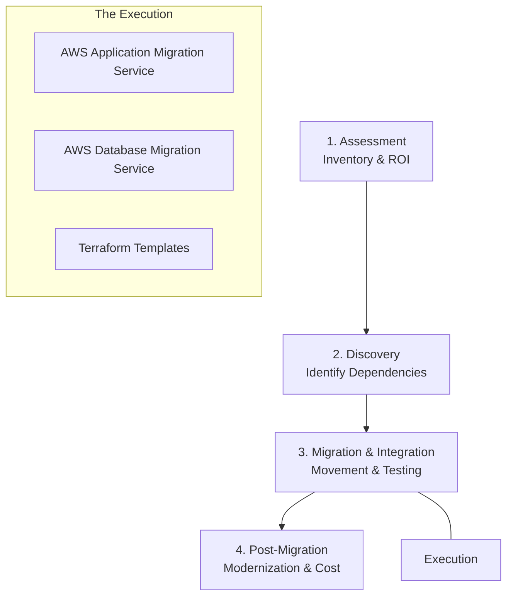

### Phase 1: Assessment & Discovery
- Used **AWS Migration Evaluator** to get an inventory of all instances, CPUs, and memory.
- Identified application dependencies (which DB connects to which API) using **AWS Application Discovery Service**.

### Phase 2: Foundation (The Landing Zone)
- Created the AWS environment using **AWS Control Tower** to set up a multi-account structure (Dev, Staging, Prod).
- Established connectivity via **AWS Site-to-Site VPN** or **Direct Connect** for the migration data transfer.

### Phase 3: Migration (The Movement)
- **Database:** Used **Schema Conversion Tool (SCT)** and **AWS DMS** to migrate a multi-TB MySQL database with near-zero downtime.
- **Compute:** Used **AWS MGN** to replicate EC2-equivalent VMs from the source cloud.
- **File Storage:** Synced object storage using **AWS DataSync**.

### Phase 4: Validation & Cutover
- Performed **Smoke Tests** and **User Acceptance Testing (UAT)** in the new AWS Staging environment.
- **DNS Switch:** Changed the TTL in Route 53 and shifted traffic from the old cloud to AWS during a low-traffic window.

---

## 3. My Role as Lead DevOps Engineer

1. **Infrastructure as Code (IaC):** Re-wrote all infrastructure from the source cloud (e.g., ARM/Deployment Manager) into **Terraform modules** to ensure repeatability and consistency.
2. **Security & Compliance:** Used **AWS IAM**, **Security Hub**, and **GuardDuty** to ensure the new environment met the client's compliance standards (PCI-DSS/HIPAA).
3. **CI/CD Parity:** Updated Jenkis/GitHub Actions to deploy to AWS ECR and EKS instead of the source cloud providers.
4. **Monitoring:** Set up **CloudWatch Dashboards** and **CloudTrail** for full observability of the new infrastructure.

---

## 4. Challenges and How I Solved Them

| Challenge | Solution |
| :--- | :--- |
| **Data Latency** | Setup **AWS Direct Connect** for a dedicated 10Gbps link during the migration phase. |
| **Downtime Concern** | Used **Blue/Green cutover** with Route 53 Weighted Routing to shift traffic gradually. |
| **Secret Management** | Migrated local secrets to **AWS Secrets Manager** with automatic rotation. |
| **Cost Overruns** | Implemented **AWS Cost Explorer** and **AWS Budgets** to track and alert on spend. |

---

## Interview Summary

**Question:** "Describe a cloud migration you led. What was your role and how did you execute it?"

**Answer:**
"I recently led a large-scale migration for a financial services client moving from a Hybrid-Cloud setup to AWS. My role was the **Lead DevOps Engineer**, and I structured the project around the **AWS Migration Hub**.

1. **Strategy:** We adopted a **Re-platforming** strategy for the database layer (moving to Aurora MySQL) and a **Re-architecting** strategy for the front-end (moving to S3/CloudFront and Lambda).
2. **Discovery:** We used the **AWS Application Discovery Service** to map out complex dependencies between 50+ microservices.
3. **Execution:** I built a **Landing Zone** using Terraform, incorporating VPCs, Transit Gateway, and centralized IAM. We migrated the data using **AWS DMS** for databases and **AWS DataSync** for flat files. 
4. **Cutover:** To ensure zero downtime, we synchronized data in real-time and performed the switch using **Route 53 Weighted Record Sets**, shifting traffic 10% at a time.
5. **Outcome:** We reduced infrastructure costs by 30% through rightsizing and increased deployment frequency by 4x by automating the entire lifecycle with AWS-native CI/CD tools."

---

---

# Question 2: "How do you manage Helm charts and API revisions when it comes to API versions?"

## The Answer: "I manage Helm versions using a clear distinction between the **Chart Version** (the package itself) and the **App Version** (the image tag). For Kubernetes API version management, I use Helm's built-in `.Capabilities` to detect the cluster version and conditionally load the correct `apiVersion` (e.g., for Ingress or horizontalPodAutoscaler). We follow **Semantic Versioning (SemVer)** for all chart releases."

"When a Kubernetes API is deprecated (like `extensions/v1beta1` to `networking.k8s.io/v1`), we update our Helm templates to use `_helpers.tpl` to dynamically determine the correct API version based on the cluster's capability. This ensures one chart can work across multiple cluster versions (EKS 1.21 vs 1.25)."

---

## 1. Chart Version vs. App Version

In `Chart.yaml`, managing these two separately is crucial for senior-level DevOps governance.

```yaml
apiVersion: v2
name: my-api-service
description: A Helm chart for my Kubernetes API

# 1. 'version': The version of the CHART itself (package version)
# Increment this when: Changing templates, adding values, fixing manifests.
version: 1.5.2

# 2. 'appVersion': The version of the APPLICATION (usually Docker tag)
# Increment this when: Deploying a new code release/Docker image.
appVersion: "v2.1.0"
```

**Best Practice:**
- **`version`:** Follows SemVer. 
  - `1.x.x` -> Major (breaking change in chart architecture).
  - `x.1.x` -> Minor (added a new feature like a Job or ServiceMonitor).
  - `x.x.1` -> Patch (minor fix in a label or annotation).
- **`appVersion`:** Controlled by the application CI/CD pipeline.

---

## 2. Managing Kubernetes API Deprecations

Kubernetes frequently evolves its APIs (e.g., Ingress, CronJob, HPA). A senior DevOps engineer ensures their charts are **backwards compatible**.

### The Problem:
An `Ingress` manifest that works on EKS 1.18 might fail on EKS 1.22 because the API moved from `networking.k8s.io/v1beta1` to `networking.k8s.io/v1`.

### The Solution: Using `_helpers.tpl`
Instead of hardcoding the `apiVersion`, we use a helper function.

**In `templates/_helpers.tpl`:**
```yaml
{{/*
Return the appropriate apiVersion for ingress.
*/}}
{{- define "myapp.ingress.apiVersion" -}}
  {{- if and .Capabilities.APIVersions.Has "networking.k8s.io/v1" (semverCompare ">=1.19-0" .Capabilities.KubeVersion.GitVersion) -}}
    {{- print "networking.k8s.io/v1" -}}
  {{- else if .Capabilities.APIVersions.Has "networking.k8s.io/v1beta1" -}}
    {{- print "networking.k8s.io/v1beta1" -}}
  {{- else -}}
    {{- print "extensions/v1beta1" -}}
  {{- end -}}
{{- end -}}
```

**In `templates/ingress.yaml`:**
```yaml
apiVersion: {{ include "myapp.ingress.apiVersion" . }}
kind: Ingress
metadata:
  name: {{ include "myapp.fullname" . }}
# ... rest of the manifest
```

---

## 3. API Revision Management Flow

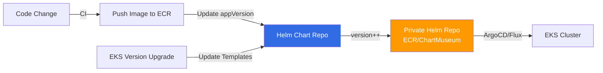

---

## 4. Production Release Strategy

### Lifecycle of an API Version change:
1. **Discovery:** Use tools like `pluto` or `fairwinds-insentia` to scan the cluster for deprecated API versions currently in use.
2. **Implementation:** Update the `_helpers.tpl` in the Helm chart to support the new version.
3. **Validation:** Use `helm template` or `helm install --dry-run` against different cluster versions to ensure the output is correct.
4. **Versioning:** Increment the **Chart Version** (Major version if it breaks support for old K8s versions).
5. **Rollout:** Deploy using a Blue/Green or Canary approach if the API change involves a structural change (like the Ingress `pathType` requirement).

---

## 5. Helm Repository Best Practices

- **Centralized Storage:** Use **AWS ECR (OCI artifacts)** or **ChartMuseum** to store versioned `.tgz` packages.
- **Immutability:** Never overwrite an existing chart version. If you made a mistake in `v1.2.3`, fix it and release `v1.2.4`.
- **Dependency Management:** Use `Chart.lock` to ensure sub-charts (like Redis or Postgres) are locked to specific versions.
- **Rollback:** Always maintain a history of at least 10 revisions in the cluster (`helm history <release>`) for instant recovery.

---

## Interview Summary

**Question:** "How do you manage Helm charts and API revisions?"

**Answer:**
"I follow a strict versioning and compatibility strategy:
1. **Versioning Separation:** We keep the **Chart Version** (SemVer for package changes) independent of the **App Version** (Docker image release). This allows us to update infrastructure manifests without redeploying the application code.
2. **API Compatibility:** To handle Kubernetes API evolution, I avoid hardcoding `apiVersion` in templates. Instead, I use **Helm Helper functions** integrated with cluster `.Capabilities`. This allows a single chart to be portable across different EKS versions by dynamically selecting `networking.k8s.io/v1` or `v1beta1` based on the target cluster.
3. **Packaging & Storage:** We treat Helm charts as immutable artifacts. We package them as OCI images and store them in **AWS ECR**. This provides a secure, versioned, and audited source of truth.
4. **Automation:** Our CI/CD pipelines automatically increment chart versions using **Git tags** and validate them with `helm lint` and `pluto` for deprecation checks before they are published."


# Question 3: "What is IRSA (IAM Roles for Service Accounts) in EKS, and why is it preferred over Node Group roles?"

## The Answer: "IRSA is a feature in Amazon EKS that allows you to provide granular IAM permissions to individual Pods by associating an IAM Role with a Kubernetes Service Account. It follows the **Principle of Least Privilege**, ensuring that a Pod only has access to the specific AWS resources it needs (e.g., an S3 bucket or DynamoDB table), rather than giving those permissions to the entire Worker Node."

"Before IRSA, we had to attach IAM policies to the EC2 Node Instance Role. This meant **every Pod** running on that node shared the same broad permissions, which was a major security risk. With IRSA, permissions are isolated at the Pod level using OIDC (OpenID Connect) federation."

---

## 1. How IRSA Works (The Workflow)

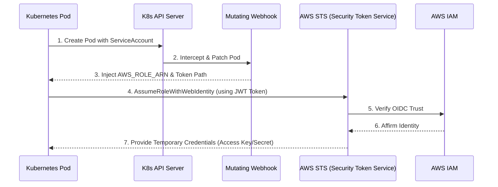

---

## 2. Implementation Steps

### Step 1: Create an OIDC Provider for the Cluster
Each EKS cluster has an OIDC issuer URL. You must create an IAM OIDC provider to establish trust between IAM and EKS.
```bash
eksctl utils associate-iam-oidc-provider --cluster my-cluster --approve
```

### Step 2: Create an IAM Role with a Trust Policy
The trust policy allows the EKS OIDC provider to assume the role ONLY if the request comes from a specific Service Account in a specific namespace.
```json
{
  "Version": "2012-10-17",
  "Statement": [
    {
      "Effect": "Allow",
      "Principal": { "Federated": "arn:aws:iam::1234567890:oidc-provider/oidc.eks.us-east-1.amazonaws.com/id/EXAMPLED539D4638E97E34DE46D4..." },
      "Action": "sts:AssumeRoleWithWebIdentity",
      "Condition": {
        "StringEquals": {
          "oidc.eks.us-east-1.amazonaws.com/id/EXAMPLED539D4638E97E34DE46D4:sub": "system:serviceaccount:prod-ns:my-app-sa"
        }
      }
    }
  ]
}
```

### Step 3: Annotate the Service Account
```yaml
apiVersion: v1
kind: ServiceAccount
metadata:
  name: my-app-sa
  namespace: prod-ns
  annotations:
    eks.amazonaws.com/role-arn: arn:aws:iam::1234567890:role/my-app-role
```

---

## 3. IRSA vs. Node Group Roles

| Feature | Node Group Roles (Direct) | IRSA (IAM Roles for Service Accounts) |
| :--- | :--- | :--- |
| **Granularity** | **Broad:** All Pods on node share same role | **Granular:** Every Pod gets its own role |
| **Security** | ❌ High risk (Pod A can access Pod B's S3) | ✅ High security (Complete isolation) |
| **Auditing** | ❌ Hard to tell which Pod made the API call | ✅ Easy to audit via CloudTrail (per role) |
| **Scalability** | ❌ Limits on policy size for one node role | ✅ Unlimited (1 role per microservice) |
| **Setup** | Simple | Requires OIDC provider setup |

---

## 4. Key Components Injected by EKS
When a Pod uses an annotated Service Account, the EKS **Pod Identity Webhook** automatically injects:
1. **`AWS_ROLE_ARN`**: The ARN of the IAM role.
2. **`AWS_WEB_IDENTITY_TOKEN_FILE`**: Path to a projected service account token (a JWT file).
3. **Volume Mount**: The JWT token is mounted at `/var/run/secrets/eks.amazonaws.com/serviceaccount/token`.

The **AWS SDK** inside your application (Go, Python, Java) automatically detects these and handles the `AssumeRoleWithWebIdentity` call for you.

---

## Interview Summary

**Question:** "What is IRSA and why do you use it?"

**Answer:**
"IRSA stands for **IAM Roles for Service Accounts**. It is the standard way to provide AWS permissions to EKS workloads securely. 

In my previous projects, we moved away from attaching policies to Worker Node roles because it violated the principle of least privilege—if one Pod was compromised, the attacker could access every AWS resource the node role had permission for.

With IRSA, we create a specific IAM role for each microservice. We establish trust between IAM and EKS using an **OIDC provider**. We then annotate the Kubernetes **Service Account** with the IAM Role ARN. EKS's mutating webhook then injects a web identity token into the Pod, which the AWS SDK uses to fetch temporary credentials. 

This approach provides **strict security isolation**, **better auditability in CloudTrail**, and ensures that our security posture is robust by limiting the blast radius of any single container."


# Question 4: "What are 'Namespaces' in AWS ECS, and what is their use? How do they differ from Kubernetes namespaces?"

## The Answer: "In AWS ECS, a 'Namespace' is a logical group used for **Service Discovery**, managed by **AWS Cloud Map**. Its primary use is to allow ECS services to communicate with each other using friendly DNS names (e.g., `auth.production` or `billing.local`) instead of IP addresses. Unlike Kubernetes namespaces, which provide resource isolation and RBAC, ECS namespaces are strictly for service-to-service connectivity."

"When you create an ECS service and associate it with a namespace, AWS Cloud Map automatically manages the DNS records (Route 53) or provides an API for service discovery as tasks are started and stopped. This is the backbone of microservices communication in a 'Service Connect' or 'Service Discovery' setup."

---

## 1. Types of ECS Namespaces (Cloud Map)

AWS Cloud Map provides three types of namespaces that you can use with ECS:

1. **HTTP Namespace:** Use this when you want your services to discover each other via an API call (`DiscoverInstances`) rather than DNS. Best for web-service based discovery.
2. **DNS Private Namespace:** Use this for service-to-service communication within a VPC. It creates a **Route 53 Private Hosted Zone** (e.g., `service.internal`).
3. **DNS Public Namespace:** Use this if your services need to be discoverable over the public internet via DNS.

---

## 2. Service Discovery vs. Service Connect

In modern ECS, namespaces are used in two ways:

### A. AWS Cloud Map (Standard Service Discovery)
- **How it works:** ECS registers the IP of each task into a Route 53 DNS record as a 'Simple' or 'Multivalue' record.
- **Workflow:** `Service A` queries DNS for `service-b.local` -> gets IP -> connects directly to `Service B`.

### B. ECS Service Connect (Recommended for Senior Roles)
- **How it works:** A sidecar proxy (based on Envoy) is injected into your tasks.
- **Workflow:** You select a namespace for your cluster. Services are assigned "aliases" within that namespace. The traffic is intercepted by the sidecar, providing **retries**, **timeouts**, and **observability** without changing application code.

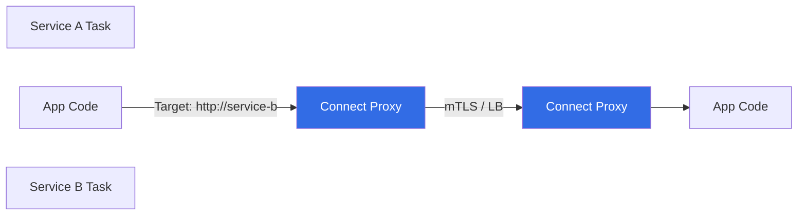

---

## 3. ECS vs. Kubernetes Namespaces (The Big Difference)

This is a common "trick" question to see if you actually know both platforms.

| Feature | Kubernetes Namespaces | ECS Namespaces (Cloud Map) |
| :--- | :--- | :--- |
| **Primary Purpose** | **Resource Isolation:** Scope for pods, services, secrets. | **Service Discovery:** Naming registry for connectivity. |
| **Security/RBAC** | ✅ Strong (Restrict access per namespace) | ❌ None (IAM handles security at the service level) |
| **Resource Quotas** | ✅ Yes (Limit CPU/Mem per namespace) | ❌ No (Set at the Task/Service level) |
| **DNS Scope** | ✅ Yes (`service.ns.svc.cluster.local`) | ✅ Yes (`service.namespace`) |
| **Network Isolation**| ✅ Yes (via NetworkPolicies) | ❌ No (via Security Groups/VPC) |

---

## 4. Key Benefits of Using ECS Namespaces

1. **Dynamic Scaling:** As ECS adds/removes tasks, the namespace (Cloud Map) is automatically updated with healthy IPs.
2. **Health Checking:** Cloud Map only returns the IPs of "HEALTHY" tasks. If a task fails its container health check, it's removed from the namespace DNS.
3. **Internal Architecture:** Essential for internal microservices that shouldn't be exposed behind an Application Load Balancer (ALB) to save costs.

---

## Interview Summary

**Question:** "What is the use of namespaces in ECS?"

**Answer:**
"Namespaces in ECS are essentially **AWS Cloud Map logical groups** used for service discovery. Unlike Kubernetes, where a namespace provides resource isolation and RBAC, an ECS namespace is used to facilitate **service-to-service communication**.

I use them to assign friendly, predictable DNS names to microservices. For example, instead of a front-end service needing the private IP of a backend service, it can simply call `http://backend.production`. 

I typically implement this using **ECS Service Connect**, which uses an Envoy-based proxy. By associating a service with a namespace, ECS handles the complex task of tracking task IP changes, performing health-aware load balancing, and providing traffic observability, all within that private namespace. This eliminates the need for internal Load Balancers, reducing both latency and AWS costs."


# Question 5: "Can we use the same 'Namespace' in different ECS clusters?"

## The Answer: "Yes! AWS Cloud Map namespaces are not tied to a single ECS cluster. They are a VPC-scoped (for Private DNS) or Region-scoped (for Public/HTTP) resource. This allows you to implement a **Cross-Cluster Service Discovery** architecture where multiple ECS clusters can discover and communicate with each other using a shared naming registry."

"For example, you might have a 'Shared Services' cluster running an Authentication API and a 'Product' cluster running the storefront. By using the same namespace (e.g., `internal.corp`), the storefront in Cluster B can resolve `auth.internal.corp` even though the auth service is running in Cluster A."

---

## 1. The Architecture of Shared Namespaces

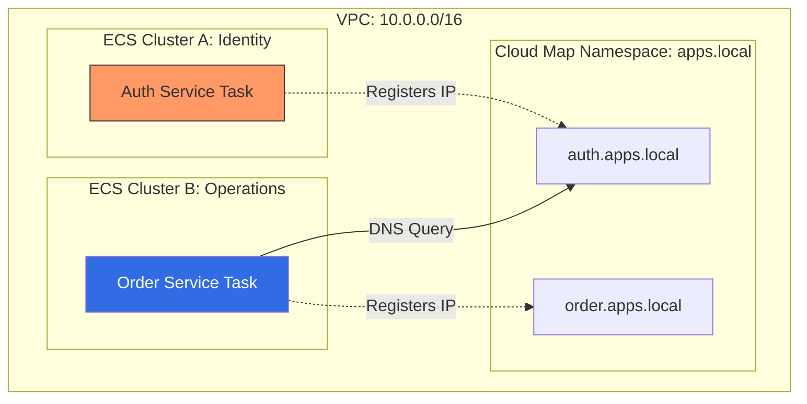

---

## 2. When to Use Multi-Cluster Namespaces

1. **Shared Utility Services:** Centralizing services like Logging (FluentBit), Monitoring agents, or Auth providers that multiple business clusters need to reach.
2. **Blue/Green Cluster Upgrades:** When migrating from an old ECS cluster to a new one, you can register services from both clusters in the same namespace to maintain connectivity during the transition.
3. **Microservice Isolation:** Separation of concerns by running high-security workloads in an isolated cluster while still allowing them to be discovered by authorized services in other clusters.

---

## 3. Important Implementation Nuance: Service Connect

While standard **Cloud Map (DNS-based)** discovery works seamlessly across clusters in the same VPC, **ECS Service Connect** has specific behavior:

- **Namespace Scope:** A Service Connect namespace is defined at the VPC level.
- **Cluster Association:** You can associate multiple ECS clusters with the **same** Service Connect namespace.
- **Connectivity:** As long as all clusters are in the same VPC and have the Service Connect agent configured, they can talk to each other across cluster boundaries using the same alias names.

---

## 4. Constraints to Remember

- **VPC Boundary:** For Private DNS namespaces, the clusters **must** be in the same VPC or have VPC Peering/Transit Gateway set up with DNS resolution enabled.
- **Overlapping Names:** If you have a service named `api` in Cluster A and another service named `api` in Cluster B both using the same namespace, Cloud Map will return IPs for **all healthy tasks from both clusters**. This is great for cross-cluster load balancing but can be a trap if you wanted them to be separate.

---

## Interview Summary

**Question:** "Can we use the same namespace in different clusters?"

**Answer:**
"Absolutely. In AWS, the **Namespace** belongs to **AWS Cloud Map**, not the ECS cluster. This is a very powerful architectural pattern for large-scale microservices.

In my projects, I've used this to enable **cross-cluster communication**. We would have a dedicated 'Platform' cluster for shared tools and several 'Product' clusters. By using a shared Cloud Map namespace, a service in a 'Product' cluster could resolve the internal DNS of a tool in the 'Platform' cluster without needing a centralized Load Balancer (ALB).

This approach reduces cost by eliminating ALBs for internal traffic and simplifies our infrastructure-as-code. We simply ensure our Terraform modules point to the same **Namespace ID** when creating the service discovery configuration for services in different clusters. It's essentially a VPC-wide internal phone book that all our clusters can share."


# Question 6: "Two containers are running in ECS (either in same or different services). I want to make an API call from Container A to Container B. How do you achieve that?"

## The Answer: "There are three primary ways to achieve this depending on the architecture: (1) **Service Connect** for advanced traffic management, (2) **Service Discovery (Cloud Map)** for standard DNS-based resolution, and (3) **Localhost** if both containers are part of the same Task Definition."

"For a modern, production-grade microservices setup, **ECS Service Connect** is the preferred choice because it provides automatic retries, timeouts, and mTLS without needing an internal Load Balancer or complex DNS configuration."

---

## 1. Scenario A: Containers in the SAME Task Definition

If Container A and Container B are defined in the same Task Definition (Sidecar pattern), they share the same **Network Namespace**.

- **Mechanism:** Communication happens over **localhost**.
- **Example:** Container A calls `http://localhost:8080` to reach Container B.
- **Use Case:** Log routers (FluentBit), Monitoring agents (Datadog), or Auth proxies.

---

## 2. Scenario B: Containers in DIFFERENT Services (Same Cluster)

This is the most common microservices scenario.

### Option 1: ECS Service Connect (Recommended)
- **How it works:** You assign a "Service Connect Alias" (e.g., `inventory-api`) to Service B.
- **Workflow:** Container A simply calls `http://inventory-api:8080`.
- **Benefits:** 
  - No DNS discovery latency.
  - Built-in **load balancing** across all healthy tasks of Service B.
  - **Observability:** You get traffic metrics (request count, error rates) in the ECS console.

### Option 2: ECS Service Discovery (Cloud Map)
- **How it works:** Each service is registered in a Cloud Map namespace (e.g., `internal.corp`).
- **Workflow:** Container A calls `http://inventory.internal.corp`.
- **Latency:** Slightly higher than Service Connect because it requires a DNS lookup.

---

## 3. Comparison of Communication Methods

| Method | Service Connect | Service Discovery (Cloud Map) | Internal Load Balancer (ALB) |
| :--- | :--- | :--- | :--- |
| **Logic** | Sidecar Proxy (Envoy) | DNS Records (Route 53) | Centralized Infrastructure |
| **Traffic Mgmt** | ✅ Retries, Timeouts | ❌ Basic DNS only | ✅ Full WAF, Path routing |
| **Visibility** | ✅ Detailed L7 metrics | ❌ Only basic metrics | ✅ Full Access Logs |
| **Cost** | 🆓 Free (Fargate/EC2) | 🆓 Free (excluding DNS queries) | 💰 High ($20+/month per ALB) |
| **Complexity** | Low (One checkbox) | Moderate (IAM + DNS) | High (VPC Subnets, SGs) |

---

## 4. Addressing Security (Security Groups)

Whatever method you choose, you must ensure the **AWS Security Groups** allow the traffic.

- **Security Group for Service B (Receiver):** 
  - Must have an Inbound Rule allowing the specific port (e.g., 8080).
  - **Best Practice:** Set the "Source" to the Security Group ID of **Service A** (rather than a wide CIDR range like `10.0.0.0/16`).

---

## Interview Summary

**Question:** "How do you enable communication between two containers in ECS?"

**Answer:**
"The implementation depends on whether the containers are tightly coupled in the same task or are independent services.

1. **Intra-Task:** For containers in the **same Task Definition**, I use **localhost**. Since they share the same network stack, Container A can reach Container B on `127.0.0.1:[port]`.
2. **Inter-Service:** For independent microservices, I strongly prefer **ECS Service Connect**. It provides an Envoy-based service mesh capability that lets me use a simple alias like `http://orders-api`. It handles internal load balancing and health-aware routing automatically.
3. **Legacy/Complex Discovery:** If Service Connect isn't an option, I use **AWS Cloud Map Service Discovery**. This creates a private Route 53 namespace where each task registers its IP, allowing the requester to use a friendly DNS name.

In all cases, I ensure security by using **Security Group referencing**, where the destination service only accepts traffic from the specific source security group of the calling service, adhering to the principle of least privilege."


# Question 7: "What is the difference between `terraform refresh` and `terraform apply`?"

## The Answer: "The fundamental difference is that `terraform refresh` only updates the **State File** to match the actual infrastructure, whereas `terraform apply` updates the **Infrastructure** to match the code. `terraform refresh` is a read-only operation with respect to your cloud resources, while `terraform apply` can create, update, or destroy them."

"In modern Terraform (v15.0+), a 'refresh' is actually performed automatically as part of every `plan` and `apply` command. Therefore, you rarely need to run `terraform refresh` manually unless you specifically want to update the state file without proposing any changes."

---

## 1. Comparing the Mechanics

| Feature | `terraform refresh` | `terraform apply` |
| :--- | :--- | :--- |
| **Primary Goal** | Sync State File ⬅️ Cloud | Sync Cloud ⬅️ Code |
| **Modifies Cloud?**| ❌ No (Read-only) | ✅ Yes (Create/Modify/Delete) |
| **Modifies State?**| ✅ Yes (Updates to match Cloud) | ✅ Yes (Updates to match transition) |
| **Requires Code?** | ❌ No (Uses existing state) | ✅ Yes (Requires configuration) |
| **Detects Drift?** | ✅ Yes | ✅ Yes (as part of the plan phase) |

---

## 2. The Logic Flow

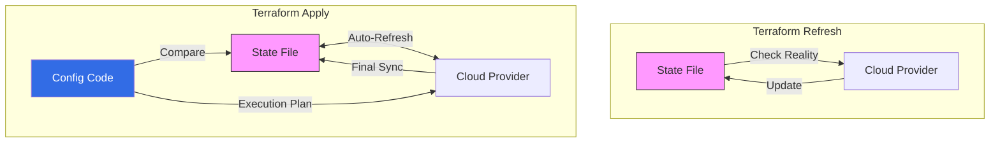

---

## 3. When to Use Each Command

### When to use `terraform apply`:
- **Daily Operations:** To deploy new resources, change instance types, or update tags.
- **Rollbacks:** As discussed in Q45, to 'roll-forward' to a stable Git commit.
- **Initial Setup:** To provision the infrastructure for the first time.

### When to use `terraform refresh`:
- **Pre-analysis:** To see if someone made manual changes in the AWS Console (Drift Detection) without wanting to change anything yet.
- **State Recovery:** If a previous `apply` crashed and you want to ensure the state file is accurately reflecting what exists before trying again.
- **Output Retrieval:** If you added a new `output` variable to your code and want to populate it with data from the current state without triggering a full apply.

---

## 4. The "Implicit Refresh" (Senior Nuance)

Important for interviews: **Do not stop at just the definitions.** 

"Since Terraform 0.15, running `terraform plan` or `terraform apply` performs an implicit refresh by default. If you want to skip this (e.g., for a very large state file to save time), you can use the `-refresh=false` flag. Conversely, if you want only the refresh logic without an apply, you use the modern alternative: `terraform plan -refresh-only` and then apply that specific plan."

---

## 5. Risk Factors: Why Refresh can be Dangerous

While `refresh` doesn't change your cloud resources, it **does** change your state file. 
- If a resource was manually deleted in AWS, `terraform refresh` will remove it from your state file. 
- In your next `apply`, Terraform will try to **re-create** it. 
- This is why you should always run `terraform plan` after a refresh to understand what changed in your source of truth.

---

## Interview Summary

**Question:** "What is the difference between refresh and apply?"

**Answer:**
"I view `terraform apply` as the command to enforce the **Desired State** defined in my code onto the cloud provider. It's the action that actually builds or modifies our environment.

`terraform refresh`, on the other hand, is about synchronizing our **State File** with the current **Reality** of the cloud. It doesn't change any AWS resources; it just updates the metadata in our `terraform.tfstate` so Terraform knows exactly what is out there.

In a professional CI/CD pipeline, we rarely run `refresh` as a standalone command. Instead, we rely on the **implicit refresh** that happens during `terraform plan`. This ensures that every time we propose a change, our plan is based on the most up-to-date information from the cloud, allowing us to detect 'Configuration Drift'—manual changes made outside of Terraform—immediately."


# Question 8: "I have 3 Terraform workspaces: `dev`, `prod`, and `uat`. I want to create an S3 bucket that should only be deployed in the `dev` environment. What condition will you set in the resource block?"

## The Answer: "To create a resource conditionally based on the workspace, I would use the `count` meta-argument combined with a conditional (ternary) operator checking the `terraform.workspace` variable. For a 'dev-only' bucket, the logic would be: `count = terraform.workspace == "dev" ? 1 : 0`."

"This ensures that when the current workspace is `dev`, Terraform sees a count of 1 and creates the bucket. In `prod` or `uat`, the count becomes 0, and Terraform effectively ignores or destroys the resource if it already exists."

---

## 1. Code Implementation Example

```hcl
resource "aws_s3_bucket" "dev_debug_logs" {
  # Conditional logic: If workspace is 'dev', create 1 bucket. Else, create 0.
  count = terraform.workspace == "dev" ? 1 : 0

  bucket = "my-company-dev-debug-logs"
  
  tags = {
    Environment = terraform.workspace
    Purpose     = "Debug logs for dev only"
  }
}
```

---

## 2. Dynamic Naming with Workspaces

While the question specifically asks for conditional creation, a common follow-up is how to handle naming across environments.

```hcl
resource "aws_s3_bucket" "app_data" {
  # This bucket is created in ALL environments, but with different names
  bucket = "my-company-${terraform.workspace}-app-data"
}
```

---

## 3. Workspaces vs. Feature Toggles

In a professional setup, we sometimes use **Variables** instead of hardcoded workspace checks for better flexibility.

**variables.tf:**
```hcl
variable "create_debug_bucket" {
  type    = bool
  default = false
}
```

**resource block:**
```hcl
resource "aws_s3_bucket" "dev_debug_logs" {
  count = var.create_debug_bucket ? 1 : 0
  bucket = "my-company-dev-debug-logs"
}
```
**Why this is better:** You can then set `create_debug_bucket = true` only in your `dev.tfvars` file, making the code more reusable and less "hardcoded" to specific workspace names.

---

## 4. Senior Warning: The Risk of Workspaces for Environment Separation

In many senior DevOps interviews, you should mention the downsides of using workspaces for `dev/uat/prod` separation:

1. **State Exposure:** All workspaces usually share the same backend. A mistake in `dev` could theoretically impact the state management of `prod`.
2. **Variable management:** It's easy to forget which workspace you are currently in (`terraform workspace show`), leading to "accidental prod deletes."
3. **The "Best Practice" Alternative:** As discussed in Q41, many senior architects prefer **Directory-based isolation** (`live/dev/`, `live/prod/`) where each environment has a completely separate state and backend configuration.

---

## Interview Summary

**Question:** "How do you create a resource only in the 'dev' workspace?"

**Answer:**
"I use the **`count`** meta-argument with a conditional expression against the **`terraform.workspace`** variable. Specifically, I would set `count = terraform.workspace == 'dev' ? 1 : 0`. 

When I run Terraform in the `dev` workspace, the condition evaluates to true, `count` is set to 1, and the S3 bucket is provisioned. In any other workspace like `prod` or `uat`, the `count` is 0, and Terraform ensures the bucket does not exist.

However, while this works for simple hobby projects, in a production-grade enterprise environment, I prefer using **Directory-based separation** or **Feature Flags (Input Variables)**. Relying on workspace names in the code can lead to brittle configurations. By using variables, we can control resource creation via environment-specific `.tfvars` files, which is more explicit and less prone to human error when switching contexts."


# Question 9: "How are you going to store the state file in an S3 bucket and use DynamoDB for state locking?"

## The Answer: "To store the state file in S3 and enable locking with DynamoDB, I configure a `backend` block within the `terraform` configuration block. This requires an existing S3 bucket for storage and a DynamoDB table with a Partition Key named `LockID`. Once the block is added, running `terraform init` will migrate the local state to the remote S3 backend."

"This configuration is critical for team collaboration as it centralizes the 'source of truth' and prevents state corruption by ensuring only one person can apply changes at a time."

---

## 1. Technical Implementation

This configuration is typically placed in a dedicated `backend.tf` file or within `main.tf`.

```hcl
terraform {
  backend "s3" {
    bucket         = "my-terraform-state-bucket"   # The S3 bucket name
    key            = "prod/terraform.tfstate"      # Path to the state file within the bucket
    region         = "us-east-1"                   # AWS Region
    encrypt        = true                          # Enable SSE-S3 encryption for the state file
    kms_key_id     = "arn:aws:kms:us-east-1:123:key/abc" # Optional: Use a specific KMS key

    # CRITICAL: Enables state locking
    dynamodb_table = "terraform-state-lock-table"
  }
}
```

---

## 2. Pre-requisites (Infrastructure for the Backend)

Before you can run `terraform init` with the above block, the S3 bucket and DynamoDB table must exist. You can either create them manually or via a separate Terraform bootstrap project.

### A. S3 Bucket Configuration:
- **Versioning:** Must be enabled (for state file history and recovery).
- **Encryption:** Enable Default Encryption (AES-256 or KMS).
- **Public Access:** Ensure "Block all public access" is turned on.

### B. DynamoDB Table Configuration:
- **Partition Key:** Must be named exactly **`LockID`** (case-sensitive).
- **Attribute Type:** String.

---

## 3. The Migration Process

1. **Write the code:** Add the `backend "s3"` block to your configuration.
2. **Initialize:** Run `terraform init`.
3. **Confirmation:** Terraform will detect that you are switching from a local state to a remote state. It will ask: *"Do you want to copy existing state to the new backend?"*.
4. **Accept:** Type `yes`. Terraform uploads your `.tfstate` to S3 and creates the initial lock metadata in DynamoDB.
5. **Clean up:** You can now safely delete your local `terraform.tfstate` and `terraform.tfstate.backup` files.

---

## 4. Key Benefits of this Setup

| Component | Benefit |
| :--- | :--- |
| **S3 Storage** | High durability, centralized access, and cost-effective. |
| **Versioning** | Allows you to revert to an older state if an 'apply' corrupts the current version. |
| **DynamoDB Lock**| Prevents race conditions. If Engineer A is running an apply, Engineer B is blocked. |
| **Encryption** | Protects sensitive data (passwords, keys) that Terraform stores in the state file. |

---

## 5. Troubleshooting: "State Locked"

If a Terraform process is interrupted (e.g., your internet goes down during an apply), the lock might stay in DynamoDB.

**The Fix:**
```bash
# Error says: "Error acquiring the state lock... ID: <LOCK_ID>"
terraform force-unlock <LOCK_ID>
```
*Note: Only do this if you are absolutely sure no one else is currently running an apply.*

---

## Interview Summary

**Question:** "How do you configure S3 and DynamoDB for Terraform state?"

**Answer:**
"I use the **Terraform S3 Backend** for state management. 

Technically, this involves adding a `backend "s3"` block in the Terraform configuration where I specify the **S3 bucket name**, the **key path** for the state file, and the **DynamoDB table name** for locking. 

For safety, I always ensure the S3 bucket has **Versioning enabled** so we can recover from accidental state corruption, and **AES-256 encryption** to protect the sensitive data within the state file. The DynamoDB table must have a primary key named **`LockID`**. 

Once configured, I run **`terraform init`** to migrate the state from the local machine to AWS. This setup is the standard for production environments as it provides a secure, audited, and 'race-condition-free' ecosystem for team-based infrastructure management."


# Question 10: "Why do we need to lock the state file, and why do we need to store it in S3? What happens if we don't?"

## The Answer: "We store the state file in S3 to ensure **persistence and team collaboration**, and we use locking to prevent **state corruption and race conditions**. In a team environment, if two people try to update the same infrastructure simultaneously without locking, the state file could become inconsistent, leading to 'broken' infrastructure that doesn't match the actual cloud resources."

---

## 1. Why Remote Storage (S3) is Essential

| Reason | The Problem with Local State | The S3 Solution |
| :--- | :--- | :--- |
| **Team Collaboration** | State is stuck on one machine. | Centralized bucket accessible to all engineers and CI/CD. |
| **State Loss** | If your laptop dies, the 'map' of your infra is gone. | High durability (99.999999999%) with **Versioning** for recovery. |
| **Security** | Sensitive data (DB passwords) is in plain text on a disk. | State is encrypted at rest (SSE-S3/KMS) and in transit (HTTPS). |
| **CI/CD Integration** | GitHub Actions can't access your local files. | CI/CD runners can assume an IAM role to pull the state from S3. |

---

## 2. Why State Locking (DynamoDB) is Essential

Without locking, a "Race Condition" occurs.

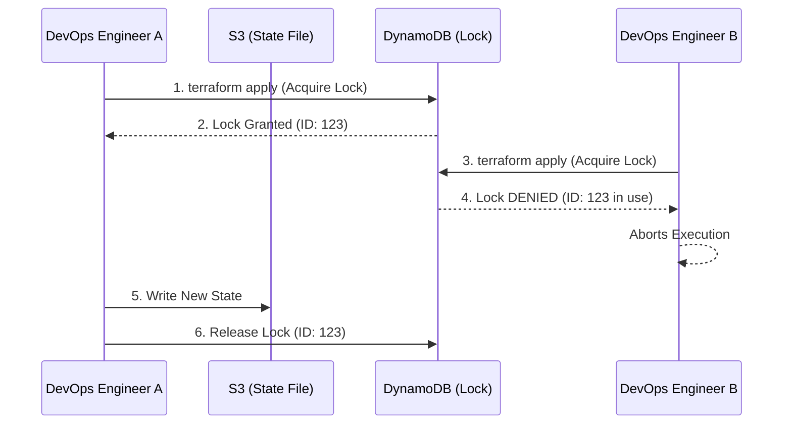

### The Risks of No Locking:
1. **Conflicting Changes:** If Engineer A is changing an Instance Type and Engineer B is changing the Subnet simultaneously, the state file might only record one of those changes, while both are happening in AWS.
2. **Corrupted State File:** Terraform writes the state file as a large JSON blob. If two processes write to it at the same time, the file can be truncated or corrupted, rendering it unreadable.
3. **Double Provisioning:** Two engineers might accidentally trigger the creation of the same resource, leading to duplicate costs and manual cleanup.

---

## 3. What happens if we don't use S3 + DynamoDB?

- **"Where is the state?"** -> You spend hours hunting for the latest `terraform.tfstate` file in Slack or Email.
- **Manual Overwrites:** You create a VPC, your colleague inadvertently deletes it because their local state doesn't show it exists.
- **Manual Cleanup:** You'll find yourself manually deleting resources in the AWS Console because Terraform has "lost track" of them.
- **Insecure Data:** Your database passwords and API keys are exposed to anyone who can access your machine.

---

## Interview Summary

**Question:** "Why are state locking and remote storage necessary?"

**Answer:**
"I consider these the 'First Two Rules' of production Terraform. 

We **store state in S3** because local state is a 'Single Point of Failure'. In a professional team, we need a centralized, encrypted, and highly durable source of truth that our CI/CD pipelines can also access. S3 with **versioning** gives us a safety net; if an apply goes wrong, we can roll back the state file itself.

We **use DynamoDB for locking** to enforce a 'One-at-a-Time' rule for infrastructure changes. Without it, you invite **race conditions** and **state corruption**. If two people apply changes at once, they risk overwriting each other's work and leaving the state file out of sync with reality. 

In my previous roles, implementing S3 and DynamoDB backends was the first thing I did for any new project to ensure we had a robust, collaborative environment where our infrastructure remained stable and secure."

---

# Question 11: "How are you going to secure your personal info like secrets in GitHub managed runners?"

## The Answer: "Securing secrets in GitHub managed runners is a multi-layered approach. It starts with using **GitHub Actions Secrets** (encrypted environment variables), but the most secure modern practice is using **OIDC (OpenID Connect)** to eliminate long-lived cloud credentials entirely. Additionally, we use **Environment Protections**, **Secret Masking**, and **External Secret Managers** to ensure a high security posture."

---

## 1. Core Security Features in GitHub Actions

### A. Encrypted Secrets
- **How it works:** Secrets are encrypted at the repository, environment, or organization level. GitHub uses [libsodium](https://libsodium.gitbook.io/doc/) to encrypt secrets before they reach GitHub.
- **Workflow:** You reference them as `${{ secrets.MY_SECRET }}` in your YAML. They are never shown in plain text in the UI after being saved.

### B. Automatic Secret Masking
- **How it works:** GitHub automatically attempts to redact any secret that is printed to the runner logs, replacing it with `***`.
- **Precaution:** Avoid encoding secrets (e.g., Base64) manually, as GitHub might not recognize the encoded version to mask it.

---

## 2. Advanced Security Patterns (Senior Level)

### A. OIDC (OpenID Connect) - The "No-Secret" Strategy
Instead of storing an `AWS_ACCESS_KEY_ID` and `AWS_SECRET_ACCESS_KEY` in GitHub, we establish a trust relationship between GitHub and AWS.

- **Benefits:** No long-lived secrets to rotate or leak. Access is based on a short-lived token issued only for a specific repository and branch.
- **Workflow:** 
  1. GitHub runner requests a JWT token from GitHub's OIDC provider.
  2. Runner presents the token to AWS STS.
  3. STS verifies the token and returns temporary AWS credentials.

### B. Environment-Level Secrets & Protection Rules
- **Use Case:** Separate secrets for `prod` vs `dev`.
- **Protection Rules:** You can require **Manual Approval** or restrict a secret to a specific **Branch** (e.g., only the `main` branch can access Production API keys).

---

## 3. Integrating External Secret Managers

For enterprise environments, we often don't store secrets in GitHub at all. Instead, we fetch them just-in-time.

```yaml
- name: Fetch secrets from HashiCorp Vault
  uses: hashicorp/vault-action@v2
  with:
    url: https://vault.mycompany.com
    method: jwt
    role: github-actions-role
    secrets: |
        secret/data/production/db_password password | DB_PASSWORD
```

- **Options:** AWS Secrets Manager, HashiCorp Vault, Azure Key Vault, or Google Secret Manager.

---

## 4. Best Practices Checklist

| Practice | Why it's important |
| :--- | :--- |
| **Least Privilege** | IAM roles should only have the exact permissions needed for the job. |
| **Secret Scanning** | Use GitHub Advanced Security to detect if a secret was accidentally committed to code. |
| **No Inline Secrets** | Never hardcode passwords in shell scripts inside the YAML; use environment variables. |
| **Runner Cleanup** | Managed runners are ephemeral (destroyed after one use), which reduces the chance of data persistence. |
| **Limit Scope** | Prefer **Environment Secrets** over **Organization Secrets** to limit the "blast radius." |

---

## Interview Summary

**Question:** "How do you secure secrets in GitHub Actions?"

**Answer:**
"I follow a defense-in-depth strategy for secrets management. 

Primary, I use **GitHub Encrypted Secrets** for any necessary configuration, ensuring they are scoped to specific **Environments** with mandatory reviewers for production deployments.

However, for cloud provider access (like AWS or Azure), my preferred approach is **OIDC (OpenID Connect)**. This allows me to eliminate long-lived access keys entirely, replacing them with temporary, short-lived tokens. This significantly reduces the risk of a credential leak.

I also emphasize **Log Masking**—being careful not to echo secrets—and I often integrate with an external secrets provider like **AWS Secrets Manager** to fetch sensitive data at runtime. Finally, I enable **Secret Scanning** on all repositories to catch any accidental exposures as early as possible in the commit history."


# Question 12: "I've created a deployment pipeline. Before deploying to production, I want a 'Gate' where only a Team Lead or Manager can approve. If any other team member approves, it shouldn't proceed. How do you implement this?"

## The Answer: "To implement role-based approval gates in GitHub Actions, I use **Environments** combined with **Required Reviewers**. By creating a 'Production' environment and restricting its 'Required Reviewers' to a specific GitHub **Team** (e.g., `lead-devs`) or specific **Users**, GitHub ensures that the deployment job stays in a 'Waiting' state until a member of that authorized group approves it."

"This prevents unauthorized deployments and ensures that high-stakes production changes always undergo senior-level verification."

---

## 1. Step-by-Step Implementation

### Step 1: Create a GitHub Team
First, create a Team in your GitHub Organization (e.g., `manager-approvers`) and add the Team Lead and Manager to it.

### Step 2: Configure the Environment
1. Go to **Settings** -> **Environments** in your GitHub repo.
2. Create an environment named `production`.
3. Enable **Required reviewers**.
4. Add the `manager-approvers` team or specific user handles as authorized reviewers.

### Step 3: Reference the Environment in YAML
In your workflow file, you must explicitly link the deployment job to that environment.

```yaml
jobs:
  deploy-to-prod:
    name: "Deploying to Production"
    runs-on: ubuntu-latest
    environment: production # This triggers the approval gate
    steps:
      - name: Deploy
        run: |
          echo "Deploying to production..."
          # Deploy commands here
```

---

## 2. Approval Workflow Logic

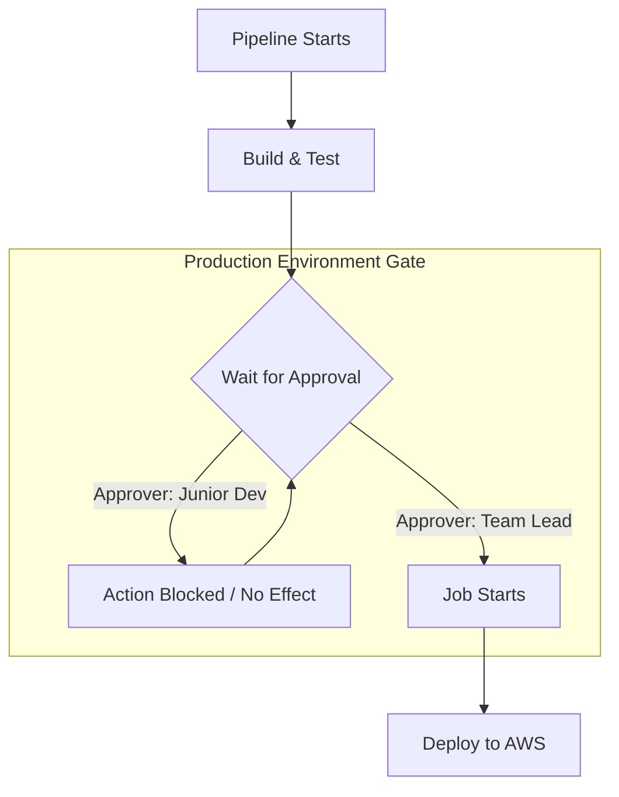

---

## 3. Comparison Across CI/CD Tools

| Feature | GitHub Actions | GitLab CI/CD | Jenkins |
| :--- | :--- | :--- | :--- |
| **Logic** | Environments + Required Reviewers | Protected Environments | `input` step with `submitter` parameter |
| **Simplicity** | ✅ High (Native UI) | ✅ High (Native UI) | ❌ Moderate (Requires Groovy script) |
| **Granularity** | Team or Individual based | Group or Role based | LDAP/User-specific |

---

## 4. Senior Tip: Deployment Protection Rules

Beyond just "who" can approve, consider adding these rules for a robust production gate:
1. **Wait Timer:** Forces a delay (e.g., 30 mins) before production deploy even after approval (useful for "soak" time).
2. **Deployment Branch Policy:** Only allows deployments to the `production` environment if the branch is `main`.
3. **Prevent Self-Approval:** Ensure the person who triggered the pipeline cannot approve their own deployment (available in GitHub Enterprise).

---

## Interview Summary

**Question:** "How do you ensure only high-level roles can approve production deployments?"

**Answer:**
"I use the **Environments** feature in GitHub Actions to create a secure deployment gate. 

Specifically, I define a 'Production' environment in the repository settings and configure **Required Reviewers**. I assign this to a specific GitHub **Team**—such as 'DevOps-Leads'—rather than individual users. This makes the process scalable and easier to manage as roles change.

In the workflow YAML, I link the deployment job to this 'Production' environment. Consequently, when the pipeline runs, the deployment job will automatically pause. GitHub then notifies the authorized leads via email and the UI. Only after an authorized member provides a manual approval will the job execute. 

If anyone outside that authorized team tries to approve, they simply won't have the button available, or their interaction won't trigger the job. This ensures a strictly governed release process where only designated stakeholders can verify and authorize production changes."


# Question 13: "How are you authenticating from your self-hosted runner to an EKS cluster? Can you explain the configuration where you are passing AWS Access Keys and Secret Keys?"

## The Answer: "To authenticate a self-hosted runner to EKS using keys, I use the `aws-actions/configure-aws-credentials` action to set up the AWS CLI environment, followed by `aws eks update-kubeconfig` to generate the Kubernetes configuration. This allows `kubectl` or `helm` commands to interact with the EKS API server using the provided credentials."

"While passing keys via GitHub Secrets is the direct answer, for a **self-hosted runner running on AWS (EC2)**, the senior-level best practice is to use an **IAM Instance Profile** to avoid managing long-lived keys entirely."

---

## 1. Authentication via Keys (The Configuration)

In this scenario, the AWS Access Key and Secret Key are stored as **GitHub Actions Secrets**.

### GitHub Actions Workflow (YAML)

```yaml
jobs:
  deploy:
    runs-on: self-hosted # Running on your own infrastructure
    steps:
      - name: Checkout Code
        uses: actions/checkout@v4

      - name: Configure AWS Credentials
        uses: aws-actions/configure-aws-credentials@v4
        with:
          aws-access-key-id: ${{ secrets.AWS_ACCESS_KEY_ID }}
          aws-secret-access-key: ${{ secrets.AWS_SECRET_ACCESS_KEY }}
          aws-region: us-east-1

      - name: Update Kubeconfig
        run: |
          aws eks update-kubeconfig --region us-east-1 --name my-eks-cluster

      - name: Deploy to EKS
        run: |
          kubectl get pods -n production
```

---

## 2. Behind the Scenes: What happens?

1. **`configure-aws-credentials`**: This action exports the keys as environment variables (`AWS_ACCESS_KEY_ID`, `AWS_SECRET_ACCESS_KEY`) on the runner.
2. **`update-kubeconfig`**: The AWS CLI uses those environment variables to call the EKS API. It creates/updates the `~/.kube/config` file.
3. **Execution**: When `kubectl` runs, it uses the token-based authentication mechanism provided by the AWS CLI (`aws eks get-token`) to authenticate against the EKS cluster's OIDC endpoint.

---

## 3. Senior Level: Keys vs. IAM Instance Profiles

If your self-hosted runner is an **EC2 instance**, passing keys is technically "Technical Debt."

| Feature | Using Access Keys | Using IAM Instance Profile |
| :--- | :--- | :--- |
| **Security** | ❌ Risk of key leakage/exposure. | ✅ No keys stored; uses temporary credentials. |
| **Maintenance**| ❌ Manual key rotation required. | ✅ Automatic rotation by AWS. |
| **Governance** | Harder to track in CloudTrail. | Seamless auditing via Instance ID. |
| **Setup** | Store in GitHub Secrets. | Attach IAM Role to EC2 Instance. |

### How to use IAM Profile (No Keys!):
```yaml
      - name: Configure AWS Credentials
        uses: aws-actions/configure-aws-credentials@v4
        with:
          aws-region: us-east-1
          # No keys needed! Action detects the EC2 IAM Role automatically.
```

---

## 4. EKS `aws-auth` ConfigMap (RBAC)

Even if the runner has the right AWS keys, EKS won't let it in unless the IAM identity is mapped to a Kubernetes group.

```yaml
# To check if your runner has access:
kubectl edit configmap aws-auth -n kube-system

# Ensure the IAM Role/User of the runner is mapped:
mapUsers: |
  - userarn: arn:aws:iam::1234567890:user/github-runner-user
    username: github-runner-user
    groups:
      - system:masters # Or a more restrictive group
```

---

## Interview Summary

**Question:** "How do you configure EKS authentication with AWS keys on a self-hosted runner?"

**Answer:**
"In my pipelines, I use the **`aws-actions/configure-aws-credentials`** action to securely inject the `AWS_ACCESS_KEY_ID` and `AWS_SECRET_ACCESS_KEY` from GitHub Secrets into the runner's environment. 

Once the credentials are set, I run the command **`aws eks update-kubeconfig --name [cluster-name]`**. This command is crucial because it configures the local `.kube/config` file to use the AWS CLI as an authentication provider.

However, I always mention that if we are running our self-hosted runners on **EC2**, I prefer to use **IAM Instance Profiles**. This eliminates the need for access keys entirely, adhering to the principle of least privilege and removing the overhead of secret rotation. It makes the pipeline more secure by ensuring that the runner's permissions are tied directly to the AWS infrastructure it sits on, rather than a static set of credentials."


# Question 14: "If I want to integrate any third-party tools (e.g., SonarQube, Snyk, Datadog) into GitHub Actions, how do you do it?"

## The Answer: "Integrating third-party tools into GitHub Actions typically involves one of three methods: (1) Using a pre-built **Action from the GitHub Marketplace**, (2) Using a **Docker Container Action**, or (3) Running the tool's **CLI/Binary manually** via a shell script. The choice depends on the tool's official support and the level of customization required."

"For most popular tools, using the official Marketplace Action is the easiest and most secure method as it handles the installation and authentication logic for you."

---

## 1. Integration Methods

### A. GitHub Marketplace Actions (Recommended)
Most vendors (HashiCorp, AWS, Snyk) provide official actions.
- **Usage:** Reference the action version in your YAML.
- **Example (Snyk Security Scan):**
```yaml
- name: Run Snyk to check for vulnerabilities
  uses: snyk/actions/node@master
  env:
    SNYK_TOKEN: ${{ secrets.SNYK_TOKEN }}
```

### B. Custom Docker Actions
If a tool doesn't have an official action but provides a Docker image.
- **Usage:** Use the `docker://` prefix.
- **Example:**
```yaml
- name: Run Custom Tool
  uses: docker://my-custom-tool:latest
  with:
    args: run --source .
```

### C. Manual CLI Integration (Shell Scripts)
For tools that provide a standalone binary or npm/pip package.
- **Workflow:** Install the CLI -> Configure Auth -> Run commands.
- **Example (SonarQube CLI):**
```yaml
- name: Install SonarScanner
  run: |
    npm install -g sonarqube-scanner
    sonar-scanner -Dsonar.login=${{ secrets.SONAR_TOKEN }}
```

---

## 2. Handling Authentication (Securing the Integration)

Integrating third-party tools almost always requires an API Key or Token.

1. **GitHub Secrets:** Store the API token in GitHub Encrypted Secrets.
2. **Environment Variables:** Pass the secret into the action or shell step.
3. **OIDC:** For tools that support it (like AWS, HashiCorp Vault, or some security platforms), use OIDC to avoid sharing static keys.

---

## 3. Webhooks & API Callbacks

Sometimes integration is "Inbound" (the tool calls GitHub).

- **Webhooks:** You configure the third-party tool to send a POST request to a GitHub URL when an event occurs (e.g., a scan completes).
- **Check Runs API:** Tools like SonarQube use the GitHub Checks API to report status (Pass/Fail) directly on the Pull Request UI.

---

## 4. Key Considerations for Senior Engineers

| Consideration | Goal |
| :--- | :--- |
| **Vendor Lock-in** | Prefer CLI tools over proprietary actions if you might move to GitLab/Jenkins later. |
| **Performance** | Use Docker-based actions carefully; pulling large images adds delay to every run. |
| **Security** | Pin actions to a specific **Commit SHA** (e.g., `actions/checkout@8e5e7e5...`) instead of a version tag to prevent supply chain attacks. |
| **Caching** | Cache the tool's dependencies (e.g., sonar-scanner binaries) to speed up subsequent runs. |

---

## Interview Summary

**Question:** "How do you integrate third-party tools into GitHub Actions?"

**Answer:**
"I evaluate the integration based on the tool's official support and our long-term maintainability. 

First, I look for an **Official Marketplace Action**. Using a well-maintained action from a verified creator is the most efficient way to get up and running while benefiting from automatic updates and community bug fixes.

If no action exists, but the tool is available as a **Docker image**, I use a Docker container action. This ensures environment parity—the tool runs exactly how the vendor intended, regardless of the runner's OS.

Lastly, for unique or internal tools, I fall back to a **Manual CLI integration**. I download the binary or use a package manager like `brew` or `npm` within a shell script. 

In all cases, I prioritize security by pinning the action versions to **Commit SHAs** rather than tags, and I never hardcode credentials—I always use **GitHub Secrets** or **OIDC** for secure authentication."


# Question 15: "How do you set up alarms in Prometheus and Grafana? Can you explain the complete alerting flow?"

## The Answer: "Setting up alarms involves two distinct but connected systems. In **Prometheus**, we define **Alerting Rules** based on PromQL expressions. These alerts are sent to **Alertmanager**, which handles deduplication, grouping, and routing to final destinations like Slack or PagerDuty. In **Grafana**, we use **Unified Alerting** to create alerts directly from dashboard panels, which can then be routed using its built-in contact points."

"The most robust production setup uses Prometheus for high-reliability infrastructure alerts and Grafana for visual, dashboard-driven application alerts."

---

## 1. The Prometheus Alerting Flow (The "Architecture" Answer)

The flow is decoupled to ensure that the monitoring system remains lightweight and reliable.

```mermaid
graph LR
    SUBGRAPH_PROM[Prometheus Cluster]
        METRICS[Metrics] -->|Query| RULES[Alerting Rules]
        RULES -->|Firing| ACTIVE_ALERTS[Active Alerts]
    end

    SUBGRAPH_AM[Alertmanager]
        ACTIVE_ALERTS -->|POST /api/v1/alerts| DISPATCH[Dedupe & Group]
        DISPATCH -->|Route| NOTIFY[Inhibit & Silence]
    end

    NOTIFY --> SLACK[Slack]
    NOTIFY --> PD[PagerDuty]
    NOTIFY --> EMAIL[Email]

    style SUBGRAPH_PROM fill:#f96,stroke:#333
    style SUBGRAPH_AM fill:#326CE5,color:#fff
```

### Steps to Setup:
1.  **Define Alerting Rule:** Created in a `.yaml` file.
    ```yaml
    groups:
    - name: host_alerts
      rules:
      - alert: HighCpuUsage
        expr: 100 - (avg by (instance) (irate(node_cpu_seconds_total{mode="idle"}[5m])) * 100) > 80
        for: 5m
        labels:
          severity: critical
        annotations:
          summary: "High CPU on {{ $labels.instance }}"
    ```
2.  **Configure Alertmanager:** Tell Prometheus where Alertmanager is running in `prometheus.yml`.
3.  **Define Routing:** In `alertmanager.yml`, define where `severity: critical` alerts should go (e.g., a specific Slack channel).

---

## 2. The Grafana Alerting Flow (Unified Alerting)

Grafana allows you to create alerts directly on top of your visualizations.

- **Flow:** Query -> Expression (Threshold) -> Notification Policy -> Contact Point.
- **Key Feature:** You can visualize exactly when an alert would have fired by looking at the historical graph during setup.

---

## 3. Prometheus vs. Grafana Alerting

| Feature | Prometheus Alerting | Grafana Alerting |
| :--- | :--- | :--- |
| **Storage** | Stored as Code (GitOps friendly). | Stored in Grafana DB / UI-driven. |
| **Logic** | Native PromQL. | Multi-datasource (SQL, CloudWatch, etc.). |
| **Reliability**| ✅ Very High (Independent of UI). | ❌ Lower (UI might be down during outage). |
| **Visualization**| ❌ Basic. | ✅ High (Rich graphs in notifications). |
| **Best Use Case**| Infrastructure, K8s Core, Uptime. | Business KPIs, Application SLOs. |

---

## 4. Senior Concepts: Silencing, Inhibition, and Grouping

In an interview, mention these three Alertmanager features to show seniority:

1.  **Grouping:** If a whole rack fails, Alertmanager sends **one** notification for 100 servers, instead of 100 separate pings.
2.  **Inhibition:** If the Data Center is down, "mute" the alerts for every individual server in that DC. This prevents "alert fatigue."
3.  **Silencing:** Temporarily mute alerts during a planned maintenance window.

---

## Interview Summary

**Question:** "How do you set up alerting in Prometheus and Grafana?"

**Answer:**
"I usually implement a tiered alerting strategy. 

For **infrastructure-level monitoring**, I use **Prometheus Alerting Rules**. I define these rules in YAML as part of our GitOps repository. These rules check the metrics every evaluation interval, and if they fire for a sustained period, they are pushed to **Alertmanager**. In Alertmanager, I configure sophisticated routing logic—for example, grouping related alerts to prevent notification storms and setting up **Inhibition rules** so that if a high-level service is down, we don't get pestered by low-level dependency alerts.

For **business logic or visual dashboards**, I use **Grafana Unified Alerting**. This is particularly useful for developers who want to set up an alert on a specific SQL query or a custom metric without writing YAML code. 

By combining both, we ensure that the SRE team has highly reliable 'Infrastructure-as-Code' alerts via Prometheus, while the product teams have the flexibility to monitor their application performance directly from their dashboards."


# Question 16: "How are you exporting metrics from Kubernetes to Prometheus and Grafana? Can you explain the data flow?"

## The Answer: "Exporting metrics from Kubernetes is based on a **Pull-based model**. Prometheus discovers targets (Pods/Services) using the **Prometheus Operator** and its **ServiceMonitor** custom resources. Data flows from specialized **Exporters** (like Node Exporter and kube-state-metrics) and the **Kubelet (cAdvisor)** into Prometheus, which is then added as a Data Source in Grafana for visualization."

---

## 1. The Metrics Architecture (The Flow)

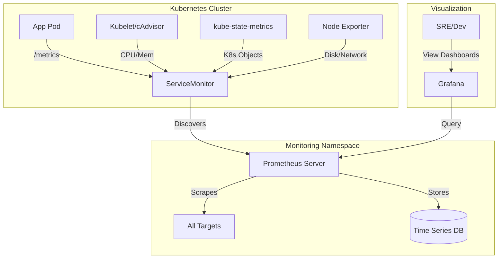

---

## 2. Key Components Explained (The "Deep Dive")

To give a complete answer, you must distinguish between the types of metrics being collected:

| Component | What it Provides | Why we need it |
| :--- | :--- | :--- |
| **cAdvisor** | Container-level stats (CPU, Memory, FS). | Embedded in Kubelet; provides the core `container_*` metrics. |
| **Node Exporter** | Host-level metrics (Disk space, Network IO, Load). | Runs as a **DaemonSet** on every node in the cluster. |
| **kube-state-metrics** | Cluster-level object states (Deployment health, Pod status). | Translates K8s API objects into Prometheus metrics. |
| **Prometheus Operator** | Automation (ServiceMonitors / PodMonitors). | Automates the discovery of new applications and services. |

---

## 3. How Discovery Works (ServiceMonitors)

In a senior interview, don't just say "we scrape." Explain **ServiceMonitors**.

1.  **Labels:** You add a specific label to your Kubernetes **Service** (e.g., `app: my-api`).
2.  **ServiceMonitor:** You create a CRD that tells Prometheus: *"Find any Service with the label `app: my-api` on port `8080` and scrape it every 30s."*
3.  **Automation:** The Prometheus Operator sees this new `ServiceMonitor`, updates the Prometheus config effectively, and Prometheus starts pulling data automatically.

---

## 4. Visualization in Grafana

1.  **DataSource:** Prometheus is added via its internal cluster URL (e.g., `http://prometheus-operated.monitoring.svc:9090`).
2.  **Dashboards:** We use official community dashboards (like ID: **15661** for EKS or **1860** for Node Exporter) to quickly visualize the scrapped data.
3.  **Variables:** We use **Grafana Variables** (Global variables like `$cluster`, `$namespace`, `$pod`) to make dashboards dynamic.

---

## Interview Summary

**Question:** "Can you explain the flow of metrics from a K8s pod to a Grafana dashboard?"

**Answer:**
"Metrics collection in our Kubernetes environments follows a standardized pull-based architecture managed by the **Prometheus Operator**. 

The process begins at the source: our application pods expose a `/metrics` endpoint, while infrastructure metrics are generated by **Node Exporter** (for OS-level data) and **kube-state-metrics** (for Kubernetes API object data). Additionally, the **Kubelet's cAdvisor** provides essential container resource stats.

To automate the discovery of these targets, I implement **ServiceMonitors**. These are custom resources that define which services Prometheus should scrape based on label selectors. Once discovered, Prometheus 'pulls' the metrics at a defined interval and stores them in its Time-Series Database (TSDB).

Finally, we connect **Grafana** to Prometheus as a data source. We build or import dashboards that use **PromQL** to query the TSDB. This setup provides us with a seamless, end-to-end observability pipeline where new services are automatically monitored as soon as they are deployed with the correct labels."

---

# Question 17: "Write a shell script to monitor a critical process in Linux. If the process stops, it should capture the application logs, store them in a .txt file, and send them via email."

## The Answer: "To solve this, I would create a bash script that uses `pgrep` or `ps` to check the process status. If the process is not found, the script extracts the last N lines of the application log using `tail`, saves them to a timestamped file, and uses a utility like `mailx` or `sendmail` to notify the stakeholders with the logs attached or inlined."

---

## 1. The Monitoring Shell Script (`monitor_process.sh`)

```bash
#!/bin/bash

# --- CONFIGURATION ---
PROCESS_NAME="nginx"                 # Name of the process to monitor
LOG_FILE="/var/log/nginx/error.log"  # Path to the application log
DUMP_DIR="/tmp/process_dumps"        # Where to store the captured logs
EMAIL="admin@example.com"            # Notification recipient
LINES_TO_CAPTURE=50                  # Number of log lines to extract

# Create dump directory if it doesn't exist
mkdir -p $DUMP_DIR

# 1. Check if the process is running
if ! pgrep -x "$PROCESS_NAME" > /dev/null
then
    echo "CRITICAL: $PROCESS_NAME is not running!"
    
    # 2. Create timestamped log file
    TIMESTAMP=$(date +%Y%m%d_%H%M%S)
    DUMP_FILE="$DUMP_DIR/${PROCESS_NAME}_crash_$TIMESTAMP.txt"
    
    echo "--- Crash Report for $PROCESS_NAME at $TIMESTAMP ---" > "$DUMP_FILE"
    echo "Last $LINES_TO_CAPTURE lines from $LOG_FILE:" >> "$DUMP_FILE"
    echo "------------------------------------------------" >> "$DUMP_FILE"
    
    # 3. Store the logs
    if [ -f "$LOG_FILE" ]; then
        tail -n $LINES_TO_CAPTURE "$LOG_FILE" >> "$DUMP_FILE"
    else
        echo "Log file $LOG_FILE not found." >> "$DUMP_FILE"
    fi
    
    # 4. Send the email
    # Note: mailx must be configured on the server
    SUBJECT="ALERT: $PROCESS_NAME Process Down on $(hostname)"
    BODY="The $PROCESS_NAME process was found to be stopped. Logs have been captured and stored at $DUMP_FILE."
    
    echo -e "$BODY\n\n$(cat $DUMP_FILE)" | mailx -s "$SUBJECT" "$EMAIL"
    
    if [ $? -eq 0 ]; then
        echo "Email sent successfully to $EMAIL."
    else
        echo "Failed to send email. Check mail logs."
    fi
else
    # Optional: Log that the process is healthy
    # echo "$PROCESS_NAME is running."
    exit 0
fi
```

---

## 2. Key Commands Used

| Command | Purpose |
| :--- | :--- |
| **`pgrep -x`** | Checks for a process exactly matching the name. Returns `0` if found, `1` if not. |
| **`date +%Y%m%d`** | Generates a sortable timestamp for the output file naming. |
| **`tail -n 50`** | Grabs the most recent 50 lines (the most relevant for a crash). |
| **`mailx`** | A standard Linux utility for sending emails from the command line. |

---

## 3. Best Practices for Production

In a senior role, you shouldn't just run the script once. You must explain how to make it "Production-Ready":

1.  **Automation (Cron):** Schedule the script to run every minute.
    ```bash
    * * * * * /usr/local/bin/monitor_process.sh >> /var/log/monitor.log 2>&1
    ```
2.  **Idempotency:** Add a "Lock File" mechanism so the script doesn't send 60 emails in an hour if the process stays down.
3.  **Log Rotation:** Ensure the `$DUMP_DIR` doesn't fill up the disk. Clean up files older than 7 days using `find $DUMP_DIR -type f -mtime +7 -delete`.
4.  **Modern Alternative:** Mention that while shell scripts are great, in a modern cloud environment, you would use **systemd** auto-restart and **CloudWatch/Prometheus** for alerting.

---

## Interview Summary

**Question:** "How would you automate process monitoring and alerting using a shell script?"

**Answer:**
"I would implement a bash script that acts as a lightweight health check. 

First, I use the **`pgrep`** command to check for the process ID. If it doesn't exist, I immediately trigger an 'incident capture' phase. During this phase, the script uses **`tail`** to grab the last 50 to 100 lines of the application's error log and redirects that output into a timestamped `.txt` file for audit purposes.

Then, I use the **`mailx`** utility to send an alert to the DevOps alias. I include the captured logs directly in the email body or as an attachment so the root cause analysis can begin immediately. 

To ensure this is robust, I schedule the script via **Cron** to run every minute and usually include a check to prevent 'alert fatigue'—ensuring that if a process is down, we don't spam the team with redundant emails. It's a simple yet effective way to maintain high availability in legacy or standalone environments where a full-blown monitoring suite might not be available."


# Question 18: "My website is currently served over HTTP and is not protected. How can I add an SSL/TLS certificate to secure it?"

## The Answer: "To secure an unprotected website on AWS, I use **AWS Certificate Manager (ACM)** to request a public SSL/TLS certificate. Once validated via **DNS or Email**, I attach the certificate to an **Application Load Balancer (ALB)** or **CloudFront Distribution**. Finally, I configure a **Listener Rule** to automatically redirect all port 80 (HTTP) traffic to port 443 (HTTPS)."

---

## 1. Step-by-Step Security Implementation

### Step A: Request the Certificate (ACM)
1.  Open the ACM Console and request a **Public Certificate**.
2.  Add your domain names (e.g., `example.com` and `*.example.com`).
3.  Choose a **Validation Method**:
    -   **DNS Validation (Recommended):** AWS provides a CNAME record to add to your Hosted Zone (Route 53). This allows ACM to **automatically renew** the certificate.
    -   **Email Validation:** AWS sends an approval link to the registered domain owner. Requires manual action for every renewal.

### Step B: Attach to a Resource (Termination)
SSL/TLS certificates in AWS are usually "terminated" at the edge or the load balancer:
-   **For ALB:** Add an **HTTPS Listener (Port 443)** and select the ACM certificate.
-   **For CloudFront:** Edit the Distribution and select the "Custom SSL certificate" option.

### Step C: Enforce HTTPS (Redirection)
On your ALB, modify the **HTTP (Port 80) Listener**:
-   **Action:** Change the default action to **'Redirect to HTTPS'**.
-   **Port:** 443.
-   **Protocol:** HTTPS.

---

## 2. Comparison of Validation Methods

| Method | Ease of Use | Auto-Renewal | Deployment Time |
| :--- | :--- | :--- | :--- |
| **DNS Validation** | ✅ High (Route 53 integrated) | ✅ Automatic | Fast (< 15 mins) |
| **Email Validation** | ❌ Moderate (Manual click) | ❌ Manual (Every year) | Dependent on user |

---

## 3. Advanced Scenario: EKS & Let's Encrypt

If you are running on Kubernetes and don't want to use ACM, the standard is **Cert-Manager**.

1.  **Issuer:** Define an `Issuer` or `ClusterIssuer` (e.g., Let's Encrypt).
2.  **Certificate Resource:** K8s resource that requests the cert.
3.  **Ingress:** Annotate your Ingress resource:
    ```yaml
    annotations:
      cert-manager.io/cluster-issuer: "letsencrypt-prod"
    ```
4.  **Result:** Cert-manager automatically handles the ACME challenge, provisions the cert as a K8s secret, and mounts it to the Ingress controller (Nginx/ALB).

---

## 4. Key Security Benefits

-   **Data Encryption:** Protects data in transit from "Man-in-the-Middle" attacks.
-   **SEO Boost:** Search engines like Google prioritize HTTPS-enabled sites.
-   **Trust:** Displays the "Padlock" icon in browsers, increasing user confidence.
-   **Compliance:** Essential for PCI-DSS, SOC2, and GDPR.

---

## Interview Summary

**Question:** "How would you migrate a website from HTTP to HTTPS?"

**Answer:**
"I follow a standardized 'Zero-Downtime' migration path for SSL. 

First, I provision a certificate using **AWS Certificate Manager (ACM)**. I always prefer **DNS validation** because it integrates seamlessly with Route 53 and enables **automatic renewal**, which eliminates the risk of human error causing an outage due to an expired certificate.

Once the certificate is 'Issued', I update our **Application Load Balancer** by adding an HTTPS listener on port 443 and associating the new certificate. 

The final and most critical step is the **Redirection Policy**. I modify the existing HTTP listener on port 80 to issue a permanent 301 redirect to port 443. This ensures that any users coming in on insecure links are automatically upgraded to a secure connection. 

In Kubernetes environments, I typically achieve the same result using **Cert-Manager** and Let's Encrypt, which automates the entire certificate lifecycle via Ingress annotations."


# Question 19: "I have an EC2 instance with an unencrypted EBS volume attached. I want to encrypt this volume now—how can I do that with minimal downtime?"

## The Answer: "AWS doesn't allow direct 'in-place' encryption of an existing volume. The standard process is a **Snapshot-Copy-Restore** workflow: (1) Take a snapshot of the unencrypted volume, (2) Copy that snapshot while enabling **Encryption**, (3) Create a new volume from the encrypted snapshot, and (4) Swap the old volume for the new one."

"For a **Root Volume**, a brief downtime is required to stop the instance and swap the volumes. For a **Data Volume**, you can achieve near-zero downtime by using `rsync` to mirror data onto a new encrypted volume while the application is still running."

---

## 1. The Standard Workflow (Snapshot Method)

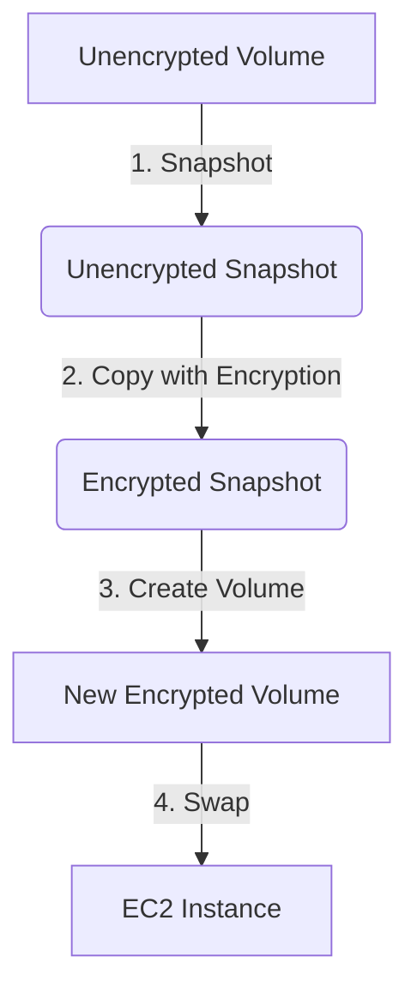

### Technical Steps:
1.  **Snapshot:** Create a snapshot of the unencrypted volume.
2.  **Copy & Encrypt:** Use the `Copy Snapshot` command. In the settings:
    -   Check the **Encrypt this snapshot** box.
    -   Select your **KMS Customer Master Key (CMK)**.
3.  **Volume Creation:** Create a new EBS volume from the newly encrypted snapshot (ensure it's in the same Availability Zone).
4.  **The Swap:**
    -   If it's a **Root Volume**: Stop the EC2 instance, detach the old volume, attach the new one as `/dev/sda1` (or equivalent), and start the instance.
    -   If it's a **Data Volume**: Unmount the filesystem, detach the old, attach the new, and remount.

---

## 2. Achieving "Near-Zero" Downtime (Data Volumes)

If the volume is a secondary data volume and you cannot afford a long outage:

1.  **Provision:** Create a new, empty EBS volume and enable encryption at creation time.
2.  **Attach:** Attach it to the same EC2 instance.
3.  **Sync:** Use `rsync -avPH` to copy data from the unencrypted mount point to the new encrypted mount point.
4.  **Final Cut-over:** Stop the application services briefly, run one final `rsync` to catch delta changes, unmount the old, mount the new at the same path, and restart the services.

---

## 3. Why is this important?

| Factor | Benefit |
| :--- | :--- |
| **Compliance** | Meets regulatory requirements like HIPAA, PCI-DSS, or SOC2. |
| **Data Protection** | If the physical storage media is stolen or compromised, the data remains unreadable. |
| **KMS Integration** | Allows fine-grained access control over who can "decrypt" and use the volume. |

---

## Interview Summary

**Question:** "How do you encrypt an already existing unencrypted EBS volume?"

**Answer:**
"Since EBS volumes cannot be encrypted in-place, I use the **Snapshot and Copy** method. 

First, I take a snapshot of the unencrypted volume. Then, I use the **Copy Snapshot** feature, where I explicitly enable encryption and select the appropriate **AWS KMS key**. This creates a new, encrypted snapshot. From there, I create a new EBS volume, which inherits that encryption.

If I'm dealing with a **Root volume**, I perform a maintenance window where I stop the instance, swap the volumes, and restart it. If it's a **Data volume** and we need minimal downtime, I might use an **rsync strategy**: creating a new encrypted volume, syncing data in the background, and performing a quick cut-over. 

I also make sure to enable **'Encryption by Default'** in the region's EBS settings moving forward, so that any new volumes created in the future—by us or by Auto Scaling groups—are automatically encrypted from day one."

---

# Question 20: "I have an RDS snapshot in Account A and I want to spin up a database from this snapshot in Account B. How do you do this?"

## The Answer: "Cross-account RDS restoration is a 3-step process involving (1) Sharing the encryption key, (2) Sharing the snapshot, and (3) Creating a local copy or restoring in the target account. The critical 'gotcha' is that you **cannot share a snapshot encrypted with the default AWS managed key**; it must be encrypted with a custom KMS Customer Master Key (CMK)."

---

## 1. The Implementation Workflow

### Step 1: Prepare the custom KMS Key (Account A)
If the existing snapshot is encrypted with the default `aws/rds` key, you must first:
1.  **Copy the snapshot** to a new one within Account A.
2.  Select a **Custom KMS Key** during the copy process.
3.  Modify the **KMS Key Policy** to allow Account B's root ARN or a specific IAM role to use the key (`kms:CreateGrant` and `kms:DescribeKey` are required).

### Step 2: Share the Snapshot (Account A)
1.  Select the snapshot encrypted with the custom key.
2.  Go to **Actions -> Modify Permissions**.
3.  Choose **Private** and add the **Account ID of Account B**.
4.  Save changes.

### Step 3: Restore the Database (Account B)
1.  In Account B, go to the RDS Console -> **Snapshots**.
2.  Select the **'Shared with Me'** tab.
3.  Select the shared snapshot and click **Actions -> Restore DB Instance**.
    -   *Note:* You can also choose to **Copy Snapshot** first if you want to own it locally and re-encrypt it with Account B's own KMS key.
4.  Configure the instance settings and launch.

---

## 2. The Architecture Flow

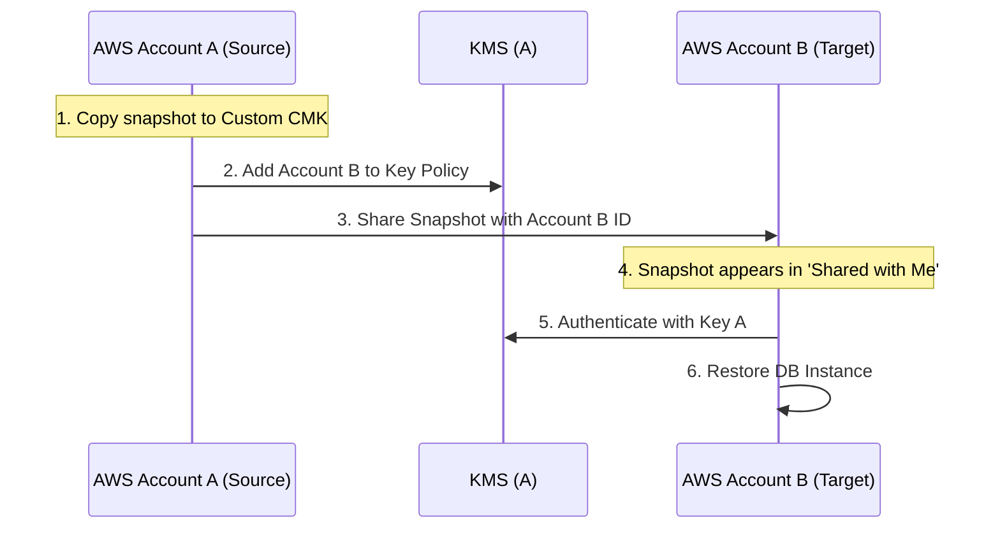

---

## 3. Important Restrictions

| Restriction | Consequence |
| :--- | :--- |
| **Default KMS Key** | Snapshots encrypted with the default `aws/rds` key **cannot be shared**. |
| **Public Sharing** | Encrypted snapshots cannot be made 'Public'. Only unencrypted ones. |
| **Region** | Sharing is region-specific. You must share from the same region where the snapshot exists. |

---

## 4. Senior Tip: Security & Ownership

In a production environment, once Account B receives the shared snapshot, it is a best practice to **Copy the snapshot to Account B's local storage** using Account B's local KMS key. 

**Why?**
1.  **Independence:** If Account A deletes the KMS key, Account B's restored database could fail or become unrecoverable if it relies on a cross-account key.
2.  **Auditability:** Keeps the data lifecycle managed within the local account boundary.

---

## Interview Summary

**Question:** "How do you restore an RDS snapshot from one AWS account to another?"

**Answer:**
"Restoring an RDS snapshot across accounts requires careful coordination of both the snapshot and its encryption keys. 

The most important technical detail is that **default AWS managed keys cannot be shared**. Therefore, my first step in **Account A** is to ensure the snapshot is encrypted with a **Custom KMS Customer Master Key (CMK)**. I then update the KMS key policy to grant the target **Account B** permissions to use that key.

Next, I modify the snapshot permissions in the RDS console to allow access to Account B's ID. Once shared, the snapshot appears in Account B under the **'Shared with Me'** tab. 

From **Account B**, I can either restore the database directly or, as a security best practice, **copy the snapshot locally** first using Account B's own KMS key. This ensures that the target account has full ownership and isn't dependent on the source account's keys for long-lived production data."

---
